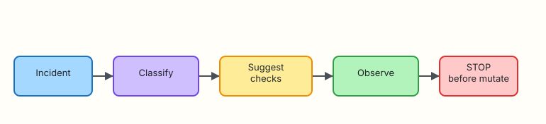

# Agents for Ops Workflows

## Overview

An **agent** loops: plan → act (tools) → observe → decide again. For incidents that is powerful — and dangerous if the loop can mutate production. Production-grade ops agents **stop** when the next step needs approval.

**Plain problem:** A demo agent “fixes” CrashLoopBackOff by deleting pods in a loop. Your agent must classify, gather evidence, suggest checks, then **STOP** with `APPROVAL_REQUIRED` before restart/delete.

This lab builds that stoppable loop under `~/rebash-ai/module-10`.

This is **Tutorial 10** in **Module 10: Agents** of the REBASH Academy **AI for DevOps Engineers** series — practical AI for Cloud and DevOps work.

## Prerequisites

- [Model Context Protocol (MCP) for DevOps](mcp-for-devops.md)
- [Tool Calling and Function APIs](tool-calling-and-function-apis.md)
- Python 3.10+

## Learning Objectives

By the end of this tutorial, you will be able to:

- [ ] Describe a plan → act → observe agent loop for incidents
- [ ] Implement classify → tool checks → stop-before-mutate
- [ ] Record a step trace for interview evidence
- [ ] Explain stop conditions and max-step budgets
- [ ] Contrast advisory agents with autonomous remediators

## Architecture

Incident in → classify → suggest checks → observe tools → STOP before mutate.



## Theory

### What it is

An **ops agent** is software that repeatedly:

1. Chooses a next action (usually a tool)  
2. Executes via a gated host  
3. Observes the result  
4. Stops, asks a human, or continues  

**Stop conditions** matter more than clever planning: max steps, approval gates, empty evidence, or forbidden tools.

### Why it matters

Incidents are multi-step. Humans forget checklists under stress. Agents that only advise (and stop cleanly) reduce mean time to understanding without owning blast radius.

### How it works

```text
incident → classify → [read-only tools…] → recommend mutate? → STOP + APPROVAL_REQUIRED
```

Never auto-loop on delete/restart in this course.

### Key concepts and comparisons

| Design | Behaviour |
|--------|-----------|
| Single-shot tool call | One propose/execute (Module 8) |
| Agent loop | Multiple steps with memory/trace |
| Autonomous remediator | Mutates without human — out of scope here |
| Advisory agent | Evidence + recommendations + stop |

### Common pitfalls

- No max-step budget (infinite loops)  
- Mutating inside the loop “just this once”  
- No trace for audit  
- Treating agent confidence as approval  

## Hands-on Lab

### Objective

Build an incident agent under `~/rebash-ai/module-10` that classifies a CrashLoop alert, runs read-only mock tools, and stops with `APPROVAL_REQUIRED` before restart.

### Prerequisites

- Python 3.10+

### Lab environment

``` {.bash .ra-terminal title="Terminal"}
mkdir -p ~/rebash-ai/module-10/fixtures && cd ~/rebash-ai/module-10
python3 --version | tee python-version.txt
```

!!! example "Expected output"
    Python 3.10+ recorded.

### Real-world scenario

SRE wants a Slack agent for first-five-minutes triage. Change Advisory Board forbids automatic restarts. You deliver classify → evidence → stop.

### Step-by-step tasks

#### Task 1 – Fixtures and read-only tools

Create `fixtures/pods.json`:

```json title="fixtures/pods.json"
[
  {"name": "payments-api-7f8b", "namespace": "payments", "phase": "Running"},
  {"name": "payments-api-2c1a", "namespace": "payments", "phase": "CrashLoopBackOff"}
]
```

Create `fixtures/payments-api.log`:

```text title="fixtures/payments-api.log"
ERROR timeout upstream=ledger
ERROR timeout upstream=ledger
WARN retry budget exhausted
```

Create `tools.py`:

```python title="tools.py"
"""Read-only tools + explicit mutate stub that must never be auto-called."""
from __future__ import annotations

import json
from pathlib import Path
from typing import Any

ROOT = Path(__file__).resolve().parent
ALLOWLIST = {"list_pods", "read_log"}


def list_pods(namespace: str = "payments") -> dict[str, Any]:
    pods = json.loads((ROOT / "fixtures" / "pods.json").read_text(encoding="utf-8"))
    return {"ok": True, "pods": [p for p in pods if p["namespace"] == namespace]}


def read_log(service: str = "payments-api") -> dict[str, Any]:
    lines = (ROOT / "fixtures" / f"{service}.log").read_text(encoding="utf-8").splitlines()
    return {"ok": True, "lines": lines}


def restart_deployment(name: str) -> dict[str, Any]:
    return {"ok": False, "error": "MUTATE_NOT_IMPLEMENTED_IN_AGENT_LOOP", "name": name}


DISPATCH = {
    "list_pods": lambda args: list_pods(str(args.get("namespace", "payments"))),
    "read_log": lambda args: read_log(str(args.get("service", "payments-api"))),
}


def execute(tool: str, args: dict[str, Any] | None = None) -> dict[str, Any]:
    args = args or {}
    if tool not in ALLOWLIST:
        return {"ok": False, "error": "DENIED", "tool": tool}
    return DISPATCH[tool](args)
```

#### Task 2 – Agent loop with stop condition

Create `agent.py`:

```python title="agent.py"
"""Advisory incident agent — stops before mutate."""
from __future__ import annotations

from dataclasses import dataclass, field
from typing import Any

from tools import execute


@dataclass
class AgentResult:
    classification: str
    steps: list[dict[str, Any]] = field(default_factory=list)
    recommendation: str = ""
    status: str = "RUNNING"


def classify(incident: str) -> str:
    lower = incident.lower()
    if "crashloop" in lower or "crash" in lower:
        return "workload_crash"
    if "disk" in lower or "inode" in lower:
        return "capacity"
    return "general"


def run_agent(incident: str, max_steps: int = 4) -> AgentResult:
    result = AgentResult(classification=classify(incident))
    plan = ["list_pods", "read_log", "restart_deployment"]

    for tool in plan:
        if len(result.steps) >= max_steps:
            result.status = "STOP_MAX_STEPS"
            break

        if tool == "restart_deployment":
            result.steps.append(
                {
                    "tool": tool,
                    "args": {"name": "payments-api"},
                    "result": {
                        "ok": False,
                        "error": "APPROVAL_REQUIRED",
                        "reason": "mutating action blocked in advisory agent",
                    },
                }
            )
            result.recommendation = (
                "Evidence gathered. Restart payments-api only with human approval "
                "after confirming upstream ledger health."
            )
            result.status = "STOP_APPROVAL_REQUIRED"
            break

        args = {"namespace": "payments"} if tool == "list_pods" else {"service": "payments-api"}
        observation = execute(tool, args)
        result.steps.append({"tool": tool, "args": args, "result": observation})

    if result.status == "RUNNING":
        result.status = "STOP_COMPLETE"
    return result
```

Create `agent_cli.py`:

```python title="agent_cli.py"
"""CLI for the advisory incident agent."""
from __future__ import annotations

import argparse
import json
from pathlib import Path

from agent import run_agent


def main() -> int:
    parser = argparse.ArgumentParser()
    parser.add_argument(
        "--incident",
        default="ALERT CrashLoopBackOff payments-api namespace=payments",
    )
    parser.add_argument("--out", type=Path, default=Path("agent-trace.json"))
    args = parser.parse_args()

    result = run_agent(args.incident)
    payload = {
        "incident": args.incident,
        "classification": result.classification,
        "status": result.status,
        "recommendation": result.recommendation,
        "steps": result.steps,
    }
    args.out.write_text(json.dumps(payload, indent=2) + "\n", encoding="utf-8")
    print(f"classification={result.classification}")
    print(f"status={result.status}")
    print(f"steps={len(result.steps)}")
    print(result.recommendation)
    return 0 if result.status == "STOP_APPROVAL_REQUIRED" else 1


if __name__ == "__main__":
    raise SystemExit(main())
```

``` {.bash .ra-terminal title="Terminal"}
cd ~/rebash-ai/module-10
python3 agent_cli.py --out agent-trace.json
python3 - <<'PY'
import json
from pathlib import Path
p = json.loads(Path("agent-trace.json").read_text())
assert p["classification"] == "workload_crash"
assert p["status"] == "STOP_APPROVAL_REQUIRED"
tools = [s["tool"] for s in p["steps"]]
assert tools[:2] == ["list_pods", "read_log"]
assert tools[-1] == "restart_deployment"
assert p["steps"][-1]["result"]["error"] == "APPROVAL_REQUIRED"
assert not any(s["result"].get("restarted") for s in p["steps"])
print("agent_stop_before_mutate=OK")
PY
```

!!! example "Expected output"
    Status `STOP_APPROVAL_REQUIRED`. Trace shows `list_pods`, `read_log`, then blocked restart. Prints `agent_stop_before_mutate=OK`.

#### Task 3 – Break: prove mutate tool cannot sneak in via execute

Create `break_mutate.py`:

```python title="break_mutate.py"
"""Attempt to execute restart via tools.execute — must DENY."""
from __future__ import annotations

import json
from pathlib import Path

from tools import execute

result = execute("restart_deployment", {"name": "payments-api"})
Path("break-mutate.json").write_text(json.dumps(result, indent=2) + "\n", encoding="utf-8")
print(json.dumps(result))
raise SystemExit(0 if result.get("error") == "DENIED" else 1)
```

``` {.bash .ra-terminal title="Terminal"}
cd ~/rebash-ai/module-10
python3 break_mutate.py
python3 - <<'PY'
import json
from pathlib import Path
r = json.loads(Path("break-mutate.json").read_text())
assert r["error"] == "DENIED"
print("execute_deny_ok")
PY
```

!!! example "Expected output"
    `execute_deny_ok` — `restart_deployment` is not allowlisted in `tools.execute`.

### Validation steps

- [ ] Agent classifies CrashLoop as `workload_crash`  
- [ ] Trace includes read-only tool observations  
- [ ] Final status is `STOP_APPROVAL_REQUIRED`  
- [ ] Mutate cannot run through `tools.execute`  

### Common errors and fixes

| Error | Cause | Fix |
|-------|-------|-----|
| Status not STOP_APPROVAL | Plan order wrong | Keep restart last with explicit stop |
| Empty log observation | Missing fixture | Ensure `fixtures/payments-api.log` |

### Challenge exercise

Add a `capacity` path: incident text about disk full → classify `capacity` → only `read_log` skipped / different plan → still never mutate.

### Learning outcomes

- You built an advisory multi-step agent  
- You enforced stop-before-mutate in two layers (agent + tool allowlist)  
- You produced an audit trace JSON  

### Cleanup

``` {.bash .ra-terminal title="Terminal"}
echo "Keep ~/rebash-ai/module-10 for portfolio evidence"
```

## Validation

- [ ] Lab passed  
- [ ] Can explain agent loops vs single tool calls  
- [ ] Can name three stop conditions  
- [ ] Can refuse “fully autonomous remediation” demos safely  

## Code Walkthrough

1. **Classify first** — pick a playbook path.  
2. **Read-only tools only** in the automated loop.  
3. **Budget steps** — `max_steps` exists for a reason.  
4. **Stop explicitly** — status enum, not silent exit.  
5. **Trace everything** — interview and audit gold.  

## Security Considerations

- Agents amplify tool risk — smaller toolboxes  
- Prompt injection can push “just restart” — code must ignore  
- Separate identities for advisory vs break-glass remediations  
- Retain traces with retention policy  
- Never store long-lived prod tokens in the agent process for labs  

## Common Mistakes

!!! warning "Closing the loop with automatic restart when confidence is high"
    **Fix:** Confidence is not approval. Keep `APPROVAL_REQUIRED`.

!!! warning "No max steps"
    **Fix:** Cap iterations; fail to `STOP_MAX_STEPS` and alert a human.

## Best Practices

- Advisory by default  
- Human gate for every mutate  
- Golden incident traces in CI  
- Combine with RAG (Module 7) for runbook steps  
- Prefer MCP/read-only servers for observations  

## Troubleshooting

| Symptom | Likely cause | Fix |
|---------|--------------|-----|
| Agent exits 1 unexpectedly | Status not approval stop | Check classification path |
| Missing CrashLoop pod | Fixture edit | Restore `pods.json` |

## Summary

Ops agents earn trust by stopping. Classify, gather evidence, recommend, and require approval before blast radius. Modules 11+ apply these patterns to CI and observability copilots.

Next: [AI in CI/CD](ai-in-ci-cd.md).

## Interview Questions

**1. What is an AI agent in an ops context?**

??? success "Reveal answer"
    Software that iteratively plans, calls tools, observes results, and decides to continue, stop, or ask a human — used for triage and advisory workflows.

**2. Why must ops agents have stop conditions?**

??? success "Reveal answer"
    Without them, loops can thrash production (restarts/deletes) or run forever. Stops protect blast radius and cost.

**3. What should happen when the next action is a restart?**

??? success "Reveal answer"
    Exit the automated loop with `APPROVAL_REQUIRED`, show evidence gathered, and wait for a human (or dual control).

**4. How is an agent different from a single tool call?**

??? success "Reveal answer"
    A single call is one propose/execute. An agent sequences multiple observations and decisions with memory/trace.

**5. Name three good stop conditions.**

??? success "Reveal answer"
    Approval required for mutate, max steps reached, and no useful tools left / empty evidence.

**6. How do you keep an agent from calling a dangerous tool?**

??? success "Reveal answer"
    Host allowlists (and denylists), omit mutate tools from the plan, and unit-test deny paths.

**7. Why keep a step trace?**

??? success "Reveal answer"
    Auditing, incident review, and interviews — you must show what the agent saw and why it stopped.

**8. When would you allow autonomous remediation?**

??? success "Reveal answer"
    Only for narrowly scoped, well-tested runbooks with strong guardrails, blast-radius limits, and rollback — not as the default for a general incident agent.

## Related Tutorials

- Previous: [Model Context Protocol (MCP) for DevOps](mcp-for-devops.md)
- Course: [AI for DevOps Overview](index.md)
- Next: [AI in CI/CD](ai-in-ci-cd.md)

## References

- [REBASH Academy — AI for DevOps Foundations](ai-for-devops-foundations.md)
- [OWASP Top 10 for LLM Applications](https://owasp.org/www-project-top-10-for-large-language-model-applications/)
