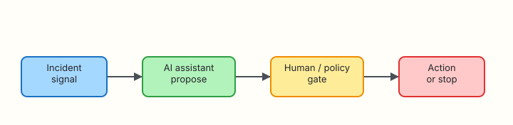

# AI for DevOps Foundations

## Overview

On-call engineers drown in alerts, logs, and half-finished runbooks. Large Language Models (LLMs) can draft checks, summarise noise, and suggest next steps — that is useful. The same models, given cloud keys and shell access, can also delete the wrong namespace in seconds.

**AI for DevOps** means using AI as an **assistant** inside operations: it proposes; people and policy dispose. It is not “replace the SRE with a chatbot”, and it is not the same as training machine-learning models for product features (that sits closer to Machine Learning Operations, or **MLOps**).

**Plain problem:** A well-meaning “auto-remediate” bot that restarts pods whenever latency rises will eventually restart the wrong workload during a dependency outage — and make the incident worse.

This tutorial answers, in order:

1. What AI for DevOps is and is not  
2. The human-in-the-loop risk model  
3. How AI-assisted ops differs from MLOps and plain automation  
4. How you prove a policy gate before any bot is trusted  

This is **Tutorial 1** in **Module 1: Foundations** of the REBASH Academy **AI for DevOps Engineers** series — practical AI for Cloud and DevOps work.

## Prerequisites

- Comfort with a terminal and Python 3.10+
- [Linux](../linux/index.md), [Shell](../shell/index.md), [Python](../python/index.md), and [Git](../git/index.md) fundamentals (career-path order)
- No paid AI API required

## Learning Objectives

By the end of this tutorial, you will be able to:

- [ ] Explain AI for DevOps versus MLOps and versus unchecked automation
- [ ] Describe the propose → validate → act → audit loop with a human or policy gate
- [ ] Classify ops actions as read-only, approval-required, or forbidden
- [ ] Build a policy-gate CLI that blocks unsafe auto-remediation and writes threat notes
- [ ] Defend in interview why AI must not hold long-lived production credentials

## Architecture

Incident signals feed an assistant that only **proposes**. A human or policy gate decides whether any action runs.



## Theory

### What it is

**AI for DevOps** is the practice of applying LLMs and related tooling to software delivery and operations: triage, documentation, CI feedback, and controlled automation. The unit of value is a **safer, faster decision** — not a longer chat transcript.

| Term | Plain meaning |
|------|----------------|
| LLM | Model that predicts text/tokens from prompts |
| Assistant | Software that calls a model and presents suggestions |
| Agent | Assistant that can call **tools** in a loop (still needs gates) |
| Human-in-the-loop | A person (or strict policy) must approve side effects |
| Guardrail | Code/policy that blocks secrets, mutations, or unsafe tools |

**Interview one-liner:** AI drafts the runbook step; the platform and the on-call engineer own the blast radius.

### Why it matters

Teams adopt AI because:

- Incidents produce more text than humans can read quickly  
- Junior engineers need structured next checks  
- Tickets and pull requests benefit from clear summaries  

Teams regret AI when:

- Models invent commands that look plausible  
- Secrets leak into prompts and vendor logs  
- Auto-execution runs `kubectl delete` from a hallucinated name  

### How it works

A healthy loop looks like this:

1. **Signal** — alert, log slice, ticket, or failing CI job  
2. **Propose** — model returns checks, labels, or a draft change  
3. **Validate** — policy, tests, or a human review the proposal  
4. **Act** — only allowlisted tools run; mutations need approval  
5. **Audit** — store who approved what, with redacted evidence  
6. **Improve** — golden tests catch prompt regressions (Module 4)

```text
signal → AI propose → policy/human gate → action or STOP → audit
```

### Key concepts and comparisons

| Approach | Goal | Typical risk |
|----------|------|--------------|
| Scripted automation | Deterministic runbooks | Brittle; limited language understanding |
| AI for DevOps | Language + judgement assist | Hallucination; prompt injection |
| MLOps | Train/deploy/monitor ML products | Data pipelines, model drift |
| “Fully autonomous ops” | No human in loop | Unacceptable blast radius for most orgs |

| Action class | Examples | Default policy |
|--------------|----------|----------------|
| Read-only | `kubectl get`, read logs, `aws describe` | Allow after allowlist |
| Approval-required | restart, scale, apply Terraform | Print `APPROVAL_REQUIRED` and stop |
| Forbidden | delete namespace, disable auth, expose secrets | Always deny + threat note |

### Common pitfalls

- Equating “chatbot in Slack” with a production control plane  
- Giving the model long-lived cloud keys “so it can help”  
- Auto-executing shell from model output  
- Skipping audit logs because “it is only a suggestion”  
- Treating model confidence as operational truth  

## Hands-on Lab

### Objective

Build a **policy gate** under `~/rebash-ai/module-01` that evaluates proposed auto-remediation actions, blocks unsafe ones, and writes a decision matrix plus threat notes you can show in an interview.

### Prerequisites

- Python 3.10+
- Write access under your home directory

### Lab environment

Workspace: `~/rebash-ai/module-01`

``` {.bash .ra-terminal title="Terminal"}
mkdir -p ~/rebash-ai/module-01 && cd ~/rebash-ai/module-01
set -euo pipefail
python3 --version | tee python-version.txt
```

!!! example "Expected output"
    `python-version.txt` contains a Python 3.10+ version line.

### Real-world scenario

A vendor demo promises an “auto-remediate latency” bot for Kubernetes. Security asks for a written decision matrix and proof that delete/scale actions cannot run without approval. You implement the gate before anyone wires a real cluster.

### Step-by-step tasks

#### Task 1 – Decision matrix and policy engine

Create `policy.py`:

```python title="policy.py"
"""Policy gate for proposed AI ops actions — interview artefact."""
from __future__ import annotations

import json
from dataclasses import dataclass
from pathlib import Path
from typing import Any

# Decision matrix: action_type → class
MATRIX: dict[str, str] = {
    "read_logs": "read_only",
    "describe_pods": "read_only",
    "get_metrics": "read_only",
    "restart_deployment": "approval_required",
    "scale_deployment": "approval_required",
    "apply_manifest": "approval_required",
    "delete_namespace": "forbidden",
    "disable_network_policy": "forbidden",
    "exfiltrate_secrets": "forbidden",
}


@dataclass
class Decision:
    action: str
    action_class: str
    allowed: bool
    requires_approval: bool
    reason: str
    threats: list[str]


def classify(action: str) -> str:
    return MATRIX.get(action, "approval_required")


def evaluate(proposal: dict[str, Any]) -> Decision:
    action = str(proposal.get("action", "")).strip()
    target = str(proposal.get("target", "")).strip()
    action_class = classify(action)
    threats: list[str] = []

    if not action:
        return Decision(
            action=action,
            action_class="forbidden",
            allowed=False,
            requires_approval=False,
            reason="Missing action",
            threats=["Malformed proposal — reject"],
        )

    if action_class == "read_only":
        return Decision(
            action=action,
            action_class=action_class,
            allowed=True,
            requires_approval=False,
            reason="Allowlisted read-only diagnostic",
            threats=[],
        )

    if action_class == "forbidden":
        threats = [
            f"Forbidden action '{action}' on '{target or 'unknown'}'",
            "Model must never execute this class without redesigning the product",
            "Risk: irreversible data loss or security control bypass",
        ]
        return Decision(
            action=action,
            action_class=action_class,
            allowed=False,
            requires_approval=False,
            reason="Policy deny — forbidden class",
            threats=threats,
        )

    # approval_required
    threats = [
        f"Mutating action '{action}' needs a human approver",
        "Confirm blast radius and change window before execute",
    ]
    if "prod" in target.lower() or "production" in target.lower():
        threats.append("Production target detected — dual control recommended")
    return Decision(
        action=action,
        action_class=action_class,
        allowed=False,
        requires_approval=True,
        reason="APPROVAL_REQUIRED",
        threats=threats,
    )


def write_artefacts(decisions: list[Decision], out_dir: Path) -> None:
    out_dir.mkdir(parents=True, exist_ok=True)
    matrix_path = out_dir / "decision-matrix.json"
    matrix_path.write_text(json.dumps(MATRIX, indent=2) + "\n", encoding="utf-8")

    rows = [
        {
            "action": d.action,
            "class": d.action_class,
            "allowed": d.allowed,
            "requires_approval": d.requires_approval,
            "reason": d.reason,
            "threats": d.threats,
        }
        for d in decisions
    ]
    (out_dir / "gate-results.json").write_text(
        json.dumps(rows, indent=2) + "\n", encoding="utf-8"
    )

    lines = ["# Threat notes — fake auto-remediate bot\n"]
    for d in decisions:
        if not d.threats and d.allowed:
            continue
        lines.append(f"## `{d.action}` ({d.action_class})\n")
        lines.append(f"- Decision: **{d.reason}**\n")
        for t in d.threats:
            lines.append(f"- {t}\n")
        lines.append("\n")
    (out_dir / "threat-notes.md").write_text("".join(lines), encoding="utf-8")
```

Create `gate_cli.py`:

```python title="gate_cli.py"
"""CLI: evaluate AI-proposed ops actions against the policy matrix."""
from __future__ import annotations

import argparse
import json
import sys
from pathlib import Path

from policy import evaluate, write_artefacts


def main() -> int:
    parser = argparse.ArgumentParser(description="AI ops policy gate")
    parser.add_argument(
        "--proposals",
        type=Path,
        default=Path("proposals.json"),
        help="JSON list of {action, target, rationale}",
    )
    parser.add_argument(
        "--out",
        type=Path,
        default=Path("out"),
        help="Output directory for matrix and threat notes",
    )
    args = parser.parse_args()

    proposals = json.loads(args.proposals.read_text(encoding="utf-8"))
    if not isinstance(proposals, list):
        print("proposals.json must be a JSON list", file=sys.stderr)
        return 2

    decisions = [evaluate(p) for p in proposals]
    write_artefacts(decisions, args.out)

    blocked = sum(1 for d in decisions if not d.allowed)
    print(f"evaluated={len(decisions)} blocked_or_pending={blocked}")
    print(f"wrote {args.out}/decision-matrix.json")
    print(f"wrote {args.out}/gate-results.json")
    print(f"wrote {args.out}/threat-notes.md")

    # Non-zero if any forbidden slipped through as allowed (should never happen)
    if any(d.allowed and d.action_class == "forbidden" for d in decisions):
        return 3
    return 0


if __name__ == "__main__":
    raise SystemExit(main())
```

Create `proposals.json`:

```json title="proposals.json"
[
  {
    "action": "read_logs",
    "target": "payments-api",
    "rationale": "Latency alert — inspect recent errors"
  },
  {
    "action": "restart_deployment",
    "target": "payments-api/prod",
    "rationale": "Vendor bot wants to bounce pods"
  },
  {
    "action": "delete_namespace",
    "target": "payments-api",
    "rationale": "Hallucinated cleanup step"
  },
  {
    "action": "scale_deployment",
    "target": "checkout/staging",
    "rationale": "Scale out for load test"
  }
]
```

``` {.bash .ra-terminal title="Terminal"}
cd ~/rebash-ai/module-01
python3 gate_cli.py --proposals proposals.json --out out
test -f out/decision-matrix.json
test -f out/threat-notes.md
grep -q 'delete_namespace' out/threat-notes.md
grep -q 'APPROVAL_REQUIRED' out/gate-results.json
```

!!! example "Expected output"
    CLI prints `evaluated=4 blocked_or_pending=3`. `threat-notes.md` mentions `delete_namespace`. `gate-results.json` contains `APPROVAL_REQUIRED` for restart/scale.

#### Task 2 – Break and fix: unknown action defaults safely

Create `proposals-break.json`:

```json title="proposals-break.json"
[
  {
    "action": "run_shell",
    "target": "bastion",
    "rationale": "Model invented a free-form shell tool"
  }
]
```

``` {.bash .ra-terminal title="Terminal"}
cd ~/rebash-ai/module-01
python3 gate_cli.py --proposals proposals-break.json --out out-break
python3 - <<'PY'
import json
from pathlib import Path
rows = json.loads(Path("out-break/gate-results.json").read_text())
assert rows[0]["requires_approval"] is True
assert rows[0]["allowed"] is False
print("unknown_action_defaults_to_approval_required=OK")
PY
```

!!! example "Expected output"
    `unknown_action_defaults_to_approval_required=OK`

Unknown actions must **not** default to allow.

#### Task 3 – Interview evidence pack

``` {.bash .ra-terminal title="Terminal"}
cd ~/rebash-ai/module-01
python3 gate_cli.py --proposals proposals.json --out out
{
  echo "### Policy gate evidence"
  echo "- decision-matrix keys: $(python3 -c 'import json;print(len(json.load(open(\"out/decision-matrix.json\"))))')"
  echo "- forbidden blocked: $(grep -c delete_namespace out/threat-notes.md || true)"
  echo "- approval lines: $(grep -c APPROVAL_REQUIRED out/gate-results.json)"
} | tee evidence.txt
```

!!! example "Expected output"
    `evidence.txt` summarises matrix size, forbidden block, and approval counts.

### Validation steps

- [ ] `out/decision-matrix.json` lists read-only, approval-required, and forbidden actions
- [ ] `delete_namespace` is denied and appears in `threat-notes.md`
- [ ] `restart_deployment` on production requires approval and is not auto-allowed
- [ ] Unknown actions default to approval-required, not allow
- [ ] You can explain the propose → gate → act loop without slides

### Common errors and fixes

| Error | Cause | Fix |
|-------|-------|-----|
| `ModuleNotFoundError: policy` | Wrong directory | `cd ~/rebash-ai/module-01` |
| `JSONDecodeError` | Trailing comma in JSON | Validate with `python3 -m json.tool` |
| Forbidden action marked allowed | Matrix typo | Re-check `MATRIX` classes |

### Challenge exercise

Extend `MATRIX` with `cordon_node` (approval-required) and `revoke_iam_admin` (forbidden). Add proposals and prove both outcomes in `out/gate-results.json`.

### Learning outcomes

- You own a written decision matrix for AI-proposed ops actions  
- You can show threat notes that security reviewers expect  
- You practised fail-closed defaults for unknown tools  

### Cleanup

``` {.bash .ra-terminal title="Terminal"}
# Keep the lab if you want portfolio evidence; otherwise:
# rm -rf ~/rebash-ai/module-01
echo "Lab artefacts remain under ~/rebash-ai/module-01 unless you remove them"
```

## Validation

- [ ] Lab path completed successfully  
- [ ] Can explain AI for DevOps versus MLOps in one minute  
- [ ] Can name three action classes and an example of each  
- [ ] Can describe one production failure mode of auto-remediation  

## Code Walkthrough

1. **Inspect** proposals as data — never trust free-form shell from a model.  
2. **Classify** before execute — matrix beats vibes.  
3. **Fail closed** — unknown action → approval, not allow.  
4. **Write evidence** — matrix + threat notes for audits and interviews.  
5. **Separate propose from act** — the gate has no cloud credentials on purpose.  

## Security Considerations

- Do not give LLMs long-lived production credentials  
- Treat model output as untrusted input (prompt injection appears in Module 13)  
- Log decisions; redact secrets from any stored prompt  
- Prefer read-only diagnostics as the default tool set  
- Require dual control for production mutations  

## Common Mistakes

!!! warning "Auto-execute because the demo looked good"
    **Fix:** Ship the policy gate first. Wire tools only after deny/allow tests pass.

!!! warning "Only documenting policy in a Confluence page"
    **Fix:** Encode the matrix in code and generate threat notes from real proposals.

!!! warning "Assuming AI for DevOps means training models"
    **Fix:** Separate MLOps (model lifecycle) from ops assistants (LLMs + gates).

## Best Practices

- Start with read-only assistants; add mutations last  
- Keep a written blast-radius story for every tool  
- Prefer offline-first labs so CI never depends on a vendor  
- Audit approvals with identity (who clicked approve)  
- Rehearse the interview line: propose → validate → act → audit  

## Troubleshooting

| Symptom | Likely cause | Fix |
|---------|--------------|-----|
| All actions allowed | Matrix empty or wrong file loaded | Print `MATRIX` keys in CLI |
| Threat notes empty | Only read-only proposals | Include forbidden/mutate samples |
| Import errors in CI | Relative imports | Run from `module-01` directory |

## Summary

AI for DevOps is assisted operations with accountability: models propose, policy and humans decide. Your lab artefact — decision matrix, gate results, and threat notes — is the foundation for every later module.

Next: [LLM and API Fundamentals](llm-and-api-fundamentals.md).

## Interview Questions

**1. What is AI for DevOps, in one sentence?**

??? success "Reveal answer"
    Using LLMs and related tools to assist delivery and operations — summarise, suggest checks, draft changes — while humans and policy remain accountable for side effects.

**2. How does AI for DevOps differ from MLOps?**

??? success "Reveal answer"
    MLOps focuses on training, deploying, and monitoring machine-learning products. AI for DevOps focuses on using models as assistants inside DevOps workflows (triage, CI, runbooks), usually without training a custom model.

**3. Why should an auto-remediate bot not hold long-lived cloud admin keys?**

??? success "Reveal answer"
    Hallucinations and prompt injection can turn a helpful bot into a high-privilege attacker. Prefer short-lived credentials, least privilege, and human approval for mutations.

**4. What are the three action classes in a sensible ops policy matrix?**

??? success "Reveal answer"
    Read-only (allow after allowlist), approval-required (mutations), and forbidden (never auto-run — for example delete namespace or disable security controls).

**5. A vendor says their agent is “fully autonomous”. What do you ask next?**

??? success "Reveal answer"
    Ask what tools it can call, how approvals work, how secrets are handled, how actions are audited, and what happens on hallucination. Demand a deny-by-default demo.

**6. Why default unknown actions to approval-required instead of allow?**

??? success "Reveal answer"
    Models invent tool names. Fail-closed defaults prevent a novel `run_shell` action from executing before security review.

**7. Where does the human sit in the propose → validate → act loop?**

??? success "Reveal answer"
    At the validate/gate step for anything with blast radius. Read-only diagnostics may be automated; production mutations need an explicit approver (or equivalent dual control).

## Related Tutorials

- Course: [AI for DevOps Overview](index.md)
- Next: [LLM and API Fundamentals](llm-and-api-fundamentals.md)
- Related: [Python — OpenAI, MCP, and LangChain](../python/ai-for-devops-openai-mcp-langchain.md)

## References

- [REBASH Academy — AI for DevOps career path](../career-paths/ai-for-devops/index.md)
- [OWASP Top 10 for Large Language Model Applications](https://owasp.org/www-project-top-10-for-large-language-model-applications/)
