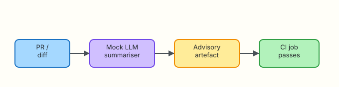

# AI in CI/CD

## Overview

Continuous Integration / Continuous Delivery (CI/CD) produces walls of diff and test noise. An LLM can draft a **pull request summary** or explain a flaky failure — as **advice**. It must not merge, deploy, or waive policy gates.

**Plain problem:** A bot that auto-approves “looks fine” diffs will ship a secrets leak. Your pipeline writes an advisory artefact; humans and required checks still decide.

This lab builds a local (and CI-shaped) mock summariser under `~/rebash-ai/module-11`.

This is **Tutorial 11** in **Module 11: CI/CD** of the REBASH Academy **AI for DevOps Engineers** series — practical AI for Cloud and DevOps work.

## Prerequisites

- [Agents for Ops Workflows](agents-for-ops-workflows.md)
- Basic Git diff literacy
- Python 3.10+

## Learning Objectives

By the end of this tutorial, you will be able to:

- [ ] Place AI as an advisory step in a CI pipeline
- [ ] Summarise a diff with a mock LLM into a build artefact
- [ ] Keep merge/deploy decisions outside the model
- [ ] Sketch a GitHub Actions job that runs the summariser offline
- [ ] Defend “AI never bypasses required checks” in interview

## Architecture

Diff in → mock summariser → advisory artefact → CI continues; humans merge.



## Theory

### What it is

**AI in CI/CD** means models assist review and triage: PR summaries, flaky-test hints, policy explanations. Outputs are comments or files — not privileged write actions.

### Why it matters

Reviewers burn time reconstructing intent from noisy diffs. A structured summary speeds review. Uncontrolled bots that change branch protection destroy trust.

### How it works

1. CI checks out code and computes a diff.  
2. A job calls a summariser (mock in labs / gated API in prod).  
3. Artefact or PR comment is published as **non-blocking** advice.  
4. Required status checks and humans still own merge.  

### Key concepts and comparisons

| Use | Safe default |
|-----|----------------|
| PR summary | Advisory comment/artefact |
| Flaky test explainer | Hint only |
| Policy bot | Explain failure; do not waive |
| Auto-merge / auto-deploy | Out of scope — never from model alone |

### Common pitfalls

- Making the AI job a required check that can greenwash risk  
- Sending entire repos to a vendor API every push  
- Auto-applying model-suggested commits  
- Logging secrets from diffs into the model prompt  

## Hands-on Lab

### Objective

Produce `summary.md` from a sample diff using a mock LLM under `~/rebash-ai/module-11`, plus a local “CI job” script that proves the artefact exists without merging anything.

### Prerequisites

- Python 3.10+

### Lab environment

``` {.bash .ra-terminal title="Terminal"}
mkdir -p ~/rebash-ai/module-11/fixtures && cd ~/rebash-ai/module-11
python3 --version | tee python-version.txt
```

!!! example "Expected output"
    Python 3.10+ recorded.

### Real-world scenario

Platform engineering wants PR summaries on every pull request. Security forbids paid APIs in CI for now. You ship a mock summariser and a job script; later you can swap the backend behind the same interface.

### Step-by-step tasks

#### Task 1 – Sample diff and mock summariser

Create `fixtures/sample.diff`:

```text title="fixtures/sample.diff"
diff --git a/app/config.py b/app/config.py
--- a/app/config.py
+++ b/app/config.py
@@ -1,3 +1,4 @@
 TIMEOUT = 5
+RETRY_BUDGET = 3
diff --git a/app/payments.py b/app/payments.py
--- a/app/payments.py
+++ b/app/payments.py
@@ -10,3 +10,6 @@ def charge():
     return client.post("/charge")
+
+def refund():
+    return client.post("/refund")
```

Create `summariser.py`:

```python title="summariser.py"
"""Mock LLM PR summariser — advisory only."""
from __future__ import annotations

from pathlib import Path


def summarise_diff(diff_text: str) -> str:
    files = []
    for line in diff_text.splitlines():
        if line.startswith("diff --git"):
            parts = line.split()
            if len(parts) >= 4:
                files.append(parts[3].removeprefix("b/"))
    unique = sorted(set(files))
    bullets = "\n".join(f"- `{f}`" for f in unique) or "- (no files detected)"
    risk = "medium" if "secret" in diff_text.lower() or "password" in diff_text.lower() else "low"
    return (
        "# Advisory PR summary (mock LLM)\n\n"
        f"**Risk (heuristic):** {risk}\n\n"
        "## Files touched\n"
        f"{bullets}\n\n"
        "## Notes\n"
        "- This summary is **advisory** and must not waive required checks.\n"
        "- Confirm behaviour and tests before merge.\n"
    )


def write_summary(diff_path: Path, out_path: Path) -> None:
    text = summarise_diff(diff_path.read_text(encoding="utf-8"))
    out_path.write_text(text, encoding="utf-8")
```

Create `ci_summarise.py`:

```python title="ci_summarise.py"
"""Local CI-shaped job: diff → summary artefact."""
from __future__ import annotations

import argparse
from pathlib import Path

from summariser import write_summary


def main() -> int:
    parser = argparse.ArgumentParser()
    parser.add_argument("--diff", type=Path, default=Path("fixtures/sample.diff"))
    parser.add_argument("--out", type=Path, default=Path("summary.md"))
    args = parser.parse_args()
    write_summary(args.diff, args.out)
    print(f"wrote {args.out}")
    return 0 if args.out.is_file() else 2


if __name__ == "__main__":
    raise SystemExit(main())
```

``` {.bash .ra-terminal title="Terminal"}
cd ~/rebash-ai/module-11
python3 ci_summarise.py --diff fixtures/sample.diff --out summary.md
test -f summary.md
grep -q 'Advisory PR summary' summary.md
grep -q 'app/payments.py' summary.md
grep -q 'must not waive' summary.md
echo "summary_ok"
```

!!! example "Expected output"
    `wrote summary.md` and `summary_ok`.

#### Task 2 – Local “CI job” wrapper

Create `run_ci_job.sh`:

```bash title="run_ci_job.sh"
#!/usr/bin/env bash
set -euo pipefail
cd "$(dirname "$0")"
python3 ci_summarise.py --diff fixtures/sample.diff --out summary.md
test -f summary.md
echo "CI_JOB_OK artefact=summary.md"
```

``` {.bash .ra-terminal title="Terminal"}
cd ~/rebash-ai/module-11
chmod +x run_ci_job.sh
./run_ci_job.sh | tee ci-job.log
grep -q 'CI_JOB_OK' ci-job.log
```

!!! example "Expected output"
    `CI_JOB_OK artefact=summary.md` in `ci-job.log`.

#### Task 3 – Break: secret-looking diff raises risk

Create `fixtures/risky.diff`:

```text title="fixtures/risky.diff"
diff --git a/deploy.env b/deploy.env
--- a/deploy.env
+++ b/deploy.env
@@ -0,0 +1,2 @@
+API_PASSWORD=super-secret
+TOKEN=abcd
```

``` {.bash .ra-terminal title="Terminal"}
cd ~/rebash-ai/module-11
python3 ci_summarise.py --diff fixtures/risky.diff --out summary-risky.md
grep -q 'Risk (heuristic):** medium' summary-risky.md
grep -q 'deploy.env' summary-risky.md
echo "risk_flag_ok"
```

!!! example "Expected output"
    `risk_flag_ok` — heuristic marks medium risk when password/token-like lines appear.

### Validation steps

- [ ] `summary.md` lists touched files  
- [ ] Text states it must not waive checks  
- [ ] `run_ci_job.sh` exits 0  
- [ ] Risky diff is flagged medium  

### Common errors and fixes

| Error | Cause | Fix |
|-------|-------|-----|
| Empty file list | Diff format unexpected | Keep `diff --git` headers |
| Permission denied on script | Missing `chmod +x` | `chmod +x run_ci_job.sh` |

### Challenge exercise

Add a GitHub Actions workflow sketch (documentation-only in the lab notes) that runs `python3 ci_summarise.py` and uploads `summary.md` as an artefact — still non-blocking.

### Learning outcomes

- You produced a CI advisory artefact without auto-merge  
- You practised secret-aware heuristics  
- You can explain AI’s place beside required checks  

### Cleanup

``` {.bash .ra-terminal title="Terminal"}
echo "Keep ~/rebash-ai/module-11 or remove manually"
```

## Validation

- [ ] Lab passed  
- [ ] Can place AI as non-blocking advice in a pipeline diagram  
- [ ] Know not to let models waive gates  
- [ ] Can discuss token cost of sending huge diffs  

## Code Walkthrough

1. **Diff → structured summary** — same interface for mock/API.  
2. **Artefact, not authority** — files/comments only.  
3. **Heuristic risk flags** — catch obvious secrets.  
4. **Job script** mirrors CI without cloud.  
5. **Humans merge** — always.  

## Security Considerations

- Redact secrets before any real API summariser  
- Least privilege for the CI token that posts comments  
- Do not grant the AI job permission to approve PRs  
- Prefer short diffs / file lists over full repo uploads  
- Log that summaries are machine-generated  

## Common Mistakes

!!! warning "Making the summariser a required green check for merge"
    **Fix:** Keep it informational. Required checks stay tests, scans, and policy.

!!! warning "Auto-committing model rewrites in CI"
    **Fix:** Suggestions only. Humans apply changes.

## Best Practices

- Non-blocking by default  
- Cache/mock in CI for determinism  
- Bound diff size  
- Link to failing checks, do not replace them  
- Measure usefulness with reviewers, not vanity  

## Troubleshooting

| Symptom | Likely cause | Fix |
|---------|--------------|-----|
| Summary missing files | Truncated diff | Ensure full `diff --git` input |
| Risk always low | Heuristic too weak | Extend keyword list carefully |

## Summary

AI in CI/CD earns a seat as a reviewer assistant, not a release manager. Your artefact job is the pattern to reuse with a real model later.

Next: [Observability Copilots](observability-copilots.md).

## Interview Questions

**1. Where should AI sit in a CI pipeline?**

??? success "Reveal answer"
    As an advisory step that produces comments or artefacts — never as the sole authority to merge or deploy.

**2. Why avoid making an AI job a required status check?**

??? success "Reveal answer"
    Models can be wrong or gamed. Required checks should enforce tests, security scans, and policy, not prose quality of a summary.

**3. What is a safe output from a PR summariser?**

??? success "Reveal answer"
    A Markdown summary of intent, files touched, and risks — posted as a comment or build artefact.

**4. How do you handle secrets in diffs sent to models?**

??? success "Reveal answer"
    Redact before prompt; prefer not sending sensitive files; use heuristics and secret scanners first.

**5. Can AI waive a failing SAST gate if it “explains” the finding?**

??? success "Reveal answer"
    No. Explanations help humans; waivers need explicit policy owners.

**6. Why use a mock summariser in CI for this course?**

??? success "Reveal answer"
    Deterministic, free, offline, and teaches the pipeline shape before paying for tokens.

**7. What permission should the AI bot’s GitHub token lack?**

??? success "Reveal answer"
    Permission to approve PRs, alter branch protection, or push to protected branches.

## Related Tutorials

- Previous: [Agents for Ops Workflows](agents-for-ops-workflows.md)
- Next: [Observability Copilots](observability-copilots.md)
- Course: [AI for DevOps Overview](index.md)

## References

- [GitHub Actions documentation](https://docs.github.com/en/actions)
- [REBASH Academy — Prompt Engineering for Ops](prompt-engineering-for-ops.md)
