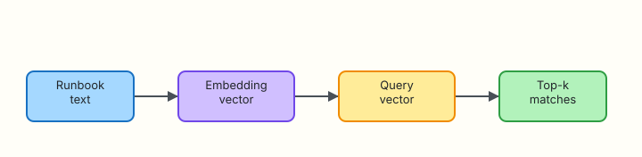

# Embeddings and Semantic Search

## Overview

Keyword search fails when on-call types “disk full” but the runbook says “filesystem capacity” or “inode exhaustion”. **Embeddings** map text into vectors so similar meaning sits nearby — even when the words differ. That is the foundation of semantic search for runbooks, tickets, and post-mortems.

**Plain problem:** `grep -i disk` misses the inode runbook. A semantic index ranks it correctly next to capacity guidance.

This tutorial builds offline, **stdlib-only** embeddings (hashing bag-of-words) and a top-k search CLI. Production teams often swap in a managed embedding API later; the **shape** of the pipeline stays the same.

This is **Tutorial 5** in **Module 5: Embeddings** of the REBASH Academy **AI for DevOps Engineers** series — practical AI for Cloud and DevOps work.

## Prerequisites

- [Evaluation and Reliability](evaluation-and-reliability.md)
- Python 3.10+ (stdlib only — no `numpy` or vendor SDKs required)
- Comfort reading short Markdown runbooks

## Learning Objectives

By the end of this tutorial, you will be able to:

- [ ] Explain what an embedding is and why ops needs semantic search
- [ ] Compare keyword search versus vector similarity for runbooks
- [ ] Implement a pure-Python embedder and cosine similarity
- [ ] Rank runbook snippets with top-k search for an incident query
- [ ] Defend trade-offs of local hashing embeddings versus API models in interview

## Architecture

Runbook text becomes vectors; a query vector ranks the nearest documents.



## Theory

### What it is

An **embedding** is a list of numbers representing text. **Semantic search** ranks documents by vector similarity (usually **cosine similarity**) instead of exact string match.

| Term | Plain meaning |
|------|----------------|
| Vector | Ordered list of floats (the embedding) |
| Dimension | Length of the vector |
| Cosine similarity | Angle-based score between −1 and 1 (higher = more similar) |
| Top-k | Return the *k* highest-scoring documents |
| Hashing embedder | Deterministic local vectors from token hashes (lab-friendly) |

**Interview one-liner:** Embeddings let “disk full” find “inode exhaustion” without sharing keywords.

### Why it matters

Ops knowledge is messy: tribal Slack threads, Markdown runbooks, and ticket titles. Assistants that only `grep` miss synonyms. Semantic search is how Retrieval-Augmented Generation (RAG) finds the right paragraph before the model answers (Module 7).

### How it works

1. Split text into tokens (words).  
2. Map tokens into a fixed-size vector (here: hash each token into a bucket and add weight).  
3. Normalise or use cosine so length does not dominate.  
4. Embed the query the same way.  
5. Score every document; return top-k.

```python
# Cosine similarity (pure Python)
dot = sum(a * b for a, b in zip(va, vb))
na = sum(a * a for a in va) ** 0.5
nb = sum(b * b for b in vb) ** 0.5
score = dot / (na * nb) if na and nb else 0.0
```

### Key concepts and comparisons

| Approach | Strength | Weakness |
|----------|----------|----------|
| Keyword / `grep` | Fast, exact IDs | Misses synonyms |
| Hashing embeddings (lab) | Offline, free, deterministic | Weaker than neural models |
| API embeddings (prod) | Stronger semantics | Cost, network, data residency |
| Hybrid (keyword + vector) | Best of both | More moving parts |

### Common pitfalls

- Comparing vectors from **different** embedding models  
- Forgetting to use the **same** embedder for query and documents  
- Ranking on raw dot product without normalisation when magnitudes differ  
- Embedding secrets or personal data into a shared index  

## Hands-on Lab

### Objective

Build an offline semantic search tool under `~/rebash-ai/module-05` that embeds runbook snippets and ranks “disk full” / inode queries above unrelated SSH content.

### Prerequisites

- Python 3.10+
- Write access under your home directory

### Lab environment

Workspace: `~/rebash-ai/module-05`

``` {.bash .ra-terminal title="Terminal"}
mkdir -p ~/rebash-ai/module-05/runbooks && cd ~/rebash-ai/module-05
set -euo pipefail
python3 --version | tee python-version.txt
```

!!! example "Expected output"
    `python-version.txt` shows Python 3.10+.

### Real-world scenario

Your SRE wiki has dozens of runbooks. On-call pastes alert text into a bot. Security forbids sending the whole wiki to a vendor embedding API during the pilot. You prove semantic ranking locally first, then decide whether to upgrade the embedder later.

### Step-by-step tasks

#### Task 1 – Runbook corpus

Create `runbooks/disk-capacity.md`:

```markdown title="runbooks/disk-capacity.md"
# Disk and filesystem capacity

When alerts mention disk full, filesystem capacity, or no space left on device:
1. Run `df -h` and `df -i` to check bytes and inodes.
2. Find large files under `/var` and application log dirs.
3. Rotate or truncate logs only with change approval.
```

Create `runbooks/inode-exhaustion.md`:

```markdown title="runbooks/inode-exhaustion.md"
# Inode exhaustion

Symptoms: cannot create new files though `df -h` shows free bytes.
Check `df -i`. Many tiny files in `/var/spool` or container layers often cause inode exhaustion.
Cleanup requires identifying the directory with the highest inode count.
```

Create `runbooks/ssh-bastion.md`:

```markdown title="runbooks/ssh-bastion.md"
# SSH bastion access

Use the corporate bastion with short-lived certificates.
Do not share private keys. Prefer `ProxyJump` and disable password authentication.
This runbook is unrelated to storage capacity incidents.
```

Create `runbooks/latency-timeout.md`:

```markdown title="runbooks/latency-timeout.md"
# Upstream latency and timeouts

Check p95 latency, error rate, and dependency health.
Restarting pods rarely fixes a saturated database.
```

``` {.bash .ra-terminal title="Terminal"}
cd ~/rebash-ai/module-05
test -f runbooks/disk-capacity.md
test -f runbooks/inode-exhaustion.md
test -f runbooks/ssh-bastion.md
wc -l runbooks/*.md | tee corpus-stats.txt
```

!!! example "Expected output"
    Four runbook files listed; `corpus-stats.txt` shows line counts.

#### Task 2 – Embedder and search CLI

Create `embedder.py`:

```python title="embedder.py"
"""Deterministic hashing embeddings — stdlib only."""
from __future__ import annotations

import hashlib
import math
import re
from typing import Iterable

DIM = 128
TOKEN_RE = re.compile(r"[a-z0-9]+", re.IGNORECASE)


def tokenize(text: str) -> list[str]:
    return TOKEN_RE.findall(text.lower())


def embed(text: str, dim: int = DIM) -> list[float]:
    vec = [0.0] * dim
    tokens = tokenize(text)
    if not tokens:
        return vec
    for tok in tokens:
        h = hashlib.sha256(tok.encode("utf-8")).digest()
        idx = int.from_bytes(h[:4], "big") % dim
        sign = 1.0 if h[4] % 2 == 0 else -1.0
        vec[idx] += sign
    # L2 normalise for stable cosine
    norm = math.sqrt(sum(v * v for v in vec))
    if norm == 0:
        return vec
    return [v / norm for v in vec]


def cosine(a: list[float], b: list[float]) -> float:
    return sum(x * y for x, y in zip(a, b))


def top_k(
    query: str,
    docs: Iterable[tuple[str, str]],
    k: int = 3,
) -> list[tuple[str, float, str]]:
    """docs: iterable of (doc_id, text). Returns (doc_id, score, text)."""
    qv = embed(query)
    scored: list[tuple[str, float, str]] = []
    for doc_id, text in docs:
        score = cosine(qv, embed(text))
        scored.append((doc_id, score, text))
    scored.sort(key=lambda row: row[1], reverse=True)
    return scored[:k]
```

Create `search_cli.py`:

```python title="search_cli.py"
"""Top-k semantic search over local runbooks."""
from __future__ import annotations

import argparse
import json
from pathlib import Path

from embedder import top_k


def load_docs(root: Path) -> list[tuple[str, str]]:
    docs: list[tuple[str, str]] = []
    for path in sorted(root.glob("*.md")):
        docs.append((path.name, path.read_text(encoding="utf-8")))
    return docs


def main() -> int:
    parser = argparse.ArgumentParser(description="Semantic runbook search")
    parser.add_argument("--query", required=True)
    parser.add_argument("--runbooks", type=Path, default=Path("runbooks"))
    parser.add_argument("--k", type=int, default=3)
    parser.add_argument("--out", type=Path, default=Path("search-results.json"))
    args = parser.parse_args()

    docs = load_docs(args.runbooks)
    hits = top_k(args.query, docs, k=args.k)
    payload = {
        "query": args.query,
        "results": [
            {"doc": doc_id, "score": round(score, 4)}
            for doc_id, score, _ in hits
        ],
    }
    args.out.write_text(json.dumps(payload, indent=2) + "\n", encoding="utf-8")
    for doc_id, score, _ in hits:
        print(f"{score:.4f}\t{doc_id}")
    return 0


if __name__ == "__main__":
    raise SystemExit(main())
```

``` {.bash .ra-terminal title="Terminal"}
cd ~/rebash-ai/module-05
python3 search_cli.py --query "disk full no space left" --k 3 --out search-disk.json
python3 - <<'PY'
import json
from pathlib import Path
r = json.loads(Path("search-disk.json").read_text())
top = [x["doc"] for x in r["results"]]
assert top[0] in {"disk-capacity.md", "inode-exhaustion.md"}, top
assert "ssh-bastion.md" not in top[:2], top
print("disk_query_ranks_storage=OK", top)
PY
```

!!! example "Expected output"
    Top hit is a storage runbook (`disk-capacity.md` or `inode-exhaustion.md`). `ssh-bastion.md` is not in the top two. Prints `disk_query_ranks_storage=OK`.

#### Task 3 – Break and fix: empty corpus

``` {.bash .ra-terminal title="Terminal"}
cd ~/rebash-ai/module-05
mkdir -p empty-runbooks
python3 search_cli.py --query "disk full" --runbooks empty-runbooks --out search-empty.json
python3 - <<'PY'
import json
from pathlib import Path
r = json.loads(Path("search-empty.json").read_text())
assert r["results"] == []
print("empty_corpus_ok")
PY
# restore confidence with real corpus
python3 search_cli.py --query "inode exhaustion cannot create files" --k 2 --out search-inode.json
python3 - <<'PY'
import json
from pathlib import Path
top = json.loads(Path("search-inode.json").read_text())["results"][0]["doc"]
assert top == "inode-exhaustion.md", top
print("inode_query_ok")
PY
```

!!! example "Expected output"
    Empty corpus returns no results. Inode query ranks `inode-exhaustion.md` first.

### Validation steps

- [ ] Four runbooks exist under `runbooks/`
- [ ] Disk-capacity query ranks storage docs above SSH
- [ ] Inode query returns `inode-exhaustion.md` first
- [ ] You can explain cosine similarity without jargon overload

### Common errors and fixes

| Error | Cause | Fix |
|-------|-------|-----|
| All scores ~0 | Empty text / wrong path | Check `--runbooks` and file contents |
| SSH ranked first | Query too generic | Use incident-shaped queries (“disk full”) |
| `ModuleNotFoundError` | Wrong directory | `cd ~/rebash-ai/module-05` |

### Challenge exercise

Add `runbooks/log-rotation.md` about journald and logrotate. Prove a “logs filling disk” query ranks it in the top two.

### Learning outcomes

- You built a portable embedder with no paid API  
- You proved semantic ranking for capacity incidents  
- You have JSON evidence for interviews  

### Cleanup

``` {.bash .ra-terminal title="Terminal"}
echo "Keep ~/rebash-ai/module-05 for portfolio evidence or remove manually"
# rm -rf ~/rebash-ai/module-05
```

## Validation

- [ ] Lab completed with passing asserts  
- [ ] Can explain embeddings versus keyword search  
- [ ] Know when hashing embeddings are enough for a pilot  
- [ ] Can name one production risk (data residency / model drift)  

## Code Walkthrough

1. **Same embedder** for documents and queries.  
2. **Normalise** vectors so cosine is meaningful.  
3. **Top-k evidence** as JSON for audits.  
4. **Offline first** — swap model later without changing CLI shape.  
5. **Never embed secrets** into shared indexes.  

## Security Considerations

- Indexes may contain sensitive runbook paths — control access  
- Do not embed customer PII from tickets without policy  
- Vendor embedding APIs see your text — check residency  
- Version the embedder; mixing models corrupts ranking  
- Treat search results as untrusted context for later RAG  

## Common Mistakes

!!! warning "Using a different model for queries than for documents"
    **Fix:** Pin one embedder version for the whole index; re-embed on upgrade.

!!! warning "Declaring semantic search solved after one demo query"
    **Fix:** Keep a small golden query set (Module 4 style) for ranking regressions.

## Best Practices

- Start local; measure quality before paying for embeddings  
- Prefer hybrid search when IDs and error codes must match exactly  
- Store document IDs and source paths with every vector  
- Log queries (redacted) for tuning  
- Re-index when runbooks change  

## Troubleshooting

| Symptom | Likely cause | Fix |
|---------|--------------|-----|
| Unstable rankings | Non-deterministic embedder | Use hashing as in the lab |
| Tiny score gaps | Corpus too similar | Add distinctive section titles |
| Import errors | Nested runs | Run from `module-05` |

## Summary

Embeddings turn ops text into comparable vectors so synonyms surface. Your offline top-k search is the retrieval half of RAG.

Next: [Vector Stores for Ops](vector-stores-for-ops.md).

## Interview Questions

**1. What is an embedding in one sentence?**

??? success "Reveal answer"
    A numeric vector representation of text that places similar meanings close together so you can rank documents by similarity.

**2. Why can semantic search beat `grep` for runbooks?**

??? success "Reveal answer"
    Operators describe incidents with different words than authors used. Vectors capture related meaning; exact string match does not.

**3. What is cosine similarity?**

??? success "Reveal answer"
    A score based on the angle between two vectors. Higher cosine means more similar direction, which we treat as more similar meaning.

**4. Why use the same embedder for queries and documents?**

??? success "Reveal answer"
    Different models live in different vector spaces. Mixing them makes similarity scores meaningless.

**5. When are hashing embeddings acceptable?**

??? success "Reveal answer"
    Pilots, CI, air-gapped labs, and teaching the pipeline. Upgrade to neural/API embeddings when quality metrics demand it.

**6. What should you store alongside each vector?**

??? success "Reveal answer"
    Document ID, source path, chunk text (or pointer), and embedder version — so you can cite and re-index.

**7. Name a security concern with embedding pipelines.**

??? success "Reveal answer"
    Sending sensitive runbooks or ticket text to a third-party embedding API without data-residency and retention controls.

## Related Tutorials

- Previous: [Evaluation and Reliability](evaluation-and-reliability.md)
- Next: [Vector Stores for Ops](vector-stores-for-ops.md)
- Course: [AI for DevOps Overview](index.md)

## References

- [REBASH Academy — AI for DevOps Overview](index.md)
- [OWASP Top 10 for LLM Applications](https://owasp.org/www-project-top-10-for-large-language-model-applications/)
