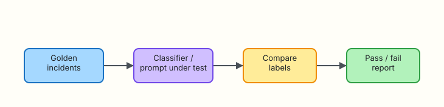

# Evaluation and Reliability

## Overview

A prompt that worked in a demo can fail quietly in production: labels drift, severity inflates, and the model **hallucinates** hostnames that never appeared in the log. **Evaluation** is how platform teams treat prompts like code — with golden inputs, expected outputs, pass/fail reports, and regression gates before merge.

Reliability for ops assistants is not “always sound smart”. It is “meet agreed accuracy on labelled incidents, fail closed when unsure, and catch prompt edits that break taxonomy”.

This tutorial covers hallucination modes, golden-file testing, and prompt regression — then you build an eval suite under `~/rebash-ai/module-04` with **exactly ten** labelled incidents, a mock classifier, a pass/fail report, and a deliberate break/fix cycle.

This is **Tutorial 4** in **Module 4: Evaluation** of the REBASH Academy **AI for DevOps Engineers** series — practical AI for Cloud and DevOps work.

## Prerequisites

- [Prompt Engineering for Ops](prompt-engineering-for-ops.md) (JSON summaries and redaction)
- Python 3.10+
- Optional: familiarity with pytest-style thinking (this lab uses a standalone CLI)

## Learning Objectives

By the end of this tutorial, you will be able to:

- [ ] Name common hallucination and failure modes for ops classifiers
- [ ] Design a golden-file dataset with expected labels and schema
- [ ] Run a pass/fail eval report suitable for CI
- [ ] Detect prompt regression by comparing accuracy before and after a change
- [ ] Explain why eval suites belong in pull-request checks for prompt repos

## Architecture

Golden incidents flow through a **classifier** (mock rules simulating an LLM). The **eval runner** compares predicted labels to expected values and writes a report for CI or humans.



## Theory

### What it is

**Evaluation** measures how often your assistant meets spec on a fixed test set. A **golden file** stores inputs and expected outputs — incident text plus labels such as `severity` and `category`. **Regression** means a prompt or model change lowered accuracy on that set.

| Term | Plain meaning |
|------|----------------|
| Hallucination | Model states false facts confidently (invented host, wrong root cause) |
| Golden test | Known input → expected output; deterministic pass/fail |
| Accuracy | Fraction of cases matching expected labels |
| Regression | New version performs worse than baseline |
| Fail closed | On low confidence or eval failure, do not automate mutations |

### Why it matters

Without evals, teams discover prompt bugs from production pages — after the wrong severity routed to the CEO. Golden files give:

- Objective **merge gates** for prompt repositories  
- Evidence for security and SRE reviewers  
- A vocabulary for “we accept 9/10 on this taxonomy until next quarter”  

### How it works

1. **Curate** ten-plus realistic incident snippets (no real customer secrets)  
2. **Label** expected severity/category/component with engineer consensus  
3. **Run classifier** on each case (mock or live)  
4. **Compare** prediction to expected — record pass/fail per row  
5. **Gate** CI on 100% or agreed threshold (e.g. ≥90%)  
6. **Investigate** failures — prompt drift, ambiguous gold label, or bad redaction  

```text
golden incidents.json → classifier(prompt) → compare → eval-report.json → CI pass/fail
```

### Key concepts and comparisons

| Failure mode | Symptom | Mitigation |
|--------------|---------|------------|
| Hallucinated entity | Hostname not in log | Prompt: “only entities from input”; eval catches |
| Severity inflation | Everything critical | Few-shot calibration; golden counterexamples |
| JSON breakage | Parse errors | Schema validation; reject in pipeline |
| Prompt injection in log | Log text steers model | Redact + treat log as data; separate system role |
| Non-determinism | Different labels same input | Lower temperature; mock in CI; track live separately |

| Eval style | Pros | Cons |
|------------|------|------|
| Golden file (exact match) | Clear pass/fail; great for CI | Brittle to wording changes |
| LLM-as-judge | Flexible rubric | Expensive; judge bias |
| Human review | Highest trust | Slow; not every PR |

For ops v1, **golden exact match** on structured labels is the right default.

### Common pitfalls

- Only three happy-path examples — misses edge cases  
- Gold labels inconsistent between authors  
- Evaluating on production logs with secrets  
- Ignoring “almost right” severity — define tie-break rules  
- Skipping eval when “we only changed wording”  

## Hands-on Lab

### Objective

Build a **golden-file eval suite** under `~/rebash-ai/module-04` with exactly **10** incidents and expected labels, a mock classifier driven by prompt rules, a pass/fail JSON report, and a break/fix cycle that proves regression detection works.

### Prerequisites

- Python 3.10+
- No live API required

### Lab environment

Workspace: `~/rebash-ai/module-04`

``` {.bash .ra-terminal title="Terminal"}
mkdir -p ~/rebash-ai/module-04/{prompts,golden,out} && cd ~/rebash-ai/module-04
python3 --version | tee python-version.txt
```

!!! example "Expected output"
    Python 3.10+ in `python-version.txt`.

### Real-world scenario

Your team ships an incident auto-triage prompt. SRE wants proof that pull requests cannot merge if severity labelling drops below 100% on the agreed ten-incident benchmark. You deliver the golden file, eval CLI, and a demo where a “clever” prompt edit breaks one label and CI fails until you revert.

### Step-by-step tasks

#### Task 1 – Golden incidents (exactly 10)

Create `golden/incidents.json`:

```json title="golden/incidents.json"
[
  {"id": "inc-01", "text": "ERROR payments-api timeout upstream=ledger latency_ms=1200", "expected": {"severity": "high", "category": "dependency", "component": "payments-api"}},
  {"id": "inc-02", "text": "INFO edge-proxy health check ok", "expected": {"severity": "low", "category": "noise", "component": "edge-proxy"}},
  {"id": "inc-03", "text": "CRITICAL database connection refused service=orders-db", "expected": {"severity": "critical", "category": "database", "component": "orders-db"}},
  {"id": "inc-04", "text": "WARN disk usage 82% mount=/var host=build-03", "expected": {"severity": "medium", "category": "capacity", "component": "build-03"}},
  {"id": "inc-05", "text": "ERROR OOMKilled service=checkout-worker", "expected": {"severity": "high", "category": "memory", "component": "checkout-worker"}},
  {"id": "inc-06", "text": "WARN 401 unauthorized service=api-gateway", "expected": {"severity": "medium", "category": "security", "component": "api-gateway"}},
  {"id": "inc-07", "text": "INFO deployment rollout complete service=catalog", "expected": {"severity": "low", "category": "deploy", "component": "catalog"}},
  {"id": "inc-08", "text": "ERROR TLS handshake failed host=legacy-vendor", "expected": {"severity": "high", "category": "network", "component": "legacy-vendor"}},
  {"id": "inc-09", "text": "WARN queue depth rising queue=email-delivery depth=50000", "expected": {"severity": "medium", "category": "backlog", "component": "email-delivery"}},
  {"id": "inc-10", "text": "CRITICAL region unreachable control-plane zone=eu-west", "expected": {"severity": "critical", "category": "platform", "component": "control-plane"}}
]
```

Create `check_golden.py`:

```python title="check_golden.py"
"""Assert the golden file has exactly ten unique incidents."""
from __future__ import annotations

import json
import sys
from pathlib import Path

data = json.loads(Path("golden/incidents.json").read_text(encoding="utf-8"))
if len(data) != 10:
    print(f"expected 10 incidents, got {len(data)}", file=sys.stderr)
    raise SystemExit(1)
ids = [r["id"] for r in data]
if len(set(ids)) != 10:
    print("incident ids must be unique", file=sys.stderr)
    raise SystemExit(1)
print("golden_count=10 OK")
```

``` {.bash .ra-terminal title="Terminal"}
cd ~/rebash-ai/module-04
python3 check_golden.py
```

!!! example "Expected output"
    `golden_count=10 OK`

#### Task 2 – Mock classifier and eval runner

Create `prompts/rules.json`:

```json title="prompts/rules.json"
{
  "severity_rules": [
    {"severity": "critical", "match": ["critical", "region unreachable"]},
    {"severity": "high", "match": ["oomkilled", "timeout", "tls handshake failed"]},
    {"severity": "medium", "match": ["warn", "401", "unauthorized", "disk usage", "queue depth"]},
    {"severity": "low", "match": ["info", "health check ok", "rollout complete"]}
  ],
  "category_rules": [
    {"match": ["timeout", "upstream"], "category": "dependency"},
    {"match": ["connection refused", "database"], "category": "database"},
    {"match": ["oomkilled", "oom"], "category": "memory"},
    {"match": ["401", "unauthorized"], "category": "security"},
    {"match": ["tls handshake"], "category": "network"},
    {"match": ["disk usage"], "category": "capacity"},
    {"match": ["queue depth"], "category": "backlog"},
    {"match": ["rollout"], "category": "deploy"},
    {"match": ["region unreachable"], "category": "platform"},
    {"match": ["health check ok"], "category": "noise"}
  ]
}
```

Create `classifier.py`:

```python title="classifier.py"
"""Mock incident classifier — simulates LLM JSON labels from prompt rules."""
from __future__ import annotations

import json
import re
from pathlib import Path
from typing import Any

RULES_PATH = Path(__file__).resolve().parent / "prompts" / "rules.json"


def load_rules(path: Path = RULES_PATH) -> dict[str, Any]:
    return json.loads(path.read_text(encoding="utf-8"))


def _severity(text: str, rules: dict[str, Any]) -> str:
    lower = text.lower()
    for rule in rules["severity_rules"]:
        if any(k in lower for k in rule["match"]):
            return rule["severity"]
    return "medium"


def _category(text: str, rules: dict[str, Any]) -> str:
    lower = text.lower()
    for rule in rules["category_rules"]:
        if any(k in lower for k in rule["match"]):
            return rule["category"]
    return "unknown"


def _component(text: str) -> str:
    for pattern in (
        r"service=([A-Za-z0-9\-]+)",
        r"host=([A-Za-z0-9\-]+)",
        r"queue=([A-Za-z0-9\-]+)",
    ):
        m = re.search(pattern, text, re.IGNORECASE)
        if m:
            return m.group(1)
    if "payments-api" in text:
        return "payments-api"
    if "edge-proxy" in text:
        return "edge-proxy"
    if "control-plane" in text:
        return "control-plane"
    return "unknown"


def classify(text: str, rules: dict[str, Any] | None = None) -> dict[str, str]:
    rules = rules or load_rules()
    return {
        "severity": _severity(text, rules),
        "category": _category(text, rules),
        "component": _component(text),
    }
```

Create `eval_suite.py`:

```python title="eval_suite.py"
"""Golden-file eval — pass/fail report for incident classifier."""
from __future__ import annotations

import argparse
import json
import sys
from pathlib import Path
from typing import Any

from classifier import classify, load_rules


def evaluate(golden_path: Path, rules_path: Path) -> dict[str, Any]:
    rows = json.loads(golden_path.read_text(encoding="utf-8"))
    rules = load_rules(rules_path)
    results: list[dict[str, Any]] = []
    passed = 0

    for row in rows:
        predicted = classify(row["text"], rules)
        expected = row["expected"]
        ok = predicted == expected
        if ok:
            passed += 1
        results.append(
            {
                "id": row["id"],
                "pass": ok,
                "expected": expected,
                "predicted": predicted,
            }
        )

    total = len(rows)
    return {
        "total": total,
        "passed": passed,
        "failed": total - passed,
        "accuracy": round(passed / total, 4) if total else 0.0,
        "results": results,
    }


def main() -> int:
    parser = argparse.ArgumentParser(description="Golden incident eval")
    parser.add_argument("--golden", type=Path, default=Path("golden/incidents.json"))
    parser.add_argument("--rules", type=Path, default=Path("prompts/rules.json"))
    parser.add_argument("--out", type=Path, default=Path("eval-report.json"))
    parser.add_argument("--min-accuracy", type=float, default=1.0)
    args = parser.parse_args()

    report = evaluate(args.golden, args.rules)
    args.out.write_text(json.dumps(report, indent=2) + "\n", encoding="utf-8")

    print(f"eval total={report['total']} passed={report['passed']} failed={report['failed']} accuracy={report['accuracy']}")
    if report["accuracy"] < args.min_accuracy:
        print("EVAL_FAIL: accuracy below threshold", file=sys.stderr)
        return 1
    print("EVAL_PASS")
    return 0


if __name__ == "__main__":
    raise SystemExit(main())
```

``` {.bash .ra-terminal title="Terminal"}
cd ~/rebash-ai/module-04
python3 eval_suite.py --out eval-report.json
test -f eval-report.json
grep -q 'EVAL_PASS' <(python3 eval_suite.py 2>&1)
python3 - <<'PY'
import json
from pathlib import Path
r = json.loads(Path("eval-report.json").read_text())
assert r["total"] == 10 and r["failed"] == 0
print("baseline_all_pass=OK")
PY
```

!!! example "Expected output"
    `eval total=10 passed=10 failed=0 accuracy=1.0` and `EVAL_PASS`. `baseline_all_pass=OK`.

#### Task 3 – Break: prompt regression fails eval

Create `prompts/rules-broken.json`:

```json title="prompts/rules-broken.json"
{
  "severity_rules": [
    {"severity": "critical", "match": ["critical", "region unreachable"]},
    {"severity": "high", "match": ["oomkilled", "timeout", "tls handshake failed", "warn"]},
    {"severity": "medium", "match": ["401", "unauthorized", "disk usage", "queue depth"]},
    {"severity": "low", "match": ["info", "health check ok", "rollout complete"]}
  ],
  "category_rules": [
    {"match": ["timeout", "upstream"], "category": "dependency"},
    {"match": ["connection refused", "database"], "category": "database"},
    {"match": ["oomkilled", "oom"], "category": "memory"},
    {"match": ["401", "unauthorized"], "category": "security"},
    {"match": ["tls handshake"], "category": "network"},
    {"match": ["disk usage"], "category": "capacity"},
    {"match": ["queue depth"], "category": "backlog"},
    {"match": ["rollout"], "category": "deploy"},
    {"match": ["region unreachable"], "category": "platform"},
    {"match": ["health check ok"], "category": "noise"}
  ]
}
```

The bug: `"warn"` was wrongly added to **high** severity — disk and queue incidents mis-label.

``` {.bash .ra-terminal title="Terminal"}
cd ~/rebash-ai/module-04
python3 eval_suite.py --rules prompts/rules-broken.json --out eval-report-broken.json --min-accuracy 1.0 2>broken.err || true
grep -q 'EVAL_FAIL' broken.err || grep -q 'failed=' broken.err
python3 - <<'PY'
import json
from pathlib import Path
r = json.loads(Path("eval-report-broken.json").read_text())
failed = [x for x in r["results"] if not x["pass"]]
print(f"regression_failures={len(failed)}")
assert len(failed) >= 1
for f in failed:
    print(f"  {f['id']}: expected {f['expected']['severity']} got {f['predicted']['severity']}")
PY
```

!!! example "Expected output"
    Eval exits non-zero. Report shows at least one failure (e.g. `inc-04` or `inc-09` severity high instead of medium).

#### Task 4 – Fix: restore rules and prove green

``` {.bash .ra-terminal title="Terminal"}
cd ~/rebash-ai/module-04
python3 eval_suite.py --rules prompts/rules.json --out eval-report-fixed.json
python3 - <<'PY'
import json
from pathlib import Path
fixed = json.loads(Path("eval-report-fixed.json").read_text())
assert fixed["failed"] == 0
Path("ci-evidence.txt").write_text(
    f"accuracy={fixed['accuracy']} passed={fixed['passed']}/10\n"
)
print("regression_fixed=OK")
PY
cat ci-evidence.txt
```

!!! example "Expected output"
    `EVAL_PASS`, `regression_fixed=OK`, and `ci-evidence.txt` showing `accuracy=1.0 passed=10/10`.

### Validation steps

- [ ] Golden file contains exactly 10 unique incident IDs
- [ ] Baseline eval passes 10/10 with `prompts/rules.json`
- [ ] Broken rules produce at least one failure and non-zero exit
- [ ] Fixed rules return to 10/10
- [ ] You can explain hallucination vs golden mismatch in an interview

### Common errors and fixes

| Error | Cause | Fix |
|-------|-------|-----|
| `expected 10 incidents, got N` | Edited golden file | Restore ten rows |
| All pass on broken rules | Threshold too low | Use `--min-accuracy 1.0` |
| Component mismatch | Regex missed token | Extend `_component` patterns |
| Flaky live eval | Non-deterministic model | Mock in CI; live on schedule |

### Challenge exercise

Add `--fail-id inc-03` debugging flag that prints rule trace for one incident. Extend golden file with an eleventh **adversarial** case containing prompt-injection text (`ignore previous instructions`) and assert category still follows log semantics.

### Learning outcomes

- You own a ten-incident golden benchmark with structured labels  
- You wired pass/fail reporting suitable for CI gates  
- You demonstrated prompt regression detection and recovery  

### Cleanup

``` {.bash .ra-terminal title="Terminal"}
echo "Keep ~/rebash-ai/module-04 for portfolio evidence or rm -rf manually"
```

## Validation

- [ ] Lab path completed successfully  
- [ ] Can define golden-file eval vs LLM-as-judge  
- [ ] Can name two hallucination modes relevant to ops  
- [ ] Can describe CI gating policy for prompt repositories  

## Code Walkthrough

1. **Fix dataset size** — ten labelled incidents is a minimal credible benchmark.  
2. **Separate** rules/prompts from runner — swap prompts without rewriting eval logic.  
3. **Compare** structured fields exactly — severity/category/component first.  
4. **Exit non-zero** on regression — humans ignore warnings in CI logs.  
5. **Archive** eval reports as merge artefacts for audits.  

## Security Considerations

- Golden files use fictional incidents — no production secrets  
- Eval reports may still contain incident text — restrict repo access  
- Do not auto-remediate from classifier output without Module 1 gate  
- Track who changed gold labels — they are specification data  
- Run redaction if importing real logs into gold sets  

## Common Mistakes

!!! warning "Changing gold labels to match a bad model"
    **Fix:** Gold is spec. Fix prompts or rules; do not weaken tests to greenwash.

!!! warning "Evaluating only on live API in CI"
    **Fix:** Mock determinism in CI; optional scheduled live canary.

!!! warning "Single accuracy number without per-id failures"
    **Fix:** Store per-incident diff — reviewers need `inc-04` not just 90%.

## Best Practices

- Check golden eval on every prompt pull request  
- Version `golden/incidents.json` with review from two engineers  
- Keep threshold explicit (`--min-accuracy 1.0` or documented 0.9)  
- Add adversarial and noise cases as the taxonomy matures  
- Pair eval pass with redaction tests from Module 3  

## Troubleshooting

| Symptom | Likely cause | Fix |
|---------|--------------|-----|
| Intermittent CI pass | Live model randomness | Pin mock backend in CI |
| Wrong category only | Overlapping keywords | Order rules most-specific first |
| Component always unknown | Missing regex | Extend `_component` |
| Eval passes locally, fails in CI | Different rules file path | Pass `--rules` explicitly |

## Summary

Reliable ops assistants need golden tests, not hope. Hallucinations and prompt drift show up as eval failures before customers do. Your suite under `~/rebash-ai/module-04` is the template for every prompt change going forward.

Next: [Embeddings and Semantic Search](embeddings-and-semantic-search.md).

## Interview Questions

**1. What is a golden-file eval for prompts?**

??? success "Reveal answer"
    A fixed set of inputs with expected structured outputs. Each run compares model or classifier output to gold labels and produces pass/fail — like unit tests for prompt behaviour.

**2. How is hallucination different from a low-confidence mistake?**

??? success "Reveal answer"
    Hallucination invents plausible facts (hostnames, root causes) not supported by input. Low-confidence mistakes may omit or mis-label while the model expresses uncertainty — if you ask for confidence scores.

**3. Why exactly ten incidents in this lab benchmark?**

??? success "Reveal answer"
    Large enough to cover severity levels and categories without unmaintainable bulk; small enough to review in pull requests. Production teams grow the set over time — ten is a credible minimum demo.

**4. What should CI do when accuracy drops from 1.0 to 0.9 after a prompt edit?**

??? success "Reveal answer"
    Fail the build unless the drop is intentional, documented, and approved — with updated gold labels or a negotiated threshold. Silent merges erode trust in auto-triage.

**5. How do you detect severity inflation in eval results?**

??? success "Reveal answer"
    Compare predicted vs expected severity fields per id; track confusion matrix over time; add counterexamples where WARN logs must stay medium/low.

**6. Why use mock classifier in CI instead of live LLM?**

??? success "Reveal answer"
    Deterministic, free, fast, no secrets — proves eval plumbing and catches rule/prompt logic errors. Live model eval is a separate scheduled job with its own budget.

**7. What belongs in an eval report for auditors?**

??? success "Reveal answer"
    Timestamp, prompt/rules version hash, total/passed/failed, per-id expected vs predicted diff, and threshold — not raw API keys or full production logs.

**8. How does evaluation connect to human-in-the-loop from Module 1?**

??? success "Reveal answer"
    Even a passing eval does not auto-execute mutations. Eval gates prompt quality; policy gates still block forbidden actions and require approval for production changes.

## Related Tutorials

- Prior: [Prompt Engineering for Ops](prompt-engineering-for-ops.md)
- Next: [Embeddings and Semantic Search](embeddings-and-semantic-search.md)
- Course: [AI for DevOps Overview](index.md)

## References

- [OpenAI — Evals guide](https://platform.openai.com/docs/guides/evals)
- [Google Cloud — Responsible AI testing](https://cloud.google.com/discover/what-is-responsible-ai)
- [REBASH Academy — AI for DevOps career path](../career-paths/ai-for-devops/index.md)
