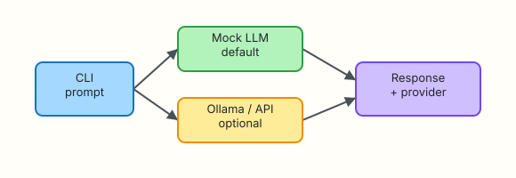

# LLM and API Fundamentals

## Overview

Every ops assistant you build will eventually call a model through an HTTP API — whether that is a vendor endpoint, an internal gateway, or a local **Ollama** server on a jump host. Before you wire prompts and tools, you need a clear mental model of **tokens**, **chat completions**, **model choice**, and **latency/cost trade-offs**.

Most production incidents involving LLM integrations are not “the model is dumb” — they are “we hit the wrong endpoint”, “context blew the budget”, or “timeouts stacked under load”. Interviewers expect you to explain how you would test an integration **without** burning API credits on every CI run.

This tutorial covers how chat completion APIs work, how OpenAI-compatible clients fit platform engineering, and how to ship a **mock-first** CLI chat tool that optionally talks to live APIs when credentials exist — never requiring them.

This is **Tutorial 2** in **Module 2: LLM & APIs** of the REBASH Academy **AI for DevOps Engineers** series — practical AI for Cloud and DevOps work.

## Prerequisites

- [AI for DevOps Foundations](ai-for-devops-foundations.md) (policy gate and human-in-the-loop model)
- Python 3.10+ and comfort with JSON
- Optional: `OPENAI_API_KEY` for a live OpenAI-compatible endpoint
- Optional: [Ollama](https://ollama.com/) on `OLLAMA_HOST` (default `http://127.0.0.1:11434`) — not required

## Learning Objectives

By the end of this tutorial, you will be able to:

- [ ] Explain tokens, chat roles, and completion responses in plain language
- [ ] Compare mock, local (Ollama), and live OpenAI-compatible backends for CI and on-call use
- [ ] Estimate latency and cost drivers for ops assistants
- [ ] Build a CLI chat client under `~/rebash-ai/module-02` that works offline with a mock
- [ ] Diagnose common API failures (auth, model name, timeout) from CLI evidence

## Architecture

Your application sends a **messages** array to a completion endpoint. A client library (or thin HTTP wrapper) returns assistant text plus usage metadata. The same interface can target mock, Ollama, or a cloud API.



## Theory

### What it is

A **Large Language Model (LLM)** predicts the next token (roughly a word fragment) given prior tokens. A **chat completion** API accepts a list of messages — typically `system`, `user`, and `assistant` roles — and returns the model’s next assistant message.

| Term | Plain meaning |
|------|----------------|
| Token | Smallest billing/context unit; ~4 characters of English on average |
| Prompt | Input text (all messages sent to the model) |
| Completion | Model output text |
| Context window | Maximum tokens the model can read in one request |
| Model ID | Vendor string such as `gpt-4o-mini` or `llama3.2` |

**Interview one-liner:** You pay for tokens in and tokens out; latency grows with prompt size and model size.

### Why it matters

Ops assistants read logs, tickets, and runbooks — often tens of thousands of tokens if you are careless. Platform teams need:

- Predictable **cost** (token meters, per-team budgets)
- Predictable **latency** (p95 under on-call pressure)
- **Testability** without live API keys in CI

A mock client lets pipelines prove wiring; Ollama gives engineers a local sandbox; live APIs stay optional behind environment variables.

### How it works

Typical chat completion flow:

1. **Build messages** — system instructions + user question (+ optional history)
2. **POST** to `/v1/chat/completions` (OpenAI-compatible shape) or vendor equivalent
3. **Receive JSON** — `choices[0].message.content`, `usage.prompt_tokens`, `usage.completion_tokens`
4. **Handle errors** — 401 auth, 404 model, 429 rate limit, 504 timeout
5. **Log safely** — redact secrets before logging prompts (Module 3)

```text
CLI → client adapter (mock | ollama | openai) → HTTP → model → JSON response → stdout
```

### Key concepts and comparisons

| Backend | Best for | CI-friendly | Cost |
|---------|----------|-------------|------|
| Mock | Unit tests, offline labs, deterministic demos | Yes | Free |
| Ollama (local) | Engineer laptop, air-gapped eval | Yes (if installed) | Free (GPU optional) |
| OpenAI-compatible cloud | Production assistants, best quality | Only with secrets | Per token |

| Latency driver | Effect | Mitigation |
|----------------|--------|------------|
| Large prompt | More input tokens to process | Summarise logs first; trim history |
| Large model | Slower inference | Use smaller model for triage |
| Cold start (serverless) | First request slow | Warm-up job or dedicated endpoint |
| Network RTT | Adds tens–hundreds of ms | Regional endpoint; retry with backoff |

| Cost driver | Effect | Mitigation |
|-------------|--------|------------|
| Input tokens | Every log line in prompt costs money | Chunk + retrieve (Module 5) |
| Output tokens | Long answers cost more | Ask for JSON / bullet limits |
| Tool loops | Multiple round trips | Cap iterations; cache reads |

**OpenAI-compatible** means the request/response JSON matches the de facto `/v1/chat/completions` schema. Many gateways (Azure OpenAI, local proxies, LiteLLM) expose the same shape — your client code stays portable.

### Common pitfalls

- Sending full log files in one prompt → context overflow or huge bills  
- Hard-coding vendor SDKs everywhere → cannot swap mock/Ollama in CI  
- Ignoring `usage` fields → no FinOps visibility  
- Treating streaming as required for batch ops tools → simpler sync calls often suffice  
- Logging raw prompts that contain API keys or Bearer tokens  

## Hands-on Lab

### Objective

Build a **mock-first CLI chat client** under `~/rebash-ai/module-02` that completes chat requests offline, records token usage, and optionally uses Ollama or an OpenAI-compatible API when configured — never requiring live credentials.

### Prerequisites

- Python 3.10+
- Optional: `export OPENAI_API_KEY=...` and `export OPENAI_BASE_URL=...` if your org uses a gateway
- Optional: Ollama running (`curl -s http://127.0.0.1:11434/api/tags`)

### Lab environment

Workspace: `~/rebash-ai/module-02`

``` {.bash .ra-terminal title="Terminal"}
mkdir -p ~/rebash-ai/module-02 && cd ~/rebash-ai/module-02
python3 --version | tee python-version.txt
```

!!! example "Expected output"
    `python-version.txt` shows Python 3.10 or newer.

### Real-world scenario

Platform engineering wants a standard “ops copilot” CLI for on-call. Security refuses to put production API keys in CI. You deliver a client that runs 100% offline in pipelines (mock), lets engineers use Ollama on laptops, and supports the corporate OpenAI-compatible gateway when `OPENAI_API_KEY` is present.

### Step-by-step tasks

#### Task 1 – Mock completion client and shared adapter

Create `mock_client.py`:

```python title="mock_client.py"
"""Deterministic mock chat completions for CI and offline labs."""
from __future__ import annotations

import hashlib
import json
from typing import Any


def _estimate_tokens(text: str) -> int:
    # Rough heuristic for labs — not for billing
    return max(1, len(text.split()))


def chat_completion(
    messages: list[dict[str, str]],
    model: str = "mock-ops-v1",
    temperature: float = 0.2,
) -> dict[str, Any]:
    user_bits = [m["content"] for m in messages if m.get("role") == "user"]
    user_text = " ".join(user_bits).strip() or "(empty)"
    digest = hashlib.sha256(user_text.encode()).hexdigest()[:8]

    if "latency" in user_text.lower():
        reply = (
            "Check p95 latency on the ingress and upstream dependency. "
            "Compare error rate and saturation before restarting pods."
        )
    elif "oom" in user_text.lower() or "memory" in user_text.lower():
        reply = "Inspect container memory limits and recent deploys. Check for leaks before scaling."
    else:
        reply = f"Mock assistant ({model}, temp={temperature}): acknowledged — ref {digest}."

    prompt_tokens = sum(_estimate_tokens(m.get("content", "")) for m in messages)
    completion_tokens = _estimate_tokens(reply)

    return {
        "id": f"chatcmpl-mock-{digest}",
        "object": "chat.completion",
        "model": model,
        "choices": [
            {
                "index": 0,
                "message": {"role": "assistant", "content": reply},
                "finish_reason": "stop",
            }
        ],
        "usage": {
            "prompt_tokens": prompt_tokens,
            "completion_tokens": completion_tokens,
            "total_tokens": prompt_tokens + completion_tokens,
        },
    }


def chat_completion_json(messages: list[dict[str, str]], **kwargs: Any) -> str:
    return json.dumps(chat_completion(messages, **kwargs), indent=2)
```

Create `llm_client.py`:

```python title="llm_client.py"
"""Select mock, Ollama, or OpenAI-compatible backend from environment."""
from __future__ import annotations

import json
import os
import urllib.error
import urllib.request
from typing import Any

from mock_client import chat_completion as mock_chat_completion


def _post_json(url: str, payload: dict[str, Any], headers: dict[str, str]) -> dict[str, Any]:
    data = json.dumps(payload).encode()
    req = urllib.request.Request(url, data=data, headers=headers, method="POST")
    with urllib.request.urlopen(req, timeout=60) as resp:
        return json.loads(resp.read().decode())


def _openai_chat(messages: list[dict[str, str]], model: str, temperature: float) -> dict[str, Any]:
    api_key = os.environ.get("OPENAI_API_KEY", "").strip()
    if not api_key:
        raise RuntimeError("OPENAI_API_KEY not set")

    base = os.environ.get("OPENAI_BASE_URL", "https://api.openai.com/v1").rstrip("/")
    url = f"{base}/chat/completions"
    headers = {
        "Authorization": f"Bearer {api_key}",
        "Content-Type": "application/json",
    }
    payload = {"model": model, "messages": messages, "temperature": temperature}
    return _post_json(url, payload, headers)


def _ollama_chat(messages: list[dict[str, str]], model: str, temperature: float) -> dict[str, Any]:
    host = os.environ.get("OLLAMA_HOST", "http://127.0.0.1:11434").rstrip("/")
    url = f"{host}/api/chat"
    payload = {"model": model, "messages": messages, "stream": False, "options": {"temperature": temperature}}
    raw = _post_json(url, payload, {"Content-Type": "application/json"})
    content = raw.get("message", {}).get("content", "")
    prompt_tokens = len(json.dumps(messages)) // 4
    completion_tokens = len(content) // 4
    return {
        "id": "ollama-local",
        "object": "chat.completion",
        "model": model,
        "choices": [{"index": 0, "message": {"role": "assistant", "content": content}, "finish_reason": "stop"}],
        "usage": {
            "prompt_tokens": prompt_tokens,
            "completion_tokens": completion_tokens,
            "total_tokens": prompt_tokens + completion_tokens,
        },
    }


def resolve_backend(explicit: str | None = None) -> str:
    if explicit and explicit != "auto":
        return explicit
    if os.environ.get("OPENAI_API_KEY", "").strip():
        return "openai"
    if os.environ.get("OLLAMA_HOST") or _ollama_reachable():
        return "ollama"
    return "mock"


def _ollama_reachable() -> bool:
    host = os.environ.get("OLLAMA_HOST", "http://127.0.0.1:11434").rstrip("/")
    try:
        urllib.request.urlopen(f"{host}/api/tags", timeout=2)
        return True
    except (urllib.error.URLError, TimeoutError):
        return False


def chat_completion(
    messages: list[dict[str, str]],
    model: str = "mock-ops-v1",
    temperature: float = 0.2,
    backend: str | None = None,
) -> dict[str, Any]:
    chosen = resolve_backend(backend)
    if chosen == "openai":
        live_model = os.environ.get("OPENAI_MODEL", model)
        return _openai_chat(messages, live_model, temperature)
    if chosen == "ollama":
        ollama_model = os.environ.get("OLLAMA_MODEL", "llama3.2")
        return _ollama_chat(messages, ollama_model, temperature)
    return mock_chat_completion(messages, model=model, temperature=temperature)
```

Create `chat_cli.py`:

```python title="chat_cli.py"
"""CLI chat — mock-first; optional OpenAI-compatible or Ollama."""
from __future__ import annotations

import argparse
import json
import sys
from pathlib import Path

from llm_client import chat_completion, resolve_backend


def main() -> int:
    parser = argparse.ArgumentParser(description="Ops copilot chat CLI")
    parser.add_argument("--message", "-m", required=True, help="User message")
    parser.add_argument("--system", default="You are a concise SRE assistant.", help="System prompt")
    parser.add_argument("--model", default="mock-ops-v1", help="Model id (mock name or live model)")
    parser.add_argument("--backend", choices=["auto", "mock", "openai", "ollama"], default="auto")
    parser.add_argument("--out", type=Path, default=Path("last-response.json"))
    args = parser.parse_args()

    messages = [
        {"role": "system", "content": args.system},
        {"role": "user", "content": args.message},
    ]

    backend = resolve_backend(args.backend)
    try:
        result = chat_completion(messages, model=args.model, backend=args.backend)
    except Exception as exc:  # noqa: BLE001 — surface to CLI for labs
        print(f"ERROR backend={backend} detail={exc}", file=sys.stderr)
        return 1

    args.out.write_text(json.dumps(result, indent=2) + "\n", encoding="utf-8")
    content = result["choices"][0]["message"]["content"]
    usage = result.get("usage", {})
    print(f"backend={backend} model={result.get('model')} tokens={usage.get('total_tokens')}")
    print(content)
    return 0


if __name__ == "__main__":
    raise SystemExit(main())
```

``` {.bash .ra-terminal title="Terminal"}
cd ~/rebash-ai/module-02
python3 chat_cli.py --backend mock -m "We see elevated latency on payments-api"
test -f last-response.json
grep -q 'Mock assistant' last-response.json
grep -q 'prompt_tokens' last-response.json
```

!!! example "Expected output"
    stdout includes `backend=mock`, a token count, and SRE-style guidance mentioning latency. `last-response.json` contains `usage` and assistant `content`.

#### Task 2 – Prove optional live backends (skip if unavailable)

``` {.bash .ra-terminal title="Terminal"}
cd ~/rebash-ai/module-02
if [ -n "${OPENAI_API_KEY:-}" ]; then
  python3 chat_cli.py --backend openai -m "Summarise one check for high CPU" --out live-openai.json
  test -f live-openai.json && echo "openai_backend=OK"
else
  echo "openai_backend=SKIPPED (no OPENAI_API_KEY)"
fi
if curl -sf "${OLLAMA_HOST:-http://127.0.0.1:11434}/api/tags" >/dev/null 2>&1; then
  python3 chat_cli.py --backend ollama -m "One line: what is a pod restart?" --out live-ollama.json
  test -f live-ollama.json && echo "ollama_backend=OK"
else
  echo "ollama_backend=SKIPPED (Ollama not reachable)"
fi
```

!!! example "Expected output"
    Mock always works. Live lines print `OK` or `SKIPPED` — neither failure blocks the lab.

#### Task 3 – Break and fix: unknown backend and error handling

Create `broken_env_test.sh`:

```bash title="broken_env_test.sh"
#!/usr/bin/env bash
set -euo pipefail
cd ~/rebash-ai/module-02
# Force openai without a key — must fail cleanly
unset OPENAI_API_KEY
if python3 chat_cli.py --backend openai -m "test" 2>err.txt; then
  echo "FAIL: should have errored"
  exit 1
fi
grep -q 'OPENAI_API_KEY not set' err.txt
echo "auth_error_handled=OK"
```

``` {.bash .ra-terminal title="Terminal"}
cd ~/rebash-ai/module-02
chmod +x broken_env_test.sh
./broken_env_test.sh
python3 chat_cli.py --backend mock -m "OOMKill on checkout-worker" | tee recovery.txt
grep -q 'memory' recovery.txt
```

!!! example "Expected output"
    `auth_error_handled=OK` then mock recovery output mentioning memory or limits.

#### Task 4 – Interview evidence: token and latency note

``` {.bash .ra-terminal title="Terminal"}
cd ~/rebash-ai/module-02
python3 chat_cli.py --backend mock -m "latency spike after deploy" --out evidence.json
python3 - <<'PY'
import json
from pathlib import Path
data = json.loads(Path("evidence.json").read_text())
u = data["usage"]
print(f"prompt_tokens={u['prompt_tokens']} completion_tokens={u['completion_tokens']}")
assert u["total_tokens"] == u["prompt_tokens"] + u["completion_tokens"]
PY
| tee token-evidence.txt
```

!!! example "Expected output"
    `token-evidence.txt` shows token breakdown; assertion passes.

### Validation steps

- [ ] Mock backend returns JSON with `choices`, `usage`, and assistant text
- [ ] `--backend openai` without `OPENAI_API_KEY` exits non-zero with a clear error
- [ ] Optional Ollama/OpenAI paths skip cleanly when unavailable
- [ ] You can explain tokens, context window, and why mocks belong in CI

### Common errors and fixes

| Error | Cause | Fix |
|-------|-------|-----|
| `OPENAI_API_KEY not set` | Live backend forced without secret | Use `--backend mock` in CI |
| `URLError` to Ollama | Daemon not running | Start Ollama or skip with mock |
| HTTP 404 on model | Wrong model name | Set `OPENAI_MODEL` / `OLLAMA_MODEL` |
| Empty assistant content | Malformed messages array | Ensure roles are `system`/`user`/`assistant` |

### Challenge exercise

Add a `--messages-file` flag to `chat_cli.py` that loads a JSON array of messages (multi-turn chat). Prove a two-turn conversation where the user first asks about latency and then asks for “three bullet checks” — mock should return distinct content.

### Learning outcomes

- You built a portable chat adapter (mock / Ollama / OpenAI-compatible)  
- You recorded usage metadata for FinOps conversations  
- You practised fail-safe behaviour when credentials are missing  

### Cleanup

``` {.bash .ra-terminal title="Terminal"}
echo "Artefacts remain under ~/rebash-ai/module-02 unless removed"
# rm -rf ~/rebash-ai/module-02
```

## Validation

- [ ] Lab path completed successfully  
- [ ] Can explain chat roles and token billing in own words  
- [ ] Can name when to use mock vs Ollama vs cloud  
- [ ] Can describe one production failure mode (timeout, rate limit, context overflow)  

## Code Walkthrough

1. **Inspect** environment before choosing a backend — never assume live keys in CI.  
2. **Normalise** on OpenAI-compatible JSON so adapters stay swappable.  
3. **Record** `usage` on every call for cost dashboards.  
4. **Surface** errors to stderr with backend name — on-call needs actionable text.  
5. **Keep secrets out** of repo; optional live paths via environment only.  

## Security Considerations

- Never commit API keys; use short-lived tokens and secret managers in production  
- Redact Bearer tokens and cloud credentials from logged prompts  
- Pin base URLs; prevent SSRF via misconfigured `OPENAI_BASE_URL`  
- Rate-limit internal gateways to contain runaway automation  
- Audit which teams can enable live backends in CI  

## Common Mistakes

!!! warning "Using production keys in CI because mock feels fake"
    **Fix:** Mock proves wiring; scheduled smoke tests hit live with rotated keys.

!!! warning "Sending entire log files as one prompt"
    **Fix:** Chunk, summarise, or retrieve relevant lines (Modules 3 and 5).

!!! warning "Ignoring latency under load"
    **Fix:** Set client timeouts, retries with jitter, and circuit breakers on the gateway.

## Best Practices

- Default to mock/offline in unit tests and pull-request checks  
- Log model ID, token usage, and latency — not full prompts with secrets  
- Wrap vendor SDKs behind your own thin adapter interface  
- Document `OPENAI_BASE_URL` for enterprise gateways  
- Cap output length for triage tools (JSON schema in Module 3)  

## Troubleshooting

| Symptom | Likely cause | Fix |
|---------|--------------|-----|
| 401 Unauthorized | Invalid or expired API key | Rotate key; check gateway headers |
| 429 Too Many Requests | Rate limit | Backoff; smaller model; queue requests |
| Timeout | Large prompt or cold start | Trim context; increase timeout; warm endpoint |
| Garbled JSON | Non-compatible proxy | Validate response schema in tests |
| Mock always selected | `auto` prefers mock when no env | Pass `--backend openai` explicitly when intended |

## Summary

Chat completion APIs are the wire protocol for ops assistants. Tokens drive cost and latency; adapters let you develop offline and deploy with the same interface. Your CLI under `~/rebash-ai/module-02` is the foundation for prompt templates and evaluation in the next modules.

Next: [Prompt Engineering for Ops](prompt-engineering-for-ops.md).

## Interview Questions

**1. What is a token in LLM billing terms?**

??? success "Reveal answer"
    A token is the unit vendors use to meter input and output — roughly a word fragment. You pay for prompt tokens plus completion tokens; long logs in the prompt directly increase cost and latency.

**2. What three roles appear in a typical chat completion request?**

??? success "Reveal answer"
    `system` (instructions), `user` (the human or upstream tool), and `assistant` (prior model replies in multi-turn history). The API returns a new assistant message.

**3. Why ship a mock LLM client in CI?**

??? success "Reveal answer"
    Deterministic tests without secrets, no network flakiness, no per-build API spend, and proof that your wiring (messages, parsing, error handling) works before live integration.

**4. When would you choose Ollama over a cloud API?**

??? success "Reveal answer"
    Local development, air-gapped environments, prototyping prompts, or cost-sensitive batch jobs where slightly lower quality is acceptable — always with governance if outputs touch production decisions.

**5. What does OpenAI-compatible mean for platform teams?**

??? success "Reveal answer"
    The HTTP JSON shape matches `/v1/chat/completions`, so one client can target OpenAI, Azure OpenAI, LiteLLM, or an internal gateway by changing base URL and credentials.

**6. Name two latency drivers and one mitigation each.**

??? success "Reveal answer"
    Large prompts → trim/summarise context. Large models → use a smaller model for triage. Network RTT → regional endpoint. Cold starts → dedicated capacity or warm-up.

**7. How should a CLI behave if `OPENAI_API_KEY` is missing but the operator passed `--backend openai`?**

??? success "Reveal answer"
    Fail fast with a clear error on stderr and non-zero exit — never silently fall back to mock in production mode, or operators may think they tested live behaviour.

**8. What metadata should you log from every completion call?**

??? success "Reveal answer"
    Backend, model ID, token usage, latency, request ID if available — and redacted prompt hashes rather than raw secrets. Enough for FinOps and incident replay.

## Related Tutorials

- Prior: [AI for DevOps Foundations](ai-for-devops-foundations.md)
- Next: [Prompt Engineering for Ops](prompt-engineering-for-ops.md)
- Course: [AI for DevOps Overview](index.md)

## References

- [OpenAI API — Chat completions](https://platform.openai.com/docs/api-reference/chat)
- [Ollama API documentation](https://github.com/ollama/ollama/blob/main/docs/api.md)
- [REBASH Academy — AI for DevOps career path](../career-paths/ai-for-devops/index.md)
