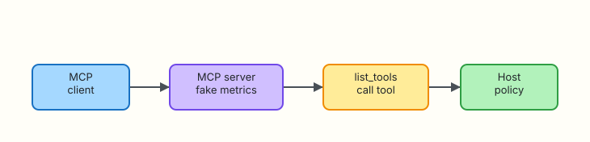

# Model Context Protocol (MCP) for DevOps

## Overview

Hard-coding every tool into each assistant does not scale. **Model Context Protocol (MCP)** is a way for hosts to **discover** tools from servers and call them with a shared shape — list tools, call tool, get structured results. For DevOps, MCP servers can expose read-only metrics, ticket search, or runbook lookup behind a policy boundary.

**Plain problem:** Five bots each reinvent `kubectl` wrappers. An MCP-style server advertises `get_cpu_percent` once; many clients reuse it — still under host allowlists.

This lab builds a minimal **MCP-style** JSON client/server (stdlib only) that lists fake metric tools and calls them. It is a teaching model of the protocol ideas, not a full network MCP SDK.

This is **Tutorial 9** in **Module 9: MCP** of the REBASH Academy **AI for DevOps Engineers** series — practical AI for Cloud and DevOps work.

## Prerequisites

- [Tool Calling and Function APIs](tool-calling-and-function-apis.md)
- Python 3.10+

## Learning Objectives

By the end of this tutorial, you will be able to:

- [ ] Explain MCP client vs server roles for ops tooling
- [ ] List tools advertised by a server
- [ ] Call a read-only fake metrics tool through the client
- [ ] Keep host policy outside the server (deny mutations)
- [ ] Contrast MCP discovery with hard-coded tool maps in interview

## Architecture

Client discovers tools from a server; the host still applies policy.



## Theory

### What it is

**MCP** standardises how AI applications connect to tool/data servers. Mentally:

| Role | Job |
|------|-----|
| MCP server | Advertises tools/resources; executes tool handlers |
| MCP client | Discovers tools; forwards calls from the host/agent |
| Host app | Policy, UX, credentials, auditing |

You do not need the full SDK to learn the loop: `list_tools` → `call_tool`.

### Why it matters

Platform teams want one metrics/runbook server reused by Slack bots, IDE copilots, and CI assistants — with consistent schemas and central policy.

### How it works

1. Client asks server for tool catalogue.  
2. Host filters catalogue through an allowlist.  
3. Model or workflow selects a tool.  
4. Client sends `call_tool` with arguments.  
5. Server returns JSON content; host audits.  

### Key concepts and comparisons

| Approach | Pros | Cons |
|----------|------|------|
| Hard-coded tools in one repo | Simple | Duplication across bots |
| MCP-style servers | Reuse, clearer boundary | Extra moving part |
| Raw shell plugin | Flexible | Unsafe by default |

### Common pitfalls

- Treating MCP as automatic trust — servers can still be dangerous  
- Putting cloud admin credentials inside every server  
- Skipping host-side allowlists because “the server is internal”  
- Confusing resources (data) with tools (actions)  

## Hands-on Lab

### Objective

Run a fake metrics MCP-style server and client under `~/rebash-ai/module-09`. List tools, call `get_cpu_percent`, and prove a mutating tool is filtered by host policy.

### Prerequisites

- Python 3.10+

### Lab environment

``` {.bash .ra-terminal title="Terminal"}
mkdir -p ~/rebash-ai/module-09 && cd ~/rebash-ai/module-09
python3 --version | tee python-version.txt
```

!!! example "Expected output"
    Python 3.10+ recorded.

### Real-world scenario

Observability wants assistants to read CPU from a staging metrics sidecar. Security refuses direct Prometheus credentials in the LLM process. You expose a tiny MCP-style server with read-only tools and keep deny rules in the client host.

### Step-by-step tasks

#### Task 1 – MCP-style server

Create `mcp_server.py`:

```python title="mcp_server.py"
"""Minimal MCP-style JSON tool server (in-process teaching model)."""
from __future__ import annotations

from typing import Any

TOOLS: list[dict[str, Any]] = [
    {
        "name": "get_cpu_percent",
        "description": "Return fake CPU percent for a service",
        "input_schema": {
            "type": "object",
            "properties": {"service": {"type": "string"}},
            "required": ["service"],
        },
    },
    {
        "name": "get_error_rate",
        "description": "Return fake error rate for a service",
        "input_schema": {
            "type": "object",
            "properties": {"service": {"type": "string"}},
            "required": ["service"],
        },
    },
    {
        "name": "restart_service",
        "description": "Mutating tool — must be blocked by host policy",
        "input_schema": {
            "type": "object",
            "properties": {"service": {"type": "string"}},
            "required": ["service"],
        },
    },
]

FAKE_CPU = {"payments-api": 87.5, "checkout": 22.0}
FAKE_ERRORS = {"payments-api": 0.12, "checkout": 0.01}


class McpServer:
    def list_tools(self) -> list[dict[str, Any]]:
        return TOOLS

    def call_tool(self, name: str, arguments: dict[str, Any]) -> dict[str, Any]:
        service = str(arguments.get("service", ""))
        if name == "get_cpu_percent":
            return {
                "ok": True,
                "tool": name,
                "service": service,
                "cpu_percent": FAKE_CPU.get(service, 5.0),
            }
        if name == "get_error_rate":
            return {
                "ok": True,
                "tool": name,
                "service": service,
                "error_rate": FAKE_ERRORS.get(service, 0.0),
            }
        if name == "restart_service":
            # Server *could* implement this — host must still deny.
            return {"ok": True, "tool": name, "restarted": service}
        return {"ok": False, "error": f"unknown tool {name}"}
```

#### Task 2 – Client with host policy

Create `mcp_client.py`:

```python title="mcp_client.py"
"""MCP-style client with host allowlist policy."""
from __future__ import annotations

from typing import Any

from mcp_server import McpServer

ALLOWLIST = {"get_cpu_percent", "get_error_rate"}


class McpClient:
    def __init__(self, server: McpServer | None = None) -> None:
        self.server = server or McpServer()

    def list_tools(self) -> list[dict[str, Any]]:
        tools = self.server.list_tools()
        return [t for t in tools if t["name"] in ALLOWLIST]

    def call_tool(self, name: str, arguments: dict[str, Any]) -> dict[str, Any]:
        if name not in ALLOWLIST:
            return {
                "ok": False,
                "error": "DENIED_BY_HOST",
                "tool": name,
                "reason": "tool not in host allowlist",
            }
        return self.server.call_tool(name, arguments)
```

Create `mcp_cli.py`:

```python title="mcp_cli.py"
"""CLI for MCP-style list/call."""
from __future__ import annotations

import argparse
import json
from pathlib import Path

from mcp_client import McpClient


def main() -> int:
    parser = argparse.ArgumentParser()
    sub = parser.add_subparsers(dest="cmd", required=True)

    sub.add_parser("list-tools")

    call = sub.add_parser("call")
    call.add_argument("--tool", required=True)
    call.add_argument("--service", required=True)
    call.add_argument("--out", type=Path, default=Path("mcp-call.json"))

    args = parser.parse_args()
    client = McpClient()

    if args.cmd == "list-tools":
        tools = client.list_tools()
        names = [t["name"] for t in tools]
        print(json.dumps({"tools": names}, indent=2))
        Path("mcp-tools.json").write_text(
            json.dumps({"tools": tools}, indent=2) + "\n", encoding="utf-8"
        )
        return 0

    result = client.call_tool(args.tool, {"service": args.service})
    args.out.write_text(json.dumps(result, indent=2) + "\n", encoding="utf-8")
    print(json.dumps(result, indent=2))
    return 0 if result.get("ok") else 1


if __name__ == "__main__":
    raise SystemExit(main())
```

``` {.bash .ra-terminal title="Terminal"}
cd ~/rebash-ai/module-09
python3 mcp_cli.py list-tools
python3 - <<'PY'
import json
from pathlib import Path
names = json.loads(Path("mcp-tools.json").read_text())
tool_names = [t["name"] for t in names["tools"]]
assert "get_cpu_percent" in tool_names
assert "get_error_rate" in tool_names
assert "restart_service" not in tool_names
print("list_tools_filtered=OK")
PY
python3 mcp_cli.py call --tool get_cpu_percent --service payments-api --out cpu.json
python3 - <<'PY'
import json
from pathlib import Path
r = json.loads(Path("cpu.json").read_text())
assert r["ok"] is True and r["cpu_percent"] == 87.5
print("call_cpu_ok")
PY
```

!!! example "Expected output"
    `list_tools_filtered=OK` — `restart_service` hidden. `call_cpu_ok` with `cpu_percent` 87.5.

#### Task 3 – Break: host denies restart

``` {.bash .ra-terminal title="Terminal"}
cd ~/rebash-ai/module-09
python3 mcp_cli.py call --tool restart_service --service payments-api --out restart.json; echo rc=$?
python3 - <<'PY'
import json
from pathlib import Path
r = json.loads(Path("restart.json").read_text())
assert r["ok"] is False and r["error"] == "DENIED_BY_HOST"
print("restart_denied_ok")
PY
```

!!! example "Expected output"
    `restart_denied_ok` — even though the server implements restart, the host blocks it.

### Validation steps

- [ ] `list-tools` omits mutating tools  
- [ ] `get_cpu_percent` returns fake metrics  
- [ ] `restart_service` is DENIED_BY_HOST  
- [ ] You can explain client vs server vs host policy  

### Common errors and fixes

| Error | Cause | Fix |
|-------|-------|-----|
| Restart appears in list | Filtering bug | Filter in `McpClient.list_tools` |
| Unknown service CPU 5.0 | Missing fixture key | Expected default for unknown services |

### Challenge exercise

Add `get_memory_percent` to the server and allowlist; prove list + call. Keep restart denied.

### Learning outcomes

- You separated discovery from policy  
- You practised MCP-style list/call without a vendor SDK  
- You proved host deny beats server capability  

### Cleanup

``` {.bash .ra-terminal title="Terminal"}
echo "Keep ~/rebash-ai/module-09 or remove manually"
```

## Validation

- [ ] Lab asserts passed  
- [ ] Can define MCP roles without marketing language  
- [ ] Know host policy still applies to “internal” servers  
- [ ] Can relate MCP to Module 8 allowlists  

## Code Walkthrough

1. **Server advertises** capability.  
2. **Client discovers** then filters.  
3. **Host deny** wins over server implement.  
4. **Structured results** only — no shell pipes.  
5. **Audit** call name + args + outcome (extend in prod).  

## Security Considerations

- Authenticate clients to MCP servers  
- Scope credentials inside each server narrowly  
- Never expose mutate tools to general assistants  
- Validate arguments (service name allowlists)  
- Log tool calls for forensics  

## Common Mistakes

!!! warning "Assuming MCP equals safe"
    **Fix:** MCP is transport/discovery. Safety is allowlists, auth, and least privilege.

!!! warning "Putting admin kubeconfig inside a shared MCP server"
    **Fix:** Read-only tokens, short TTL, per-tool credentials.

## Best Practices

- Start with read-only metric/runbook servers  
- Version tool schemas  
- Document blast radius per tool  
- Filter at the host even if the server is “trusted”  
- Prefer one server per domain (metrics vs tickets)  

## Troubleshooting

| Symptom | Likely cause | Fix |
|---------|--------------|-----|
| Empty tool list | Allowlist mismatch | Align names with server |
| DENIED on CPU tool | Typo in allowlist | Check `ALLOWLIST` set |

## Summary

MCP-style servers make ops tools reusable; hosts still enforce who may call what. Next you loop propose → act → observe into a stoppable agent.

Next: [Agents for Ops Workflows](agents-for-ops-workflows.md).

## Interview Questions

**1. What problem does MCP aim to solve?**

??? success "Reveal answer"
    Standardising how AI hosts discover and call external tools/data sources so every bot does not hard-code its own integrations.

**2. What is the difference between an MCP server and the host application?**

??? success "Reveal answer"
    The server exposes tools/resources. The host owns UX, model orchestration, credentials policy, and auditing.

**3. Why filter `list_tools` through an allowlist?**

??? success "Reveal answer"
    So assistants never even see mutating tools they must not call — reducing prompt-injection and accidental selection risk.

**4. Can a server implement a dangerous tool that the client still blocks?**

??? success "Reveal answer"
    Yes. Defence in depth: host deny should win even if the server offers `restart_service`.

**5. How is MCP different from hard-coded Module 8 tools?**

??? success "Reveal answer"
    MCP emphasises discovery and reusable servers; Module 8 hard-codes dispatch. Both still need allowlists.

**6. What should you put in a tool’s input schema?**

??? success "Reveal answer"
    Required properties, types, and descriptions clear enough for a model — and strict enough for host validation.

**7. Name a DevOps-shaped MCP server you might build first.**

??? success "Reveal answer"
    Read-only metrics, runbook search, or ticket fetch — not cluster mutate.

## Related Tutorials

- Previous: [Tool Calling and Function APIs](tool-calling-and-function-apis.md)
- Next: [Agents for Ops Workflows](agents-for-ops-workflows.md)
- Course: [AI for DevOps Overview](index.md)

## References

- [Model Context Protocol documentation](https://modelcontextprotocol.io/)
- [REBASH Academy — Tool Calling](tool-calling-and-function-apis.md)
