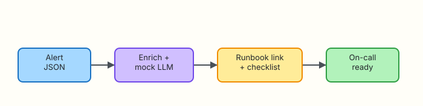

# Observability Copilots

## Overview

Alerts arrive as dense JSON: labels, annotations, silence URLs. An **observability copilot** turns that into a short narrative, a runbook link, and a first-five-minutes checklist — still **advisory**.

**Plain problem:** On-call opens a page full of labels and freezes. Enrichment that auto-restarts services makes outages worse. Your copilot only prepares the human.

This lab enriches alert JSON under `~/rebash-ai/module-12`.

This is **Tutorial 12** in **Module 12: Observability** of the REBASH Academy **AI for DevOps Engineers** series — practical AI for Cloud and DevOps work.

## Prerequisites

- [AI in CI/CD](ai-in-ci-cd.md)
- Familiarity with alert labels (Prometheus-style is enough)
- Python 3.10+

## Learning Objectives

By the end of this tutorial, you will be able to:

- [ ] Map alert labels to a runbook identifier
- [ ] Produce a checklist artefact with a mock LLM narrative
- [ ] Keep remediation suggestions read-only by default
- [ ] Explain alert enrichment vs auto-remediation
- [ ] Defend on-call UX improvements without giving AI pages

## Architecture

Alert JSON → enrich + mock LLM → runbook link + checklist → on-call.



## Theory

### What it is

An **observability copilot** assists humans during detection and triage: summarise alerts, attach runbooks, suggest checks. It does not own paging policy or mutate systems.

### Why it matters

Mean time to understanding dominates many incidents. Better first messages beat clever autonomous restarts.

### How it works

1. Ingest alert JSON (webhook or file).  
2. Map `alertname` / labels to a runbook key.  
3. Draft narrative + checklist (mock/API).  
4. Emit artefact for Slack/ticket — no execute.  

### Key concepts and comparisons

| Capability | Safe? |
|------------|-------|
| Summarise alert | Yes |
| Link runbook | Yes |
| Suggest `df -h` | Yes (read-only) |
| Auto-silence / auto-restart | No (needs separate control plane) |

### Common pitfalls

- Enrichment storms (AI on every flapping alert)  
- Wrong runbook mapping  
- Hiding the raw alert behind prose  
- Auto-acking pages  

## Hands-on Lab

### Objective

Enrich a sample alert into `enrichment.json` + `checklist.md` with runbook link under `~/rebash-ai/module-12`.

### Prerequisites

- Python 3.10+

### Lab environment

``` {.bash .ra-terminal title="Terminal"}
mkdir -p ~/rebash-ai/module-12/fixtures && cd ~/rebash-ai/module-12
python3 --version | tee python-version.txt
```

!!! example "Expected output"
    Python 3.10+ recorded.

### Real-world scenario

The NOC wants Slack messages that include “open this runbook” and three checks. SRE forbids webhook handlers that call cloud APIs to remediate. You ship enrichment only.

### Step-by-step tasks

#### Task 1 – Alert fixture and runbook map

Create `fixtures/alert.json`:

```json title="fixtures/alert.json"
{
  "status": "firing",
  "alertname": "KubePodCrashLooping",
  "labels": {
    "namespace": "payments",
    "pod": "payments-api-2c1a",
    "severity": "critical"
  },
  "annotations": {
    "summary": "Pod is CrashLoopBackOff",
    "description": "payments-api restarted more than 5 times in 10m"
  }
}
```

Create `runbooks.json`:

```json title="runbooks.json"
{
  "KubePodCrashLooping": {
    "title": "Pod CrashLoop triage",
    "url": "https://wiki.example.local/runbooks/pod-crashloop",
    "checks": [
      "kubectl describe pod (read-only) for events",
      "Read recent container logs for stack traces",
      "Check upstream dependency health before restart"
    ]
  },
  "NodeDiskPressure": {
    "title": "Disk pressure",
    "url": "https://wiki.example.local/runbooks/disk-pressure",
    "checks": [
      "df -h and df -i on the node",
      "Identify largest log directories",
      "Escalate before deleting application data"
    ]
  }
}
```

Create `enrich.py`:

```python title="enrich.py"
"""Alert enrichment with mock LLM narrative."""
from __future__ import annotations

import json
from pathlib import Path
from typing import Any


def mock_narrative(alert: dict[str, Any], runbook: dict[str, Any]) -> str:
    labels = alert.get("labels", {})
    return (
        f"Firing alert `{alert.get('alertname')}` in namespace "
        f"`{labels.get('namespace', 'unknown')}` for pod `{labels.get('pod', 'n/a')}`. "
        f"Follow runbook: {runbook['title']}. Do not restart until logs and dependencies are checked."
    )


def enrich(alert_path: Path, runbooks_path: Path) -> dict[str, Any]:
    alert = json.loads(alert_path.read_text(encoding="utf-8"))
    runbooks = json.loads(runbooks_path.read_text(encoding="utf-8"))
    key = alert.get("alertname", "")
    rb = runbooks.get(key)
    if not rb:
        return {
            "ok": False,
            "error": "no_runbook_mapping",
            "alertname": key,
        }
    narrative = mock_narrative(alert, rb)
    return {
        "ok": True,
        "alertname": key,
        "severity": alert.get("labels", {}).get("severity", "unknown"),
        "runbook_url": rb["url"],
        "runbook_title": rb["title"],
        "narrative": narrative,
        "checklist": rb["checks"],
        "remediation_allowed": False,
    }


def write_checklist(payload: dict[str, Any], path: Path) -> None:
    lines = [
        f"# Checklist — {payload.get('alertname')}\n",
        f"Runbook: {payload.get('runbook_url')}\n\n",
        f"{payload.get('narrative')}\n\n",
        "## First checks\n",
    ]
    for item in payload.get("checklist", []):
        lines.append(f"- [ ] {item}\n")
    lines.append("\n**Auto-remediation:** disabled\n")
    path.write_text("".join(lines), encoding="utf-8")
```

Create `enrich_cli.py`:

```python title="enrich_cli.py"
from __future__ import annotations

import argparse
import json
from pathlib import Path

from enrich import enrich, write_checklist


def main() -> int:
    parser = argparse.ArgumentParser()
    parser.add_argument("--alert", type=Path, default=Path("fixtures/alert.json"))
    parser.add_argument("--runbooks", type=Path, default=Path("runbooks.json"))
    parser.add_argument("--out", type=Path, default=Path("enrichment.json"))
    parser.add_argument("--checklist", type=Path, default=Path("checklist.md"))
    args = parser.parse_args()

    payload = enrich(args.alert, args.runbooks)
    args.out.write_text(json.dumps(payload, indent=2) + "\n", encoding="utf-8")
    if not payload.get("ok"):
        print(json.dumps(payload))
        return 2
    write_checklist(payload, args.checklist)
    print(f"runbook={payload['runbook_url']}")
    print(f"remediation_allowed={payload['remediation_allowed']}")
    return 0


if __name__ == "__main__":
    raise SystemExit(main())
```

``` {.bash .ra-terminal title="Terminal"}
cd ~/rebash-ai/module-12
python3 enrich_cli.py
test -f enrichment.json
test -f checklist.md
grep -q 'pod-crashloop' enrichment.json
grep -q 'Auto-remediation' checklist.md
grep -q 'disabled' checklist.md
grep -q '"remediation_allowed": false' enrichment.json
echo "enrich_ok"
```

!!! example "Expected output"
    `enrich_ok` with runbook URL and remediation disabled.

#### Task 2 – Break: unknown alertname

Create `fixtures/alert-unknown.json`:

```json title="fixtures/alert-unknown.json"
{
  "status": "firing",
  "alertname": "TotallyNewAlert",
  "labels": {"severity": "warning"},
  "annotations": {"summary": "unknown"}
}
```

``` {.bash .ra-terminal title="Terminal"}
cd ~/rebash-ai/module-12
python3 enrich_cli.py --alert fixtures/alert-unknown.json --out enrichment-unknown.json; echo rc=$?
python3 - <<'PY'
import json
from pathlib import Path
p = json.loads(Path("enrichment-unknown.json").read_text())
assert p["ok"] is False and p["error"] == "no_runbook_mapping"
print("unknown_alert_ok")
PY
```

!!! example "Expected output"
    Non-zero exit; `unknown_alert_ok`.

### Validation steps

- [ ] Known alert maps to runbook URL  
- [ ] Checklist lists first checks  
- [ ] `remediation_allowed` is false  
- [ ] Unknown alert fails closed  

### Common errors and fixes

| Error | Cause | Fix |
|-------|-------|-----|
| KeyError labels | Malformed alert | Validate JSON schema at ingress |
| Wrong runbook | alertname mismatch | Keep map keys exact |

### Challenge exercise

Add `NodeDiskPressure` alert fixture and prove it maps to the disk runbook.

### Learning outcomes

- You enriched alerts without remediating  
- You failed closed on missing mappings  
- You produced on-call-ready checklist artefacts  

### Cleanup

``` {.bash .ra-terminal title="Terminal"}
echo "Keep ~/rebash-ai/module-12 or remove manually"
```

## Validation

- [ ] Lab passed  
- [ ] Can contrast enrichment vs auto-remediation  
- [ ] Know to keep raw alert fields accessible  
- [ ] Can discuss alert flapping + AI cost  

## Code Walkthrough

1. **Map then narrate** — deterministic runbook key first.  
2. **Checklist as artefact** — portable to Slack/tickets.  
3. **Fail closed** on unknown alerts.  
4. **Never set remediation true** in this module.  
5. **Keep severity from labels**.  

## Security Considerations

- Webhooks need authentication  
- Do not echo secrets from annotations into public channels  
- Rate-limit enrichment on flapping alerts  
- Separate identities for notify vs remediate systems  
- Audit mapping changes  

## Common Mistakes

!!! warning "Auto-restart from the enrichment webhook"
    **Fix:** Enrichment services must lack mutate credentials.

!!! warning "Replacing the alert with only AI prose"
    **Fix:** Always keep deep links to the raw alert and runbook.

## Best Practices

- Deterministic runbook IDs  
- Short checklists (3–5 items)  
- Human-readable narrative + machine JSON  
- Suppress AI on known noisy alerts  
- Measure time-to-first-useful-action  

## Troubleshooting

| Symptom | Likely cause | Fix |
|---------|--------------|-----|
| Empty checklist | Missing checks in map | Edit `runbooks.json` |
| rc=2 on happy path | Wrong alert path | Use `fixtures/alert.json` |

## Summary

Observability copilots shorten the path from page to plan. They do not take the page’s place — and they do not press the restart button.

Next: [Security, Cost, and Governance](security-cost-and-governance.md).

## Interview Questions

**1. What does an observability copilot do?**

??? success "Reveal answer"
    It enriches alerts with narrative, runbook links, and checklists to help on-call triage faster — without owning remediation.

**2. Why is auto-remediation from alert webhooks risky?**

??? success "Reveal answer"
    Flapping and mis-labelled alerts can trigger destructive loops. Remediation needs separate controls and approvals.

**3. What should happen when alertname has no runbook mapping?**

??? success "Reveal answer"
    Fail closed: return an error, page with raw alert, and ask humans to add a mapping — do not invent a runbook.

**4. How do you prevent enrichment from spamming Slack?**

??? success "Reveal answer"
    Deduplicate, rate-limit, and skip known noisy alerts before calling the model.

**5. Should remediation_allowed ever be true in this design?**

??? success "Reveal answer"
    Not in the enrichment service. Mutate paths belong to gated control planes with explicit policy.

**6. What fields from an alert must remain visible after AI narrative?**

??? success "Reveal answer"
    alertname, severity, namespace/resource identifiers, and links back to the monitoring system.

**7. How does this relate to RAG?**

??? success "Reveal answer"
    Enrichment can retrieve runbook chunks (Module 7) for checklist text; mapping IDs still provide deterministic links.

## Related Tutorials

- Previous: [AI in CI/CD](ai-in-ci-cd.md)
- Next: [Security, Cost, and Governance](security-cost-and-governance.md)
- Course: [AI for DevOps Overview](index.md)

## References

- [REBASH Academy — RAG for Ops](retrieval-augmented-generation-for-ops.md)
- [OpenTelemetry overview](https://opentelemetry.io/docs/)
