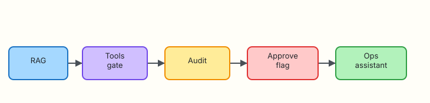

# Production AI for DevOps

## Overview

Production AI for DevOps is not a bigger prompt. It is an **architecture**: retrieval for truth, tools for evidence, gates for blast radius, audits for accountability, and rollouts with owners and Service Level Objectives (SLOs).

**Plain problem:** Demos skip approval flags and audit files. Interviewers and security reviewers ask for both. This capstone glues Modules 5–13 into one assistant under `~/rebash-ai/module-14`.

This is **Tutorial 14** in **Module 14: Production** of the REBASH Academy **AI for DevOps Engineers** series — practical AI for Cloud and DevOps work.

## Prerequisites

- [Security, Cost, and Governance](security-cost-and-governance.md)
- Prior modules on RAG, tools, and agents (recommended)
- Python 3.10+

## Learning Objectives

By the end of this tutorial, you will be able to:

- [ ] Assemble RAG + tool gate + audit into one CLI
- [ ] Require `--approve` before any mutating action
- [ ] Define a minimal SLO and ownership note for an assistant
- [ ] Produce a portfolio evidence pack
- [ ] Defend the end-to-end design in interview

## Architecture

RAG → tools gate → audit → approve flag → ops assistant.



## Theory

### What it is

A **production ops assistant** combines:

| Layer | Role |
|-------|------|
| Retrieval (RAG) | Ground answers in runbooks |
| Tools | Read-only evidence gathering |
| Policy gate | Deny mutate unless approved |
| Audit | Who/what/when |
| Ops wrapper | SLOs, owners, rollback |

### Why it matters

Without these layers you have a chatbot. With them you have a service that platform and security can accept.

### How it works

```text
question → retrieve chunks → propose checks/tools → audit →
  mutate? need --approve : else STOP
```

### Key concepts and comparisons

| Maturity | Traits |
|----------|--------|
| Demo | Happy path, no audit |
| Pilot | Mock LLM, allowlists, audit file |
| Production | Gateway, budgets, on-call owner, SLO |

### Common pitfalls

- Shipping without an owner  
- No rollback (how to disable the bot)  
- Mutate default-on  
- Measuring vanity answer rates instead of time-to-understanding  

## Hands-on Lab

### Objective

Build `ops_assistant.py` under `~/rebash-ai/module-14` that retrieves runbook chunks, runs allowlisted read-only tools, writes audits, and only runs a mock restart when `--approve` is passed.

### Prerequisites

- Python 3.10+

### Lab environment

``` {.bash .ra-terminal title="Terminal"}
mkdir -p ~/rebash-ai/module-14/{runbooks,fixtures} && cd ~/rebash-ai/module-14
python3 --version | tee python-version.txt
```

!!! example "Expected output"
    Python 3.10+ recorded.

### Real-world scenario

You must demo a minimum viable production assistant to architecture review: citations, deny-by-default mutate, audit trail, and a kill switch note in `OWNERSHIP.md`.

### Step-by-step tasks

#### Task 1 – Knowledge, tools, and assistant

Create `runbooks/crashloop.md`:

```markdown title="runbooks/crashloop.md"
# CrashLoop triage

## Checks
Read logs and describe events before any restart.
Confirm upstream dependencies are healthy.
```

Create `fixtures/pods.json`:

```json title="fixtures/pods.json"
[{"name": "payments-api-2c1a", "namespace": "payments", "phase": "CrashLoopBackOff"}]
```

Create `fixtures/payments-api.log`:

```text title="fixtures/payments-api.log"
ERROR timeout upstream=ledger
```

Create `rag.py`:

```python title="rag.py"
"""Tiny retrieval helper."""
from __future__ import annotations

from pathlib import Path


def retrieve(question: str, root: Path) -> list[dict]:
    hits = []
    q = question.lower()
    for path in sorted(root.glob("*.md")):
        text = path.read_text(encoding="utf-8")
        score = sum(1 for tok in q.split() if tok in text.lower())
        if score:
            hits.append({"path": str(path), "text": text, "score": score})
    hits.sort(key=lambda h: h["score"], reverse=True)
    return hits[:2]
```

Create `tools.py`:

```python title="tools.py"
from __future__ import annotations

import json
from pathlib import Path
from typing import Any

ROOT = Path(__file__).resolve().parent
ALLOW = {"list_pods", "read_log"}


def execute(tool: str, args: dict[str, Any] | None = None, approve: bool = False) -> dict[str, Any]:
    args = args or {}
    if tool == "restart_deployment":
        if not approve:
            return {"ok": False, "error": "APPROVAL_REQUIRED", "tool": tool}
        return {"ok": True, "tool": tool, "restarted": args.get("name"), "dry_run": True}
    if tool not in ALLOW:
        return {"ok": False, "error": "DENIED", "tool": tool}
    if tool == "list_pods":
        pods = json.loads((ROOT / "fixtures" / "pods.json").read_text(encoding="utf-8"))
        return {"ok": True, "tool": tool, "pods": pods}
    if tool == "read_log":
        lines = (ROOT / "fixtures" / "payments-api.log").read_text(encoding="utf-8").splitlines()
        return {"ok": True, "tool": tool, "lines": lines}
    return {"ok": False, "error": "unknown", "tool": tool}
```

Create `ops_assistant.py`:

```python title="ops_assistant.py"
"""Production-shaped ops assistant (capstone)."""
from __future__ import annotations

import argparse
import json
from datetime import datetime, timezone
from pathlib import Path

from rag import retrieve
from tools import execute


def audit(path: Path, event: dict) -> None:
    event = {**event, "ts": datetime.now(timezone.utc).isoformat()}
    with path.open("a", encoding="utf-8") as fh:
        fh.write(json.dumps(event) + "\n")


def main() -> int:
    parser = argparse.ArgumentParser()
    parser.add_argument("--question", required=True)
    parser.add_argument("--approve", action="store_true", help="Allow dry-run mutate")
    parser.add_argument("--want-restart", action="store_true")
    parser.add_argument("--out", type=Path, default=Path("assistant-out.json"))
    parser.add_argument("--audit", type=Path, default=Path("audit.jsonl"))
    args = parser.parse_args()

    chunks = retrieve(args.question, Path("runbooks"))
    steps = []
    for tool, tool_args in (
        ("list_pods", {}),
        ("read_log", {}),
    ):
        result = execute(tool, tool_args, approve=False)
        steps.append({"tool": tool, "result": result})
        audit(args.audit, {"action": "tool", "tool": tool, "ok": result.get("ok")})

    mutate = None
    if args.want_restart:
        mutate = execute(
            "restart_deployment",
            {"name": "payments-api"},
            approve=args.approve,
        )
        audit(
            args.audit,
            {
                "action": "mutate_attempt",
                "approve": args.approve,
                "ok": mutate.get("ok"),
                "error": mutate.get("error"),
            },
        )

    answer = {
        "ok": True,
        "citations": [c["path"] for c in chunks],
        "chunks": chunks,
        "steps": steps,
        "mutate": mutate,
        "status": (
            "STOP_APPROVAL_REQUIRED"
            if mutate and mutate.get("error") == "APPROVAL_REQUIRED"
            else "COMPLETE"
        ),
    }
    args.out.write_text(json.dumps(answer, indent=2) + "\n", encoding="utf-8")
    print(json.dumps({"status": answer["status"], "citations": answer["citations"]}, indent=2))
    if mutate and not mutate.get("ok"):
        return 1
    return 0


if __name__ == "__main__":
    raise SystemExit(main())
```

Create `OWNERSHIP.md`:

```markdown title="OWNERSHIP.md"
# Ops assistant ownership

- **Service:** rebash-ops-assistant (lab)
- **Owner:** platform-ai squad (example)
- **SLO:** 99% of advisory requests return under 5s locally; mutate never auto-runs
- **Kill switch:** stop scheduling the job / remove tool credentials
- **Rollback:** disable `--want-restart` path in config; keep read-only mode
```

``` {.bash .ra-terminal title="Terminal"}
cd ~/rebash-ai/module-14
python3 ops_assistant.py --question "CrashLoop payments pod triage" --out out.json
python3 - <<'PY'
import json
from pathlib import Path
p = json.loads(Path("out.json").read_text())
assert p["citations"]
assert p["steps"][0]["result"]["ok"] is True
print("advisory_ok")
PY
```

!!! example "Expected output"
    `advisory_ok` with citations and read-only tool steps.

#### Task 2 – Mutate blocked without approve

``` {.bash .ra-terminal title="Terminal"}
cd ~/rebash-ai/module-14
rm -f audit.jsonl
python3 ops_assistant.py --question "crashloop" --want-restart --out denied.json; echo rc=$?
python3 - <<'PY'
import json
from pathlib import Path
p = json.loads(Path("denied.json").read_text())
assert p["status"] == "STOP_APPROVAL_REQUIRED"
assert p["mutate"]["error"] == "APPROVAL_REQUIRED"
assert any(json.loads(l)["action"]=="mutate_attempt" for l in Path("audit.jsonl").read_text().splitlines())
print("mutate_denied_ok")
PY
```

!!! example "Expected output"
    `mutate_denied_ok`.

#### Task 3 – Approve dry-run restart

``` {.bash .ra-terminal title="Terminal"}
cd ~/rebash-ai/module-14
python3 ops_assistant.py --question "crashloop" --want-restart --approve --out approved.json
python3 - <<'PY'
import json
from pathlib import Path
p = json.loads(Path("approved.json").read_text())
assert p["mutate"]["ok"] is True and p["mutate"].get("dry_run") is True
assert p["status"] == "COMPLETE"
print("approve_dry_run_ok")
PY
test -f OWNERSHIP.md
echo "capstone_ok"
```

!!! example "Expected output"
    `approve_dry_run_ok` and `capstone_ok`.

### Validation steps

- [ ] Citations present for crashloop question  
- [ ] Read-only tools ran  
- [ ] Mutate blocked without `--approve`  
- [ ] `--approve` only dry-runs restart  
- [ ] `OWNERSHIP.md` exists  

### Common errors and fixes

| Error | Cause | Fix |
|-------|-------|-----|
| Empty citations | Question tokens miss runbook | Use “CrashLoop” wording |
| Mutate always ok | Forgot to omit `--approve` | Test deny path first |

### Challenge exercise

Add a guardrails check from Module 13 before retrieval; deny injection phrases with audit.

### Learning outcomes

- You shipped a portfolio-ready assistant skeleton  
- You demonstrated approve-gated mutate  
- You documented ownership and kill switch  

### Cleanup

``` {.bash .ra-terminal title="Terminal"}
echo "Keep ~/rebash-ai/module-14 as portfolio evidence"
```

## Validation

- [ ] Capstone lab passed  
- [ ] Can draw the production layers from memory  
- [ ] Can state an SLO and kill switch  
- [ ] Ready for interview defence of the design  

## Code Walkthrough

1. **Retrieve before advise**.  
2. **Read-only tools by default**.  
3. **Explicit approve for mutate**.  
4. **Audit every tool/mutate attempt**.  
5. **Ownership doc is part of the product**.  

## Security Considerations

- Dry-run is not production restart — label clearly  
- Separate credentials for read vs mutate  
- Gateway budgets from Module 13  
- Disable path for incidents involving the bot itself  
- Review audits after red-teams  

## Common Mistakes

!!! warning "Shipping without an owner or kill switch"
    **Fix:** Write `OWNERSHIP.md` before the demo.

!!! warning "Defaulting approve=true in config"
    **Fix:** Defaults must be deny; approve is opt-in per request.

## Best Practices

- Progressive delivery: advisory → read tools → gated mutate  
- SLOs on latency and error rate of the assistant  
- Golden evals (Module 4) in CI  
- Cost dashboards  
- Post-incident review includes AI actions  

## Troubleshooting

| Symptom | Likely cause | Fix |
|---------|--------------|-----|
| status COMPLETE without citations | Empty runbooks dir | Add Markdown runbooks |
| approve path missing dry_run | Code edit | Keep dry_run True in lab |

## Summary

You finished the AI for DevOps course path: foundations through a production-shaped assistant. Propose with RAG, prove with tools, govern with audits and approvals.

Return to the [AI for DevOps Overview](index.md). Optional deeper taster: [Python — OpenAI, MCP, and LangChain](../python/ai-for-devops-openai-mcp-langchain.md).

## Interview Questions

**1. What layers make an ops assistant “production-shaped”?**

??? success "Reveal answer"
    Retrieval grounding, allowlisted tools, approval gates for mutate, audit trails, ownership/SLOs, and a kill switch — not just a chat UI.

**2. Why require an explicit approve flag for restarts?**

??? success "Reveal answer"
    Mutating production needs intentional human (or dual) control. Defaults must fail closed.

**3. What is a reasonable first SLO for an advisory assistant?**

??? success "Reveal answer"
    Example: high availability of the advisory path and p95 latency under a few seconds, with mutate disabled or separately budgeted.

**4. How do you roll back a bad assistant behaviour?**

??? success "Reveal answer"
    Disable mutate features, pin/rollback prompts and indexes, revoke tool credentials, and keep read-only mode if useful.

**5. How do RAG and tools work together here?**

??? success "Reveal answer"
    RAG supplies procedure/context; tools supply live evidence; neither replaces the approval gate.

**6. What evidence would you show in an architecture review?**

??? success "Reveal answer"
    Sample citations, deny-without-approve trace, audit.jsonl lines, OWNERSHIP.md, and golden eval results.

**7. When would you move from dry-run restart to a real restart API?**

??? success "Reveal answer"
    After policy sign-off, least-privilege credentials, stronger evals, rate limits, and clear on-call ownership — never on day one of a pilot.

**8. How does this course’s philosophy show up in the capstone?**

??? success "Reveal answer"
    AI proposes and assists; humans and policy dispose. The assistant accelerates understanding without silent production changes.

## Related Tutorials

- Previous: [Security, Cost, and Governance](security-cost-and-governance.md)
- Course: [AI for DevOps Overview](index.md)
- Related: [Agents for Ops Workflows](agents-for-ops-workflows.md)

## References

- [REBASH Academy — AI for DevOps career path](../career-paths/ai-for-devops/index.md)
- [OWASP Top 10 for LLM Applications](https://owasp.org/www-project-top-10-for-large-language-model-applications/)
