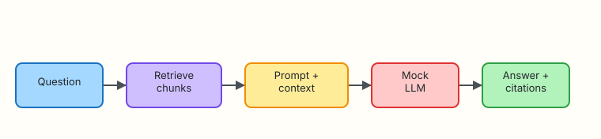

# Retrieval-Augmented Generation for Ops

## Overview

Large Language Models (LLMs) invent confident nonsense when they lack your runbooks. **Retrieval-Augmented Generation (RAG)** fixes the usual failure mode: retrieve relevant chunks first, then ask the model to answer **only** from that evidence — and cite the source paths.

**Plain problem:** A chat bot says “delete `/var/lib/docker`” with no citation. A RAG assistant must show which runbook chunk justified each step — or refuse.

This lab wires Module 5–6 retrieval to a **mock LLM**, enforces citations, then breaks grounding on purpose and fixes it.

This is **Tutorial 7** in **Module 7: RAG** of the REBASH Academy **AI for DevOps Engineers** series — practical AI for Cloud and DevOps work.

## Prerequisites

- [Vector Stores for Ops](vector-stores-for-ops.md)
- [Embeddings and Semantic Search](embeddings-and-semantic-search.md)
- Python 3.10+ (stdlib only)

## Learning Objectives

By the end of this tutorial, you will be able to:

- [ ] Describe the retrieve → prompt → generate → cite loop
- [ ] Build a RAG CLI that answers from SQLite chunks with source paths
- [ ] Detect ungrounded answers when citations are removed
- [ ] Explain when RAG beats fine-tuning for runbook knowledge
- [ ] Defend citation checks as a production guardrail in interview

## Architecture

Question → retrieve chunks → prompt with context → mock LLM → answer with citations.



## Theory

### What it is

**RAG** combines:

1. **Retrieval** — find relevant chunks (vector store)  
2. **Augmentation** — put chunks into the prompt  
3. **Generation** — model drafts an answer grounded in those chunks  

**Citations** link answer claims back to `path` / chunk IDs so humans can verify.

### Why it matters

Runbooks change weekly. Fine-tuning a model on last quarter’s wiki is expensive and stale. RAG keeps knowledge in documents you already own and updates by re-indexing.

### How it works

```text
question → top-k chunks → prompt(system + context + question) → answer + sources
```

Guardrails:

- If retrieval returns nothing, refuse (“no runbook evidence”).  
- Require the answer to list source paths that appeared in context.  
- Never execute remediation from the model — propose only (Module 1).  

### Key concepts and comparisons

| Approach | Best for | Cost of updates |
|----------|----------|-----------------|
| RAG over runbooks | Changing ops knowledge | Re-index docs |
| Fine-tuning | Stable style/format behaviour | Retrain |
| Long context dump | Tiny corpora | Token cost, noise |
| Pure chat (no retrieval) | Brainstorming only | Hallucination risk |

### Common pitfalls

- Retrieving chunks but not putting them in the prompt  
- Accepting answers with missing or invented citations  
- Stuffing 50 chunks into context (noise)  
- Skipping refusal when retrieval is empty  

## Hands-on Lab

### Objective

Build a RAG CLI under `~/rebash-ai/module-07` that answers disk incidents from indexed runbooks with citations, then prove that removing context breaks the citation check.

### Prerequisites

- Python 3.10+
- Concepts from Modules 5–6

### Lab environment

Workspace: `~/rebash-ai/module-07`

``` {.bash .ra-terminal title="Terminal"}
mkdir -p ~/rebash-ai/module-07/runbooks && cd ~/rebash-ai/module-07
python3 --version | tee python-version.txt
```

!!! example "Expected output"
    Python 3.10+ in `python-version.txt`.

### Real-world scenario

Your incident bot must never invent cleanup steps. Security wants every suggestion tied to a runbook path. You ship RAG with a citation gate before any Slack integration.

### Step-by-step tasks

#### Task 1 – Corpus, embedder, and store

Create `runbooks/disk-capacity.md`:

```markdown title="runbooks/disk-capacity.md"
# Disk capacity

## Quick checks
When the alert says disk full or no space left, run df -h and df -i.

## Safe cleanup
Rotate application logs under /var/log with change approval. Do not delete database directories.
```

Create `runbooks/inode-exhaustion.md`:

```markdown title="runbooks/inode-exhaustion.md"
# Inode exhaustion

## Symptoms
Cannot create new files even when df -h shows free bytes.

## Diagnosis
Use df -i and locate directories with huge file counts.
```

Create `runbooks/ssh-bastion.md`:

```markdown title="runbooks/ssh-bastion.md"
# SSH bastion

Use short-lived certificates. Never paste private keys into assistants.
```

Create `embedder.py`:

```python title="embedder.py"
"""Deterministic hashing embeddings — stdlib only."""
from __future__ import annotations

import hashlib
import math
import re

DIM = 128
TOKEN_RE = re.compile(r"[a-z0-9]+", re.IGNORECASE)


def tokenize(text: str) -> list[str]:
    return TOKEN_RE.findall(text.lower())


def embed(text: str, dim: int = DIM) -> list[float]:
    vec = [0.0] * dim
    tokens = tokenize(text)
    if not tokens:
        return vec
    for tok in tokens:
        h = hashlib.sha256(tok.encode("utf-8")).digest()
        idx = int.from_bytes(h[:4], "big") % dim
        sign = 1.0 if h[4] % 2 == 0 else -1.0
        vec[idx] += sign
    norm = math.sqrt(sum(v * v for v in vec))
    if norm == 0:
        return vec
    return [v / norm for v in vec]


def cosine(a: list[float], b: list[float]) -> float:
    return sum(x * y for x, y in zip(a, b))
```

Create `store.py`:

```python title="store.py"
"""Minimal SQLite chunk store for RAG."""
from __future__ import annotations

import json
import sqlite3
from pathlib import Path

from embedder import cosine, embed

SCHEMA = """
CREATE TABLE IF NOT EXISTS chunks (
  id TEXT PRIMARY KEY,
  path TEXT NOT NULL,
  text TEXT NOT NULL,
  vector_json TEXT NOT NULL
);
"""


def connect(db_path: Path) -> sqlite3.Connection:
    conn = sqlite3.connect(db_path)
    conn.execute(SCHEMA)
    return conn


def chunk_markdown(path: Path, text: str) -> list[tuple[str, str]]:
    parts: list[str] = []
    current: list[str] = []
    for line in text.splitlines():
        if line.startswith("## ") and current:
            parts.append("\n".join(current).strip())
            current = [line]
        else:
            current.append(line)
    if current:
        parts.append("\n".join(current).strip())
    out: list[tuple[str, str]] = []
    for i, part in enumerate(parts):
        if part:
            out.append((f"{path.name}#{i}", part))
    return out


def index_runbooks(conn: sqlite3.Connection, root: Path) -> int:
    conn.execute("DELETE FROM chunks")
    n = 0
    for path in sorted(root.glob("*.md")):
        for chunk_id, chunk_text in chunk_markdown(path, path.read_text(encoding="utf-8")):
            conn.execute(
                "INSERT INTO chunks (id, path, text, vector_json) VALUES (?, ?, ?, ?)",
                (chunk_id, str(path), chunk_text, json.dumps(embed(chunk_text))),
            )
            n += 1
    conn.commit()
    return n


def retrieve(conn: sqlite3.Connection, question: str, k: int = 3) -> list[dict]:
    qv = embed(question)
    rows = conn.execute("SELECT id, path, text, vector_json FROM chunks").fetchall()
    scored = []
    for chunk_id, path, text, vector_json in rows:
        score = cosine(qv, json.loads(vector_json))
        scored.append({"id": chunk_id, "path": path, "score": round(score, 4), "text": text})
    scored.sort(key=lambda r: r["score"], reverse=True)
    return scored[:k]
```

``` {.bash .ra-terminal title="Terminal"}
cd ~/rebash-ai/module-07
python3 - <<'PY'
from pathlib import Path
from store import connect, index_runbooks
conn = connect(Path("runbooks.db"))
n = index_runbooks(conn, Path("runbooks"))
print(f"indexed_chunks={n}")
assert n >= 3
conn.close()
PY
```

!!! example "Expected output"
    `indexed_chunks` is at least 3.

#### Task 2 – Mock LLM RAG with citation gate

Create `mock_llm.py`:

```python title="mock_llm.py"
"""Mock LLM that only restates retrieved ops evidence."""
from __future__ import annotations


def complete(prompt: str) -> str:
    """Produce a short answer. Citations must be added by the RAG host."""
    lower = prompt.lower()
    steps: list[str] = []
    if "df -h" in lower or "disk full" in lower or "no space" in lower:
        steps.append("Check filesystem capacity with df -h and inodes with df -i.")
    if "inode" in lower:
        steps.append("If bytes are free but creates fail, investigate inode exhaustion.")
    if "/var/log" in lower or "rotate" in lower:
        steps.append("Rotate application logs under /var/log only with approval.")
    if not steps:
        steps.append("No specific remediation found in the provided context.")
    steps.append("Do not delete database directories without explicit human approval.")
    return " ".join(steps)
```

Create `rag_cli.py`:

```python title="rag_cli.py"
"""RAG CLI with mandatory citations from retrieved paths."""
from __future__ import annotations

import argparse
import json
import sys
from pathlib import Path

from mock_llm import complete
from store import connect, index_runbooks, retrieve


def build_prompt(question: str, chunks: list[dict], include_context: bool) -> str:
    lines = [
        "You are a DevOps assistant. Use ONLY the context. Suggest read-only checks first.",
        f"Question: {question}",
    ]
    if include_context and chunks:
        lines.append("Context:")
        for c in chunks:
            lines.append(f"- source: {c['path']}\n  text: {c['text']}")
    elif include_context:
        lines.append("Context: (empty)")
    return "\n".join(lines)


def citation_check(answer: str, chunks: list[dict]) -> tuple[bool, list[str]]:
    paths = sorted({c["path"] for c in chunks})
    cited = [p for p in paths if p in answer]
    return (bool(paths) and len(cited) == len(paths), cited)


def main() -> int:
    parser = argparse.ArgumentParser(description="Ops RAG with citations")
    parser.add_argument("--question", required=True)
    parser.add_argument("--db", type=Path, default=Path("runbooks.db"))
    parser.add_argument("--runbooks", type=Path, default=Path("runbooks"))
    parser.add_argument("--k", type=int, default=3)
    parser.add_argument("--reindex", action="store_true")
    parser.add_argument("--no-context", action="store_true", help="Break grounding on purpose")
    parser.add_argument("--out", type=Path, default=Path("rag-answer.json"))
    args = parser.parse_args()

    conn = connect(args.db)
    if args.reindex or not args.db.exists():
        index_runbooks(conn, args.runbooks)

    chunks = [] if args.no_context else retrieve(conn, args.question, k=args.k)
    conn.close()

    if not args.no_context and not chunks:
        payload = {
            "ok": False,
            "error": "no_runbook_evidence",
            "answer": "",
            "sources": [],
        }
        args.out.write_text(json.dumps(payload, indent=2) + "\n", encoding="utf-8")
        print("RAG_REFUSE: no_runbook_evidence")
        return 2

    prompt = build_prompt(args.question, chunks, include_context=not args.no_context)
    answer_body = complete(prompt)

    sources = sorted({c["path"] for c in chunks})
    if args.no_context:
        # Deliberately ungrounded: model-ish text without sources
        answer = answer_body
        ok = False
        cited: list[str] = []
    else:
        # Host attaches citations — production pattern: tool/host owns provenance
        cite_lines = "Sources:\n" + "\n".join(f"- {p}" for p in sources)
        answer = f"{answer_body}\n\n{cite_lines}"
        ok, cited = citation_check(answer, chunks)

    payload = {
        "ok": ok,
        "question": args.question,
        "answer": answer,
        "sources": sources,
        "cited": cited,
        "ungrounded": bool(args.no_context) or not ok,
        "retrieved": [{"id": c["id"], "path": c["path"], "score": c["score"]} for c in chunks],
    }
    args.out.write_text(json.dumps(payload, indent=2) + "\n", encoding="utf-8")
    print(answer)
    print(f"citation_ok={ok}")
    return 0 if ok else 1


if __name__ == "__main__":
    raise SystemExit(main())
```

``` {.bash .ra-terminal title="Terminal"}
cd ~/rebash-ai/module-07
python3 rag_cli.py --reindex --question "disk full no space left on device" --out rag-ok.json
python3 - <<'PY'
import json
from pathlib import Path
p = json.loads(Path("rag-ok.json").read_text())
assert p["ok"] is True
assert p["sources"]
assert "df" in p["answer"].lower()
assert all(s in p["answer"] for s in p["sources"])
print("rag_grounded=OK")
PY
```

!!! example "Expected output"
    Answer mentions `df` checks, lists `Sources:` paths, `citation_ok=True`, prints `rag_grounded=OK`.

#### Task 3 – Break citations, then fix

``` {.bash .ra-terminal title="Terminal"}
cd ~/rebash-ai/module-07
python3 rag_cli.py --question "disk full" --no-context --out rag-broken.json; broken_rc=$?
python3 - <<'PY'
import json
from pathlib import Path
p = json.loads(Path("rag-broken.json").read_text())
assert p["ungrounded"] is True
assert p["ok"] is False
print("ungrounded_detected=OK")
PY
# Fix: run with context again
python3 rag_cli.py --question "disk full" --out rag-fixed.json
python3 - <<'PY'
import json
from pathlib import Path
p = json.loads(Path("rag-fixed.json").read_text())
assert p["ok"] is True and p["ungrounded"] is False
print("rag_fixed=OK")
PY
```

!!! example "Expected output"
    `--no-context` yields `ungrounded_detected=OK` and non-zero citation status. Normal run prints `rag_fixed=OK`.

### Validation steps

- [ ] Index contains runbook chunks  
- [ ] Grounded answer includes every retrieved source path  
- [ ] `--no-context` is marked ungrounded / fails citation gate  
- [ ] You can explain RAG versus fine-tuning for runbooks  

### Common errors and fixes

| Error | Cause | Fix |
|-------|-------|-----|
| `no_runbook_evidence` | Empty DB | Pass `--reindex` |
| `citation_ok=False` with context | Sources not appended | Ensure host adds `Sources:` block |
| SSH runbook cited for disk | Weak retrieval | Check index contents; tighten query |

### Challenge exercise

Add a golden question file with three questions and expected source path substrings (`disk-capacity` or `inode`). Write `eval_rag.py` that fails if citations miss.

### Learning outcomes

- You connected retrieval to generation with provenance  
- You proved a citation gate catches ungrounded answers  
- You have JSON artefacts for interview storytelling  

### Cleanup

``` {.bash .ra-terminal title="Terminal"}
echo "Keep ~/rebash-ai/module-07 or remove manually"
# rm -rf ~/rebash-ai/module-07
```

## Validation

- [ ] Lab break/fix cycle passed  
- [ ] Can draw retrieve → augment → generate on a whiteboard  
- [ ] Can argue RAG over fine-tuning for changing runbooks  
- [ ] Know to refuse when retrieval is empty  

## Code Walkthrough

1. **Retrieve before generate** — never prompt without a plan for evidence.  
2. **Host-owned citations** — do not trust the model to invent paths.  
3. **Fail closed** on empty retrieval.  
4. **JSON evidence** for every answer.  
5. **Propose-only** remediation language.  

## Security Considerations

- Retrieved text may contain sensitive hostnames — control access  
- Prompt injection can hide inside runbooks (Module 13)  
- Citation forge attempts: only accept paths from the retrieved set  
- Do not auto-run shell from RAG answers  
- Redact secrets before indexing  

## Common Mistakes

!!! warning "Letting the model invent source filenames"
    **Fix:** Attach citations in your code from the retrieval result set only.

!!! warning "Calling it RAG when you only stuff a random wiki page into the prompt"
    **Fix:** Rank chunks per question; measure retrieval with golden queries.

## Best Practices

- Keep top-k small (2–5) for ops answers  
- Show sources in the UI next to the answer  
- Re-index on runbook merge to main  
- Combine with Module 4 evals for answer quality  
- Refuse clearly when evidence is missing  

## Troubleshooting

| Symptom | Likely cause | Fix |
|---------|--------------|-----|
| Always ungrounded | Always passing `--no-context` | Omit the flag |
| Wrong runbook cited | Retrieval quality | Improve chunks/titles; add synonyms |
| Empty sources list | Index empty | `--reindex` |

## Summary

RAG makes ops answers checkable: retrieve, generate, cite. Your citation gate is the difference between a helpful assistant and a confident liability.

Next: [Tool Calling and Function APIs](tool-calling-and-function-apis.md).

## Interview Questions

**1. What is RAG in one sentence?**

??? success "Reveal answer"
    Retrieve relevant documents, put them into the prompt, and generate an answer grounded in that evidence — ideally with citations.

**2. Why is RAG often better than fine-tuning for runbooks?**

??? success "Reveal answer"
    Runbooks change frequently. Re-indexing documents is cheaper and fresher than retraining a model every time a procedure updates.

**3. What should happen when retrieval returns zero chunks?**

??? success "Reveal answer"
    Refuse or ask for clarification — do not let the model answer from parametric memory as if it had evidence.

**4. Who should attach citations — the model or the host application?**

??? success "Reveal answer"
    Prefer the host: take paths from the retrieved set and attach them. Models may hallucinate filenames.

**5. How do you detect an ungrounded answer in a pipeline?**

??? success "Reveal answer"
    Fail the job if required source paths are missing from the answer, or if retrieval was empty / skipped.

**6. What is a typical top-k for ops RAG and why not 50?**

??? success "Reveal answer"
    Small k (about 2–5) keeps context focused. Too many chunks add noise, cost, and conflicting instructions.

**7. How does RAG relate to the Module 1 policy gate?**

??? success "Reveal answer"
    RAG improves what the assistant proposes; the policy gate still decides whether any mutating action may run. Citations do not equal approval to execute.

**8. Name one RAG failure mode besides hallucination.**

??? success "Reveal answer"
    Retrieval failure: the right runbook exists but ranking never surfaces it, so the answer is incomplete even if the model is careful.

## Related Tutorials

- Previous: [Vector Stores for Ops](vector-stores-for-ops.md)
- Course: [AI for DevOps Overview](index.md)
- Next: [Tool Calling and Function APIs](tool-calling-and-function-apis.md)

## References

- [REBASH Academy — AI for DevOps Overview](index.md)
- [OWASP Top 10 for LLM Applications](https://owasp.org/www-project-top-10-for-large-language-model-applications/)
