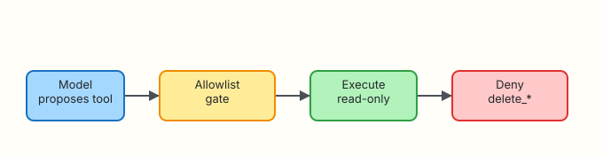

# Tool Calling and Function APIs

## Overview

Chat alone cannot prove cluster state. **Tool calling** (also called function calling) lets a model request structured actions — `list_pods`, `read_log` — while **your host** decides whether to run them. The model proposes; the platform disposes.

**Plain problem:** If the model can run arbitrary shell, a single hallucinated `delete` wipes production. Allowlists and deny patterns (`delete_*`) are non-negotiable.

This lab builds a mock tool runtime under `~/rebash-ai/module-08` that executes read-only tools and hard-denies deletes.

This is **Tutorial 8** in **Module 8: Tool Calling** of the REBASH Academy **AI for DevOps Engineers** series — practical AI for Cloud and DevOps work.

## Prerequisites

- [Retrieval-Augmented Generation for Ops](retrieval-augmented-generation-for-ops.md)
- [AI for DevOps Foundations](ai-for-devops-foundations.md) (policy classes)
- Python 3.10+

## Learning Objectives

By the end of this tutorial, you will be able to:

- [ ] Explain tool calling as propose → validate → execute
- [ ] Define JSON tool schemas the host understands
- [ ] Allowlist read-only tools and deny `delete_*`
- [ ] Build a CLI that runs mock `read_log` / `list_pods` safely
- [ ] Defend why models must never hold raw shell by default

## Architecture

The model proposes a tool; an allowlist gate executes or denies.



## Theory

### What it is

**Tool calling** is a protocol where the model returns a structured request such as:

```json
{"tool": "list_pods", "args": {"namespace": "payments"}}
```

The **host** validates the name and arguments, runs code, and returns the result to the model (or to the user).

### Why it matters

Ops answers need live evidence: pod phase, last log lines, metric samples. Without tools, the model guesses. With uncontrolled tools, the model becomes a remote shell.

### How it works

1. Advertise tools (name, description, JSON schema).  
2. Model selects a tool + args.  
3. Host checks allowlist / denylist.  
4. Execute or return `DENIED`.  
5. Optionally loop (agents — Module 10).  

### Key concepts and comparisons

| Pattern | Meaning |
|---------|---------|
| Allowlist | Only named tools may run |
| Denylist | Patterns like `delete_*` always blocked |
| Schema validation | Reject missing/invalid args |
| Side-effect class | read-only vs mutate (Module 1) |

### Common pitfalls

- Passing model output straight to `subprocess`  
- Allowing `run_shell` “for flexibility”  
- Skipping argument validation  
- Logging full tool results that contain secrets  

## Hands-on Lab

### Objective

Build a tool host under `~/rebash-ai/module-08` that runs mock `read_log` and `list_pods`, and denies any `delete_*` proposal.

### Prerequisites

- Python 3.10+

### Lab environment

``` {.bash .ra-terminal title="Terminal"}
mkdir -p ~/rebash-ai/module-08/fixtures && cd ~/rebash-ai/module-08
python3 --version | tee python-version.txt
```

!!! example "Expected output"
    Python 3.10+ in `python-version.txt`.

### Real-world scenario

Product wants an “AI kubectl”. Security requires proof that delete verbs cannot execute even if the model asks. You ship the allowlist host before any real cluster credentials exist.

### Step-by-step tasks

#### Task 1 – Mock cluster fixtures and tool implementations

Create `fixtures/pods.json`:

```json title="fixtures/pods.json"
[
  {"name": "payments-api-7f8b", "namespace": "payments", "phase": "Running"},
  {"name": "payments-api-2c1a", "namespace": "payments", "phase": "CrashLoopBackOff"},
  {"name": "checkout-worker-9aa0", "namespace": "checkout", "phase": "Running"}
]
```

Create `fixtures/payments-api.log`:

```text title="fixtures/payments-api.log"
2026-08-04T10:00:01Z INFO starting payments-api
2026-08-04T10:01:12Z ERROR timeout upstream=ledger
2026-08-04T10:01:13Z ERROR timeout upstream=ledger
2026-08-04T10:02:00Z WARN retry budget exhausted
```

Create `tools.py`:

```python title="tools.py"
"""Allowlisted mock ops tools."""
from __future__ import annotations

import json
import re
from pathlib import Path
from typing import Any

ROOT = Path(__file__).resolve().parent
ALLOWLIST = {"read_log", "list_pods"}
DELETE_RE = re.compile(r"^delete_", re.IGNORECASE)


def list_pods(namespace: str | None = None) -> dict[str, Any]:
    pods = json.loads((ROOT / "fixtures" / "pods.json").read_text(encoding="utf-8"))
    if namespace:
        pods = [p for p in pods if p["namespace"] == namespace]
    return {"ok": True, "tool": "list_pods", "pods": pods}


def read_log(service: str, lines: int = 50) -> dict[str, Any]:
    path = ROOT / "fixtures" / f"{service}.log"
    if not path.is_file():
        return {"ok": False, "tool": "read_log", "error": f"no log for {service}"}
    content = path.read_text(encoding="utf-8").splitlines()[-lines:]
    return {"ok": True, "tool": "read_log", "service": service, "lines": content}


DISPATCH = {
    "list_pods": lambda args: list_pods(args.get("namespace")),
    "read_log": lambda args: read_log(str(args.get("service", "")), int(args.get("lines", 50))),
}


def execute(tool: str, args: dict[str, Any] | None = None) -> dict[str, Any]:
    args = args or {}
    if DELETE_RE.match(tool) or tool not in ALLOWLIST:
        return {
            "ok": False,
            "tool": tool,
            "error": "DENIED",
            "reason": "not allowlisted or matches delete_*",
        }
    return DISPATCH[tool](args)
```

#### Task 2 – Mock model proposer and host CLI

Create `proposer.py`:

```python title="proposer.py"
"""Mock model that proposes tool calls from incident text."""
from __future__ import annotations

from typing import Any


def propose(incident: str) -> dict[str, Any]:
    lower = incident.lower()
    if "delete" in lower and "pod" in lower:
        return {"tool": "delete_pod", "args": {"name": "payments-api-2c1a"}}
    if "log" in lower or "timeout" in lower or "error" in lower:
        return {"tool": "read_log", "args": {"service": "payments-api", "lines": 20}}
    if "pod" in lower or "crash" in lower:
        return {"tool": "list_pods", "args": {"namespace": "payments"}}
    return {"tool": "list_pods", "args": {"namespace": "payments"}}
```

Create `tool_cli.py`:

```python title="tool_cli.py"
"""Host: model proposes → allowlist executes."""
from __future__ import annotations

import argparse
import json
from pathlib import Path

from proposer import propose
from tools import execute


def main() -> int:
    parser = argparse.ArgumentParser(description="Tool-calling host")
    parser.add_argument("--incident", required=True)
    parser.add_argument("--out", type=Path, default=Path("tool-result.json"))
    args = parser.parse_args()

    proposal = propose(args.incident)
    result = execute(proposal["tool"], proposal.get("args") or {})
    payload = {"proposal": proposal, "result": result}
    args.out.write_text(json.dumps(payload, indent=2) + "\n", encoding="utf-8")
    print(json.dumps(payload, indent=2))
    return 0 if result.get("ok") else 1


if __name__ == "__main__":
    raise SystemExit(main())
```

``` {.bash .ra-terminal title="Terminal"}
cd ~/rebash-ai/module-08
python3 tool_cli.py --incident "payments pods crashing" --out list.json
python3 - <<'PY'
import json
from pathlib import Path
p = json.loads(Path("list.json").read_text())
assert p["proposal"]["tool"] == "list_pods"
assert p["result"]["ok"] is True
assert any(x["phase"] == "CrashLoopBackOff" for x in p["result"]["pods"])
print("list_pods_ok")
PY
python3 tool_cli.py --incident "timeout errors in payments logs" --out logs.json
python3 - <<'PY'
import json
from pathlib import Path
p = json.loads(Path("logs.json").read_text())
assert p["result"]["ok"] is True
assert any("timeout" in line.lower() for line in p["result"]["lines"])
print("read_log_ok")
PY
```

!!! example "Expected output"
    `list_pods_ok` and `read_log_ok`. JSON shows CrashLoopBackOff and timeout log lines.

#### Task 3 – Break: deny delete

``` {.bash .ra-terminal title="Terminal"}
cd ~/rebash-ai/module-08
python3 tool_cli.py --incident "please delete pod payments-api-2c1a" --out delete.json; echo rc=$?
python3 - <<'PY'
import json
from pathlib import Path
p = json.loads(Path("delete.json").read_text())
assert p["proposal"]["tool"] == "delete_pod"
assert p["result"]["ok"] is False
assert p["result"]["error"] == "DENIED"
print("delete_denied_ok")
PY
```

!!! example "Expected output"
    Non-zero exit from CLI is fine. `delete_denied_ok` proves `delete_pod` never executed.

### Validation steps

- [ ] `list_pods` returns fixture pods  
- [ ] `read_log` returns timeout lines  
- [ ] `delete_pod` is DENIED  
- [ ] You can explain allowlist versus denylist  

### Common errors and fixes

| Error | Cause | Fix |
|-------|-------|-----|
| `no log for …` | Wrong service name | Use `payments-api` fixture |
| Delete accidentally allowed | Missing deny regex | Keep `delete_*` check before allowlist |

### Challenge exercise

Add `get_metrics` (read-only) to the allowlist and prove it runs; keep `delete_namespace` denied.

### Learning outcomes

- You separated proposal from execution  
- You enforced deny-by-default for destructive names  
- You have JSON evidence for security review  

### Cleanup

``` {.bash .ra-terminal title="Terminal"}
echo "Keep ~/rebash-ai/module-08 or remove manually"
```

## Validation

- [ ] Lab asserts passed  
- [ ] Can describe tool schemas at a high level  
- [ ] Know why `run_shell` is a last resort  
- [ ] Can map tools to Module 1 action classes  

## Code Walkthrough

1. **Advertise few tools** — small surface area.  
2. **Validate name first** — deny patterns before dispatch.  
3. **Validate args** — typed conversions, defaults.  
4. **Return structured errors** — `DENIED` is a feature.  
5. **Never subprocess the raw proposal**.  

## Security Considerations

- Treat tool args as untrusted input  
- Scope credentials per tool, not a god-mode kubeconfig  
- Redact secrets from tool results before logging  
- Prefer read-only tools in v1 assistants  
- Audit every execution with identity + proposal  

## Common Mistakes

!!! warning "Allowing a generic shell tool for demos"
    **Fix:** Ship named tools only. Add shell never — or behind dual control outside this course.

!!! warning "Trusting the model to pick safe verbs"
    **Fix:** Enforce allowlists in code. Models invent verbs under pressure.

## Best Practices

- One tool, one job  
- Document blast radius next to each tool name  
- Unit-test deny paths  
- Return useful errors the model can recover from  
- Combine with RAG so tools are not the only context  

## Troubleshooting

| Symptom | Likely cause | Fix |
|---------|--------------|-----|
| Always list_pods | Proposer heuristics | Adjust incident keywords |
| Import errors | Wrong cwd | Run in `module-08` |

## Summary

Tool calling is power with a leash: structured proposals, host-side allowlists, hard denies for deletes. Next you standardise tool discovery with MCP.

Next: [Model Context Protocol (MCP) for DevOps](mcp-for-devops.md).

## Interview Questions

**1. What is tool calling?**

??? success "Reveal answer"
    A pattern where the model returns a structured request to run a named function with arguments, and the host application validates and executes it.

**2. Why shouldn’t the model execute tools directly?**

??? success "Reveal answer"
    Models hallucinate and can be prompt-injected. The host must enforce policy, credentials, and auditing.

**3. What is an allowlist in this context?**

??? success "Reveal answer"
    An explicit set of tool names permitted to run. Anything else is denied by default.

**4. Why deny `delete_*` even if not on the allowlist?**

??? success "Reveal answer"
    Defence in depth: a future bug that widens the allowlist should still block destructive naming patterns.

**5. How do tool results feed back into the model?**

??? success "Reveal answer"
    The host appends the tool result to the conversation (or agent state) so the next step can reason over evidence.

**6. When is a `run_shell` tool acceptable?**

??? success "Reveal answer"
    Rarely. Prefer named tools. If required, isolate, least privilege, human approval, and full audit — not default for assistants.

**7. How does tool calling relate to Module 1 policy classes?**

??? success "Reveal answer"
    Read-only tools may be allowlisted; mutating tools need approval; forbidden classes never get a tool binding.

## Related Tutorials

- Previous: [Retrieval-Augmented Generation for Ops](retrieval-augmented-generation-for-ops.md)
- Next: [Model Context Protocol (MCP) for DevOps](mcp-for-devops.md)
- Course: [AI for DevOps Overview](index.md)

## References

- [REBASH Academy — AI for DevOps Foundations](ai-for-devops-foundations.md)
- [OWASP Top 10 for LLM Applications](https://owasp.org/www-project-top-10-for-large-language-model-applications/)
