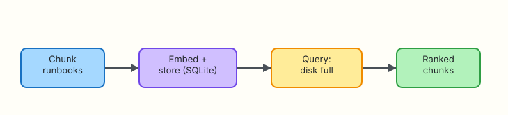

# Vector Stores for Ops

## Overview

Embedding a few files in memory is fine for a demo. Production assistants need a **vector store**: persist chunks, re-index on change, and query quickly. For ops, that usually means chunked runbooks with source paths you can cite later.

**Plain problem:** Re-reading every Markdown file on each query does not scale, and without chunking you retrieve entire unrelated sections.

This lab builds a small **SQLite** vector store (vectors as JSON) with chunking and a query CLI. No external vector database required — the ideas transfer to Chroma, pgvector, or OpenSearch later.

This is **Tutorial 6** in **Module 6: Vector Stores** of the REBASH Academy **AI for DevOps Engineers** series — practical AI for Cloud and DevOps work.

## Prerequisites

- [Embeddings and Semantic Search](embeddings-and-semantic-search.md)
- Python 3.10+ with stdlib `sqlite3`
- Familiarity with Markdown runbooks

## Learning Objectives

By the end of this tutorial, you will be able to:

- [ ] Explain why ops knowledge is chunked before embedding
- [ ] Persist embeddings and metadata in SQLite
- [ ] Index and query runbooks for “disk full” style incidents
- [ ] Diagnose empty-index and bad chunk-size failures
- [ ] Compare SQLite pilots versus dedicated vector databases in interview

## Architecture

Chunk runbooks → embed → store in SQLite → query returns ranked chunks.



## Theory

### What it is

A **vector store** saves embeddings with metadata (path, chunk id, text). At query time it embeds the question and returns the nearest chunks.

**Chunking** splits long documents so retrieval returns a focused paragraph, not a 20-page wiki dump.

### Why it matters

RAG quality is mostly retrieval quality. Bad chunks → bad answers. Ops runbooks need stable IDs and paths for citations and audit.

### How it works

1. Split Markdown into chunks (by heading or character window).  
2. Embed each chunk.  
3. `INSERT` into SQLite: `id`, `path`, `text`, `vector_json`.  
4. On query: embed question, score all rows (fine for lab scale), return top-k.

### Key concepts and comparisons

| Store | When to use |
|-------|-------------|
| In-memory list | Unit tests, tiny demos |
| SQLite + JSON vectors | Pilots, laptops, CI (this lab) |
| pgvector / OpenSearch | Team platforms, larger corpora |
| Managed vector DB | Less ops toil, vendor lock-in trade-off |

| Chunking | Trade-off |
|----------|-----------|
| Too large | Noisy context, weak ranking |
| Too small | Missing sentences, broken meaning |
| By heading | Natural for runbooks |

### Common pitfalls

- Re-indexing without deleting stale chunks  
- Storing vectors without source paths  
- Changing embedder without rebuilding the index  
- Assuming approximate nearest neighbour (ANN) is required for 100 docs  

## Hands-on Lab

### Objective

Index chunked runbooks into SQLite under `~/rebash-ai/module-06` and prove a “disk full” query returns capacity-related chunks with scores.

### Prerequisites

- Python 3.10+
- Completed Module 5 concepts (embed + cosine)

### Lab environment

Workspace: `~/rebash-ai/module-06`

``` {.bash .ra-terminal title="Terminal"}
mkdir -p ~/rebash-ai/module-06/runbooks && cd ~/rebash-ai/module-06
python3 --version | tee python-version.txt
```

!!! example "Expected output"
    Python 3.10+ recorded in `python-version.txt`.

### Real-world scenario

Platform engineering wants a searchable runbook index for an incident bot. Until legal approves a SaaS vector database, you ship SQLite on the jump host with the same chunk metadata the future service will need.

### Step-by-step tasks

#### Task 1 – Corpus and embedder

Create `runbooks/disk-capacity.md`:

```markdown title="runbooks/disk-capacity.md"
# Disk capacity

## Quick checks
Use df -h and df -i when the alert says disk full or no space left.

## Cleanup
Rotate application logs under /var/log with approval. Do not delete database files.
```

Create `runbooks/inode-exhaustion.md`:

```markdown title="runbooks/inode-exhaustion.md"
# Inode exhaustion

## Symptoms
Cannot create files while byte capacity remains.

## Diagnosis
Inspect df -i and find directories with millions of tiny files.
```

Create `runbooks/ssh-bastion.md`:

```markdown title="runbooks/ssh-bastion.md"
# SSH bastion

## Access
Use short-lived certificates through the bastion. Never paste private keys into chat tools.
```

Create `embedder.py` (same hashing approach as Module 5):

```python title="embedder.py"
"""Deterministic hashing embeddings — stdlib only."""
from __future__ import annotations

import hashlib
import math
import re

DIM = 128
TOKEN_RE = re.compile(r"[a-z0-9]+", re.IGNORECASE)


def tokenize(text: str) -> list[str]:
    return TOKEN_RE.findall(text.lower())


def embed(text: str, dim: int = DIM) -> list[float]:
    vec = [0.0] * dim
    tokens = tokenize(text)
    if not tokens:
        return vec
    for tok in tokens:
        h = hashlib.sha256(tok.encode("utf-8")).digest()
        idx = int.from_bytes(h[:4], "big") % dim
        sign = 1.0 if h[4] % 2 == 0 else -1.0
        vec[idx] += sign
    norm = math.sqrt(sum(v * v for v in vec))
    if norm == 0:
        return vec
    return [v / norm for v in vec]


def cosine(a: list[float], b: list[float]) -> float:
    return sum(x * y for x, y in zip(a, b))
```

#### Task 2 – SQLite store, index, and query

Create `store.py`:

```python title="store.py"
"""SQLite vector store for ops runbook chunks."""
from __future__ import annotations

import json
import sqlite3
from pathlib import Path

from embedder import cosine, embed


SCHEMA = """
CREATE TABLE IF NOT EXISTS chunks (
  id TEXT PRIMARY KEY,
  path TEXT NOT NULL,
  text TEXT NOT NULL,
  vector_json TEXT NOT NULL
);
"""


def connect(db_path: Path) -> sqlite3.Connection:
    conn = sqlite3.connect(db_path)
    conn.execute(SCHEMA)
    return conn


def chunk_markdown(path: Path, text: str, max_chars: int = 280) -> list[tuple[str, str]]:
    """Split on ## headings, then window long sections."""
    parts = []
    current = []
    for line in text.splitlines():
        if line.startswith("## ") and current:
            parts.append("\n".join(current).strip())
            current = [line]
        else:
            current.append(line)
    if current:
        parts.append("\n".join(current).strip())

    chunks: list[tuple[str, str]] = []
    for i, part in enumerate(parts):
        if not part:
            continue
        if len(part) <= max_chars:
            chunks.append((f"{path.name}#{i}", part))
            continue
        for j in range(0, len(part), max_chars):
            window = part[j : j + max_chars].strip()
            if window:
                chunks.append((f"{path.name}#{i}.{j}", window))
    return chunks


def index_runbooks(conn: sqlite3.Connection, root: Path, max_chars: int = 280) -> int:
    conn.execute("DELETE FROM chunks")
    count = 0
    for path in sorted(root.glob("*.md")):
        text = path.read_text(encoding="utf-8")
        for chunk_id, chunk_text in chunk_markdown(path, text, max_chars=max_chars):
            vec = embed(chunk_text)
            conn.execute(
                "INSERT INTO chunks (id, path, text, vector_json) VALUES (?, ?, ?, ?)",
                (chunk_id, str(path), chunk_text, json.dumps(vec)),
            )
            count += 1
    conn.commit()
    return count


def query(conn: sqlite3.Connection, question: str, k: int = 3) -> list[dict]:
    qv = embed(question)
    rows = conn.execute("SELECT id, path, text, vector_json FROM chunks").fetchall()
    scored = []
    for chunk_id, path, text, vector_json in rows:
        score = cosine(qv, json.loads(vector_json))
        scored.append(
            {
                "id": chunk_id,
                "path": path,
                "score": round(score, 4),
                "text": text,
            }
        )
    scored.sort(key=lambda r: r["score"], reverse=True)
    return scored[:k]
```

Create `index_cli.py`:

```python title="index_cli.py"
"""Build the SQLite vector index from runbooks/."""
from __future__ import annotations

import argparse
from pathlib import Path

from store import connect, index_runbooks


def main() -> int:
    parser = argparse.ArgumentParser()
    parser.add_argument("--db", type=Path, default=Path("runbooks.db"))
    parser.add_argument("--runbooks", type=Path, default=Path("runbooks"))
    parser.add_argument("--max-chars", type=int, default=280)
    args = parser.parse_args()

    conn = connect(args.db)
    n = index_runbooks(conn, args.runbooks, max_chars=args.max_chars)
    conn.close()
    print(f"indexed_chunks={n} db={args.db}")
    return 0 if n > 0 else 2


if __name__ == "__main__":
    raise SystemExit(main())
```

Create `query_cli.py`:

```python title="query_cli.py"
"""Query the SQLite vector index."""
from __future__ import annotations

import argparse
import json
from pathlib import Path

from store import connect, query


def main() -> int:
    parser = argparse.ArgumentParser()
    parser.add_argument("--db", type=Path, default=Path("runbooks.db"))
    parser.add_argument("--query", required=True)
    parser.add_argument("--k", type=int, default=3)
    parser.add_argument("--out", type=Path, default=Path("query-results.json"))
    args = parser.parse_args()

    conn = connect(args.db)
    hits = query(conn, args.query, k=args.k)
    conn.close()
    args.out.write_text(json.dumps({"query": args.query, "hits": hits}, indent=2) + "\n")
    for h in hits:
        print(f"{h['score']:.4f}\t{h['id']}\t{h['path']}")
    return 0


if __name__ == "__main__":
    raise SystemExit(main())
```

``` {.bash .ra-terminal title="Terminal"}
cd ~/rebash-ai/module-06
python3 index_cli.py --db runbooks.db
python3 query_cli.py --query "disk full no space left" --k 3 --out query-disk.json
python3 - <<'PY'
import json
from pathlib import Path
hits = json.loads(Path("query-disk.json").read_text())["hits"]
assert hits, "expected hits"
top_paths = " ".join(h["path"] for h in hits[:2])
assert "disk-capacity" in top_paths or "inode" in top_paths, hits
assert "ssh-bastion" not in hits[0]["path"]
print("disk_full_query=OK", hits[0]["id"])
PY
```

!!! example "Expected output"
    `indexed_chunks` > 0. Top hit path includes `disk-capacity` or `inode`. Prints `disk_full_query=OK`.

#### Task 3 – Break: empty index and tiny chunks

``` {.bash .ra-terminal title="Terminal"}
cd ~/rebash-ai/module-06
rm -f empty.db
python3 - <<'PY'
from pathlib import Path
from store import connect, query
conn = connect(Path("empty.db"))
hits = query(conn, "disk full", k=3)
assert hits == []
print("empty_index_ok")
conn.close()
PY
# Pathological tiny chunks still index, but may rank poorly — rebuild sane size
python3 index_cli.py --db runbooks.db --max-chars 40
python3 query_cli.py --query "disk full" --db runbooks.db --out query-tiny.json
python3 index_cli.py --db runbooks.db --max-chars 280
python3 query_cli.py --query "disk full" --db runbooks.db --out query-fixed.json
python3 - <<'PY'
import json
from pathlib import Path
fixed = json.loads(Path("query-fixed.json").read_text())["hits"]
assert fixed and ("disk" in fixed[0]["path"] or "inode" in fixed[0]["path"])
print("reindex_fixed=OK")
PY
```

!!! example "Expected output"
    Empty index returns no hits. After rebuilding with sane `max-chars`, disk query ranks storage chunks again.

### Validation steps

- [ ] `runbooks.db` contains chunks after indexing  
- [ ] “disk full” query returns storage-related chunk IDs  
- [ ] SSH bastion is not the top hit  
- [ ] Empty DB returns zero hits without crashing  

### Common errors and fixes

| Error | Cause | Fix |
|-------|-------|-----|
| `indexed_chunks=0` | Wrong `--runbooks` path | Point at directory with `.md` files |
| Stale results | Old DB not rebuilt | Re-run `index_cli.py` (it deletes then inserts) |
| JSON decode errors | Corrupted DB | Delete `runbooks.db` and re-index |

### Challenge exercise

Add a fourth runbook about log rotation filling disks. Re-index and prove “logs filling /var” returns that chunk in top-k.

### Learning outcomes

- You persisted embeddings with citation-ready paths  
- You practised chunking trade-offs  
- You can explain SQLite as a pilot vector store  

### Cleanup

``` {.bash .ra-terminal title="Terminal"}
echo "Artefacts under ~/rebash-ai/module-06"
# rm -rf ~/rebash-ai/module-06
```

## Validation

- [ ] Lab asserts passed  
- [ ] Can explain chunking and why paths matter  
- [ ] Can compare SQLite versus pgvector at a high level  
- [ ] Know to rebuild after embedder changes  

## Code Walkthrough

1. **Delete then insert** on re-index to avoid stale chunks.  
2. **Store path + text + vector** together.  
3. **Score in Python** for small corpora; ANN later if needed.  
4. **Tune chunk size** with real queries, not guesses.  
5. **Keep embedder version** documented next to the DB.  

## Security Considerations

- Runbook DBs may be sensitive — encrypt at rest on shared hosts  
- Query logs can leak incident details  
- Do not index secrets files  
- Separate prod and lab indexes  
- Access-control the DB file like any ops datastore  

## Common Mistakes

!!! warning "Appending forever without deleting old chunks"
    **Fix:** Rebuild atomically or upsert by stable chunk IDs.

!!! warning "Chunking only by fixed bytes through mid-sentence forever"
    **Fix:** Prefer heading-aware splits for runbooks, then window leftovers.

## Best Practices

- Include source path in every hit  
- Keep a golden query list for ranking regressions  
- Version embedder + chunker together  
- Start with SQLite; migrate when scale or multi-writer needs appear  
- Document rebuild procedure for on-call  

## Troubleshooting

| Symptom | Likely cause | Fix |
|---------|--------------|-----|
| Always same top hit | Tiny corpus / weak query | Add docs; use incident language |
| DB locked | Concurrent writers | Single indexer job |
| Huge DB | Storing duplicate indexes | One DB path; rebuild cleanly |

## Summary

Vector stores make embeddings durable and queryable. Chunked SQLite indexes are enough to learn ops retrieval — and to feed RAG next.

Next: [Retrieval-Augmented Generation for Ops](retrieval-augmented-generation-for-ops.md).

## Interview Questions

**1. What problem does a vector store solve beyond in-memory lists?**

??? success "Reveal answer"
    Persistence, re-indexing, shared metadata (paths/IDs), and repeatable queries as the corpus grows — without reloading every file into a process each time.

**2. Why chunk runbooks before embedding?**

??? success "Reveal answer"
    So retrieval returns a focused section the model can use, instead of an entire unrelated document that wastes context and confuses answers.

**3. What metadata must you store with each vector for ops?**

??? success "Reveal answer"
    Stable chunk ID, source path, and the chunk text (or a pointer) so answers can cite evidence.

**4. When is SQLite a reasonable vector store?**

??? success "Reveal answer"
    Pilots, local tools, CI, and corpora small enough to score in Python. Move to ANN/pgvector when scale or concurrency demands it.

**5. What happens if you change the embedding model without re-indexing?**

??? success "Reveal answer"
    Query vectors and stored vectors live in different spaces; rankings become nonsense. Rebuild the index with one embedder version.

**6. How do you detect a bad chunk size in production?**

??? success "Reveal answer"
    Golden queries return irrelevant sections, citations look random, or answers miss critical steps that were split away — fix by re-chunking and re-evaluating.

**7. Why delete-all-then-insert on lab re-index?**

??? success "Reveal answer"
    It prevents stale chunks from deleted or renamed runbooks lingering and polluting rankings.

## Related Tutorials

- Previous: [Embeddings and Semantic Search](embeddings-and-semantic-search.md)
- Next: [Retrieval-Augmented Generation for Ops](retrieval-augmented-generation-for-ops.md)
- Course: [AI for DevOps Overview](index.md)

## References

- [Python sqlite3 documentation](https://docs.python.org/3/library/sqlite3.html)
- [REBASH Academy — AI for DevOps Overview](index.md)
