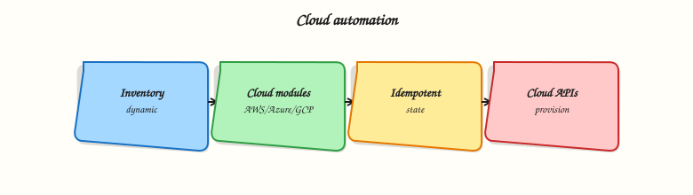

# Cloud Automation

## Overview

Cloud infrastructure APIs change fast. Ansible addresses AWS, Azure, and Google Cloud through **collections** — not core modules — so teams can pin versions and follow each vendor’s authentication model. Typical modules include `amazon.aws.ec2_instance`, `azure.azcollection.azure_rm_virtualmachine`, and `google.cloud.gcp_compute_instance`. Credentials usually arrive via **environment variables**, **cloud CLI profiles**, or **IAM roles** on the control host — never committed in playbooks.

Production teams prefer **`check_mode`** (dry run) and staged inventories before mutating shared accounts. This tutorial documents real module names from [docs.ansible.com](https://docs.ansible.com/) collections and builds **offline stub playbooks** with `ansible.builtin.debug` so you learn structure without cloud spend.

This is **Tutorial 12** in **Module 12: Cloud Automation** of the REBASH Academy **Ansible for Cloud & DevOps Engineers** series — written for cloud and DevOps engineers. You will author inventory stubs, cloud playbook stubs, and `cloud-matrix.yaml` validated by Python.

## Prerequisites

- [Vault and Secrets](ansible-vault-and-secrets.md) (Module 11)
- [Collections and Galaxy](ansible-collections-and-galaxy.md) — `requirements.yml` pins
- Python 3 with PyYAML
- Optional: cloud CLI credentials for future live runs (not required for this lab)

## Learning Objectives

By the end of this tutorial, you will be able to:

- [ ] Name primary Ansible collections for AWS, Azure, and GCP
- [ ] Describe credential delivery via environment variables and IAM roles
- [ ] Structure playbooks for check mode and staged rollouts
- [ ] Author offline debug stubs that mirror real module calls
- [ ] Validate a multi-cloud module matrix with Python

## Architecture

The control node holds cloud credentials; Ansible collection modules call cloud APIs; inventory selects accounts/regions/projects.



## Theory

### What it is

| Cloud | Collection namespace | Example modules (FQCN) |
|-------|---------------------|-------------------------|
| AWS | `amazon.aws` | `ec2_instance`, `s3_bucket`, `iam_role`, `ec2_vpc_net` |
| Azure | `azure.azcollection` | `azure_rm_virtualmachine`, `azure_rm_virtualnetwork`, `azure_rm_storageaccount` |
| GCP | `google.cloud` | `gcp_compute_instance`, `gcp_storage_bucket`, `gcp_compute_network` |

Install via `collections/requirements.yml` (see Module 10). Reference modules by FQCN in tasks.

### Why it matters

Multi-cloud organisations standardise on Ansible for bootstrapping, drift remediation, and day-2 operations alongside Terraform for provisioning. Shared patterns — inventory per account, Vault for secrets, check mode in CI — reduce outage risk when API defaults change.

### How it works

1. Configure credentials on control node (env vars, shared credentials file, or instance profile).
2. Inventory defines hosts or `localhost` with cloud-specific vars (`ansible_python_interpreter`, region, subscription).
3. Tasks call collection modules; modules translate to API requests.
4. **`check_mode: true`** (play or task) asks modules to report planned changes without applying (module support varies).

**AWS credential environment variables (common):**

```bash title="Terminal"
export AWS_ACCESS_KEY_ID=...
export AWS_SECRET_ACCESS_KEY=...
export AWS_SESSION_TOKEN=...   # when using STS
export AWS_DEFAULT_REGION=ap-south-1
```

**Azure:** `AZURE_SUBSCRIPTION_ID`, `AZURE_CLIENT_ID`, `AZURE_SECRET`, `AZURE_TENANT_ID`, or Azure CLI login / federated credentials.

**GCP:** `GOOGLE_APPLICATION_CREDENTIALS` pointing to service account JSON, or Application Default Credentials from `gcloud auth application-default login`.

### Key concepts and comparisons

| Pattern | Use when |
|---------|----------|
| `check_mode` | Pre-flight CI or change review |
| `connection: local` on localhost | API modules from control node |
| Dynamic inventory plugins | Large fleets (EC2, Azure RM, GCE) |
| Terraform + Ansible split | Terraform provisions; Ansible configures OS/apps |

| Risk | Mitigation |
|------|------------|
| Accidental prod delete | Separate inventory; `--limit`; confirmation vars |
| Credential leak | Vault; env vars; no keys in Git |
| API rate limits | Serial/throttle; backoff |
| Drift vs state files | Document ownership: Terraform vs Ansible |

### Common pitfalls

- Running cloud modules without check mode in shared CI — costly mistakes.
- Using root account keys instead of IAM roles or OIDC.
- Assuming all modules support check mode — verify collection docs.
- Wrong Python SDK on control node — collections document required pip packages.
- Hard-coding region/subscription in tasks instead of inventory vars.

## Hands-on Lab

### Objective

Install cloud collections locally, create inventory and playbooks that provision a **local resource registry** (real files under the lab dir) per cloud provider, run `ansible-playbook` to apply them, and validate with `cat`/`grep` — no cloud API spend.

### Prerequisites

- Ansible Core installed
- Python 3 + PyYAML
- Network for `ansible-galaxy collection install`

### Lab environment

```bash title="Terminal"
mkdir -p ~/rebash-ansible/module-12/{inventory,playbooks,scripts}
cd ~/rebash-ansible/module-12
```

Runtime: localhost `connection: local`; offline validation only.

### Real-world scenario

Your platform guild maintains a **cloud module matrix** documenting which FQCN modules each team may use. Before enabling live AWS/Azure/GCP credentials in CI, architects review stub playbooks and the validated YAML matrix.

### Step-by-step tasks

#### Task 1 – Inventory stub

Create `inventory/cloud-stub.yml`:


```yaml
---
all:
  hosts:
    localhost:
      ansible_connection: local
      ansible_python_interpreter: "{{ ansible_playbook_python }}"
  vars:
    cloud_env: lab-stub
    aws_region: ap-south-1
    azure_location: centralindia
    gcp_project: rebash-lab-stub
    gcp_zone: asia-south1-a
```


Create `ansible.cfg`:

```ini title="ansible.cfg"
[defaults]
inventory = inventory/cloud-stub.yml
host_key_checking = False
```

#### Task 2 – Install cloud collections and requirements

Create `collections/requirements.yml`:

```yaml title="requirements.yml"
---
collections:
  - name: amazon.aws
    version: ">=7.0.0,<8.0.0"
  - name: azure.azcollection
    version: ">=2.0.0,<3.0.0"
  - name: google.cloud
    version: ">=1.0.0,<2.0.0"
```

Create `ansible.cfg`:

```ini title="ansible.cfg"
[defaults]
inventory = inventory/cloud-stub.yml
collections_paths = ./collections:~/.ansible/collections
host_key_checking = False
```

Install collections:

```bash title="Terminal"
cd ~/rebash-ansible/module-12
ansible-galaxy collection install -r collections/requirements.yml -p ./collections --force-with-deps | tee galaxy-install.txt
ansible-galaxy collection list amazon.aws | tee collection-list-aws.txt
grep -q amazon.aws collection-list-aws.txt
```

!!! example "Expected output"
    `amazon.aws` appears in collection list output.


#### Task 3 – Playbook that writes cloud resource registry files

Create `playbooks/provision-local-registry.yml`:


```yaml
---
- name: Build local cloud resource registry from inventory vars
  hosts: localhost
  connection: local
  gather_facts: false
  vars:
    registry_root: "~/rebash-ansible/module-12/registry"
  tasks:
    - name: Ensure registry directory exists
      ansible.builtin.file:
        path: "{{ registry_root }}"
        state: directory
        mode: "0755"

    - name: Write AWS registry stub
      ansible.builtin.template:
        src: ../templates/aws-resource.json.j2
        dest: "{{ registry_root }}/aws-ec2-stub.json"
        mode: "0644"

    - name: Write Azure registry stub
      ansible.builtin.template:
        src: ../templates/azure-resource.json.j2
        dest: "{{ registry_root }}/azure-vm-stub.json"
        mode: "0644"

    - name: Write GCP registry stub
      ansible.builtin.template:
        src: ../templates/gcp-resource.json.j2
        dest: "{{ registry_root }}/gcp-instance-stub.json"
        mode: "0644"
```


Create `templates/aws-resource.json.j2`:


```json
{
  "provider": "aws",
  "module": "amazon.aws.ec2_instance",
  "region": "{{ aws_region }}",
  "name": "rebash-lab-vm",
  "instance_type": "t3.micro",
  "check_mode_required": true
}
```


Create `templates/azure-resource.json.j2`:


```json
{
  "provider": "azure",
  "module": "azure.azcollection.azure_rm_virtualmachine",
  "location": "{{ azure_location }}",
  "name": "rebash-lab-vm",
  "vm_size": "Standard_B1s"
}
```


Create `templates/gcp-resource.json.j2`:


```json
{
  "provider": "gcp",
  "module": "google.cloud.gcp_compute_instance",
  "project": "{{ gcp_project }}",
  "zone": "{{ gcp_zone }}",
  "machine_type": "e2-micro"
}
```


Run playbook:

```bash title="Terminal"
cd ~/rebash-ansible/module-12
mkdir -p templates
ansible-playbook playbooks/provision-local-registry.yml --syntax-check
ansible-playbook playbooks/provision-local-registry.yml | tee registry-run.txt
grep -q 'PLAY RECAP' registry-run.txt
grep -q 'amazon.aws.ec2_instance' ~/rebash-ansible/module-12/registry/aws-ec2-stub.json
grep -q 'ap-south-1' ~/rebash-ansible/module-12/registry/aws-ec2-stub.json
grep -q 'google.cloud.gcp_compute_instance' ~/rebash-ansible/module-12/registry/gcp-instance-stub.json
echo "registry apply OK" | tee registry-ok.txt
```

!!! example "Expected output"
    Three JSON files under `registry/` with correct FQCN module names and inventory vars.


#### Task 4 – cloud-matrix.yaml and Python validator

Create `cloud-matrix.yaml`:

```yaml title="cloud-matrix.yaml"
---
# REBASH Module 12 — Ansible cloud collection module matrix (offline reference)
schema_version: 1
clouds:
  aws:
    collection: amazon.aws
    credential_hint: "AWS_ACCESS_KEY_ID / IAM role / AWS CLI profile"
    check_mode: recommended
    modules:
      compute: amazon.aws.ec2_instance
      network: amazon.aws.ec2_vpc_net
      identity: amazon.aws.iam_role
      storage: amazon.aws.s3_bucket
  azure:
    collection: azure.azcollection
    credential_hint: "AZURE_* service principal env vars or az login"
    check_mode: recommended
    modules:
      compute: azure.azcollection.azure_rm_virtualmachine
      network: azure.azcollection.azure_rm_virtualnetwork
      storage: azure.azcollection.azure_rm_storageaccount
  gcp:
    collection: google.cloud
    credential_hint: "GOOGLE_APPLICATION_CREDENTIALS or ADC"
    check_mode: recommended
    modules:
      compute: google.cloud.gcp_compute_instance
      network: google.cloud.gcp_compute_network
      storage: google.cloud.gcp_storage_bucket
playbook_stubs:
  - playbooks/aws-stub.yml
  - playbooks/azure-stub.yml
  - playbooks/gcp-stub.yml
```

Create `scripts/validate-cloud-matrix.py`:

```python title="validate-cloud-matrix.py"
#!/usr/bin/env python3
"""Validate cloud-matrix.yaml structure and FQCN prefixes."""
from __future__ import annotations

import pathlib
import sys

try:
    import yaml
except ImportError:
    print("PyYAML required", file=sys.stderr)
    sys.exit(1)

EXPECTED_CLOUDS = {"aws", "azure", "gcp"}
MODULE_KEYS = {"compute", "network", "storage"}
FQCN_PREFIX = {
    "aws": "amazon.aws.",
    "azure": "azure.azcollection.",
    "gcp": "google.cloud.",
}


def main() -> int:
    path = pathlib.Path("cloud-matrix.yaml")
    doc = yaml.safe_load(path.read_text())
    clouds = doc.get("clouds", {})
    if set(clouds.keys()) != EXPECTED_CLOUDS:
        print("clouds must be aws, azure, gcp", file=sys.stderr)
        return 1
    for cloud, cfg in clouds.items():
        prefix = FQCN_PREFIX[cloud]
        mods = cfg.get("modules", {})
        if set(mods.keys()) != MODULE_KEYS:
            print(f"{cloud}: modules must include compute, network, storage", file=sys.stderr)
            return 1
        for role, fqcn in mods.items():
            if not str(fqcn).startswith(prefix):
                print(f"{cloud}.{role}: FQCN must start with {prefix}", file=sys.stderr)
                return 1
        if cfg.get("check_mode") != "recommended":
            print(f"{cloud}: check_mode should be recommended for lab policy", file=sys.stderr)
            return 1
    stubs = doc.get("playbook_stubs", [])
    for stub in stubs:
        if not pathlib.Path(stub).is_file():
            print(f"Missing stub playbook: {stub}", file=sys.stderr)
            return 1
    print("cloud-matrix.yaml OK")
    for c in sorted(clouds):
        print(f"  {c}: {clouds[c]['collection']}")
    return 0


if __name__ == "__main__":
    raise SystemExit(main())
```

Validate:

```bash title="Terminal"
cd ~/rebash-ansible/module-12
chmod +x scripts/validate-cloud-matrix.py
python3 scripts/validate-cloud-matrix.py | tee validate-matrix.txt
grep -q 'cloud-matrix.yaml OK' validate-matrix.txt
```

!!! example "Expected output"
    `cloud-matrix.yaml OK` with three cloud collection names listed.


### Validation steps

- [ ] Three stub playbooks syntax-check and run offline
- [ ] Each stub documents real FQCN module name from official collections
- [ ] `cloud-matrix.yaml` passes Python validator
- [ ] Inventory stub sets region/location/project vars
- [ ] Can explain credential env vars for one cloud

### Common errors and fixes

| Error | Cause | Fix |
|-------|-------|-----|
| `Collection not found` on live run | Collection not installed | `ansible-galaxy collection install -r requirements.yml` |
| Authentication failure | Missing env credentials | Export cloud env vars or use role-based auth |
| Check mode shows changed but no change | Module partial check support | Read collection module docs |
| Wrong region/project | Inventory vars typo | Fix `cloud-stub.yml` vars |
| Python validator fails FQCN | Wrong prefix in matrix | Match `amazon.aws.`, `azure.azcollection.`, `google.cloud.` |

### Challenge exercise

Add `requirements.yml` referencing the three cloud collections with pins, extend the validator to require `schema_version: 1`, and add a `playbooks/check-mode-policy.yml` that sets `check_mode: true` at play level and debugs a message for each cloud.

### Learning outcomes

- Documented real cloud module FQCNs without API spend
- Ran debug stub playbooks on localhost
- Built and validated a multi-cloud module matrix in YAML
- Understood credential and check-mode production habits

### Cleanup

```bash title="Terminal"
rm -f ~/rebash-ansible/module-12/run-stubs.txt ~/rebash-ansible/module-12/validate-matrix.txt
# Keep stubs for portfolio review
```

## Validation

- [ ] Lab completed under `~/rebash-ansible/module-12`
- [ ] Python validator passes on `cloud-matrix.yaml`
- [ ] Can name one module per cloud from memory
- [ ] Can describe when to use check mode

## Code Walkthrough

1. **Stub before spend** — validate playbook structure with `debug` before enabling credentials.
2. **Pin collections** — cloud APIs change; lock `amazon.aws`, `azure.azcollection`, `google.cloud` versions.
3. **Separate inventories** — dev/staging/prod account IDs in different inventory trees.
4. **Check mode first** — default CI to check mode unless explicitly deploying.
5. **Credential hygiene** — env vars and roles; rotate keys; never commit.

## Security Considerations

- Use least-privilege IAM/service principals scoped to required API actions.
- Prefer short-lived STS/OIDC credentials over long-lived access keys.
- Vault-encrypt cloud secrets referenced in vars; do not embed in playbooks.
- Audit cloud API calls from CI control nodes; restrict prod credentials to prod runners.
- Review module `state: absent` tasks carefully — deletion is irreversible.

## Common Mistakes

!!! warning "Full admin cloud keys in CI"
    Key leak owns the account. **Fix:** scoped IAM roles, OIDC federation, time-bound tokens.

!!! warning "Skipping check mode in shared accounts"
    One typo creates billable resources. **Fix:** CI check mode + manual approval for apply.

!!! warning "Terraform and Ansible fighting same resources"
    Dual ownership causes drift and deletes. **Fix:** clear boundary — who owns which resource type.

!!! warning "Assuming identical module arguments across clouds"
    API models differ. **Fix:** read per-collection docs; use cloud-matrix for standards.

## Best Practices

- Maintain `requirements.yml` and cloud module matrix in Git.
- Use dynamic inventory for large fleets; static stub for lab/architecture review.
- Tag all cloud resources created by Ansible for cost and ownership tracking.
- Test collection upgrades in sandbox subscriptions/projects first.
- Document required Python libraries on execution environment image.

## Troubleshooting

| Symptom | Likely cause | Fix |
|---------|--------------|-----|
| `Unable to locate credentials` | Env not set on control node | Export vars or configure role |
| Module not found | Collection missing | Install from requirements |
| Wrong subscription/project | Inventory var error | Fix azure/gcp vars |
| Check mode always changed | Module limitation | Treat as estimate; read docs |
| Slow playbook | Sequential API calls | `async`/`poll` or batch where supported |

## Summary

Cloud automation in Ansible flows through vendor collections, environment-based credentials, and disciplined check mode. Offline stubs and a validated module matrix let teams agree on FQCNs before live API access. Continue with Kubernetes automation or CI integration in later modules.

## Interview Questions

**1. Which collections cover AWS, Azure, and GCP in modern Ansible?**

??? success "Reveal answer"
    `amazon.aws` for AWS, `azure.azcollection` for Azure, and `google.cloud` for GCP. They ship separately from ansible-core and must be installed via Galaxy or execution environment images with version pins.

**2. How do you supply AWS credentials to Ansible without putting keys in playbooks?**

??? success "Reveal answer"
    Environment variables (`AWS_ACCESS_KEY_ID`, etc.), shared credentials file on control node, instance/profile IAM role on EC2/Automation Platform, or STS-assumed role. Playbooks reference neither keys nor secrets inline.

**3. What is check mode and when should you use it for cloud modules?**

??? success "Reveal answer"
    Check mode (`--check` or `check_mode: true`) asks modules to predict changes without applying. Use in CI review and before prod changes. Not all modules support all check features — verify collection documentation.

**4. Name one compute module FQCN per cloud.**

??? success "Reveal answer"
    AWS: `amazon.aws.ec2_instance`. Azure: `azure.azcollection.azure_rm_virtualmachine`. GCP: `google.cloud.gcp_compute_instance`.

**5. Why use localhost with connection local for cloud API modules?**

??? success "Reveal answer"
    Cloud modules call HTTP APIs from the control node; no SSH to a managed host is required. Inventory host represents the automation context while modules interact with cloud endpoints.

**6. How would you prevent Ansible from deleting production resources accidentally?**

??? success "Reveal answer"
    Separate inventories and credentials; require `--limit` and confirmation vars; default CI to check mode; use RBAC on cloud accounts; avoid broad `state: absent` without strict tags/naming guards.

**7. Terraform already provisioned VMs — what should Ansible do?**

??? success "Reveal answer"
    Ansible configures OS, agents, applications, and day-2 drift remediation on existing hosts. Avoid duplicating provisioning unless architecture explicitly splits responsibilities with clear state ownership.

## Related Tutorials

- [Ansible course index](index.md)
- Previous: [Vault and Secrets](ansible-vault-and-secrets.md)
- Next: Kubernetes and CI modules (course roadmap)
- Related: [Multi-Cloud Terraform](../terraform/multi-cloud-terraform.md), [Collections and Galaxy](ansible-collections-and-galaxy.md)

## References

- [amazon.aws collection documentation](https://docs.ansible.com/ansible/latest/collections/amazon/aws/index.html)
- [azure.azcollection documentation](https://docs.ansible.com/ansible/latest/collections/azure/azcollection/index.html)
- [google.cloud collection documentation](https://docs.ansible.com/ansible/latest/collections/google/cloud/index.html)
- [Ansible cloud modules guide](https://docs.ansible.com/ansible/latest/scenario_guides/cloud.html)
- [AWS credential configuration](https://docs.aws.amazon.com/cli/latest/userguide/cli-configure-files.html)
