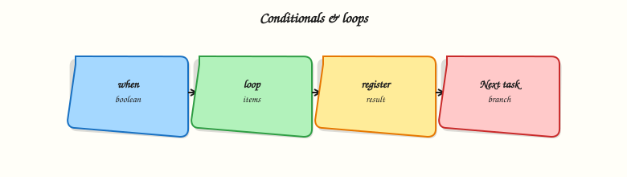

# Conditionals and Loops

## Overview

Real automation rarely runs the same task on every host in the same way. You skip steps when a service is already configured, iterate over a list of users, retry until a port opens, or mark a command as “changed” only when output matches a pattern. Ansible expresses these patterns with **conditionals** (`when`), **loops** (`loop`), **retries** (`until` with `retries` and `delay`), and **result overrides** (`failed_when`, `changed_when`).

Without these controls, playbooks become brittle: they fail on edge cases, report false changes that break idempotency checks, or hammer APIs until rate limits trigger. Platform teams use conditionals to gate tasks by environment, loops to roll out packages or firewall rules, and `until` for bootstrap scenarios where a dependency becomes ready after a delay.

This is **Tutorial 7** in **Module 7: Conditionals & Loops** of the REBASH Academy **Ansible for Cloud & DevOps Engineers** series — written for DevOps engineers, cloud engineers, platform engineers, and Linux administrators. By the end, you will run a localhost playbook that combines `loop` + `when` and demonstrate `until` retries with observable evidence.

## Prerequisites

- [Variables and Facts](ansible-variables-and-facts.md) (Module 6) — play structure, variables, registered results
- Ansible Core 2.16+ or 2.18+ installed on Ubuntu 22.04/24.04 or macOS
- Ability to run `ansible-playbook` against `localhost` with `connection: local`

## Learning Objectives

By the end of this tutorial, you will be able to:

- [ ] Skip or run tasks with `when` and combine conditions safely
- [ ] Iterate lists and dictionaries with `loop` and access `item` / `ansible_loop`
- [ ] Retry tasks with `until`, `retries`, and `delay` until a condition is met
- [ ] Override failure and change detection with `failed_when` and `changed_when`
- [ ] Explain when loops beat duplicated tasks and when retries beat manual re-runs

## Architecture

Conditionals and loops sit between the playbook engine and individual modules. The engine evaluates `when` before each task, expands `loop` into repeated task executions, and applies `until` / retry logic around module results.



## Theory

### What it is

**`when`** — a Jinja2 expression; if it evaluates to false, Ansible skips the task for that host.

**`loop`** — repeats the task for each element in a list (or each key/value for a dict using the `dict2items` filter in a loop). Replaces legacy `with_items`, `with_dict`, and similar plugins for new playbooks.

**`until`** — retry the task until the expression is true or `retries` is exhausted. Pair with **`retries`** (default 3) and **`delay`** (seconds between attempts, default 5).

**`failed_when`** — treat a task as failed when a Jinja2 expression is true, even if the module returned success.

**`changed_when`** — control whether Ansible reports `changed` for idempotency and handler notification.

### Why it matters

Configuration management pipelines often gate tasks: run hardening only when `ansible_os_family == "Debian"`, install agents only when a group variable says so, or retry API checks during cluster bootstrap. CI/CD systems that parse Ansible output rely on accurate `changed` counts — false positives trigger unnecessary downstream steps.

### How it works

1. Ansible renders `when` per host before executing the module.
2. For `loop`, each iteration runs the module; results appear in `results` (a list) when registered.
3. `until` re-runs the task; the registered variable from the last attempt is available as `register_name` (and `register_name.attempts` shows try count).
4. `failed_when` / `changed_when` inspect `register` variables or module return keys (`stdout`, `rc`, `failed`, etc.).


```yaml
- name: Example conditional loop
  ansible.builtin.debug:
    msg: "Deploying {{ item.name }}"
  loop:
    - { name: api, enabled: true }
    - { name: worker, enabled: false }
  when: item.enabled | bool
```


### Key concepts and comparisons

| Mechanism | Use when | Avoid when |
|-----------|----------|------------|
| `when` | OS family, env tag, feature flag | Duplicating entire plays for one flag |
| `loop` | Same module, many items | Complex unrelated steps (use `include_tasks`) |
| `until` | Wait for port, file, HTTP 200 | Long unbounded waits without `retries` cap |
| `failed_when` | Script exits 0 but prints ERROR | Hiding real module failures without review |
| `changed_when` | Command always exits 0 | Suppressing all change reporting blindly |

| Legacy | Modern replacement |
|--------|---------------------|
| `with_items` | `loop:` |
| `with_dict` | `loop` with the `dict2items` filter on a dict |
| `with_fileglob` | `loop` with a `fileglob` lookup on a path pattern |

### Common pitfalls

- **`when` and loops:** `when` is evaluated per iteration; use `item.field`, not undefined outer variables.
- **Empty loop:** looping over `[]` skips the task — confirm the list is populated.
- **`until` without `retries`:** default may be too low for slow services; set explicit `retries` and `delay`.
- **`changed_when: false` everywhere:** hides real drift; use only when the module cannot report change correctly.
- **Jinja type coercion:** `"false"` as a string is truthy; use `| bool` for string flags.

## Hands-on Lab

### Objective

Build a localhost playbook that installs packages with `loop` + `when`, then demonstrates `until` retries against a simulated “not ready yet” command — with syntax-check and run evidence.

### Prerequisites

- Ansible installed (`ansible --version`)
- Python 3 on the control node
- No root on remote hosts required (`connection: local`)

### Lab environment

``` {.bash .ra-terminal title="Terminal"}
mkdir -p ~/rebash-ansible/module-07/{playbooks,files}
cd ~/rebash-ansible/module-07
```

Runtime: your laptop or practice VM as control node; all tasks use `hosts: localhost` and `connection: local`.

### Real-world scenario

Your platform team rolls out optional monitoring agents per service. Some packages apply only when a service is marked `enabled`. A health-check script must succeed before marking deployment complete — you model that with `until` and bounded retries.

### Step-by-step tasks

#### Task 1 – Playbook with loop and when

Create `playbooks/conditionals-loops.yml`:


```yaml
---
- name: Conditionals and loops lab
  hosts: localhost
  connection: local
  gather_facts: true
  vars:
    services:
      - name: curl
        enabled: true
        state: present
      - name: jq
        enabled: true
        state: present
      - name: phantom-agent
        enabled: false
        state: present
  tasks:
    - name: Ensure enabled packages are present (Debian family only)
      ansible.builtin.apt:
        name: "{{ item.name }}"
        state: "{{ item.state }}"
      loop: "{{ services }}"
      when:
        - item.enabled | bool
        - ansible_os_family == "Debian"
      register: package_results

    - name: Show skipped vs changed summary
      ansible.builtin.debug:
        msg: "{{ item.item.name }} changed={{ item.changed }} skipped={{ item.skipped | default(false) }}"
      loop: "{{ package_results.results }}"
      when: package_results is defined
```


Syntax-check and run:

``` {.bash .ra-terminal title="Terminal"}
cd ~/rebash-ansible/module-07
ansible-playbook playbooks/conditionals-loops.yml --syntax-check | tee syntax-check.txt
ansible-playbook playbooks/conditionals-loops.yml | tee run-conditionals.txt
grep -q 'PLAY RECAP' run-conditionals.txt
grep -q 'phantom-agent' run-conditionals.txt || true
```

!!! example "Expected output"
    Syntax check passes; recap shows `ok=` tasks; debug lines include `phantom-agent` with `skipped=True` (or task omitted from changed count).


#### Task 2 – Until retry demo script

Create `files/wait-for-ready.sh`:

```bash title="wait-for-ready.sh"
#!/usr/bin/env bash
set -euo pipefail
COUNTER_FILE="${1:-/tmp/rebash-ready.counter}"
mkdir -p "$(dirname "$COUNTER_FILE")"
count=0
if [[ -f "$COUNTER_FILE" ]]; then
  count="$(cat "$COUNTER_FILE")"
fi
count=$((count + 1))
echo "$count" > "$COUNTER_FILE"
echo "attempt=$count"
if [[ "$count" -lt 3 ]]; then
  echo "STATUS=waiting"
  exit 1
fi
echo "STATUS=ready"
exit 0
```

Make it executable:

``` {.bash .ra-terminal title="Terminal"}
chmod +x ~/rebash-ansible/module-07/files/wait-for-ready.sh
rm -f /tmp/rebash-ready.counter
```

#### Task 3 – Playbook with until, retries, failed_when, changed_when

Create `playbooks/until-retry.yml`:


```yaml
---
- name: Until and result overrides lab
  hosts: localhost
  connection: local
  gather_facts: false
  vars:
    ready_counter: /tmp/rebash-ready.counter
  tasks:
    - name: Wait until readiness script reports ready
      ansible.builtin.command:
        cmd: "{{ playbook_dir }}/../files/wait-for-ready.sh {{ ready_counter }}"
      register: ready_result
      until: ready_result.rc == 0
      retries: 5
      delay: 1
      changed_when: "'STATUS=ready' in ready_result.stdout"

    - name: Prove final attempt count
      ansible.builtin.debug:
        msg: "Attempts={{ ready_result.attempts }} stdout={{ ready_result.stdout }}"
      failed_when: ready_result.attempts < 3
```


Run and capture evidence:

``` {.bash .ra-terminal title="Terminal"}
cd ~/rebash-ansible/module-07
rm -f /tmp/rebash-ready.counter
ansible-playbook playbooks/until-retry.yml | tee run-until.txt
grep -q 'Attempts=3' run-until.txt
grep -q 'STATUS=ready' run-until.txt
```

!!! example "Expected output"
    Play succeeds after three attempts; debug shows `Attempts=3` and `STATUS=ready`.


#### Task 4 – Assert idempotency on second run

``` {.bash .ra-terminal title="Terminal"}
cd ~/rebash-ansible/module-07
ansible-playbook playbooks/until-retry.yml | tee run-until-idempotent.txt
grep -q 'changed=0' run-until-idempotent.txt || grep -q 'changed=1' run-until-idempotent.txt
```

!!! example "Expected output"
    Second run completes immediately (attempt counter file already at ready state); playbook recap shows success.


### Validation steps

- [ ] `ansible-playbook --syntax-check` passes for both playbooks
- [ ] `loop` + `when` skips disabled service `phantom-agent`
- [ ] `until` retries until `wait-for-ready.sh` exits 0 on attempt 3
- [ ] `changed_when` ties change reporting to `STATUS=ready` in stdout
- [ ] You can explain difference between `retries` and `until`

### Common errors and fixes

| Error | Cause | Fix |
|-------|-------|-----|
| `'dict object' has no attribute 'skipped'` | Accessing skip on non-loop register | Use the `default` filter on `item.skipped` when looping over `results` |
| Task never retries | `until` true on first run | Confirm script/command fails until condition met |
| `when` skips entire loop unexpectedly | Wrong fact name or type | Debug with `-e` vars or `ansible.builtin.debug: var=` |
| Jinja undefined variable in `when` | Typo in `item` key | Run with `-vvv` and inspect facts |
| All iterations show `changed` | Module not idempotent | Add `changed_when` or use proper module args |

### Challenge exercise

Create `playbooks/challenge-failed-when.yml` that runs `grep NONEXISTENT /etc/hosts`, registers output, uses `failed_when: false` and a separate task that fails when `'NONEXISTENT' not in grep_result.stdout`. Prove with `ansible-playbook` exit code 0 then adjust to fail intentionally.

### Learning outcomes

- Authored playbooks using `when`, `loop`, and `until` on localhost
- Demonstrated bounded retries with a real shell script
- Applied `changed_when` and `failed_when` to control reporting
- Validated behaviour with grep-based asserts on playbook output

### Cleanup

``` {.bash .ra-terminal title="Terminal"}
rm -f /tmp/rebash-ready.counter
# Keep ~/rebash-ansible/module-07 for portfolio review
```

## Validation

- [ ] Completed lab under `~/rebash-ansible/module-07`
- [ ] Can explain `when` vs `loop` vs `until` without reading notes
- [ ] Used `ansible-playbook --syntax-check` before every run
- [ ] Can describe one production failure mode (infinite retry, false changed)

## Code Walkthrough

1. **Inspect first** — use `--check` where modules support it; debug vars before adding `when`.
2. **Small loops** — keep loop bodies one module; extract complex flows to `include_tasks`.
3. **Cap retries** — always set `retries` and `delay` with `until`; document expected wait time.
4. **Register results** — name registers clearly (`package_results`, `ready_result`) for `failed_when`.
5. **Least surprise** — avoid `failed_when: false` in production without a comment and review.

## Security Considerations

- Do not embed secrets in `when` expressions logged at high verbosity (`-vvv`).
- `loop` over user-supplied lists without validation can install unintended packages — whitelist names.
- `until` with shell modules can execute repeatedly — ensure commands are safe and idempotent.
- Skipping security tasks via misconfigured `when` leaves hosts exposed — test conditionals in CI.
- Review `failed_when: false` patterns; they can hide compromise indicators in script output.

## Common Mistakes

!!! warning "Using string `'false'` in when"
    The string `"false"` is truthy in Jinja2. **Fix:** use booleans or `| bool` filter.

!!! warning "Unbounded until loops in production"
    Missing or excessive `retries` can hang pipelines or hammer endpoints. **Fix:** set explicit `retries`, `delay`, and alert on exhaustion.

!!! warning "Copy-pasting with_items from old examples"
    Legacy plugins still work but confuse readers. **Fix:** standardise on `loop` for new playbooks.

!!! warning "Ignoring loop result structure"
    Registered loop results live in `.results` list. **Fix:** iterate `register.results` in follow-up tasks.

## Best Practices

- Prefer `loop` over duplicate tasks; prefer `include_tasks` over nested loops deeper than two levels.
- Combine `when` conditions as YAML lists (AND logic); use `when: cond1 or cond2` sparingly with parentheses.
- Set `retries` based on measured startup time, not guesses.
- Document why `changed_when` or `failed_when` overrides exist inline in the playbook.
- Test conditionals on a canary host group before fleet-wide rollout.

## Troubleshooting

| Symptom | Likely cause | Fix |
|---------|--------------|-----|
| Task runs when it should skip | Wrong variable type or fact missing | `debug` var; use `| default(false)` |
| Loop runs zero times | Empty list or filtered upstream | Print `services` before loop |
| until exhausts retries | Condition never true | Increase retries/delay; fix script exit codes |
| Handler never fires | `changed_when: false` on notifying task | Adjust changed detection |
| Spurious failures on one OS | Missing `when: ansible_os_family` | Gate package modules per family |

## Summary

Conditionals and loops turn static playbooks into adaptive automation: skip work with `when`, scale repetition with `loop`, and tolerate startup delay with `until` and retries. Result overrides fine-tune how Ansible reports success and change. Next, package reusable automation as [Roles](ansible-roles.md).

## Interview Questions

**1. When should you use `loop` instead of writing three separate tasks?**

??? success "Reveal answer"
    Use `loop` when the same module and argument shape apply to many items (packages, users, firewall rules). Separate tasks are clearer when steps, modules, or error handling differ materially. Loops reduce copy-paste drift; separate tasks improve readability for unrelated operations.

**2. How do `retries`, `delay`, and `until` interact?**

??? success "Reveal answer"
    Ansible runs the task, evaluates `until` against the registered result, and if false, waits `delay` seconds and retries up to `retries` times. The last attempt’s register is kept, including `attempts`. Without `until`, `retries` applies to module failures rather than a custom condition.

**3. Why might you set `changed_when: false` on a command task?**

??? success "Reveal answer"
    Some commands always exit 0 but do not represent configuration drift (read-only checks). Marking them unchanged prevents false `changed` counts and accidental handler runs. Use sparingly and document — hiding real changes breaks audit trails.

**4. What is the difference between `failed_when` and ignoring errors with `ignore_errors: true`?**

??? success "Reveal answer"
    `failed_when` marks success/failure based on your expression while still recording the result; downstream `when: not failed` behaves predictably. `ignore_errors: true` continues the play but sets `failed` on the host, which can block later plays unless handled. Prefer explicit `failed_when` for controlled semantics.

**5. How do you loop over a dictionary in modern Ansible?**

??? success "Reveal answer"
    Loop over the dictionary with the `dict2items` filter and reference `item.key` and `item.value`. Legacy `with_dict` is deprecated for new content. For subelements, combine `loop` with `subelements` filter or structured lists.

**6. A package task loops but skips every item on RHEL — what do you check first?**

??? success "Reveal answer"
    Check `when` conditions tied to `ansible_os_family` or package module choice (`apt` vs `dnf`). Confirm facts are gathered (`gather_facts: true`) and group/host vars populate the loop list. Run with `-vvv` on one host to see evaluated `when` per iteration.

**7. Production concern: a colleague uses `until` with a 300-second delay and 100 retries. What is the risk?**

??? success "Reveal answer"
    A single task could block for hours, stalling CI/CD and masking upstream failures. Cap total wait time, add monitoring alerts on retry exhaustion, and fix root cause (service not starting) instead of infinite tolerance.

## Related Tutorials

- [Ansible course index](index.md)
- Previous: [Variables and Facts](ansible-variables-and-facts.md) (Module 6)
- Next: [Roles](ansible-roles.md)
- Related: [Jinja2 Templates](ansible-jinja2-templates.md)

## References

- [Ansible conditionals documentation](https://docs.ansible.com/ansible/latest/playbook_guide/playbooks_conditionals.html)
- [Ansible loops documentation](https://docs.ansible.com/ansible/latest/playbook_guide/playbooks_loops.html)
- [Controlling playbook execution — retries](https://docs.ansible.com/ansible/latest/playbook_guide/playbooks_blocks.html#retrying-failed-tasks-until)
- [Ansible for Cloud & DevOps Engineers — course index](index.md)
