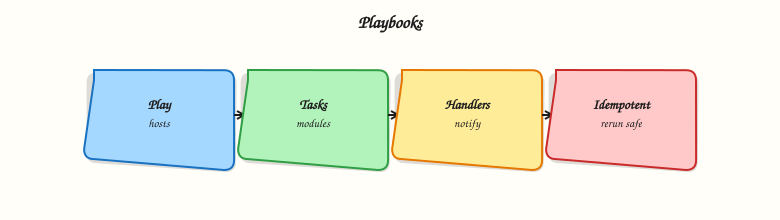

# Ansible Playbooks

## Overview

**Playbooks** are Ansible’s durable automation documents — version-controlled YAML that describes *plays* (mapped to host groups) and *tasks* (module calls). They add **handlers** for notified restarts, **tags** for selective execution, and structure that ad-hoc commands lack.

This tutorial explains playbook anatomy, handler semantics, and tag strategies. The lab creates **`site.yml`**, runs **`ansible-playbook --syntax-check`**, executes against **localhost**, and demonstrates tag-limited runs — the pattern production pipelines use before wide rollout.

This is **Tutorial 5** in **Module 5: Playbooks** of the REBASH Academy **Ansible for Cloud & DevOps Engineers** series.

## Prerequisites

- [Ansible Ad-hoc Commands](ansible-ad-hoc-commands.md)
- [Python file handling (YAML)](../python/file-handling-pathlib-json-yaml-csv.md) — indentation and lists
- [Git](../git/index.md) — playbooks live in pull requests
- Inventory and ansible.cfg from prior modules

## Learning Objectives

By the end of this tutorial, you will be able to:

- [ ] Structure a playbook with `hosts`, `tasks`, `handlers`, and `vars`
- [ ] Explain when handlers run and why they are idempotent-friendly
- [ ] Use **tags** to run subsets of tasks in CI or canary deploys
- [ ] Validate with **`ansible-playbook --syntax-check`** before apply
- [ ] Run playbooks with **`connection=local`** for lab and CI targets

## Architecture

A playbook can contain multiple plays; each play runs top-to-bottom on its host pattern, then flushes handlers once at the end of the play.



## Theory

### What it is

Minimal playbook shape:

```yaml
---
- name: Configure web tier
  hosts: web
  become: true
  tasks:
    - name: Ensure app directory exists
      ansible.builtin.file:
        path: /opt/myapp
        state: directory
        mode: "0755"
  handlers:
    - name: restart app
      ansible.builtin.debug:
        msg: handler would restart app here
```

Key elements:

| Element | Purpose |
|---------|---------|
| `hosts` | Inventory pattern (`web`, `local`, `all`) |
| `gather_facts` | Default true — runs setup module |
| `tasks` | Ordered module calls |
| `handlers` | Tasks run once when notified |
| `notify` | Links task change to handler name |
| `tags` | Label tasks for selective runs |
| `become` | Privilege escalation for the play |

**Handlers** run **only once** at end of play **if notified** and only if a notifying task reported **`changed: true`** (unless `force_handlers`).

### Why it matters

Playbooks are how teams pass code review, run Molecule tests, and integrate with CI. Tags let you run **`--tags deploy`** without re-running **`baseline`**. Handlers prevent restarting a service five times when five config tasks change. Syntax-check catches YAML and structural errors before SSH connections open.

### How it works

Execution flow:

1. Parse playbook YAML.
2. For each play, resolve host list from inventory.
3. Gather facts (unless disabled).
4. Run tasks in order; track notifications.
5. Flush handler queue once.
6. Report recap (`ok`, `changed`, `failed`, `skipped`).

Commands:

```bash
ansible-playbook site.yml --syntax-check
ansible-playbook site.yml --list-tasks
ansible-playbook site.yml --check
ansible-playbook site.yml --tags config
ansible-playbook site.yml --limit localhost
```

Use **`ansible.builtin.*`** fully qualified collection names (FQCN) for clarity and ansible-lint compliance.

### Key concepts and comparisons

| Concept | Behaviour |
|---------|-----------|
| Task | Runs every play unless skipped/tag filtered |
| Handler | Runs max once per play if notified after change |
| Tag | Filter with `--tags` / `--skip-tags` |
| Play | Scoped host set + vars + task list |
| Import/include | Reuse task files (advanced modules later) |

| check mode | Limitation |
|------------|------------|
| `--check` | Dry-run; not all modules support it perfectly |
| `--diff` | Show file diffs where supported |

### Common pitfalls

- Handler never runs because notifying task returned `ok` not `changed`.
- Duplicate handler names — last wins; notifications merge.
- Missing **`---`** YAML document start — tolerated but recommended.
- **`hosts: all`** without `--limit` in lab — dangerous on real inventory.
- Forgetting **`notify`** spelling must match handler **name** exactly.

## Hands-on Lab

### Objective

Create **`site.yml`** with config tasks, a notified handler, and tags; pass syntax-check; run full and tag-filtered applies on localhost.

### Prerequisites

- Modules 1–4 complete
- Write access under `~/rebash-ansible/module-05`

### Lab environment

Workspace: `~/rebash-ansible/module-05`

```bash
mkdir -p ~/rebash-ansible/module-05/{files,group_vars} && cd ~/rebash-ansible/module-05
```

Create `ansible.cfg`:

```ini
[defaults]
inventory = ./inventory
host_key_checking = False
interpreter_python = auto_silent
```

Create `inventory`:

```ini
[local]
localhost ansible_connection=local
```

Create `group_vars/local.yml`:

```yaml
app_name: rebash-lab
app_root: "~/rebash-ansible/module-05/app"
```

### Real-world scenario

You package a baseline playbook that creates app directories, drops a config file, notifies a “restart” handler when content changes, and tags **`baseline`** vs **`deploy`** tasks so CI can run deploy-only stages.

### Step-by-step tasks

#### Task 1 – Create site.yml with handlers and tags

Create `files/app.conf`:

```
app_name=rebash-lab
listen=8080
```

Create `site.yml`:


```yaml
---
- name: Local lab application baseline
  hosts: local
  gather_facts: true
  vars:
    config_dest: "{{ app_root }}/app.conf"
  tasks:
    - name: Ensure application directory exists
      ansible.builtin.file:
        path: "{{ app_root }}"
        state: directory
        mode: "0755"
      tags:
        - baseline
        - always

    - name: Deploy application configuration
      ansible.builtin.copy:
        src: files/app.conf
        dest: "{{ config_dest }}"
        mode: "0644"
      notify: restart application
      tags:
        - deploy
        - config

    - name: Create marker file for deploy tag demo
      ansible.builtin.copy:
        content: "deployed_at={{ ansible_date_time.iso8601 }}\n"
        dest: "{{ app_root }}/deploy-marker.txt"
        mode: "0644"
      tags:
        - deploy

  handlers:
    - name: restart application
      ansible.builtin.debug:
        msg: "Handler fired — would restart {{ app_name }} after config change"
```


Syntax-check:

```bash
cd ~/rebash-ansible/module-05
ansible-playbook site.yml --syntax-check | tee syntax-check.txt
grep -qi 'playbook.*syntax ok' syntax-check.txt || grep -qi 'Syntax OK' syntax-check.txt || test ${PIPESTATUS[0]} -eq 0
echo "syntax OK" | tee syntax-ok.txt
```

**Expected output:** Syntax-check exits 0; `syntax-ok.txt` created.

#### Task 2 – List tasks and run full playbook

```bash
cd ~/rebash-ansible/module-05
ansible-playbook site.yml --list-tasks | tee list-tasks.txt
ansible-playbook site.yml | tee playbook-run1.txt
grep -q 'PLAY RECAP' playbook-run1.txt
grep -q 'restart application' playbook-run1.txt
test -f ~/rebash-ansible/module-05/app/app.conf
test -f ~/rebash-ansible/module-05/app/deploy-marker.txt
echo "run1 OK" | tee run1-ok.txt
```

**Expected output:** Handler debug message appears on first run (config changed); app files exist; `run1-ok.txt` shows `run1 OK`.

#### Task 3 – Tag-filtered second run (idempotency + handler silence)

```bash
cd ~/rebash-ansible/module-05
ansible-playbook site.yml --tags deploy | tee playbook-run2-tags.txt
ansible-playbook site.yml | tee playbook-run3-idempotent.txt
grep -q 'changed=0' playbook-run3-idempotent.txt || grep -q 'changed=0.*unreachable=0' playbook-run3-idempotent.txt
echo "tags and idempotency OK" | tee run3-ok.txt
```

**Expected output:** Third run shows zero or minimal changes; handler skipped when config unchanged.

### Validation steps

- [ ] `--syntax-check` passes
- [ ] `--list-tasks` shows tagged tasks
- [ ] Handler runs on first config deploy
- [ ] Second full run is idempotent (no unnecessary handler)
- [ ] `--tags deploy` skips pure baseline if configured (verify skipped tasks in output)

### Common errors and fixes

| Error | Cause | Fix |
|-------|-------|-----|
| `ERROR! Syntax Error` | YAML indent or tab characters | Spaces only; validate with syntax-check |
| Handler never runs | Task not `changed` | Modify src file; check `notify` name match |
| `template error` undefined var | Missing var/fact | Define in `group_vars` or `vars` |
| Wrong host targeted | Pattern mismatch | Use `--list-hosts`; check inventory groups |
| MkDocs breaks on playbook docs | Unescaped Jinja in tutorial site | Wrap playbook fences in raw Jinja blocks in docs |

### Challenge exercise

Add a **`verify-playbook.sh`** script:

```bash
#!/usr/bin/env bash
set -euo pipefail
cd ~/rebash-ansible/module-05
ansible-playbook site.yml --syntax-check
ansible-playbook site.yml --list-tags | tee list-tags.txt
grep -q baseline list-tags.txt
grep -q deploy list-tags.txt
ansible-playbook site.yml --tags baseline --check | tee check-baseline.txt
echo "verify-playbook PASS" | tee verify-playbook-pass.txt
```

**Expected output:** `verify-playbook-pass.txt` contains PASS; tags listed.

### Learning outcomes

- Production-shaped playbook with FQCN modules
- Handler notification workflow understood
- Tag-based partial runs for CI stages
- Syntax-check gate before apply

### Cleanup

```bash
cd ~/rebash-ansible/module-05
rm -rf ~/rebash-ansible/module-05/app
rm -f syntax-check.txt syntax-ok.txt list-tasks.txt playbook-run*.txt run*-ok.txt \
  list-tags.txt check-baseline.txt verify-playbook-pass.txt
```

## Validation

- [ ] `site.yml` passes syntax-check and runs on localhost
- [ ] Can explain handler flush timing
- [ ] Used `--tags` successfully
- [ ] Can describe playbook vs role (preview for later modules)

## Code Walkthrough

1. **Syntax-check in CI** — cheap gate before molecule or apply.
2. **FQCN modules** — `ansible.builtin.copy` survives collection refactors.
3. **Tags for stages** — baseline vs deploy mirrors pipeline jobs.
4. **Handlers for restarts** — one bounce after all config tasks.
5. **Facts in templates** — `ansible_date_time` needs `gather_facts: true`.

## Security Considerations

- Playbooks often run with **`become: true`** — scope sudo to required playbooks.
- Do not embed secrets in `vars:` — use Vault or lookup plugins later.
- Review **`copy`**/`template` dest paths — avoid overwriting system files unintentionally.
- Restrict who can push to playbook default branches — Ansible is arbitrary code execution on targets.
- Use **`--check`** on prod-like staging before production apply.

## Common Mistakes

!!! warning "Handlers for every task"
    Notifying restart on non-service tasks causes confusion.  
    **Fix:** Notify only when service-relevant config changes.

!!! warning "Untagged critical tasks"
    `--tags deploy` skips security hardening accidentally.  
    **Fix:** Tag `always` on critical tasks or document required tag combos.

!!! warning "Monolithic 2000-line site.yml"
    Unmaintainable without roles.  
    **Fix:** Split by play; later modules introduce roles and imports.

## Best Practices

- Start playbooks with `---` and meaningful `name` keys for operator logs.
- Run **`ansible-playbook --list-tasks`** in PR comments for reviewer clarity.
- Use **`changed_when`** / **`failed_when`** when module defaults misreport (advanced).
- Keep lab playbooks **`hosts: local`** until SSH inventory is validated.
- Add **`verify-playbook.sh`** to CI identically to Modules 2–4.

## Troubleshooting

| Symptom | Likely cause | Fix |
|---------|--------------|-----|
| `ERROR! conflicting action statements` | YAML merge error | One module per task list item |
| All tasks skipped | Tag filter too narrow | Run without tags or adjust `--tags` |
| Handler runs every time | Copy always changes | Set `force: false`; stable file content |
| `sudo password` prompt | become without NOPASSWD | `-K` in lab only; fix sudoers for automation |
| Variable undefined | Wrong host group vars | `hostvars[inventory_hostname]` debug |

## Summary

Playbooks bundle tasks, handlers, and tags into reviewable automation. You built **`site.yml`**, validated syntax, ran tagged executes, and observed handler idempotency on localhost. Next, deepen **Variables and Facts** — precedence, `register`, and debugging output.

## Interview Questions

**1. What is the structure of an Ansible playbook?**

??? success "Reveal answer"
    A playbook is a YAML list of **plays**. Each play sets **`hosts`**, optional **`vars`**, **`become`**, **`gather_facts`**, a **tasks** list (module calls), and optional **handlers**. Tasks run in order on each host in the play. Multiple plays let you configure web then db tiers sequentially with different settings.

**2. When do handlers run and how often?**

??? success "Reveal answer"
    **Handlers** run **once at the end of the play** if any notifying task reported **`changed: true`** (unless `force_handlers: true`). Multiple notifies to the same handler dedupe to a single run. They are suited for service restarts after config changes — avoiding five restarts for five file updates.

**3. Why did my handler not run?**

??? success "Reveal answer"
    Common causes: notifying task returned **`ok`** (already converged) not **`changed`**; **`notify`** name typo vs handler **`name`**; task skipped by tags; handler section in wrong play; or play failed before handler flush. Fix: ensure task actually changes state, match names exactly, and check `--list-tasks` / verbose `-v` output.

**4. How do Ansible tags help in CI/CD?**

??? success "Reveal answer"
    **Tags** label tasks (`baseline`, `deploy`, `molecule`). Pipeline stages run **`ansible-playbook site.yml --tags deploy`** to skip lengthy baseline on frequent app deploys. Use **`always`** tag for tasks that must run unless explicitly skipped. Document tag contracts in README so operators do not partial-run into broken state.

**5. What does ansible-playbook --syntax-check validate?**

??? success "Reveal answer"
    It validates **YAML parsing** and **playbook structure** — hosts present, task format, module keys — without connecting to inventory hosts (no task execution). It catches many errors cheaply. It does **not** guarantee runtime success (missing vars, API failures, sudo issues). Follow with `--check` and molecule tests.

**6. Compare gather_facts true vs false.**

??? success "Reveal answer"
    **`gather_facts: true`** (default) runs the setup module to populate **`ansible_*`** facts (OS, IP, mounts). Needed for conditional tasks and Jinja templates using facts. **`false`** speeds up large runs when facts are unused or provided externally. Disable consciously — missing facts break templated tasks.

**7. What is the difference between a play and a task?**

??? success "Reveal answer"
    A **play** maps to a host pattern and contains configuration scope (vars, become, handlers). **Tasks** are individual module invocations within that play executed sequentially per host. One playbook → many plays → many tasks. Ad-hoc commands are equivalent to a single task without playbook structure.

**8. How would you migrate ad-hoc commands into a playbook?**

??? success "Reveal answer"
    Capture working **`ansible -m … -a …`** lines as **`tasks`** with the same module args using FQCN YAML form. Add **`name`** descriptions, **`tags`**, and **`notify`** where services restart. Put host pattern in **`hosts`**. Store in Git, add **`--syntax-check`** in CI, replace manual runs with **`ansible-playbook`**. Keep ad-hoc for emergencies only.

## Related Tutorials

- [Ansible course index](index.md)
- **Previous:** [Ansible Ad-hoc Commands](ansible-ad-hoc-commands.md)
- **Next:** [Ansible Variables and Facts](ansible-variables-and-facts.md)
- [GitOps fundamentals](../git/gitops-fundamentals.md)
- [JSON and YAML with jq and yq](../shell/json-and-yaml-with-jq-yq.md)

## References

- [Ansible Playbooks intro](https://docs.ansible.com/projects/ansible/latest/playbook_guide/playbooks_intro.html)
- [Handlers — running operations on change](https://docs.ansible.com/projects/ansible/latest/playbook_guide/playbooks_handlers.html)
- [Tags](https://docs.ansible.com/projects/ansible/latest/playbook_guide/playbooks_tags.html)
- [ansible-playbook CLI](https://docs.ansible.com/projects/ansible/latest/cli/ansible-playbook.html)
- [FQCN in tasks](https://docs.ansible.com/projects/ansible/latest/reference_appendices/general_precedence.html)
