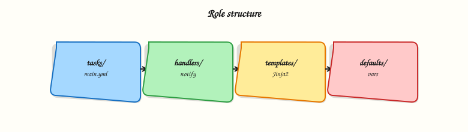

# Ansible Roles

## Overview

Copy-pasted task blocks drift across teams. **Roles** package automation into a standard directory layout with a clear variable contract — defaults for overridable values, tasks for work, handlers for service restarts, templates and files for content, and meta for dependencies. Application playbooks stay thin: they set variables and list roles.

Roles are how platform engineering teams ship baselines (time sync, logging agents, hardening) and how product teams consume them without reading hundreds of YAML lines. Understanding role precedence (`defaults` vs `vars`) prevents surprise overrides in production inventories.

This is **Tutorial 8** in **Module 8: Roles** of the REBASH Academy **Ansible for Cloud & DevOps Engineers** series — written for DevOps engineers, cloud engineers, and platform engineers. You will build a `common` role on disk, invoke it from a playbook, and prove success with syntax-check and run output.

## Prerequisites

- [Conditionals and Loops](ansible-conditionals-and-loops.md) (Module 7)
- Ansible Core 2.16+ installed
- Completed at least one playbook lab on `localhost`

## Learning Objectives

By the end of this tutorial, you will be able to:

- [ ] Describe the standard role directory layout and purpose of each folder
- [ ] Set overridable values in `defaults/main.yml` vs internal constants in `vars/main.yml`
- [ ] Wire handlers, templates, and static files into role tasks
- [ ] Call a role from a playbook and validate with `--syntax-check`
- [ ] Explain role dependencies declared in `meta/main.yml`

## Architecture

A playbook imports roles; Ansible merges variables, runs role tasks in order, and notifies handlers when tasks report `changed`.



## Theory

### What it is

A **role** is a directory named after the role (for example `roles/common/`) with conventional subdirectories:

| Path | Purpose |
|------|---------|
| `defaults/main.yml` | Low-precedence default variables callers override |
| `vars/main.yml` | Higher-precedence internal variables |
| `tasks/main.yml` | Entry task list (can `import_tasks` / `include_tasks` other files) |
| `handlers/main.yml` | Notified tasks (often service restarts) |
| `templates/` | Jinja2 templates (`.j2`) deployed with `template` module |
| `files/` | Static files deployed with `copy` module |
| `meta/main.yml` | Role metadata, dependencies (`dependencies:`), Galaxy tags |
| `README.md` | Contract documentation for consumers |

Roles load from `roles/` adjacent to the playbook or from configured `roles_path`. Collections may ship roles under `namespace.collection.role`.

### Why it matters

Roles encode reviewed patterns once: naming, tags, secure defaults. Playbooks express intent (`roles: [common]`) instead of implementation. Code review focuses on variable contracts and handler behaviour. Version roles in Git tags or collections for reproducible fleet rollouts.

### How it works

1. Playbook lists `roles:` or `tasks: ansible.builtin.include_role:`.
2. Ansible merges variables (inventory > play vars > role vars > role defaults).
3. `tasks/main.yml` runs; `notify` queues handlers until the play’s task section completes.
4. `meta/main.yml` dependencies run first (unless `allow_duplicates` set).


```yaml
# site.yml
- hosts: localhost
  connection: local
  roles:
    - role: common
      vars:
        common_banner: "Lab host"
```


### Key concepts and comparisons

| Location | Precedence (simplified) | Typical content |
|----------|-------------------------|-----------------|
| `defaults/main.yml` | Low | Port numbers, feature toggles |
| `vars/main.yml` | Higher inside role | Paths, package names fixed by role |
| Play `vars:` | Overrides defaults | Environment-specific |
| `group_vars` / `host_vars` | Inventory layer | Fleet-wide settings |

| Pattern | Prefer when |
|---------|-------------|
| Role per concern (`common`, `nginx`, `postgres`) | Clear ownership and reuse |
| `include_role` in tasks | Conditional role application |
| Static `roles:` list | Baseline always applied |

### Common pitfalls

- Putting secrets in `defaults/` — they are easy to override accidentally; use Vault for secrets.
- Mega-roles with unrelated tasks — hard to test and review.
- Missing handler `listen` names — typos silently skip restarts.
- Relative paths outside the role — use `role_path` or module `src` relative to `files/` / `templates/`.
- Forgetting `meta/main.yml` Galaxy metadata when publishing.

## Hands-on Lab

### Objective

Create a `common` role with defaults, tasks, handlers, a template, and a static file; run a playbook that applies the role on localhost with syntax-check and run evidence.

### Prerequisites

- Ansible installed
- Lab directory writable under `$HOME`

### Lab environment

```bash
mkdir -p ~/rebash-ansible/module-08/{playbooks,roles/common/{defaults,vars,tasks,handlers,templates,files,meta}}
cd ~/rebash-ansible/module-08
```

Runtime: local control node; `connection: local`.

### Real-world scenario

Every server in your organisation receives a standard banner file and a marker file proving baseline Ansible ran. The platform team ships this as the `common` role; application playbooks only include the role name.

### Step-by-step tasks

#### Task 1 – Role defaults and vars

Create `roles/common/defaults/main.yml`:

```yaml
---
common_banner: "REBASH Academy baseline"
common_marker_path: /tmp/rebash-common-applied
common_create_marker: true
```

Create `roles/common/vars/main.yml`:

```yaml
---
common_role_version: "1.0.0"
```

#### Task 2 – Tasks, handler, template, and file

Create `roles/common/files/baseline.txt`:

```text
Common role static file — do not edit on host.
```

Create `roles/common/templates/motd.j2`:


```jinja2
# {{ common_banner }}
# Applied by common role v{{ common_role_version }}
# Host: {{ ansible_hostname | default(inventory_hostname) }}
```


Create `roles/common/handlers/main.yml`:

```yaml
---
- name: common marker updated
  ansible.builtin.debug:
    msg: "Handler ran — baseline marker changed"
```

Create `roles/common/tasks/main.yml`:


```yaml
---
- name: Deploy static baseline file
  ansible.builtin.copy:
    src: baseline.txt
    dest: /tmp/rebash-baseline.txt
    mode: "0644"

- name: Deploy motd template
  ansible.builtin.template:
    src: motd.j2
    dest: /tmp/rebash-motd.txt
    mode: "0644"

- name: Create baseline marker
  ansible.builtin.file:
    path: "{{ common_marker_path }}"
    state: touch
    mode: "0644"
  when: common_create_marker | bool
  notify: common marker updated
```


Create `roles/common/meta/main.yml`:

```yaml
---
galaxy_info:
  author: rebash
  description: Common baseline role for lab
  license: MIT
  min_ansible_version: "2.16"
  platforms:
    - name: Ubuntu
      versions:
        - jammy
        - noble
dependencies: []
```

#### Task 3 – Playbook that includes the role

Create `playbooks/site.yml`:


```yaml
---
- name: Apply common role
  hosts: localhost
  connection: local
  gather_facts: true
  roles:
    - role: common
      vars:
        common_banner: "Module 08 lab host"
```


Syntax-check and run:

```bash
cd ~/rebash-ansible/module-08
ansible-playbook playbooks/site.yml --syntax-check | tee syntax-check.txt
ansible-playbook playbooks/site.yml | tee run-site.txt
test -f /tmp/rebash-motd.txt
grep -q 'Module 08 lab host' /tmp/rebash-motd.txt
grep -q 'PLAY RECAP' run-site.txt
```

**Expected output:** Syntax check passes; `/tmp/rebash-motd.txt` contains `Module 08 lab host`; recap shows success.

#### Task 4 – Prove idempotency and handler behaviour

```bash
cd ~/rebash-ansible/module-08
ansible-playbook playbooks/site.yml | tee run-idempotent.txt
grep -E 'changed=0|changed=1' run-idempotent.txt | tee changed-summary.txt
test -f /tmp/rebash-common-applied
```

**Expected output:** Second run reports few or zero changes; marker file exists.

### Validation steps

- [ ] Role tree matches standard layout under `roles/common/`
- [ ] `--syntax-check` passes
- [ ] Template rendered to `/tmp/rebash-motd.txt` with custom banner var
- [ ] Static file copied to `/tmp/rebash-baseline.txt`
- [ ] Can explain defaults vs vars precedence

### Common errors and fixes

| Error | Cause | Fix |
|-------|-------|-----|
| `role 'common' not found` | Wrong `roles_path` or cwd | Run playbook from `module-08`; role under `roles/common` |
| Template not found | File not in `templates/` | Place `motd.j2` in `roles/common/templates/` |
| Handler never runs | Task not `changed` on second run | First run must change marker; use `force: true` only in lab |
| Variable undefined | Typo in var name | Match `common_banner` in defaults and playbook |
| Permission denied on `/tmp` | Unusual permissions | Use paths under lab dir if needed |

### Challenge exercise

Add `roles/common/tasks/assert.yml` and `import_tasks: assert.yml` at the end of `main.yml` to assert `/tmp/rebash-motd.txt` contains the banner string using `ansible.builtin.assert`. Re-run the playbook and capture success output.

### Learning outcomes

- Built a multi-directory role with defaults, vars, tasks, handlers, template, and file
- Consumed the role from a thin playbook with override variables
- Validated with syntax-check, file content grep, and idempotent re-run

### Cleanup

```bash
rm -f /tmp/rebash-motd.txt /tmp/rebash-baseline.txt /tmp/rebash-common-applied
# Keep ~/rebash-ansible/module-08 for portfolio review
```

## Validation

- [ ] Lab completed under `~/rebash-ansible/module-08`
- [ ] Can draw role layout from memory
- [ ] Used `--syntax-check` before run
- [ ] Can name one production failure mode (variable precedence surprise)

## Code Walkthrough

1. **Defaults first** — expose every caller-tunable value in `defaults/main.yml`.
2. **One entry** — keep `tasks/main.yml` as the readable index; split large roles by concern file.
3. **Handlers idempotent** — handlers must tolerate re-run; use service modules with `state: restarted`.
4. **Meta dependencies** — declare role order in `meta/main.yml`, not hidden imports in tasks.
5. **Document contract** — README lists variables, tags, and example playbook snippet.

## Security Considerations

- Do not store credentials in role defaults committed to Git — use Ansible Vault.
- Templates rendering user input need escaping — understand Jinja autoescape limits for your content type.
- `copy`/`template` file modes matter — avoid world-writable config (`0666`).
- Role dependencies pull external code — pin collection and role versions.
- Review handler side effects (restarts) for availability impact during rolling updates.

## Common Mistakes

!!! warning "Everything in vars/main.yml"
    Callers cannot override internal `vars` easily. **Fix:** move tunables to `defaults/`.

!!! warning "Flat playbooks instead of roles"
    Teams duplicate 200-line plays. **Fix:** extract when a pattern repeats twice.

!!! warning "Wrong notify name"
    Handler name must match exactly (case-sensitive). **Fix:** use consistent naming; test with deliberate change.

!!! warning "Roles path confusion in monorepos"
    Playbook in `playbooks/` may not see `roles/` unless configured. **Fix:** set `roles_path` in `ansible.cfg` or use FQCN collection roles.

## Best Practices

- One role, one responsibility (`common`, `nginx`, not `everything`).
- Tag role tasks for selective runs (`tags: [common, baseline]`).
- Ship `meta/main.yml` with `min_ansible_version` and platforms.
- Version roles via Git tags or collection releases.
- Test roles with Molecule or minimal localhost playbooks in CI.

## Troubleshooting

| Symptom | Likely cause | Fix |
|---------|--------------|-----|
| Variable not applied | vars vs defaults precedence | Put override in play or use `-e` |
| Role tasks run twice | Duplicate listing + dependency | Check `meta` dependencies |
| Template renders empty | Undefined fact | `gather_facts: true` or `default` filter |
| File not found in role | Wrong module path | `copy`/`template` use filenames relative to role dirs |
| Syntax check fails on role | YAML indentation in nested file | `ansible-playbook --syntax-check -vv` |

## Summary

Roles standardise reusable automation behind a directory layout and variable contract. Defaults invite overrides; vars and inventory layers specialise behaviour. Next, deepen dynamic file generation with [Jinja2 Templates](ansible-jinja2-templates.md).

## Interview Questions

**1. What is the difference between `defaults/main.yml` and `vars/main.yml` in a role?**

??? success "Reveal answer"
    `defaults` have lower precedence — designed for values callers override in play, inventory, or `-e`. `vars` inside the role have higher precedence among role data and suit internal constants the role should not casually override. Tunables go in defaults; fixed role internals go in vars.

**2. When do handlers run?**

??? success "Reveal answer"
    Handlers run once at the end of the play’s tasks section, only if notified by a task that reported `changed` (unless `force_handlers`). Multiple notifies to the same handler dedupe to a single run. They are suited to restarts and batchable reactions, not immediate sequential logic.

**3. How do role dependencies work?**

??? success "Reveal answer"
    Listed under `dependencies` in `meta/main.yml`, dependencies execute before the role that declares them. You can pass vars into dependencies. Avoid circular dependencies; pin versions when roles come from Galaxy or collections.

**4. Why use `include_role` instead of listing under `roles:`?**

??? success "Reveal answer"
    `include_role` in tasks allows conditional application (`when`), loops, and dynamic ordering mid-play. Static `roles:` sections run in defined order at role import time — simpler for baselines always applied.

**5. Where should static binaries live — `files/` or `templates/`?**

??? success "Reveal answer"
    `files/` for byte-identical content deployed with `copy`. `templates/` for Jinja2-processed content deployed with `template`. Do not Jinja-process binaries in templates.

**6. Production scenario: a role works in dev but prod hosts skip tasks — what do you check?**

??? success "Reveal answer"
    Inventory group vars may override defaults differently; check `host_vars`/`group_vars` precedence. Tags may limit runs (`--tags`). Facts may differ (`ansible_os_family`). Run with `-vvv` on one prod host in check mode if safe.

**7. How do collection roles differ from standalone roles on disk?**

??? success "Reveal answer"
    Collection roles install under `~/.ansible/collections/...` and are referenced by FQCN (`namespace.collection.role`). Standalone roles live in `roles/` on the project tree. Both follow the same internal layout; distribution and versioning differ.

## Related Tutorials

- [Ansible course index](index.md)
- Previous: [Conditionals and Loops](ansible-conditionals-and-loops.md)
- Next: [Jinja2 Templates](ansible-jinja2-templates.md)
- Related: [Terraform Modules](../terraform/modules-creating-reusable-infrastructure.md)

## References

- [Ansible roles documentation](https://docs.ansible.com/ansible/latest/playbook_guide/playbooks_reuse_roles.html)
- [Role directory structure](https://docs.ansible.com/ansible/latest/playbook_guide/playbooks_reuse_roles.html#role-directory-structure)
- [Ansible variable precedence](https://docs.ansible.com/ansible/latest/playbook_guide/playbooks_variables.html#variable-precedence-where-should-i-put-a-variable)
- [Ansible Galaxy](https://galaxy.ansible.com/)
