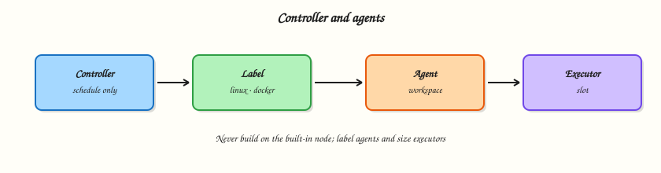

# AWX and Ansible Automation Platform

## Overview

At scale, operators stop running ad hoc `ansible-playbook` commands from laptops. **AWX** (upstream open source) and **Red Hat Ansible Automation Platform (AAP)** provide a control plane: job templates, credentials, inventories, schedules, Role-Based Access Control (RBAC), and audit logs. Playbooks stay in Git projects; the platform executes them with consistent Execution Environments.

This is **Tutorial 15** in **Module 15: Automation Platform** of the REBASH Academy **Ansible for Cloud & DevOps Engineers** series — written for Cloud, DevOps, Platform, and SRE engineers. Upstream AWX docs: [AWX documentation](https://ansible.readthedocs.io/projects/awx/en/latest/).

## Prerequisites

- [Ansible CI/CD Integration](ansible-ci-cd-integration.md)
- [Vault and Secrets](ansible-vault-and-secrets.md) (credentials concepts)
- Comfortable reading YAML and Ansible project layout

## Learning Objectives

By the end of this tutorial, you will be able to:

- [ ] Contrast **AWX** (upstream) with **Ansible Automation Platform** (enterprise support)
- [ ] Map platform objects: Projects, Inventories, Job Templates, Credentials, Schedules
- [ ] Explain RBAC boundaries for operators versus job runners
- [ ] Author machine-readable stubs describing a lab AWX topology
- [ ] Validate AWX YAML offline when a full install is impractical

## Architecture

Users and CI trigger job templates; AWX/AAP pulls project playbooks from Git, injects credentials, targets inventory groups, and records job output.



## Theory

### What it is

| Object | Purpose |
|--------|---------|
| **Project** | Links to a Git (or SVN) repo containing playbooks |
| **Inventory** | Hosts and groups (static, constructed, or from inventory plugins) |
| **Job Template** | Playbook + inventory + credential + Execution Environment + limits |
| **Credential** | SSH keys, Vault passwords, cloud API tokens — stored encrypted |
| **Schedule** | Cron-like execution of job templates |
| **Workflow Job Template** | DAG of job templates with approval nodes |
| **RBAC** | Roles on organisations, inventories, and job templates |

**AWX** is the community upstream web UI and API. **AAP** adds Red Hat support, bundled content, analytics, and enterprise integrations — the mental model for objects is the same.

### Why it matters

Centralising automation reduces snowflake laptops, enforces who can run production changes, and preserves job logs for compliance. Platform teams expose self-service job templates instead of sharing root SSH keys.

### How it works

1. Admin creates a **Project** synced from Git (`main` branch, webhook or poll).
2. **Inventory** imports hosts (static YAML, cloud inventory plugin, or constructed from EC2).
3. **Credential** holds machine login or cloud API access; assigned to job templates — not copied into playbooks.
4. **Job Template** selects playbook path (`site.yml`), inventory, credential, forks, verbosity.
5. Operator clicks **Launch** (or **Schedule** / webhook / CI calls API).
6. Controller runs the job in an **Execution Environment** container with pinned collections.

### Key concepts and comparisons

| Feature | AWX | AAP |
|---------|-----|-----|
| Cost | Open source (self-support) | Subscription |
| Support | Community | Red Hat |
| Content hub | Galaxy public | Private Automation Hub option |
| Ideal use | Labs, startups, homelab | Regulated enterprise |

### Common pitfalls

- Running production without RBAC — everyone is Organisation Admin — **Fix:** separate Admin, Auditor, Operator roles.
- Storing secrets in project Git — **Fix:** platform credentials + Ansible Vault for vars.
- Full AWX install on a laptop for a syntax lab — **Fix:** use topology stubs and upstream docs; install AWX only when you have cluster resources.
- Stale project sync — **Fix:** webhooks on Git push or short poll intervals.

## Hands-on Lab

### Objective

Create the Ansible project layout AWX would sync (`site.yml`, inventories, roles), run it locally with `ansible-playbook`, and capture evidence — simulating what a job template executes without requiring a full AWX install.

### Prerequisites

- ansible-core installed
- Python 3 with PyYAML

### Lab environment

Workspace: `~/rebash-ansible/module-15`

``` {.bash .ra-terminal title="Terminal"}
mkdir -p ~/rebash-ansible/module-15/{playbooks,inventories/staging,roles/common/{tasks,defaults}} && cd ~/rebash-ansible/module-15
```

!!! note "Full AWX install is heavy"
    Production AWX needs Kubernetes or Docker Compose, PostgreSQL, and ongoing upgrades. This lab runs the **same playbook tree** locally that AWX would execute. When ready for a real controller, follow [AWX operator install](https://ansible.readthedocs.io/projects/awx-operator/en/latest/).

### Real-world scenario

Your platform architect wants a working automation repo before the cluster team provisions AWX. You deliver playbooks, inventory, and a role that AWX will reference from a Project — and prove the site play runs end-to-end on staging inventory.

### Step-by-step tasks

#### Task 1 – Project layout and inventory

Create `inventories/staging/hosts.yml`:

```yaml title="hosts.yml"
all:
  children:
    app:
      hosts:
        localhost:
          ansible_connection: local
```

Create `ansible.cfg`:

```ini title="ansible.cfg"
[defaults]
inventory = inventories/staging/hosts.yml
roles_path = roles
host_key_checking = False
interpreter_python = auto_silent
```

Create `roles/common/defaults/main.yml`:

```yaml title="main.yml"
common_marker_path: ~/rebash-ansible/module-15/staging-marker.txt
common_banner: "AWX-ready baseline"
```

Create `roles/common/tasks/main.yml`:


```yaml
---
- name: Write staging baseline marker
  ansible.builtin.copy:
    content: "banner={{ common_banner }}\n"
    dest: "{{ common_marker_path }}"
    mode: "0644"
```


Create `playbooks/site.yml`:

```yaml title="site.yml"
---
- name: AWX job template equivalent — site play
  hosts: app
  gather_facts: false
  roles:
    - common
```

!!! example "Expected output"
    Directory tree matches AWX Project expectations.


#### Task 2 – Run site playbook (job template simulation)

``` {.bash .ra-terminal title="Terminal"}
cd ~/rebash-ansible/module-15
ansible-playbook playbooks/site.yml --syntax-check | tee syntax-check.txt
ansible-playbook playbooks/site.yml | tee site-run.txt
grep -q 'PLAY RECAP' site-run.txt
grep -q 'AWX-ready baseline' ~/rebash-ansible/module-15/staging-marker.txt
cat ~/rebash-ansible/module-15/staging-marker.txt | tee marker-proof.txt
echo "site play OK" | tee site-ok.txt
```

!!! example "Expected output"
    Play succeeds; marker file contains `AWX-ready baseline`.


#### Task 3 – Job template metadata file (for AWX import reference)

Create `awx-job-template-ref.yaml` documenting how AWX would reference this repo (not applied to a cluster):

```yaml
# Reference for AWX UI / awx.awx collection — maps to files in this lab
job_template:
  name: site-staging
  project_playbook: playbooks/site.yml
  inventory: inventories/staging/hosts.yml
  credentials:
    - machine-credential-staging
    - vault-credential-staging
  execution_environment: ee-rebash-ansible:1.0
  production_gate:
    requires_approval: true
    approver_role: production-approver
```

Verify playbook path exists:

``` {.bash .ra-terminal title="Terminal"}
cd ~/rebash-ansible/module-15
test -f playbooks/site.yml
test -f inventories/staging/hosts.yml
grep -q 'site-staging' awx-job-template-ref.yaml
echo "job template ref OK" | tee jt-ref-ok.txt
```

!!! example "Expected output"
    Reference file documents AWX mapping; all referenced paths exist on disk.


#### Task 4 – Idempotent re-run and evidence tarball

``` {.bash .ra-terminal title="Terminal"}
cd ~/rebash-ansible/module-15
ansible-playbook playbooks/site.yml | tee site-run2.txt
grep -E 'changed=0|changed=1' site-run2.txt | tail -1 | tee idempotency-line.txt
tar -czf module-15-evidence.tgz \
  playbooks/ inventories/ roles/ ansible.cfg awx-job-template-ref.yaml \
  syntax-check.txt site-run.txt marker-proof.txt site-ok.txt
ls -lh module-15-evidence.tgz | tee tarball.txt
test -s module-15-evidence.tgz
```

!!! example "Expected output"
    Second run shows minimal changes; tarball includes playbook tree and run logs.


### Validation steps

- [ ] `ansible-playbook playbooks/site.yml` succeeds on staging inventory
- [ ] Role writes marker file provable with `cat`
- [ ] Project layout matches AWX Project expectations (playbooks, inventories, roles)
- [ ] Job template reference YAML maps to existing paths
- [ ] Evidence tarball created

### Common errors and fixes

| Error | Cause | Fix |
|-------|-------|-----|
| Role not found | Wrong `roles_path` | Confirm `roles/common` beside `ansible.cfg` |
| Play targets zero hosts | Wrong inventory group | Use `hosts: app` matching `inventories/staging/hosts.yml` |
| Marker path wrong | Tilde expansion in dest | Use full path under lab dir if needed |
| Real AWX sync fails | SCM credential or branch wrong | Test Git access from controller; verify project update logs |
| Job cannot decrypt Vault | Vault credential not attached | Add vault credential to job template |

### Challenge exercise

Add `inventories/production/hosts.yml` with a different host entry and a `--check` run of `site.yml` against prod inventory; capture output showing which hosts would change without applying to a real prod server.

### Learning outcomes

- Built AWX-ready project layout with working playbooks and roles
- Executed site play locally — same artefact a job template would run
- Documented job template mapping for platform review
- Observed idempotent re-run behaviour

### Cleanup

``` {.bash .ra-terminal title="Terminal"}
rm -f ~/rebash-ansible/module-15/staging-marker.txt ~/rebash-ansible/module-15/module-15-evidence.tgz
```

## Validation

- [ ] Topology stubs validate offline
- [ ] You can name five AWX/AAP objects and their relationships
- [ ] You know where to read official AWX install docs

## Code Walkthrough

The stubs use a fictional `apiVersion: rebash.academy/v1` so learners can schema-check locally without an AWX API. In real AWX/AAP you create the same relationships through UI, REST API, or `awx.awx` Ansible collection modules / Terraform provider resources. The production job template’s `requires_approval` flag models change control — staging runs freely; production needs a human approver role.

## Security Considerations

- Never store SSH private keys or Vault passwords in Git — use platform credentials
- Scope RBAC so operators can launch staging but not edit production inventories
- Enable job isolation with Execution Environments to pin collection versions
- Retain job logs for audit; restrict log access containing sensitive stdout
- Use HTTPS and SSO for the AWX/AAP web interface in production

## Common Mistakes

!!! warning "Organisation Admin for every user"
    **Fix:** grant least privilege — launch on specific job templates, audit read-only elsewhere.

!!! warning "Manual project sync drift"
    **Fix:** webhook-driven project updates on Git push.

!!! warning "Installing AWX for a YAML syntax exercise"
    **Fix:** use topology stubs in CI; reserve full install for dedicated platform clusters.

## Best Practices

- One Git repo layout per project; tag releases for reproducible job runs
- Separate inventories per environment with explicit RBAC
- Pin Execution Environment images; rebuild when `requirements.yml` changes
- Use schedules for baseline compliance; use workflows for multi-step promotions
- Document job template purpose and rollback path in template descriptions

## Troubleshooting

| Symptom | Likely cause | Fix |
|---------|--------------|-----|
| Project update failed | SCM auth or branch rename | Re-enter credential; test `git ls-remote` from controller |
| Job template missing playbook | Sync lag or wrong playbook path | Manual project sync; verify path relative to project root |
| Permission denied on launch | RBAC role missing | Assign launch role on job template to user team |
| Vault decrypt failed in job | Credential not linked | Attach vault credential to template |
| EE pull errors | Registry auth or missing tag | Verify `ee-rebash-ansible:1.0` exists in registry |

## Summary

AWX and AAP centralise Ansible execution with projects, inventories, credentials, job templates, schedules, and RBAC. Full install is heavy — start with topology stubs and upstream docs, then promote to a managed controller when your organisation needs audit and self-service at scale.

## Interview Questions

**1. What is the difference between AWX and Ansible Automation Platform?**

??? success "Reveal answer"
    AWX is the upstream open-source automation controller. AAP is Red Hat’s supported enterprise product with subscription support, bundled content options, and additional integrations. Core objects (projects, inventories, job templates) behave similarly.

**2. What is a job template?**

??? success "Reveal answer"
    A reusable definition binding a playbook, inventory, credentials, Execution Environment, and runtime options (forks, limits, verbosity). Operators launch it without re-specifying those inputs each time.

**3. Where should SSH keys live in a platform-managed model?**

??? success "Reveal answer"
    In AWX/AAP **Credentials**, encrypted at rest and injected at job runtime — not in Git playbooks or inventory files.

**4. How do schedules differ from CI webhooks?**

??? success "Reveal answer"
    Schedules are cron-like timers inside the controller for recurring compliance or drift jobs. CI webhooks trigger validation or deploy pipelines on Git events — complementary, not identical.

**5. Why use Execution Environments with AWX?**

??? success "Reveal answer"
    They bundle ansible-core, Python deps, and collections into immutable container images so every job uses the same toolchain — avoiding “works on my laptop” drift.

**6. How would you protect production job templates?**

??? success "Reveal answer"
    RBAC limiting launch to approved roles, workflow approval nodes, separate production inventory, credentials scoped to production hosts, and audit logging of who launched which job.

## Related Tutorials

- [Ansible CI/CD Integration](ansible-ci-cd-integration.md)
- [Production Ansible Practices](production-ansible-practices.md)
- [Vault and Secrets](ansible-vault-and-secrets.md)

## References

- [AWX documentation](https://ansible.readthedocs.io/projects/awx/en/latest/)
- [AWX operator install guide](https://ansible.readthedocs.io/projects/awx-operator/en/latest/)
- [Red Hat Ansible Automation Platform](https://www.redhat.com/en/technologies/management/ansible)
- [Ansible Execution Environments](https://docs.ansible.com/ansible/latest/user_guide/execution_environments.html)
