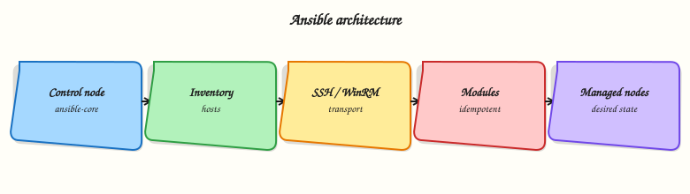

# Introduction to Configuration Management and Ansible

## Overview

Servers drift when configuration lives only in memory, sticky notes, or one engineer’s laptop. **Configuration management (CM)** treats machine state — packages, files, services, users — as **desired state** you declare in version-controlled files and apply repeatably. That is the same discipline as **Infrastructure as Code (IaC)**, but focused on what runs *inside* hosts after they exist.

**Ansible** is an agentless automation engine. A **control node** (your laptop, a CI runner, or Automation Controller) reads an **inventory** of hosts, connects over **SSH** (Linux) or **WinRM** (Windows), runs **modules** that encode idempotent operations, and returns structured results. No permanent agent daemon is required on managed nodes — only Python and a login path.

This is **Tutorial 1** in **Module 1: Configuration Management Fundamentals** of the REBASH Academy **Ansible for Cloud & DevOps Engineers** series — written for Linux administrators, DevOps engineers, Platform engineers, and Site Reliability Engineering (SRE) teams. By the end you will explain why Ansible fits agentless fleets, sketch the architecture, and prove a localhost `ping` with `connection=local`.

## Prerequisites

- [Linux](../linux/index.md) — comfortable terminal, files, and SSH concepts
- [Git](../git/index.md) — commits and pull requests (automation lives in repos)
- [Python](../python/index.md) — Ansible is Python-based on the control node
- A practice VM or laptop with Python 3.9+ (Ubuntu 22.04/24.04 recommended)

## Learning Objectives

By the end of this tutorial, you will be able to:

- [ ] Define configuration management and contrast it with ad-hoc shell scripts
- [ ] Explain Ansible’s agentless model and the control-node → inventory → module flow
- [ ] Name when Ansible is a strong fit versus imperative tools or image-only workflows
- [ ] Capture architecture facts in YAML and validate the file
- [ ] Run `ansible localhost -m ping` with `ansible_connection=local` and interpret success

## Architecture

Ansible separates *what you want* (playbooks, roles, inventory) from *how modules apply it* on each host. The control node orchestrates; managed nodes execute module code transiently.



## Theory

### What it is

**Configuration management** keeps systems aligned to a declared desired state: users exist, packages are installed, config files match templates, services are enabled. When someone edits a file by hand, the next CM run should detect drift and correct it (or fail loudly in check mode).

**Ansible** implements CM (and broader automation — app deploy, networking, cloud APIs via collections) through:

| Component | Role |
|-----------|------|
| Control node | Runs `ansible` / `ansible-playbook`; holds playbooks and inventory |
| Inventory | List of hosts and groups (`web`, `db`, `staging`) |
| Playbook | YAML document describing plays, tasks, handlers |
| Module | Unit of work (`copy`, `service`, `apt`, `user`) — idempotent when possible |
| Facts | Variables Ansible gathers about each host (`ansible_os_family`, IP addresses) |
| Connection plugin | How to reach hosts — usually SSH; `local` for localhost labs |

Ansible is **agentless**: it pushes modules over the existing management channel (SSH). Managed nodes need Python (usually preinstalled on Linux) and privilege escalation (`sudo`) where tasks require root.

### Why it matters

Click-ops and one-off scripts do not scale across hundreds of VMs, Kubernetes nodes, or network appliances. Teams choose Ansible because:

- **Readable YAML** lowers the bar for review in pull requests
- **Agentless** reduces operational overhead — no daemon to patch on every server
- **Batteries included** — hundreds of modules for Linux, cloud, network, and Windows
- **Composable** — ad-hoc commands for debugging; playbooks for production; roles and collections for reuse
- **Auditable** — Git history shows who changed automation and when

Platform teams use Ansible for baseline hardening, application deployment, day-2 patching workflows, and glue between Terraform-provisioned infrastructure and running services. It complements IaC: Terraform creates the VPC and VM; Ansible configures the OS and app.

### How it works

Mental model: **inventory + playbook → control node → connection → module on target → result JSON**.

1. You define hosts in inventory (INI, YAML, or dynamic plugins for AWS, Azure, etc.).
2. A play targets a group and lists tasks (each calling a module with parameters).
3. Ansible connects (SSH by default; `local` for localhost).
4. Ansible copies module code, runs it, collects **changed/ok/failed** status, and optionally gathers facts.
5. Handlers run once at the end if notified (e.g. restart nginx after config change).

```bash
# Ad-hoc connectivity check (after install — Module 2)
ansible localhost -m ping -c local
```

For remote hosts you need SSH keys or passwords, `ansible_user`, and often `ansible_become: true` for privilege escalation.

### Key concepts and comparisons

| Approach | You specify | Trade-off |
|----------|-------------|-----------|
| Shell scripts | Ordered commands | Fast to write; often not idempotent; hard to test |
| Imperative CM (some legacy tools) | Steps with state on agent | Agent lifecycle overhead |
| Ansible (declarative tasks) | Desired state per module | Requires module discipline; YAML sprawl without roles |

| Ansible strength | Limitation |
|------------------|------------|
| Agentless SSH automation | Needs reliable SSH/WinRM and Python on targets |
| Large module/collection ecosystem | Complex orchestration may need Controller/AWX |
| Great for config + app deploy | Not a container orchestrator (use Kubernetes for that) |
| Idempotent modules | `shell`/`command` bypass idempotency if misused |

**Ansible Core** vs **ansible** package: **ansible-core** is the minimal engine maintained by the Ansible project; the **`ansible`** PyPI package bundles ansible-core plus many **collections**. Production teams often pin **ansible-core** and install only the collections they need.

### Common pitfalls

- Treating Ansible as “remote bash” — prefer modules over `shell` unless no module exists.
- Running playbooks without inventory discipline — hostnames and groups should match your CMDB or cloud tags.
- Ignoring idempotency — a task that always reports `changed` erodes trust in automation.
- Skipping version pins — module behaviour and collection APIs evolve; pin in CI and execution environments.
- Forgetting **check mode** (`--check`) before wide production runs — dry-run is not perfect but catches many mistakes.

## Hands-on Lab

### Objective

Create inventory and a baseline playbook under `~/rebash-ansible/module-01`, apply it with `ansible-playbook` on localhost, prove files exist with `cat`/`ls`, fix a broken inventory group, and clean up.

### Prerequisites

- Python 3.9+ on your control node
- If `ansible` is not installed yet: `python3 -m pip install --user ansible-core` (see [Ansible installation guide](https://docs.ansible.com/projects/ansible/latest/installation_guide/intro_installation.html))

### Lab environment

Workspace: `~/rebash-ansible/module-01`

```bash
mkdir -p ~/rebash-ansible/module-01/{files,group_vars} && cd ~/rebash-ansible/module-01
```

Runtime: **localhost** with `ansible_connection=local` — no remote VM required.

### Real-world scenario

You join a platform team onboarding Ansible. Before any production SSH, the lead wants proof that your control node can run a playbook end-to-end: inventory resolves, modules create files under the lab directory, and a wrong group name is caught before a fleet run.

### Step-by-step tasks

#### Task 1 – Inventory, config, and baseline playbook

Create `ansible.cfg`:

```ini
[defaults]
inventory = ./inventory.ini
host_key_checking = False
interpreter_python = auto_silent
```

Create `inventory.ini`:

```ini
[local]
localhost ansible_connection=local
```

Create `group_vars/local.yml`:

```yaml
lab_module: module-01
app_name: rebash-cm-lab
```

Create `files/baseline.conf`:

```
app_name=rebash-cm-lab
managed_by=ansible
```

Create `baseline.yml`:


```yaml
---
- name: Module 01 baseline on localhost
  hosts: local
  gather_facts: false
  vars:
    lab_root: "~/rebash-ansible/module-01/lab"
  tasks:
    - name: Ensure lab directory exists
      ansible.builtin.file:
        path: "{{ lab_root }}"
        state: directory
        mode: "0755"

    - name: Deploy baseline configuration
      ansible.builtin.copy:
        src: files/baseline.conf
        dest: "{{ lab_root }}/baseline.conf"
        mode: "0644"

    - name: Write onboarding marker
      ansible.builtin.copy:
        content: "module={{ lab_module }} app={{ app_name }}\n"
        dest: "{{ lab_root }}/onboarding.txt"
        mode: "0644"
```


Syntax-check and apply:

```bash
cd ~/rebash-ansible/module-01
ansible-playbook baseline.yml --syntax-check | tee syntax-check.txt
ansible-playbook baseline.yml | tee playbook-run.txt
grep -q 'PLAY RECAP' playbook-run.txt
test -f ~/rebash-ansible/module-01/lab/baseline.conf
grep -q rebash-cm-lab ~/rebash-ansible/module-01/lab/baseline.conf
cat ~/rebash-ansible/module-01/lab/onboarding.txt | tee onboarding-proof.txt
```

**Expected output:** Play recap success; `baseline.conf` and `onboarding.txt` exist; `onboarding-proof.txt` shows `module=module-01`.

#### Task 2 – Prove connectivity and inventory merge

```bash
cd ~/rebash-ansible/module-01
ansible -i inventory.ini local -m ping | tee ping-local.txt
ansible-inventory -i inventory.ini --host localhost | tee host-localhost.json
grep -q '"ping": "pong"' ping-local.txt
grep -q lab_module host-localhost.json
echo "inventory and ping OK" | tee connectivity-ok.txt
```

**Expected output:** Ping returns `"ping": "pong"`; host vars include `lab_module`.

#### Task 3 – Diagnose and fix wrong inventory group

Create `needs-local-group.yml`:

```yaml
---
- name: Play targeting wrong group name
  hosts: labhosts
  gather_facts: false
  tasks:
    - name: Should not run when group is wrong
      ansible.builtin.debug:
        msg: "labhosts task ran"
```

Run with the broken group (inventory has `local`, not `labhosts`):

```bash
cd ~/rebash-ansible/module-01
ansible-playbook needs-local-group.yml | tee inventory-miss.txt
grep -Ei 'skipping.*no hosts matched|0 hosts' inventory-miss.txt
```

Fix the play — edit `needs-local-group.yml` and change `hosts: labhosts` to `hosts: local`. Re-run:

```bash
cd ~/rebash-ansible/module-01
ansible-playbook needs-local-group.yml | tee inventory-hit.txt
grep -q 'labhosts task ran' inventory-hit.txt || grep -q 'PLAY RECAP' inventory-hit.txt
echo "inventory fix OK" | tee inventory-fix-ok.txt
```

**Expected output:** First run shows no matching hosts; second run completes after fixing `hosts:`.

#### Task 4 – Idempotent second apply

```bash
cd ~/rebash-ansible/module-01
ansible-playbook baseline.yml | tee playbook-run2.txt
grep -E 'changed=0|changed=1' playbook-run2.txt | tail -1 | tee idempotency-line.txt
```

**Expected output:** Second run reports zero or minimal changes when files already match desired state.

### Validation steps

- [ ] `baseline.yml` passes `--syntax-check` and creates files under `lab/`
- [ ] `cat`/`grep` prove `baseline.conf` content
- [ ] Wrong group `labhosts` produces no-host evidence before fix
- [ ] Second playbook run is idempotent
- [ ] You can explain control node vs managed node without reading notes

### Common errors and fixes

| Error | Cause | Fix |
|-------|-------|-----|
| `ansible: command not found` | Ansible not on PATH | `pipx install ansible-core` or `pip install --user ansible-core`; add `~/.local/bin` to PATH |
| `localhost \| UNREACHABLE` | Missing `ansible_connection=local` | Set in inventory for localhost |
| Play changes zero hosts | Wrong `hosts:` pattern | Run `ansible-playbook --list-hosts`; align group name with inventory |
| `ERROR! Syntax Error` | YAML indent | Spaces only; re-run `--syntax-check` |
| Files not created | Wrong `lab_root` path | Use paths under `~/rebash-ansible/module-01` |

### Challenge exercise

Add a task to `baseline.yml` that runs `ansible -m command -a "test -f {{ lab_root }}/baseline.conf"` via `ansible.builtin.command` with `changed_when: false`, re-run the playbook, and confirm the task reports `ok` without `changed`.

### Learning outcomes

- Created inventory, group_vars, and a real baseline playbook
- Applied automation with `ansible-playbook` and proved results on disk
- Diagnosed an inventory group mismatch before it could hit production
- Observed idempotent re-run behaviour

### Cleanup

```bash
cd ~/rebash-ansible/module-01
ansible-playbook -i inventory.ini -e '{"lab_root":"~/rebash-ansible/module-01/lab"}' \
  -c local localhost -m file -a "path=~/rebash-ansible/module-01/lab state=absent" 2>/dev/null || \
  rm -rf ~/rebash-ansible/module-01/lab
rm -f syntax-check.txt playbook-run*.txt ping-local.txt host-localhost.json \
  connectivity-ok.txt inventory-miss.txt inventory-hit.txt inventory-fix-ok.txt \
  onboarding-proof.txt idempotency-line.txt
```

## Validation

- [ ] Completed lab under `~/rebash-ansible/module-01` with ping evidence
- [ ] Can explain agentless CM without reading notes
- [ ] Used `ansible-inventory --list` and `ansible -m ping` with local connection
- [ ] Can name one production failure mode (e.g. SSH key rotation breaking runs)

## Code Walkthrough

1. **Inspect before automate** — inventory and facts describe reality before you change it.
2. **Prefer modules** — `ping` is trivial but follows the same result JSON pattern as `copy` or `service`.
3. **Evidence in Git** — architecture YAML and inventory belong in the repo, not Slack.
4. **Local connection for CI** — `connection=local` lets pipelines test modules without SSH secrets.
5. **Least privilege** — even in labs, document which tasks need `become` before enabling it globally.

## Security Considerations

- Store SSH private keys in secure paths (`0600`); never commit keys to Git.
- Use dedicated automation service accounts with sudo limited to required commands.
- Inventory often reveals hostnames and roles — treat repos as internal documentation classification.
- Disable host key checking only in disposable lab networks; production should verify host keys or use certificates.
- Plan for **Ansible Vault** (later modules) before storing passwords or API tokens in group_vars.

## Common Mistakes

!!! warning "Using Ansible as remote shell only"
    Running ad-hoc `command`/`shell` for everything skips idempotency and reviewable desired state.  
    **Fix:** Use modules (`copy`, `file`, `package`, `service`) and encode repeat work in playbooks.

!!! warning "No inventory structure"
    A flat list of IP addresses does not scale.  
    **Fix:** Use groups (`web`, `db`), `group_vars/`, and naming that matches your environment tiers.

!!! warning "Mixing prod and lab inventory without guards"
    One typo can target production from a laptop.  
    **Fix:** Separate inventory directories, `--limit`, and CI approval gates for production.

## Best Practices

- Pin **ansible-core** version in documentation and CI (`ansible --version` in evidence scripts).
- Keep playbooks and inventory in Git with pull request review.
- Use `ansible_connection=local` for localhost and container-based execution environments.
- Document optional SSH targets separately from lab localhost groups.
- Start with ad-hoc discovery, then promote proven commands into idempotent playbooks.

## Troubleshooting

| Symptom | Likely cause | Fix |
|---------|--------------|-----|
| `UNREACHABLE!` on real hosts | Firewall, wrong IP, SSH down | `ssh user@host` manually; verify security groups |
| `Permission denied (publickey)` | Missing or wrong SSH key | `ssh-add -l`; set `ansible_user` and `--private-key` |
| `sudo: a password is required` | Privilege escalation without `-K` or NOPASSWD | Configure `--ask-become-pass` in lab only, or sudoers for automation account |
| Slow first run | Fact gathering and SSH setup | Expected; use `gather_facts: false` in playbooks when facts are not needed |
| Wrong host targeted | Inventory typo or missing `--limit` | `ansible-inventory --graph`; always `--limit` for risky changes |

## Summary

Configuration management declares desired server state in version-controlled automation. Ansible implements it agentlessly from a control node through inventory, connection plugins, and modules — no permanent agent on targets. You captured architecture facts, defined localhost inventory, and proved connectivity with `ping`. Next, install and configure Ansible properly: **Installing Ansible and Configuration**.

## Interview Questions

**1. What is configuration management, and how does it differ from running shell scripts on servers?**

??? success "Reveal answer"
    Configuration management declares **desired state** (users, packages, files, services) in repeatable, reviewable form. Shell scripts often list imperative steps without guaranteeing idempotency or drift detection. CM tools like Ansible report whether each resource **changed**, stayed **ok**, or **failed**, so repeated runs converge safely. Scripts are fine for one-offs; CM is for fleet-wide, auditable baseline and application state.

**2. Why is Ansible called agentless?**

??? success "Reveal answer"
    Managed nodes do not run a permanent CM daemon. Ansible connects over existing management channels (typically **SSH** on Linux), pushes module code, executes it with Python, and exits. You still need Python and network access on targets, but you avoid patching, monitoring, and securing agent software on every server — a major operational win at scale.

**3. Describe the Ansible architecture from control node to module result.**

??? success "Reveal answer"
    The **control node** runs CLI tools and holds playbooks/inventory. **Inventory** maps hosts to groups and variables. For each task, Ansible uses a **connection plugin** (SSH, local, etc.) to reach the host, runs an **module** with parameters, and collects structured JSON (`changed`, `failed`, `msg`). **Facts** from the `setup` module describe host properties. **Handlers** run notified tasks once at the end of a play. The flow is declarative at the playbook level even though modules execute imperatively on the target.

**4. When would you choose Ansible over Terraform or over golden VM images only?**

??? success "Reveal answer"
    **Terraform** (and similar IaC) excels at creating cloud resources — VPCs, VMs, IAM. **Ansible** excels at configuring what runs on those resources — packages, config files, services, app deploys. **Golden images** bake state at build time; Ansible handles drift, per-environment variance, and day-2 changes without rebuilding images. Many teams use Terraform plus Ansible: provision with IaC, configure with CM. Images alone struggle when you need frequent app config changes without full image rebuilds.

**5. What is the difference between ansible-core and the ansible package on PyPI?**

??? success "Reveal answer"
    **ansible-core** is the minimal automation engine (CLI, plugin framework, built-in modules). The **`ansible`** package bundles ansible-core plus a large set of **collections** (community and supported content). Production teams often install **ansible-core** and add only required collections for reproducibility and smaller attack surface. Pin versions in CI and execution environments either way.

**6. How do you safely test Ansible against localhost before touching production?**

??? success "Reveal answer"
    Use a dedicated lab inventory with `ansible_connection=local` or `--limit` to a single test host. Run **`ansible -m ping`** and small ad-hoc module checks first. Use **`--check`** mode on playbooks for dry-runs where modules support it. Never point a laptop inventory at production groups without `--limit` and review. CI should run syntax-check and molecule/check mode against disposable targets before merge.

**7. What does idempotency mean in Ansible, and why does it matter in production?**

??? success "Reveal answer"
    **Idempotency** means running the same automation twice should leave the system in the desired state without unnecessary changes the second time. Modules like `copy`, `file`, and `service` compare current vs desired state and report `ok` when already correct. Production schedules re-run playbooks nightly or on drift detection — if tasks always show `changed`, operators lose trust and real changes hide in noise. Avoid raw `shell` when a module exists.

**8. A junior engineer says “Ansible is just YAML SSH.” How do you respond?**

??? success "Reveal answer"
    SSH is the transport; Ansible adds **inventory**, **variable precedence**, **facts**, **roles/collections**, **check mode**, **handlers**, **Vault**, and structured **callback** reporting integrated with CI and Automation Controller. YAML is the interface, but the value is idempotent modules, reviewable automation in Git, and enterprise patterns (testing with Molecule, execution environments, RBAC on Controller). Reducing it to “YAML SSH” ignores idempotency, security, and operability at fleet scale.

## Related Tutorials

- [Ansible course index](index.md)
- **Next:** [Installing Ansible and Configuration](installing-ansible-and-configuration.md)
- [Linux fundamentals](../linux/linux-fundamentals-distributions-and-architecture.md)
- [GitOps fundamentals](../git/gitops-fundamentals.md)
- [Introduction to Terraform and IaC](../terraform/introduction-to-terraform-and-iac.md)

## References

- [Ansible Documentation](https://docs.ansible.com/)
- [Ansible Core — Installation guide](https://docs.ansible.com/projects/ansible/latest/installation_guide/intro_installation.html)
- [Ansible Core — Getting started](https://docs.ansible.com/projects/ansible/latest/getting_started/index.html)
- [Ansible Core — Inventory intro](https://docs.ansible.com/projects/ansible/latest/inventory_guide/intro_inventory.html)
- [REBASH Ansible course index](index.md)
