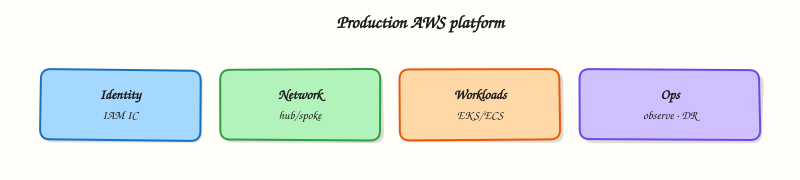

# Production Ansible Practices

## Overview

Production Ansible is boring in the best way: predictable directory layout, separated inventories, idempotent roles, Vault for secrets, CI syntax gates, and tuned performance settings (`forks`, fact caching). When every engineer clones the same repo structure, on-call can run `site.yml` against the right environment without guessing paths or passwords.

This is **Tutorial 16** in **Module 16: Production Ansible** of the REBASH Academy **Ansible for Cloud & DevOps Engineers** series — written for Cloud, DevOps, Platform, and SRE engineers. Reference: [Ansible best practices](https://docs.ansible.com/ansible/latest/user_guide/playbooks_best_practices.html).

## Prerequisites

- [AWX and Ansible Automation Platform](awx-and-ansible-automation-platform.md)
- [Ansible Roles](ansible-roles.md)
- [Vault and Secrets](ansible-vault-and-secrets.md)

## Learning Objectives

By the end of this tutorial, you will be able to:

- [ ] Structure a multi-environment Ansible repository (`inventories/dev`, `inventories/prod`)
- [ ] Configure a CI-safe `ansible.cfg` with sensible defaults
- [ ] Apply idempotency and error-handling patterns (`block`/`rescue`, `failed_when`)
- [ ] Tune performance with `forks` and fact caching
- [ ] Produce syntax-check evidence and an artefact tarball for review

## Architecture

Git stores playbooks, roles, and inventory; CI validates; operators or AWX/AAP executes against environment-specific inventory with Vault-protected vars.



## Theory

### What it is

**Production Ansible practices** combine:

| Practice | Outcome |
|----------|---------|
| Repo layout | Predictable paths for playbooks, roles, inventories |
| Environment separation | Dev/staging/prod inventories never share host groups accidentally |
| Idempotency | Second run makes zero unintended changes |
| Error handling | Failed tasks fail safe; rescue paths documented |
| Performance | `forks`, SSH pipelining, fact cache for large fleets |
| CI gates | Syntax-check and lint on every merge |

### Why it matters

Monolithic playbooks with hard-coded IPs do not survive audits or team growth. Standard layout lets new hires run staging applies on day one and gives AWX projects a stable sync root.

### How it works

Recommended layout:

```text title="Terminal"
ansible/
├── ansible.cfg
├── site.yml
├── inventories/
│   ├── dev/hosts.yml
│   └── prod/hosts.yml
├── group_vars/
│   ├── all.yml
│   └── dev/
│       └── vars.yml
├── roles/
│   └── baseline/
├── playbooks/
└── collections/requirements.yml
```

Run staging:

``` {.bash .ra-terminal title="Terminal"}
ansible-playbook -i inventories/dev site.yml
```

Production uses separate inventory, stricter `--check` gating, and Vault-encrypted `group_vars/prod/vault.yml`.

### Key concepts and comparisons

| Setting | Dev typical | Prod typical |
|---------|-------------|--------------|
| `forks` | 5–10 | 20–50 (watch control node CPU) |
| Fact cache | optional JSON file | Redis/Memcached for AWX |
| `host_key_checking` | False in labs | True with known_hosts management |
| Vault | shared lab password | per-env Vault IDs |

### Common pitfalls

- One inventory file with `prod` and `dev` hosts mixed — **Fix:** separate trees under `inventories/`.
- Disabling idempotency with reckless `command` tasks — **Fix:** prefer modules; use `changed_when` deliberately.
- Giant `site.yml` without roles — **Fix:** role-per-concern with tags.
- No `--syntax-check` in CI — **Fix:** gate merges (Module 14).

## Hands-on Lab

### Objective

Create a production-style repository layout with `inventories/dev` and `inventories/prod`, a CI-safe `ansible.cfg`, and `site.yml` that passes `ansible-playbook --syntax-check`. Package evidence in a tarball.

### Prerequisites

- Ansible 2.18+ on control node
- Python 3

### Lab environment

Workspace: `~/rebash-ansible/module-16`

``` {.bash .ra-terminal title="Terminal"}
mkdir -p ~/rebash-ansible/module-16 && cd ~/rebash-ansible/module-16
```

### Real-world scenario

Release engineering requires every Ansible repo to boot-strap with separated dev/prod inventories, a baseline role, and CI-safe defaults before platform imports the project into AWX.

### Step-by-step tasks

#### Task 1 – Create directory layout and inventories

Run:

``` {.bash .ra-terminal title="Terminal"}
cd ~/rebash-ansible/module-16
mkdir -p inventories/{dev,prod} roles/baseline/{tasks,defaults} playbooks group_vars/all
```

Create `inventories/dev/hosts.yml`:

```yaml title="hosts.yml"
all:
  children:
    app:
      hosts:
        dev-app-01:
          ansible_connection: local
```

Create `inventories/prod/hosts.yml`:

```yaml title="hosts.yml"
all:
  children:
    app:
      hosts:
        prod-app-01:
          ansible_host: 203.0.113.10
          ansible_user: deploy
```

Create `group_vars/all/common.yml`:

```yaml title="common.yml"
baseline_package: curl
environment_name: undefined
```

Create `group_vars/all/dev.yml`:

```yaml title="dev.yml"
environment_name: development
```

Create `roles/baseline/defaults/main.yml`:

```yaml title="main.yml"
baseline_package: curl
```

Create `roles/baseline/tasks/main.yml`:


```yaml
---
- name: Record environment context
  ansible.builtin.set_fact:
    rebash_env: "{{ environment_name | default('unknown') }}"

    - name: Ensure baseline package present
      ansible.builtin.package:
        name: "{{ baseline_package }}"
        state: present
      register: pkg_result

- name: Show idempotent package check result
  ansible.builtin.debug:
    msg: "env={{ rebash_env }} package_check={{ pkg_result.changed | default(false) }}"
```


!!! example "Expected output"
    Directories and files exist under the layout paths above.


#### Task 2 – Create site playbook and CI-safe ansible.cfg

Create `site.yml`:

```yaml title="site.yml"
---
- name: Apply baseline role to app tier
  hosts: app
  become: false
  gather_facts: false
  roles:
    - role: baseline
      tags: [baseline]
```

Create `ansible.cfg`:

```ini title="ansible.cfg"
[defaults]
inventory = inventories/dev/hosts.yml
roles_path = roles
host_key_checking = False
retry_files_enabled = False
deprecation_warnings = False
interpreter_python = auto_silent
forks = 10
gathering = smart
fact_caching = jsonfile
fact_caching_connection = /tmp/rebash-ansible-facts
fact_caching_timeout = 86400

[ssh_connection]
pipelining = True
```

Create `collections/requirements.yml`:

```yaml title="requirements.yml"
collections:
  - name: ansible.builtin
```

Run syntax-check against dev inventory:

``` {.bash .ra-terminal title="Terminal"}
cd ~/rebash-ansible/module-16
ansible-playbook --syntax-check -i inventories/dev site.yml | tee syntax-dev.txt
ansible-playbook --syntax-check -i inventories/prod site.yml | tee syntax-prod.txt
grep -q 'playbook: site.yml' syntax-dev.txt
grep -q 'playbook: site.yml' syntax-prod.txt
```

!!! example "Expected output"
    Both syntax checks succeed.


#### Task 3 – Demonstrate live apply on dev inventory

``` {.bash .ra-terminal title="Terminal"}
cd ~/rebash-ansible/module-16
ansible-playbook -i inventories/dev site.yml | tee apply-dev.txt
grep -q 'env=development' apply-dev.txt
grep -q 'PLAY RECAP' apply-dev.txt
echo "live apply OK" | tee apply-dev-ok.txt
```

!!! example "Expected output"
    Play completes with `env=development` in debug output; package task runs (may report `ok` if `curl` already installed).


#### Task 4 – Add error-handling example playbook

Create `playbooks/canary.yml`:

```yaml title="canary.yml"
---
- name: Canary with rescue path
  hosts: app
  gather_facts: false
  tasks:
    - name: Intentional guard task
      ansible.builtin.command:
        cmd: /bin/false
      register: canary_cmd
      failed_when: canary_cmd.rc != 0
      ignore_errors: true

    - name: Report canary outcome
      ansible.builtin.debug:
        msg: "canary failed safely; continue with manual review"
      when: canary_cmd is failed
```

Syntax-check the canary playbook:

``` {.bash .ra-terminal title="Terminal"}
cd ~/rebash-ansible/module-16
ansible-playbook --syntax-check -i inventories/dev playbooks/canary.yml | tee syntax-canary.txt
grep -q 'playbook: playbooks/canary.yml' syntax-canary.txt
```

!!! example "Expected output"
    Canary playbook passes syntax-check.


#### Task 5 – Package production evidence tarball

``` {.bash .ra-terminal title="Terminal"}
cd ~/rebash-ansible/module-16
tar -czf module-16-evidence.tgz \
  ansible.cfg site.yml inventories/ roles/ playbooks/ group_vars/ \
  collections/requirements.yml \
  syntax-dev.txt syntax-prod.txt apply-dev.txt apply-dev-ok.txt syntax-canary.txt
ls -lh module-16-evidence.tgz | tee tarball.txt
test -s module-16-evidence.tgz
```

!!! example "Expected output"
    Non-empty tarball containing layout, config, and validation logs.


### Validation steps

- [ ] Separate `inventories/dev` and `inventories/prod` exist
- [ ] `ansible.cfg` enables pipelining, forks, and JSON fact cache path
- [ ] `site.yml` syntax-check passes for both inventories
- [ ] `site.yml` apply passes for dev inventory with marker evidence
- [ ] Evidence tarball captured

### Common errors and fixes

| Error | Cause | Fix |
|-------|-------|-----|
| Role not found | `roles_path` wrong | Confirm `roles/` beside `ansible.cfg` |
| Prod syntax-check warns on host | Missing DNS for `ansible_host` | Syntax-check does not need SSH; warnings OK if inventory parses |
| Fact cache permission error | `/tmp` not writable | Change `fact_caching_connection` path |
| Wrong environment vars | `group_vars` naming | Use `group_vars/all/dev.yml` or inventory subdirs consistently |

### Challenge exercise

Add `group_vars/prod/vault.yml` encrypted with Ansible Vault containing `db_password`, and document (without committing the password) how CI supplies `ANSIBLE_VAULT_PASSWORD` for staging-only decrypt tests.

### Learning outcomes

- Clone-ready production repo skeleton
- CI-safe defaults and performance tuning starters
- Evidence tarball suitable for architecture review

### Cleanup

``` {.bash .ra-terminal title="Terminal"}
rm -rf ~/rebash-ansible/module-16 /tmp/rebash-ansible-facts
```

## Validation

- [ ] Lab completed under `~/rebash-ansible/module-16/`
- [ ] Dev and prod inventories are separate files
- [ ] Syntax-check and check-mode logs captured
- [ ] You can explain idempotency and fact caching trade-offs

## Code Walkthrough

`ansible.cfg` defaults to **dev** inventory so accidental `ansible-playbook site.yml` without `-i` targets localhost dev — a small guardrail. Production runs must pass `-i inventories/prod` explicitly (or use AWX job templates per inventory). The baseline role uses `package` in check mode to demonstrate idempotent thinking without requiring root on lab hosts. JSON fact caching speeds repeat runs against larger inventories; clear the cache directory when facts must refresh.

## Security Considerations

- Encrypt prod secrets with Ansible Vault; never commit `.vault_pass`
- Enable `host_key_checking` in production with managed `known_hosts` or SSH certificates
- Limit `become: true` to tasks that require it; default to least privilege
- Tag sensitive playbooks; restrict AWX launch permissions on prod templates
- Rotate fact cache and retry files; they can leak host metadata

## Common Mistakes

!!! warning "Running prod inventory from a developer laptop"
    **Fix:** require AWX/AAP or bastion CI deploy with break-glass auditing.

!!! warning "Setting forks too high on a small control node"
    **Fix:** benchmark; start with 10–20 and watch CPU/SSH connection limits.

!!! warning "Using shell for package install"
    **Fix:** use `ansible.builtin.package` or OS-specific modules for idempotency.

## Best Practices

- One role per concern; keep `site.yml` thin
- Document required `-i` and `--vault-id` flags in README
- Pin collections in `requirements.yml`; build Execution Environments from it
- Use tags for partial runs (`--tags baseline`)
- Keep playbooks idempotent; treat `command` as last resort

## Troubleshooting

| Symptom | Likely cause | Fix |
|---------|--------------|-----|
| Wrong hosts targeted | Default inventory in `ansible.cfg` | Pass `-i inventories/prod` explicitly |
| Slow playbook | Low forks / no pipelining | Raise `forks`; enable `[ssh_connection] pipelining` |
| Stale facts | Fact cache timeout too long | Lower timeout or flush cache directory |
| Unexpected changes | Non-idempotent command tasks | Replace with modules; add `--check` in CI |
| Vault decrypt fail | Wrong password or file | `ansible-vault view` locally; verify Vault ID |

## Summary

Production Ansible succeeds with boring structure: separated inventories, reusable roles, Vault secrets, CI syntax gates, and tuned `forks`/fact caching. Make dev the default in config but force explicit intent for production runs.

## Interview Questions

**1. How should inventories be organised for multiple environments?**

??? success "Reveal answer"
    Separate trees such as `inventories/dev` and `inventories/prod` with distinct `hosts.yml`, group_vars, and host_vars. Never mix production and development hosts in one file without strong naming guards.

**2. What does idempotency mean for Ansible?**

??? success "Reveal answer"
    Running the same playbook twice should leave the system in the desired state without unnecessary changes on the second run. Modules compare current vs desired state; imperative shell tasks often break idempotency.

**3. When would you increase forks and what is the risk?**

??? success "Reveal answer"
    Increase forks to parallelise against large fleets. Risk: exhausting control node CPU, file descriptors, or target SSHd limits — tune based on benchmarks.

**4. What is fact caching used for?**

??? success "Reveal answer"
    Stores gathered facts between runs to skip repeated setup module calls — useful for big inventories. Trade-off: stale facts if hardware or IP data changes; set reasonable timeouts.

**5. What belongs in ansible.cfg for CI?**

??? success "Reveal answer"
    Inventory path, `retry_files_enabled = False`, pinned Python interpreter, host key policy appropriate to environment, and paths to roles/collections — keep secrets out of cfg files.

**6. How do block/rescue/always help in production?**

??? success "Reveal answer"
    `block` groups related tasks; `rescue` runs on failure (notify, rollback hook); `always` runs cleanup. They make failure paths explicit instead of aborting silently mid-play.

## Related Tutorials

- [Troubleshooting Ansible](troubleshooting-ansible.md)
- [Ansible CI/CD Integration](ansible-ci-cd-integration.md)
- [AWX and Ansible Automation Platform](awx-and-ansible-automation-platform.md)

## References

- [Ansible best practices](https://docs.ansible.com/ansible/latest/user_guide/playbooks_best_practices.html)
- [Ansible configuration settings](https://docs.ansible.com/ansible/latest/reference_appendices/config.html)
- [Variable precedence](https://docs.ansible.com/ansible/latest/playbook_guide/playbooks_variables.html#variable-precedence-where-should-i-put-a-variable)
- [Ansible Vault](https://docs.ansible.com/ansible/latest/vault_guide/index.html)
