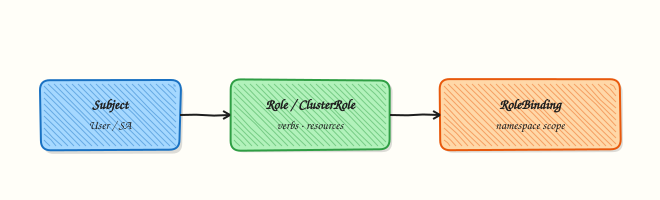

# Argo CD Security, RBAC, and SSO

## Overview

Production GitOps platforms must answer who can sync what, from which repositories, into which clusters. Argo CD layers **Role-Based Access Control (RBAC)** on top of Kubernetes RBAC: a CSV policy in the `argocd-rbac-cm` ConfigMap maps identities to actions on Applications and AppProjects. **AppProjects** fence source repos, destination clusters, and resource types. **Single Sign-On (SSO)** through **OpenID Connect (OIDC)** — often via built-in **Dex** — replaces long-lived local admin passwords for day-to-day use.

This is **Tutorial 1** in **Module 11 · Security** of the REBASH Academy **Argo CD for Cloud & DevOps Engineers** series — written for Platform, DevOps, SRE, and DevSecOps engineers who operate multi-team controllers.

## Prerequisites

- [Kubernetes RBAC](../kubernetes/rbac-and-kubernetes-security-basics.md)
- [GitOps fundamentals](../git/gitops-fundamentals.md)
- **kind** cluster with Argo CD installed ([Installing Argo CD](installing-argo-cd.md))
- `argocd` CLI logged in via port-forward
- Basic familiarity with `kubectl` and the `argocd` CLI

## Learning Objectives

By the end of this tutorial, you will be able to:

- [ ] Author a CSV RBAC policy for `argocd-rbac-cm` and explain Casbin-style rules
- [ ] Restrict repositories, destinations, and cluster resources with an AppProject
- [ ] Describe how Dex/OIDC integrates with Argo CD for SSO
- [ ] Store private Git credentials as Kubernetes Secrets referenced by Applications
- [ ] Apply RBAC and AppProject manifests and prove sync enforcement on a kind cluster

## Architecture

Argo CD security spans authentication (who you are), authorisation (what you may do), and project boundaries (where you may deploy).



## Theory

### What it is

**Argo CD RBAC** uses a CSV file mounted into `argocd-rbac-cm`. Each line grants a role permissions such as `get`, `sync`, or `update` on `applications`, `projects`, or `repositories` in a scope (`proj/*`, `proj/my-team`, or `*`). Groups from your identity provider map to roles via `policy.csv` and `policy.default` settings.

**AppProjects** are namespace-scoped CRDs that whitelist:

- **sourceRepos** — which Git/OCI URLs Applications may use
- **destinations** — cluster server + namespace pairs
- **clusterResourceWhitelist** / **namespaceResourceWhitelist** — which API kinds may be synced

**SSO** delegates login to an OIDC provider (Google, Azure AD, Okta, GitHub). Dex ships with Argo CD as a broker; you configure `argocd-cm` with `oidc.config` or `dex.config`.

**Repository credentials** live in Secrets labelled `argocd.argoproj.io/secret-type: repository` (or `repo-creds` for credential templates). The repo server uses them for private Git or Helm repos — never commit tokens to Application manifests.

### Why it matters

A shared `default` project with cluster-admin-equivalent sync rights lets any developer deploy cluster-scoped resources from any Git URL. Regulated teams need least privilege: platform admins manage projects; product teams sync only their apps into approved namespaces. SSO with group claims ties GitOps permissions to corporate identity and enables quick offboarding.

### How it works

1. User authenticates via local account, SSO, or CLI token.
2. Argo CD evaluates CSV policy: role → action → object → effect (`allow`/`deny`).
3. Application sync checks AppProject rules before the controller applies manifests.
4. Repo server fetches Git using credentials from referenced Secrets.

### Key concepts and comparisons

| Layer | Controls |
|-------|----------|
| Kubernetes RBAC | Who can CRUD Argo CD CRDs in `argocd` namespace |
| Argo CD RBAC | Who can sync/get/update Applications via UI/CLI/API |
| AppProject | Which repos, clusters, and resource types an Application may use |

| Auth mode | When to use |
|-----------|-------------|
| Local admin | Break-glass only; rotate initial password immediately |
| OIDC/SSO | Day-to-day human access with group mapping |
| Project-scoped tokens | CI automation with minimal Application rights |

### Common pitfalls

- Leaving `policy.default: role:admin` in production.
- AppProject `sourceRepos: ['*']` while claiming “restricted” projects.
- Storing Git PATs in plain `Application` spec instead of repository Secrets.
- Forgetting that Argo CD RBAC is separate from Kubernetes RBAC — both must align.

## Hands-on Lab

### Objective

Apply a restricted AppProject and RBAC ConfigMap on a **kind** cluster, sync an allowed Application into `rebash-argocd-m11`, then diagnose and fix a sync blocked by an out-of-scope repository URL.

### Prerequisites

- **kind** cluster with Argo CD installed ([Installing Argo CD](installing-argo-cd.md))
- `kubectl` cluster-admin and `argocd` CLI logged in (`kubectl port-forward svc/argocd-server -n argocd 8080:443`)
- Public internet for `argocd-example-apps` (repo-server fetches Git)

### Lab environment

Runtime: **kind** cluster with Argo CD control plane — client dry-run alone is not sufficient for this lab.

``` {.bash .ra-terminal title="Terminal"}
kind create cluster --name rebash-argocd 2>/dev/null || true
export KUBECONFIG="$(kind get kubeconfig --name rebash-argocd)"
mkdir -p ~/rebash-argocd/module-11/{rbac,projects,apps} && cd ~/rebash-argocd/module-11
kubectl get pods -n argocd | grep -E 'server|application-controller' | tee argocd-pods-m11.txt
```

### Real-world scenario

Your platform team onboarded Team Alpha. They may sync only from approved GitHub repos into namespace `rebash-argocd-m11`. A squad member opens a ticket: their Application shows `InvalidSpecError` after pointing at the wrong repo. You apply RBAC defaults, create the AppProject fence, prove a valid sync, reproduce the rejection, and fix the manifest.

### Step-by-step tasks

#### Task 1 – Apply RBAC ConfigMap with safe default

Create `rbac/argocd-rbac-cm-patch.yaml`:

```yaml title="argocd-rbac-cm-patch.yaml"
apiVersion: v1
kind: ConfigMap
metadata:
  name: argocd-rbac-cm
  namespace: argocd
  labels:
    app.kubernetes.io/part-of: argocd
data:
  policy.csv: |
    p, role:platform-admin, applications, *, */*, allow
    p, role:platform-admin, projects, *, *, allow
    p, role:platform-admin, repositories, *, *, allow
    p, role:team-alpha, applications, get, team-alpha/*, allow
    p, role:team-alpha, applications, sync, team-alpha/*, allow
    p, role:team-alpha, applications, update, team-alpha/*, allow
    p, role:team-alpha, applications, override, team-alpha/*, deny
    g, team-alpha, role:team-alpha
  policy.default: role:readonly
  scopes: '[groups, email]'
```

Apply and verify the default role:

``` {.bash .ra-terminal title="Terminal"}
cd ~/rebash-argocd/module-11
kubectl apply -f rbac/argocd-rbac-cm-patch.yaml | tee rbac-apply-m11.txt
kubectl -n argocd get configmap argocd-rbac-cm \
  -o jsonpath='{.data.policy\.default}{"\n"}' | tee policy-default-m11.txt
grep -q 'readonly' policy-default-m11.txt
```

!!! example "Expected output"
    ConfigMap applied; `policy.default` is `role:readonly`.


#### Task 2 – Create and apply restricted AppProject

Create `projects/team-alpha-project.yaml`:

```yaml title="team-alpha-project.yaml"
apiVersion: argoproj.io/v1alpha1
kind: AppProject
metadata:
  name: team-alpha
  namespace: argocd
  labels:
    app.kubernetes.io/part-of: rebash-argocd-lab
spec:
  description: Team Alpha — lab namespace only
  sourceRepos:
    - https://github.com/argoproj/argocd-example-apps.git
    - https://github.com/argoproj/argocd-example-apps
  destinations:
    - namespace: rebash-argocd-m11
      server: https://kubernetes.default.svc
  namespaceResourceWhitelist:
    - group: apps
      kind: Deployment
    - group: ""
      kind: Service
    - group: ""
      kind: ConfigMap
  clusterResourceWhitelist: []
  roles:
    - name: developer
      description: Sync team-alpha apps
      policies:
        - p, proj:team-alpha:developer, applications, get, team-alpha/*, allow
        - p, proj:team-alpha:developer, applications, sync, team-alpha/*, allow
      groups:
        - team-alpha
```

Apply and verify destination fence:

``` {.bash .ra-terminal title="Terminal"}
cd ~/rebash-argocd/module-11
kubectl apply -f projects/team-alpha-project.yaml | tee project-apply-m11.txt
kubectl get appproject team-alpha -n argocd \
  -o jsonpath='{.spec.destinations[0].namespace}{"\n"}' | tee project-ns-m11.txt
grep -q 'rebash-argocd-m11' project-ns-m11.txt
```

!!! example "Expected output"
    AppProject `team-alpha` exists; destination namespace is `rebash-argocd-m11`.


#### Task 3 – Sync allowed Application and prove health

Create `apps/team-alpha-guestbook.yaml`:

```yaml title="team-alpha-guestbook.yaml"
apiVersion: argoproj.io/v1alpha1
kind: Application
metadata:
  name: team-alpha-guestbook
  namespace: argocd
spec:
  project: team-alpha
  source:
    repoURL: https://github.com/argoproj/argocd-example-apps.git
    targetRevision: HEAD
    path: guestbook
  destination:
    server: https://kubernetes.default.svc
    namespace: rebash-argocd-m11
  syncPolicy:
    automated:
      prune: true
      selfHeal: true
    syncOptions:
      - CreateNamespace=true
```

Apply and wait for sync:

``` {.bash .ra-terminal title="Terminal"}
cd ~/rebash-argocd/module-11
kubectl apply -f apps/team-alpha-guestbook.yaml | tee app-apply-m11.txt
kubectl wait --for=jsonpath='{.status.sync.status}'=Synced \
  application/team-alpha-guestbook -n argocd --timeout=300s | tee wait-synced-m11.txt
kubectl get application team-alpha-guestbook -n argocd \
  -o jsonpath='Sync={.status.sync.status} Health={.status.health.status}{"\n"}' \
  | tee sync-health-m11.txt
kubectl get deploy,svc -n rebash-argocd-m11 | tee workloads-m11.txt
grep -q 'Synced' sync-health-m11.txt
```

!!! example "Expected output"
    Application Synced and Healthy; guestbook Deployment and Service run in `rebash-argocd-m11`.


#### Task 4 – Diagnose AppProject rejection and fix

Create `apps/team-alpha-bad-repo.yaml` with a repo URL **not** in `sourceRepos`:

```yaml
apiVersion: argoproj.io/v1alpha1
kind: Application
metadata:
  name: team-alpha-bad-repo
  namespace: argocd
spec:
  project: team-alpha
  source:
    repoURL: https://github.com/argoproj/argo-cd.git
    targetRevision: HEAD
    path: manifests
  destination:
    server: https://kubernetes.default.svc
    namespace: rebash-argocd-m11
```

Apply and capture the rejection:

``` {.bash .ra-terminal title="Terminal"}
cd ~/rebash-argocd/module-11
kubectl apply -f apps/team-alpha-bad-repo.yaml | tee bad-app-apply-m11.txt
sleep 5
kubectl get application team-alpha-bad-repo -n argocd \
  -o jsonpath='{.status.conditions[*].message}{"\n"}' | tee bad-app-error-m11.txt
grep -Ei 'repository|source|not allowed|permission' bad-app-error-m11.txt
kubectl delete -f apps/team-alpha-bad-repo.yaml --ignore-not-found
```

Document repository credential pattern (template only — never apply with real tokens):

Create `projects/repo-credential-secret.example.yaml`:

```yaml title="repo-credential-secret.example.yaml"
apiVersion: v1
kind: Secret
metadata:
  name: team-alpha-git
  namespace: argocd
  labels:
    argocd.argoproj.io/secret-type: repository
  annotations:
    rebash.academy/warning: "Template only — inject PAT from vault at deploy time"
type: Opaque
stringData:
  type: git
  url: https://github.com/EXAMPLE-ORG/team-alpha-config.git
  username: git
  password: "<replace-with-PAT-from-vault>"
```

``` {.bash .ra-terminal title="Terminal"}
grep -q 'argocd.argoproj.io/secret-type: repository' projects/repo-credential-secret.example.yaml
echo 'repo-secret-template: OK' | tee repo-secret-template-m11.txt
```

!!! example "Expected output"
    Bad Application shows a condition message about repository not permitted; template documents Secret shape without applying credentials.


### Validation steps

- [ ] RBAC ConfigMap applied with `policy.default: role:readonly`
- [ ] AppProject restricts repos and destination namespace `rebash-argocd-m11`
- [ ] Allowed Application syncs to Healthy with workloads in namespace
- [ ] Out-of-scope repo URL produces a visible Application condition error
- [ ] Repository Secret template uses placeholders, not real tokens

### Common errors and fixes

| Error | Cause | Fix |
|-------|-------|-----|
| `permission denied` on sync | User not in mapped OIDC group | Add group claim to `g, …` line in policy.csv |
| Application rejected | Repo URL not in AppProject | Add repo to `sourceRepos` or fix Application `repoURL` |
| RBAC change ignored | ConfigMap not reloaded | Restart `argocd-server` or wait for ConfigMap watch |
| SSO login loops | Redirect URI mismatch | Match OIDC callback URL in provider and `argocd-cm` |
| Sync stuck OutOfSync | Guestbook path wrong | Use path `guestbook` on `argocd-example-apps` repo |

### Challenge exercise

Extend `rbac/argocd-rbac-cm-patch.yaml` with a `readonly` role that may `get` all applications but not `sync`, map group `auditors` to it, re-apply, and confirm `policy.default` still reads `role:readonly`.

### Learning outcomes

- Applied CSV RBAC defaults and AppProject fences on a live cluster
- Synced an allowed Application and proved workload health in namespace
- Diagnosed AppProject rejection from an out-of-scope repository URL
- Documented repository credential Secret pattern without committing secrets

### Cleanup

``` {.bash .ra-terminal title="Terminal"}
kubectl delete application team-alpha-guestbook team-alpha-bad-repo -n argocd --ignore-not-found
kubectl delete appproject team-alpha -n argocd --ignore-not-found
kubectl delete namespace rebash-argocd-m11 --ignore-not-found
# Restore original argocd-rbac-cm from backup in real environments
rm -rf ~/rebash-argocd/module-11
```

## Validation

- [ ] Lab evidence captured under `~/rebash-argocd/module-11/`
- [ ] RBAC and AppProject applied on kind with sync proof
- [ ] You can explain difference between Argo CD RBAC and Kubernetes RBAC
- [ ] You know where OIDC/Dex configuration lives (`argocd-cm`)

## Code Walkthrough

1. **CSV policy** — `p` lines grant permissions; `g` lines bind OIDC/local groups to roles. Order matters for deny rules.
2. **AppProject** — Applications reference `spec.project`; the controller rejects out-of-scope sources or destinations.
3. **Repository Secret** — Argo CD discovers labelled Secrets; never embed PATs in Application YAML committed to Git.

## Security Considerations

- Rotate the initial `admin` password immediately; prefer SSO for humans.
- Set `policy.default` to `role:readonly`, not `admin`.
- Scope AppProjects per team/environment; avoid wildcard `sourceRepos` in production.
- Store Git/Helm credentials in Secrets or external secret operators — reference only.
- Audit sync and login events; restrict who can modify `argocd-rbac-cm` and AppProjects.
- Align Kubernetes RBAC so only platform admins edit Argo CD CRDs in `argocd` namespace.

## Common Mistakes

!!! warning "Using the default AppProject for everything"
    `default` often allows broad destinations. Create explicit projects per team and environment.

!!! warning "Equating SSO login with sync permission"
    Authenticated users still need CSV policy and project roles. SSO only proves identity.

!!! warning "Committing repository passwords to Git"
    Use labelled Secrets or `repo-creds` templates populated from your secret store at deploy time.

## Best Practices

- Map IdP groups to Argo CD roles; avoid per-user CSV lines.
- Document break-glass local admin procedure separately from SSO.
- Version-control RBAC CSV and AppProject manifests in a platform Git repo.
- Test policy changes in a staging Argo CD instance before production.
- Combine AppProject resource whitelists with admission policy (OPA/Kyverno) for defence in depth.

## Troubleshooting

| Symptom | Likely cause | Fix |
|---------|--------------|-----|
| `permission denied: get application` | Missing `get` in role | Add `applications, get` for app scope |
| SSO works but no apps visible | Wrong group claim / scope | Verify `scopes` in `argocd-cm` and IdP group attribute |
| Private repo clone failed | Missing or wrong repository Secret | Check Secret labels and URL match Application `repoURL` |
| Sync blocked on ClusterRole | AppProject namespace-only whitelist | Move resource to namespace scope or request project exception |
| Policy change no effect | Stale server cache | Restart argocd-server deployment |

## Summary

**Argo CD security** combines CSV RBAC, AppProject fences, SSO via OIDC/Dex, and repository Secrets. Treat the controller as a privileged deployment path: least privilege for humans and automation, explicit projects, and live cluster proof before policy changes land in production.

## Interview Questions

**1. How does Argo CD RBAC differ from Kubernetes RBAC?**

??? success "Reveal answer"
    Kubernetes RBAC controls access to API resources (including Argo CD CRDs) via Roles and ClusterRoles. Argo CD RBAC is an application-layer policy (CSV in `argocd-rbac-cm`) that governs UI/CLI/API actions such as sync, get, and update on Applications and Projects. Both layers must align: a user with Kubernetes edit on Applications but no Argo CD sync role still cannot sync via the Argo CD API.

**2. What does an AppProject restrict, and why use one per team?**

??? success "Reveal answer"
    AppProjects whitelist source repositories, destination clusters/namespaces, and permitted API kinds (namespace vs cluster scoped). Per-team projects limit blast radius: a compromised Git repo or misconfigured Application cannot deploy cluster-admin resources or touch another team's namespace.

**3. Where should private Git credentials live?**

??? success "Reveal answer"
    In Kubernetes Secrets labelled `argocd.argoproj.io/secret-type: repository` (or credential templates with `repo-creds`), populated from a vault or sealed-secrets workflow — never in Application manifests committed to Git. The repo server reads these at fetch time.

**4. How does Dex relate to OIDC SSO in Argo CD?**

??? success "Reveal answer"
    Dex is an optional identity broker bundled with Argo CD. It can federate to upstream OIDC providers (Google, Azure AD, GitHub) and pass group claims to Argo CD for CSV group mapping. You can also configure OIDC directly in `argocd-cm` without Dex when a single provider suffices.

**5. What is a safe default for `policy.default`?**

??? success "Reveal answer"
    `role:readonly` or an explicit deny — not `admin`. New users or unmapped SSO groups should see applications (if permitted) but not sync or override production unless deliberately granted.

**6. How would you audit who synced an application in production?**

??? success "Reveal answer"
    Enable audit logging on `argocd-server`, ship logs to your SIEM, correlate with Git commit history and Kubernetes audit logs. Application sync events record actor when using SSO or tokens; combine with change tickets for regulated environments.

## Related Tutorials

- [Argo CD Notifications](argo-cd-notifications.md)
- [Kubernetes RBAC](../kubernetes/rbac-and-kubernetes-security-basics.md)
- [GitOps and CI/CD with Kubernetes](../kubernetes/gitops-and-cicd-with-kubernetes.md)

## References

- [Argo CD RBAC](https://argo-cd.readthedocs.io/en/stable/operator-manual/rbac/)
- [AppProject specification](https://argo-cd.readthedocs.io/en/stable/operator-manual/project/)
- [SSO overview](https://argo-cd.readthedocs.io/en/stable/operator-manual/user-management/)
