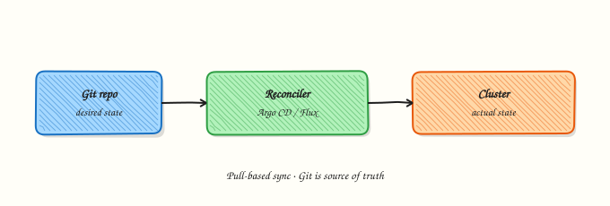

# Argo CD — Learning Roadmap

Follow the course in order:

1. **Course overview** — scope, prerequisites, outcomes  
2. **Modules 1–16** — tutorials in sequence  
3. **Labs / quizzes / projects** — practice  
4. **Capstone** — production GitOps platform  
5. **Interview & certifications** — GitOps / CKA/CKAD adjacent skills  

## Modules

| # | Focus | Tutorials |
|---|-------|-----------|
| 1 | GitOps fundamentals | [Introduction](introduction-to-gitops-and-argo-cd.md) |
| 2 | Architecture | [Components](argo-cd-architecture-and-components.md) |
| 3 | Installation | [Install Argo CD](installing-argo-cd.md) |
| 4 | Applications | [Applications and Projects](argo-cd-applications-and-projects.md) |
| 5 | Repositories | [Repos and credentials](argo-cd-repositories-and-credentials.md) |
| 6 | Synchronisation | [Sync, options, and hooks](synchronisation-sync-options-and-hooks.md) |
| 7 | Helm | [Helm with Argo CD](helm-with-argo-cd.md) |
| 8 | Kustomize | [Kustomize with Argo CD](kustomize-with-argo-cd.md) |
| 9 | ApplicationSets | [ApplicationSets](applicationsets.md) |
| 10 | Multi-cluster | [Multi-cluster GitOps](multi-cluster-gitops.md) |
| 11 | Security | [RBAC and SSO](argo-cd-security-rbac-and-sso.md) |
| 12 | Notifications | [Notifications](argo-cd-notifications.md) |
| 13 | Progressive delivery | [Sync windows and delivery](progressive-delivery-and-sync-windows.md) |
| 14 | CI/CD | [CI/CD integration](ci-cd-integration-with-argo-cd.md) |
| 15 | Production | [Production GitOps](production-gitops-with-argo-cd.md) |
| 16 | Troubleshooting | [Troubleshooting](troubleshooting-argo-cd.md) |

## Official references

- [Argo CD GitHub](https://github.com/argoproj/argo-cd)
- [Argo CD documentation](https://argo-cd.readthedocs.io/en/stable/)
- [Getting started](https://argo-cd.readthedocs.io/en/stable/getting_started/)
