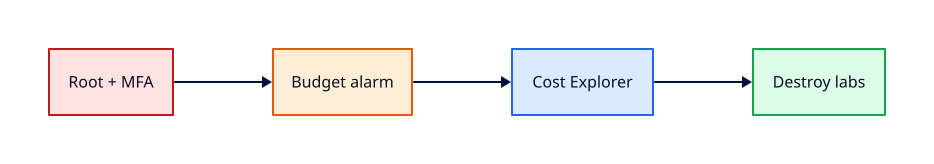

# Accounts, Free Tier, Billing, and Cost Hygiene

## Overview

Surprise cloud bills usually come from forgotten NAT Gateways, idle load balancers, or RDS instances
left running overnight — not from malicious attacks. This tutorial walks through creating an
account safely, enabling **MFA on root**, setting **billing alarms**, reading **Cost Explorer**,
and understanding **Free Tier** limits.

You will configure AWS Budgets, enable cost anomaly detection where available, and adopt a destroy
discipline every lab session. Cost hygiene is a core production skill, not an finance afterthought.

This is **Tutorial 2** in **Module 1: Foundations** of the REBASH Academy AWS track.

!!! warning "Destroy lab resources and watch billing"
    Tear down every resource you create before you close your laptop. Set a **billing alarm**
    (see [Accounts, Free Tier, Billing, and Cost Hygiene](accounts-free-tier-billing-and-cost-hygiene.md))
    and check the Cost Explorer dashboard after each lab session.


## Prerequisites

- Completed [Introduction to AWS and Global Infrastructure](introduction-to-aws-and-global-infrastructure.md)
- Email address and payment method for AWS account creation (Free Tier still requires a card)
- Access to root email inbox for verification

## Learning Objectives

By the end of this tutorial, you will be able to:

- [ ] Create or verify an AWS account with MFA enabled on the root user
- [ ] Enable IAM access to billing and create a monthly cost budget with email alerts
- [ ] Explain Free Tier categories and common billable traps (NAT, ALB, RDS)
- [ ] Use Cost Explorer and billing dashboards to find running resources
- [ ] Apply a lab teardown checklist before closing your session

## Architecture




## Theory

### Account creation and root hygiene

The **root user** owns the account and can do anything, including closing it. Production rule:
**enable MFA on root**, store root credentials offline, and **never use root for daily work**.

| Identity | Use for |
|----------|---------|
| Root | Account recovery, rare billing tasks only |
| IAM admin user/role | Day-one setup, then delegate |
| IAM role | EC2, Lambda, CI — no long-lived keys |

### Free Tier (high level)

Free Tier offers limited usage for 12 months (account creation date) and some always-free services.
Limits are **per service**, not a single pool of credits. Always check the official Free Tier page
before launching:

- **EC2** — limited hours of specific instance types per month
- **S3** — limited storage and requests
- **RDS** — limited db.t2/db.t3 hours in eligible Regions
- **Not Free Tier** — NAT Gateway hourly + data processing, Application Load Balancer hours, many EIPs when unattached

### Cost allocation and tags

Tags (`Environment=lab`, `Owner=rebash`) appear in Cost Explorer when activated. Tag every lab
resource you create; untagged resources are hard to attribute during triage.

### Billing alarms vs Budgets vs Anomaly Detection

| Tool | Purpose |
|------|---------|
| **Billing alarm (CloudWatch)** | Legacy metric on estimated charges |
| **AWS Budgets** | Threshold alerts on cost or usage |
| **Cost Anomaly Detection** | ML-assisted spikes |

For labs, a **Budget** at `$5` or `$10` with email notification is a sensible default.

### Teardown discipline

Before you stop for the day:

1. Delete EC2 instances and volumes you do not need
2. Remove NAT Gateways and Elastic IPs
3. Delete RDS instances (skip snapshots in labs unless required)
4. Empty and delete S3 buckets created for tests
5. Confirm **Cost Explorer → Last 7 days** shows near-zero after cleanup

## Hands-on Lab

### Step 1 — Secure the root user

1. Sign in as root → **IAM** → **Security credentials**
2. Enable **MFA** on root (virtual authenticator app)
3. Do **not** create access keys for root

### Step 2 — Enable IAM access to billing

**Account** → **IAM user and role access to Billing information** → **Activate**.

### Step 3 — Create a billing budget (console)

**Billing** → **Budgets** → **Create budget** → **Cost budget** → `$10` monthly → email alert at
80% and 100%.

CLI (after budget permissions exist):

```bash
aws budgets create-budget \
  --account-id $(aws sts get-caller-identity --query Account --output text) \
  --budget file://budget.json \
  --notifications-with-subscribers file://notifications.json
```

Example `budget.json`:

```json
{
  "BudgetName": "rebash-lab-monthly",
  "BudgetLimit": {"Amount": "10", "Unit": "USD"},
  "TimeUnit": "MONTHLY",
  "BudgetType": "COST"
}
```

### Step 4 — Review Cost Explorer

Open **Cost Explorer** → last 7 days → group by **Service**. Baseline should be near zero before
compute labs.

### Step 5 — Lab teardown template

Save `~/rebash-aws/teardown-checklist.md` with EC2, EIP, NAT, ALB, RDS, S3 sections — use it after
every hands-on session.

        ### LocalStack / dry-run alternative

        With [LocalStack](https://localstack.cloud/) running on port 4566:

        ```bash
        export AWS_ACCESS_KEY_ID=test
        export AWS_SECRET_ACCESS_KEY=test
        export AWS_DEFAULT_REGION=eu-west-1
        # Billing APIs are not emulated — use the real account for this tutorial only.
aws --endpoint-url=http://localhost:4566 sts get-caller-identity  # identity practice only
        ```

        Some services are emulated imperfectly — treat LocalStack as CLI practice, not a full AWS substitute.

## Validation

| Check | Pass criteria |
|-------|---------------|
| Root MFA | Console shows MFA enabled for root |
| Budget | Budget visible with email subscriber |
| IAM billing access | IAM user can open Billing dashboard |
| Cost Explorer | Loads with zero or minimal spend pre-lab |
| Teardown doc | Checklist saved locally |

## Code Walkthrough

| Item | Why it matters |
|------|----------------|
| Root MFA | Stops credential stuffing from owning your account |
| Budget alerts | Early warning before a NAT weekend bill |
| Cost Explorer grouping | Finds which service leaked spend |
| Tags | Identifies lab vs personal experiments |
| Teardown checklist | Habit beats memory after long labs |

## Security Considerations

- Never commit AWS access keys to Git
- Root MFA is mandatory; prefer IAM roles over users where possible
- Billing alerts go to a monitored inbox, not a throwaway address
- Review **IAM Credential Report** monthly in production accounts

## Common Mistakes

!!! warning "Leaving NAT Gateway running"
    NAT charges hourly plus data processing. **Fix:** Use public subnet + SSM for labs; destroy NAT same session.

!!! warning "Unattached Elastic IPs"
    AWS charges for idle public IPs. **Fix:** Release EIPs in teardown checklist.

!!! warning "Using root for CLI daily"
    Maximum blast radius. **Fix:** Create IAM admin with MFA; use roles on compute.

## Best Practices

- Budget + anomaly detection on every account
- Tag `Environment`, `Owner`, `Ticket` on all resources
- Automate teardown with scripts or Terraform destroy
- Review Free Tier page before each new service lab
- Use **AWS Pricing Calculator** for architecture estimates

## Troubleshooting

| Issue | Cause | Fix |
|-------|-------|-----|
| Cannot create budget | IAM billing access off | Activate in account settings |
| Unexpected charge | NAT/ALB/RDS | Cost Explorer → service; delete resource |
| Free Tier exceeded | Wrong instance class | Switch to eligible instance type or destroy |
| No budget email | SNS spam or wrong address | Confirm subscriber email confirmed |

## Production Patterns and Deep Dive

        ### How `Accounts, Free Tier, Billing, and Cost Hygiene` fits in real environments

        Engineers working on **Module 1: Foundations** material use these concepts daily during design reviews,
        incident response, and cost optimisation workshops. The lab exercises prove you can execute;
        this section connects those commands to production trade-offs you will defend in interviews
        and on-call handovers.

        Production teams treating AWS as a first-class platform typically document:

        | Artefact | Purpose |
        |----------|---------|
        | Architecture decision record (ADR) | Why this service, alternatives rejected |
        | Runbook | Step-by-step operational procedures with rollback |
        | Teardown / DR checklist | What to destroy or fail over during exercises |
        | Cost owner | Who receives Budget alerts for resources tagged to this service |

        Always pair technical controls with **billing alarms** and a **destroy discipline** after
        experiments. The REBASH AWS track assumes British English documentation and explicit
        mention of Free Tier limits.

        ### Extended CLI and console reference

        The commands below extend the lab — run read-only variants first, then mutating operations
        in a non-production account. Replace `$LAB_REGION` and resource identifiers with your values.

        ```bash
aws ce get-cost-and-usage --time-period Start=2026-07-01,End=2026-07-28 --granularity MONTHLY \
  --metrics BlendedCost --group-by Type=DIMENSION,Key=SERVICE
aws budgets describe-budgets --account-id $(aws sts get-caller-identity --query Account --output text)
aws cloudwatch describe-alarms --alarm-names rebash-lab-monthly
aws freetier get-free-tier-usage --region us-east-1
aws account get-contact-information
aws account get-alternate-contact --alternate-contact-type BILLING
```

| Cost trap | Detection | Mitigation |
|-----------|-----------|------------|
| NAT Gateway | Cost Explorer `Amazon VPC` spike | SSM + endpoints in labs |
| Idle ALB | ELB line item daily | Delete after lab |
| Orphan EBS | `describe-volumes --filters Name=status,Values=available` | Weekly janitor script |
| RDS storage | RDS snapshot/storage lines | Destroy instances; limit retention |

        ### Operational scenario (table-top)

        **Scenario:** A teammate announces "customers cannot reach the application after a change."
        You suspect a misconfiguration related to **Accounts, Free Tier, Billing, and Cost Hygiene**.

        | Step | Action | Why |
        |------|--------|-----|
        | 1 | Confirm Region and account (`aws sts get-caller-identity`) | Wrong profile wastes triage time |
        | 2 | Check CloudWatch alarms and recent deploys | Correlates timeline |
        | 3 | Review CloudTrail events for API changes in this service | Identifies who changed what |
        | 4 | Compare running config to IaC/Terraform state | Detects manual console drift |
        | 5 | Roll back or restore last known good | Document in incident ticket |
        | 6 | Update runbook and least-privilege IAM if human error | Prevents repeat |

        ### Hardening checklist before production

        - [ ] IAM roles preferred over IAM users with long-lived keys
        - [ ] MFA enabled for privileged humans; root not used daily
        - [ ] Resources tagged `Environment`, `Owner`, `CostCentre`
        - [ ] Budgets and anomaly detection configured
        - [ ] Encryption at rest and in transit enabled where supported
        - [ ] No `0.0.0.0/0` administrative ports (use SSM Session Manager)
        - [ ] Teardown script or `terraform destroy` documented for non-prod environments
        - [ ] Cross-links reviewed: [Networking](../networking/index.md), [Linux](../linux/index.md), [Terraform](../terraform/index.md)

        ### When to choose a different AWS service

        No service exists in isolation. If **Accounts, Free Tier, Billing, and Cost Hygiene** feels forced, discuss alternatives with your
        team: managed versus self-managed, serverless versus EC2, or whether the workload belongs in
        another Region or account under AWS Organizations. Capture that decision in an ADR so future
        engineers understand the constraints you optimised for.

        ### Terraform handoff note

        After completing the AWS track, reproduce this tutorial's resources using modules in the
        [Terraform](../terraform/index.md) curriculum. Start with `required_providers` for `hashicorp/aws`,
        pin provider versions, store remote state in S3 with locking, and never commit secrets. The
        `accounts-free-tier-billing-and-cost-hygiene` lesson maps cleanly to named resources you will import or recreate in HCL.

        ### Review questions (self-check)

        Before moving to the next tutorial, answer without looking at notes:

        1. Which API calls in this lesson are **read-only** versus **mutating**?
        2. What is the first command you run to confirm account and Region?
        3. Which tags will you apply so Cost Explorer can attribute spend?
        4. How do you destroy lab resources created here?
        5. Which [Networking](../networking/index.md) or [Linux](../linux/index.md) concept underpins this AWS service?

        ### Additional references inside AWS

        Browse the official **AWS Documentation** centre for `Accounts, Free Tier, Billing, and Cost Hygiene` — focus on quotas, API permissions,
        and CloudWatch metrics emitted by the service. Bookmark the **Pricing** page for the service and
        add a line item to your personal cheat sheet noting Free Tier eligibility and the most common
        bill surprise mentioned in this tutorial.

## Summary

- Secure root with MFA; do not use root daily
- Configure **Budgets** and read **Cost Explorer** before billable labs
- Free Tier is per-service with exceptions — NAT and ALB are common traps
- Destroy resources and run the teardown checklist every session

## Interview Questions

1. Why should MFA be enabled on the root user?
2. Name three AWS services that are commonly not covered by Free Tier.
3. What is the difference between a Budget and a billing alarm?
4. How do tags help with cost allocation?
5. What steps would you take if Cost Explorer shows a spike in EC2 spend?
6. Why avoid long-lived IAM access keys on laptops?
7. What is the shared billing benefit of AWS Organizations?
8. How often should you review the IAM credential report?
9. What should a lab teardown checklist include?
10. When is it acceptable to leave an RDS instance running overnight?

!!! tip "Sample answer — question 1"
    Root can change billing, close the account, and bypass most guardrails. MFA adds a second factor so stolen passwords alone cannot compromise the account. Daily work should use IAM roles with least privilege, not root.


!!! tip "Sample answer — question 10"
    In production, RDS may run continuously with backups and monitoring. In Free Tier **labs**, never — destroy RDS immediately after validation to avoid storage and instance charges; snapshots also cost money if retained.


## Related Tutorials

- Track overview: [AWS](index.md)
- Previous: [Introduction to AWS and Global Infrastructure](introduction-to-aws-and-global-infrastructure.md)
- Next: [IAM Fundamentals](iam-fundamentals.md)
- [Terraform track](../terraform/index.md) — automate these patterns next


## References

1. [AWS Billing and Cost Management](https://docs.aws.amazon.com/cost-management/latest/userguide/what-is-costmanagement.html)
2. [AWS Free Tier](https://aws.amazon.com/free/)
3. [AWS Budgets](https://docs.aws.amazon.com/cost-management/latest/userguide/budgets-managing-costs.html)
4. [IAM best practices](https://docs.aws.amazon.com/IAM/latest/UserGuide/best-practices.html)
