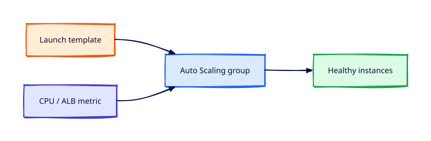

# Auto Scaling Groups and Launch Templates

## Overview

**Auto Scaling Groups (ASG)** maintain desired capacity across AZs, replacing unhealthy instances and
scaling on metrics. **Launch templates** define how each instance is built — AMI, type, SG, profile.

You will create a launch template with SSM profile, attach an ASG to an ALB target group, trigger
a scale event, and scale down to zero before teardown.

This is **Tutorial 17** in **Module 5: Edge and Data** of the REBASH Academy AWS track.

!!! warning "Destroy lab resources and watch billing"
    Tear down every resource you create before you close your laptop. Set a **billing alarm**
    (see [Accounts, Free Tier, Billing, and Cost Hygiene](accounts-free-tier-billing-and-cost-hygiene.md))
    and check the Cost Explorer dashboard after each lab session.


## Prerequisites

- Completed [RDS Fundamentals](rds-fundamentals.md)
- ALB target group from Tutorial 14

## Learning Objectives

By the end of this tutorial, you will be able to:

- [ ] Create launch template with IMDSv2 and SSM instance profile
- [ ] Define ASG across two subnets/AZs
- [ ] Attach ASG to ALB target group for health
- [ ] Simulate scale out via desired capacity change
- [ ] Set desired capacity to 0 and delete ASG/template

## Architecture




## Theory

### Launch template vs launch configuration

Launch templates are the modern approach — versioning, mixed instances policy, T2/T3 unlimited.

### ASG integration

- **ELB health checks** — replace instances failing ALB checks
- **Scaling policies** — target tracking on CPU, request count
- **Instance refresh** — rolling AMI updates

### Cooldowns and protection

Scale-in protection on long-running jobs; lifecycle hooks for drain.

### Lab cost

ASG with `t3.micro` still bills per instance-hour — scale to zero and delete ASG after lab.

## Hands-on Lab

```bash
aws ec2 create-launch-template --launch-template-name rebash-web-lt \
  --launch-template-data '{
    "ImageId": "resolve:ssm:/aws/service/ami-amazon-linux-latest/al2023-ami-kernel-default-x86_64",
    "InstanceType": "t3.micro",
    "IamInstanceProfile": {"Name": "rebash-ec2-ssm-profile"},
    "SecurityGroupIds": ["'$WEB_SG'"],
    "MetadataOptions": {"HttpTokens": "required"},
    "UserData": "'$(base64 -w0 user-data.sh)'"
  }' --region $LAB_REGION

aws autoscaling create-auto-scaling-group \
  --auto-scaling-group-name rebash-web-asg \
  --launch-template LaunchTemplateName=rebash-web-lt,Version='$Latest' \
  --min-size 1 --max-size 3 --desired-capacity 2 \
  --vpc-zone-identifier "$PUBLIC_SUBNET_A,$PUBLIC_SUBNET_B" \
  --target-group-arns $TG_ARN \
  --health-check-type ELB --health-check-grace-period 300 \
  --region $LAB_REGION

aws autoscaling set-desired-capacity --auto-scaling-group-name rebash-web-asg \
  --desired-capacity 3 --region $LAB_REGION

aws autoscaling update-auto-scaling-group --auto-scaling-group-name rebash-web-asg \
  --min-size 0 --max-size 0 --desired-capacity 0 --region $LAB_REGION
aws autoscaling delete-auto-scaling-group --auto-scaling-group-name rebash-web-asg \
  --force-delete --region $LAB_REGION
```

### LocalStack / dry-run alternative

With [LocalStack](https://localstack.cloud/) running on port 4566:

```bash
export AWS_ACCESS_KEY_ID=test
export AWS_SECRET_ACCESS_KEY=test
export AWS_DEFAULT_REGION=eu-west-1
aws --endpoint-url=http://localhost:4566 autoscaling describe-auto-scaling-groups
```

Some services are emulated imperfectly — treat LocalStack as CLI practice, not a full AWS substitute.

## Validation

| Check | Pass criteria |
|-------|---------------|
| ASG instances | Two healthy in target group |
| Scale out | Desired 3 launches third instance |
| Scale in | Desired 0 terminates instances |
| Cleanup | ASG and launch template deleted |

## Code Walkthrough

| Setting | Detail |
|---------|--------|
| `health-check-type ELB` | ASG replaces targets failing ALB checks |
| Grace period | Delay before health evaluation after launch |
| Mixed instances | Spot + On-Demand in advanced configs |
| Template version | `$Latest` vs pinned version for rollbacks |

## Security Considerations

- Launch template enforces IMDSv2 and SSM-only admin
- Instance role least privilege per app
- Validate user data does not contain secrets

## Common Mistakes

!!! warning "ASG desired >0 overnight"
    EC2 hours accumulate. **Fix:** Scale to zero; delete ASG.

!!! warning "EC2 health only with ALB"
    App broken but instance healthy. **Fix:** Use ELB health check type.

!!! warning "No grace period"
    Premature termination during boot. **Fix:** Set 300s grace for user data.

## Best Practices

- Target tracking scaling on CPU or ALB request count
- Instance refresh for AMI patching
- Spread across AZs matching ALB subnets

## Troubleshooting

| Issue | Cause | Fix |
|-------|-------|-----|
| Instances cycle | Failed health checks | Fix user data; SG from ALB |
| Launch fails | Bad AMI or quota | Check EC2 events; request limit increase |
| ASG won't delete | Instances still running | Set desired 0; force-delete |

## Production Patterns and Deep Dive

        ### How `Auto Scaling Groups and Launch Templates` fits in real environments

        Engineers working on **Module 5: Edge and Data** material use these concepts daily during design reviews,
        incident response, and cost optimisation workshops. The lab exercises prove you can execute;
        this section connects those commands to production trade-offs you will defend in interviews
        and on-call handovers.

        Production teams treating AWS as a first-class platform typically document:

        | Artefact | Purpose |
        |----------|---------|
        | Architecture decision record (ADR) | Why this service, alternatives rejected |
        | Runbook | Step-by-step operational procedures with rollback |
        | Teardown / DR checklist | What to destroy or fail over during exercises |
        | Cost owner | Who receives Budget alerts for resources tagged to this service |

        Always pair technical controls with **billing alarms** and a **destroy discipline** after
        experiments. The REBASH AWS track assumes British English documentation and explicit
        mention of Free Tier limits.

        ### Extended CLI and console reference

        The commands below extend the lab — run read-only variants first, then mutating operations
        in a non-production account. Replace `$LAB_REGION` and resource identifiers with your values.

        ```bash
aws autoscaling describe-auto-scaling-groups --auto-scaling-group-names rebash-web-asg
aws autoscaling describe-scaling-activities --auto-scaling-group-name rebash-web-asg
aws autoscaling put-scaling-policy --auto-scaling-group-name rebash-web-asg \
  --policy-name cpu-target --policy-type TargetTrackingScaling --target-tracking-configuration file://tt.json
aws ec2 describe-launch-template-versions --launch-template-name rebash-web-lt
aws autoscaling start-instance-refresh --auto-scaling-group-name rebash-web-asg
```

        ### Operational scenario (table-top)

        **Scenario:** A teammate announces "customers cannot reach the application after a change."
        You suspect a misconfiguration related to **Auto Scaling Groups and Launch Templates**.

        | Step | Action | Why |
        |------|--------|-----|
        | 1 | Confirm Region and account (`aws sts get-caller-identity`) | Wrong profile wastes triage time |
        | 2 | Check CloudWatch alarms and recent deploys | Correlates timeline |
        | 3 | Review CloudTrail events for API changes in this service | Identifies who changed what |
        | 4 | Compare running config to IaC/Terraform state | Detects manual console drift |
        | 5 | Roll back or restore last known good | Document in incident ticket |
        | 6 | Update runbook and least-privilege IAM if human error | Prevents repeat |

        ### Hardening checklist before production

        - [ ] IAM roles preferred over IAM users with long-lived keys
        - [ ] MFA enabled for privileged humans; root not used daily
        - [ ] Resources tagged `Environment`, `Owner`, `CostCentre`
        - [ ] Budgets and anomaly detection configured
        - [ ] Encryption at rest and in transit enabled where supported
        - [ ] No `0.0.0.0/0` administrative ports (use SSM Session Manager)
        - [ ] Teardown script or `terraform destroy` documented for non-prod environments
        - [ ] Cross-links reviewed: [Networking](../networking/index.md), [Linux](../linux/index.md), [Terraform](../terraform/index.md)

        ### When to choose a different AWS service

        No service exists in isolation. If **Auto Scaling Groups and Launch Templates** feels forced, discuss alternatives with your
        team: managed versus self-managed, serverless versus EC2, or whether the workload belongs in
        another Region or account under AWS Organizations. Capture that decision in an ADR so future
        engineers understand the constraints you optimised for.

        ### Terraform handoff note

        After completing the AWS track, reproduce this tutorial's resources using modules in the
        [Terraform](../terraform/index.md) curriculum. Start with `required_providers` for `hashicorp/aws`,
        pin provider versions, store remote state in S3 with locking, and never commit secrets. The
        `auto-scaling-groups-and-launch-templates` lesson maps cleanly to named resources you will import or recreate in HCL.

        ### Review questions (self-check)

        Before moving to the next tutorial, answer without looking at notes:

        1. Which API calls in this lesson are **read-only** versus **mutating**?
        2. What is the first command you run to confirm account and Region?
        3. Which tags will you apply so Cost Explorer can attribute spend?
        4. How do you destroy lab resources created here?
        5. Which [Networking](../networking/index.md) or [Linux](../linux/index.md) concept underpins this AWS service?

        ### Additional references inside AWS

        Browse the official **AWS Documentation** centre for `Auto Scaling Groups and Launch Templates` — focus on quotas, API permissions,
        and CloudWatch metrics emitted by the service. Bookmark the **Pricing** page for the service and
        add a line item to your personal cheat sheet noting Free Tier eligibility and the most common
        bill surprise mentioned in this tutorial.

## Summary

- Launch templates version instance config; ASGs maintain capacity across AZs
- Integrate with ALB health for realistic web tier patterns
- Scale to zero and delete ASG after labs; monitor billing

## Interview Questions

1. Launch template vs configuration?
2. ELB vs EC2 health checks in ASG?
3. What triggers scale out?
4. Grace period purpose?
5. Instance refresh use case?
6. Mixed instances policy?
7. Lifecycle hook use case?
8. Minimum capacity 0 valid?
9. AZ rebalance behaviour?
10. How ASG picks subnet for instance?

!!! tip "Sample answer — question 2"
    EC2 status checks only know hypervisor/network — app can be broken. ELB health checks hit the app path; ASG replaces instances that fail ALB target health — preferred for web tiers behind ALB.


!!! tip "Sample answer — question 8"
    Yes — desired capacity 0 terminates all instances but keeps ASG definition; useful to stop compute charges whilst retaining scaling config, or before delete.


## Related Tutorials

- Track overview: [AWS](index.md)
- Previous: [RDS Fundamentals](rds-fundamentals.md)
- Next: [CloudWatch Metrics, Logs, and Alarms](cloudwatch-metrics-logs-and-alarms.md)
- [Terraform track](../terraform/index.md) — automate these patterns next


## References

1. [Auto Scaling groups](https://docs.aws.amazon.com/autoscaling/ec2/userguide/auto-scaling-groups.html)
2. [Launch templates](https://docs.aws.amazon.com/AWSEC2/latest/UserGuide/ec2-launch-templates.html)
3. [ELB health checks](https://docs.aws.amazon.com/autoscaling/ec2/userguide/ec2-auto-scaling-health-checks.html)
