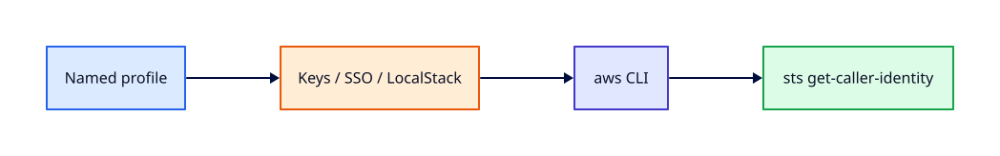

# AWS CLI, Credentials, and Profiles

## Overview

The AWS CLI is how engineers script EC2, S3, and IAM changes in pipelines and during incidents.
Misconfigured credentials — wrong profile, expired SSO token, keys in shell history — waste hours.

This tutorial covers `aws configure`, **named profiles**, **SSO login**, environment variables,
and safe patterns that mirror what Terraform and CI systems use. You will never paste secret keys
into command lines.

This is **Tutorial 4** in **Module 1: Foundations** of the REBASH Academy AWS track.

!!! warning "Destroy lab resources and watch billing"
    Tear down every resource you create before you close your laptop. Set a **billing alarm**
    (see [Accounts, Free Tier, Billing, and Cost Hygiene](accounts-free-tier-billing-and-cost-hygiene.md))
    and check the Cost Explorer dashboard after each lab session.


## Prerequisites

- Completed [IAM Fundamentals](iam-fundamentals.md)
- IAM lab user with programmatic access (or SSO configured)
- AWS CLI v2 installed

## Learning Objectives

By the end of this tutorial, you will be able to:

- [ ] Install and verify AWS CLI v2
- [ ] Configure named profiles in `~/.aws/credentials` and `~/.aws/config`
- [ ] Use `aws sso login` and `--profile` consistently
- [ ] Explain credential provider chain order
- [ ] Run mutating commands with explicit Region and profile flags

## Architecture




## Theory

### CLI v2 vs v1

AWS CLI v2 adds SSO, improved pagination, and unified installer. Verify with `aws --version`.

### Credential sources (chain order)

1. Environment variables (`AWS_ACCESS_KEY_ID`, `AWS_SECRET_ACCESS_KEY`, `AWS_SESSION_TOKEN`)
2. SSO cached credentials (`aws sso login`)
3. Named profiles in `~/.aws/credentials`
4. Instance/container role (IMDS or ECS task role)

Explicit `--profile lab` beats hoping the default is correct.

### Profiles in config

`~/.aws/config`:

```ini
[profile rebash-lab]
region = eu-west-1
output = json

[profile rebash-sso]
sso_start_url = https://my-org.awsapps.com/start
sso_region = eu-west-1
sso_account_id = 123456789012
sso_role_name = AdministratorAccess
region = eu-west-1
```

### Output and pagination

- `--output table|json|text`
- `--query` with JMESPath to filter
- `--no-cli-pager` or `export AWS_PAGER=""` for scripts

### Safety flags

Always pass `--region` and `--profile` in scripts. Use `set -euo pipefail` in Bash wrappers.

## Hands-on Lab

### Step 1 — Configure lab profile

```bash
aws configure --profile rebash-lab
# enter access key, secret, region eu-west-1, output json
aws sts get-caller-identity --profile rebash-lab
```

Prefer SSO in organisations:

```bash
aws configure sso --profile rebash-sso
aws sso login --profile rebash-sso
aws sts get-caller-identity --profile rebash-sso
```

### Step 2 — Environment override (temporary)

```bash
export AWS_PROFILE=rebash-lab
export AWS_DEFAULT_REGION=eu-west-1
aws ec2 describe-vpcs --max-items 5
```

### Step 3 — JMESPath query

```bash
aws ec2 describe-vpcs \
  --profile rebash-lab \
  --query 'Vpcs[*].[VpcId,CidrBlock,IsDefault]' \
  --output table
```

### Step 4 — Dry-run style read-only script

```bash
cat > ~/rebash-aws/whoami.sh <<'EOF'
#!/usr/bin/env bash
set -euo pipefail
PROFILE="${AWS_PROFILE:-rebash-lab}"
aws sts get-caller-identity --profile "$PROFILE"
aws configure list --profile "$PROFILE"
EOF
chmod +x ~/rebash-aws/whoami.sh
~/rebash-aws/whoami.sh
```

### LocalStack / dry-run alternative

With [LocalStack](https://localstack.cloud/) running on port 4566:

```bash
export AWS_ACCESS_KEY_ID=test
export AWS_SECRET_ACCESS_KEY=test
export AWS_DEFAULT_REGION=eu-west-1
export AWS_ACCESS_KEY_ID=test AWS_SECRET_ACCESS_KEY=test AWS_DEFAULT_REGION=eu-west-1
    aws --endpoint-url=http://localhost:4566 sts get-caller-identity
    aws --endpoint-url=http://localhost:4566 s3 ls
```

Some services are emulated imperfectly — treat LocalStack as CLI practice, not a full AWS substitute.

## Validation

| Check | Command | Pass criteria |
|-------|---------|---------------|
| CLI version | `aws --version` | 2.x |
| Profile | `aws sts get-caller-identity --profile rebash-lab` | Expected ARN |
| Region | `aws configure get region --profile rebash-lab` | Your lab Region |
| Script | `~/rebash-aws/whoami.sh` | Exit 0 |

## Code Walkthrough

| Setting | File | Notes |
|---------|------|-------|
| Access keys | `~/.aws/credentials` | chmod 600; never commit |
| Region/output | `~/.aws/config` | `[profile name]` section |
| SSO cache | `~/.aws/sso/cache/` | Refreshed via `aws sso login` |
| `AWS_PROFILE` | Shell env | Overrides default profile |

## Security Considerations

- chmod 600 on credential files; use OS keychain where supported
- Prefer SSO and roles over static keys on developer laptops
- Never export secret keys in shell profile scripts
- Rotate keys if leaked; use **CloudTrail** to detect misuse

## Common Mistakes

!!! warning "Using default profile for prod and lab"
    Wrong account deletes. **Fix:** Named profiles; prompt for account alias in scripts.

!!! warning "Secrets in shell history"
    `export AWS_SECRET_ACCESS_KEY=` logged. **Fix:** Use profiles file or SSO; `HISTCONTROL=ignorespace` is not enough.

!!! warning "Forgotten SSO login"
    Expired token errors. **Fix:** Wrap scripts with clear `aws sso login` message.

## Best Practices

- One profile per account/environment
- Explicit `--region` in all automation
- Use `AWS_PAGER=""` in CI logs
- Document profile names in team README
- Move to IAM Identity Centre SSO for teams

## Troubleshooting

| Issue | Cause | Fix |
|-------|-------|-----|
| Unable to locate credentials | No profile/env | `aws configure` or SSO login |
| Token expired | SSO session timeout | `aws sso login --profile X` |
| Wrong region | Config mismatch | `--region` flag or fix config |
| Partial JSON in pager | Default less pager | `AWS_PAGER=""` |

## Production Patterns and Deep Dive

        ### How `AWS CLI, Credentials, and Profiles` fits in real environments

        Engineers working on **Module 1: Foundations** material use these concepts daily during design reviews,
        incident response, and cost optimisation workshops. The lab exercises prove you can execute;
        this section connects those commands to production trade-offs you will defend in interviews
        and on-call handovers.

        Production teams treating AWS as a first-class platform typically document:

        | Artefact | Purpose |
        |----------|---------|
        | Architecture decision record (ADR) | Why this service, alternatives rejected |
        | Runbook | Step-by-step operational procedures with rollback |
        | Teardown / DR checklist | What to destroy or fail over during exercises |
        | Cost owner | Who receives Budget alerts for resources tagged to this service |

        Always pair technical controls with **billing alarms** and a **destroy discipline** after
        experiments. The REBASH AWS track assumes British English documentation and explicit
        mention of Free Tier limits.

        ### Extended CLI and console reference

        The commands below extend the lab — run read-only variants first, then mutating operations
        in a non-production account. Replace `$LAB_REGION` and resource identifiers with your values.

        ```bash
aws configure list-profiles
aws configure get region --profile rebash-lab
aws sts get-session-token --duration-seconds 3600 --profile rebash-lab
aws sso login --profile rebash-sso && aws sts get-caller-identity --profile rebash-sso
AWS_PAGER="" aws ec2 describe-instances --profile rebash-lab --query 'Reservations[].Instances[].InstanceId'
aws history list | tail
```

| Profile pattern | Example |
|-----------------|---------|
| Lab account | `rebash-lab` |
| SSO admin | `rebash-sso` |
| LocalStack | env vars + `--endpoint-url` |

        ### Operational scenario (table-top)

        **Scenario:** A teammate announces "customers cannot reach the application after a change."
        You suspect a misconfiguration related to **AWS CLI, Credentials, and Profiles**.

        | Step | Action | Why |
        |------|--------|-----|
        | 1 | Confirm Region and account (`aws sts get-caller-identity`) | Wrong profile wastes triage time |
        | 2 | Check CloudWatch alarms and recent deploys | Correlates timeline |
        | 3 | Review CloudTrail events for API changes in this service | Identifies who changed what |
        | 4 | Compare running config to IaC/Terraform state | Detects manual console drift |
        | 5 | Roll back or restore last known good | Document in incident ticket |
        | 6 | Update runbook and least-privilege IAM if human error | Prevents repeat |

        ### Hardening checklist before production

        - [ ] IAM roles preferred over IAM users with long-lived keys
        - [ ] MFA enabled for privileged humans; root not used daily
        - [ ] Resources tagged `Environment`, `Owner`, `CostCentre`
        - [ ] Budgets and anomaly detection configured
        - [ ] Encryption at rest and in transit enabled where supported
        - [ ] No `0.0.0.0/0` administrative ports (use SSM Session Manager)
        - [ ] Teardown script or `terraform destroy` documented for non-prod environments
        - [ ] Cross-links reviewed: [Networking](../networking/index.md), [Linux](../linux/index.md), [Terraform](../terraform/index.md)

        ### When to choose a different AWS service

        No service exists in isolation. If **AWS CLI, Credentials, and Profiles** feels forced, discuss alternatives with your
        team: managed versus self-managed, serverless versus EC2, or whether the workload belongs in
        another Region or account under AWS Organizations. Capture that decision in an ADR so future
        engineers understand the constraints you optimised for.

        ### Terraform handoff note

        After completing the AWS track, reproduce this tutorial's resources using modules in the
        [Terraform](../terraform/index.md) curriculum. Start with `required_providers` for `hashicorp/aws`,
        pin provider versions, store remote state in S3 with locking, and never commit secrets. The
        `aws-cli-credentials-and-profiles` lesson maps cleanly to named resources you will import or recreate in HCL.

        ### Review questions (self-check)

        Before moving to the next tutorial, answer without looking at notes:

        1. Which API calls in this lesson are **read-only** versus **mutating**?
        2. What is the first command you run to confirm account and Region?
        3. Which tags will you apply so Cost Explorer can attribute spend?
        4. How do you destroy lab resources created here?
        5. Which [Networking](../networking/index.md) or [Linux](../linux/index.md) concept underpins this AWS service?

        ### Additional references inside AWS

        Browse the official **AWS Documentation** centre for `AWS CLI, Credentials, and Profiles` — focus on quotas, API permissions,
        and CloudWatch metrics emitted by the service. Bookmark the **Pricing** page for the service and
        add a line item to your personal cheat sheet noting Free Tier eligibility and the most common
        bill surprise mentioned in this tutorial.

## Summary

- AWS CLI v2 with **named profiles** and optional **SSO** is the standard operator interface
- Credential chain: env → SSO → files → instance role
- Always specify profile and Region in scripts; protect credential files
- LocalStack endpoint flag practices the same command shapes locally

## Interview Questions

1. What is the AWS CLI credential provider chain order?
2. How do named profiles differ between credentials and config files?
3. Why prefer SSO over long-lived access keys?
4. What does `--query` do?
5. How would you prevent accidental changes in the wrong account?
6. What is the purpose of `aws sts get-caller-identity`?
7. How do instance roles provide credentials without a profile file?
8. What environment variables override profile settings?
9. Why set `AWS_PAGER` empty in CI?
10. How would you rotate compromised access keys?

!!! tip "Sample answer — question 3"
    SSO issues **temporary** credentials tied to corporate identity, centralised assignment, and MFA. Long-lived keys on laptops leak via git, backups, and malware. SSO reduces rotation pain and improves audit trails.


!!! tip "Sample answer — question 5"
    Use separate profiles per account, print `sts get-caller-identity` before destructive scripts, require explicit `--profile` flags, and in CI use OIDC roles scoped to one repository/environment.


## Related Tutorials

- Track overview: [AWS](index.md)
- Previous: [IAM Fundamentals](iam-fundamentals.md)
- Next: [VPC, Subnets, and Multi-AZ Design](vpc-subnets-and-multi-az-design.md)
- [Terraform track](../terraform/index.md) — automate these patterns next


## References

1. [AWS CLI User Guide](https://docs.aws.amazon.com/cli/latest/userguide/cli-chap-welcome.html)
2. [Configuring the CLI](https://docs.aws.amazon.com/cli/latest/userguide/cli-chap-configure.html)
3. [SSO configuration](https://docs.aws.amazon.com/cli/latest/userguide/cli-configure-sso.html)
4. [STS GetCallerIdentity](https://docs.aws.amazon.com/STS/latest/APIReference/API_GetCallerIdentity.html)
