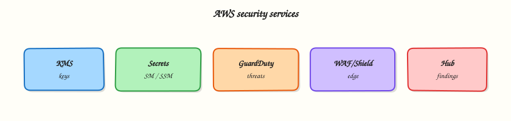

# AWS Security Services

## Overview

Security on AWS is not one switch. You layer **identity** (who can log in — IAM from Module 2), **detection** (who did what — CloudTrail, GuardDuty), and **protection** (encrypt data at rest and in transit).

Start with encryption — it appears in almost every Cloud interview:

- **KMS** — **AWS Key Management Service** — creates and controls encryption keys
- **S3 default encryption** — every object encrypted when stored
- **Secrets Manager** — store database passwords (not in Git)

This is **Tutorial 1** in **Module 10: Security Services** of the REBASH Academy **AWS for Cloud & DevOps Engineers** series. You will create a **customer managed KMS key**, create an S3 bucket with **default SSE-KMS**, upload and download to prove the **decrypt path**, then schedule **safe key deletion** after emptying the bucket.

!!! warning "Cost and safety"
    Customer managed KMS keys cost about **$1/month** until deleted. Key deletion has a **minimum 7-day waiting period** — never schedule deletion on production keys. This lab uses disposable names only.

## Prerequisites

- [Monitoring and Observability on AWS](monitoring-and-observability-on-aws.md)
- [IAM, Identity Access, and Organizations](iam-identity-access-and-organizations.md)
- [Storage: S3, EBS, and EFS](storage-s3-ebs-efs.md) — S3 basics and bucket policies
- AWS CLI v2 with `kms:*`, `s3:*` in sandbox

## Learning Objectives

By the end of this tutorial, you will be able to:

- [ ] Explain KMS and envelope encryption with a simple analogy
- [ ] Configure S3 default encryption with a customer managed KMS key
- [ ] Prove encrypt-at-upload and decrypt-on-download via CLI
- [ ] Contrast Secrets Manager vs Parameter Store vs KMS
- [ ] Schedule KMS key deletion safely with waiting period
- [ ] Name GuardDuty, Security Hub, and WAF at fresher interview depth

## Architecture

Applications call KMS to generate **data keys**. AWS services use **envelope encryption** — KMS encrypts a data key; the service encrypts your payload. S3 **SSE-KMS** requires `kms:Decrypt` permission to download. CloudTrail logs key use.



## Theory

### The problem (before AWS words)

A laptop with customer data is stolen from a car. If the disk was encrypted, the thief gets gibberish. Cloud data needs the same discipline — encryption at rest is baseline for compliance and customer trust.

### KMS — who holds the master keys

**Problem:** Every service inventing its own encryption is inconsistent and unauditable.

**Analogy:** **KMS** is a bank vault for encryption keys — you request “wrap this data key” and KMS returns ciphertext only if your IAM/key policy allows.

**AWS name:** **AWS Key Management Service (KMS)**.

**Tiny example:** S3 uploads call KMS; downloads call `kms:Decrypt` before returning bytes.

**Interview one-liner:** “KMS is the control plane for encryption keys — separate key policies and IAM control who can decrypt.”

| Key type | Plain meaning |
|----------|----------------|
| **AWS managed** | AWS owns; tied to a service |
| **Customer managed** | You control policy and rotation — lab uses this |
| **AWS owned** | Shared invisible keys for some defaults |

### Envelope encryption — lock inside lock

**Problem:** Encrypting huge files directly with one master key is slow and risky.

**Analogy:** KMS encrypts a small **data key** (envelope). S3 encrypts the file with that data key and stores the encrypted key beside the object. On read, KMS unwraps the data key if allowed.

**Interview one-liner:** “Envelope encryption limits KMS API calls while keeping master keys in hardware security modules (HSMs).”

### S3 SSE-S3 vs SSE-KMS

| Mode | Plain meaning | When |
|------|---------------|------|
| **SSE-S3** | S3-managed keys (`AES256`) | Simple default |
| **SSE-KMS** | KMS key you control | Audit `Decrypt` in CloudTrail; regulated data |

Module 5 used SSE-S3; this module upgrades to **SSE-KMS**.

### Secrets Manager vs Parameter Store

**Problem:** Developers paste database passwords into Git — breaches follow.

**Analogy:** **Secrets Manager** is a locked drawer with automatic rotation hooks; **Parameter Store SecureString** is a cheaper config vault encrypted by KMS.

**Interview one-liner:** “Secrets Manager for rotating DB credentials; Parameter Store for static config — never commit `.env` to GitHub.”

### Detective and edge controls (awareness)

| Service | Plain job |
|---------|-----------|
| **CloudTrail** | Audit log of API calls |
| **GuardDuty** | Threat detection from logs and network |
| **Security Hub** | Single dashboard of findings |
| **AWS WAF** | Block bad HTTP patterns on ALB/CloudFront |
| **AWS Shield** | DDoS protection (Standard free) |
| **Macie** | Find sensitive data in S3 |

### Common pitfalls

- KMS key policy too tight — Lambda/S3 cannot decrypt at runtime
- Deleting KMS key while encrypted data exists — **permanent data loss** after waiting period
- Confusing **WAF** (app rules) with **Shield** (DDoS)
- Storing secrets in plain CloudFormation parameters

## Hands-on Lab

### Objective

Create a customer managed KMS key and alias, create an S3 bucket with default SSE-KMS, upload/download to prove decrypt, empty the bucket, and schedule key deletion (7-day minimum wait).

### Prerequisites

| Tool | Notes |
|------|--------|
| AWS CLI v2 | kms, s3 |
| jq | Parse JSON |
| Unique bucket name | Global uniqueness |

### Lab environment

``` {.bash .ra-terminal title="Terminal"}
mkdir -p ~/rebash-aws/module-10 && cd ~/rebash-aws/module-10
export AWS_REGION="${AWS_REGION:-eu-west-2}"
export AWS_PAGER=""
ACCOUNT_ID=$(aws sts get-caller-identity --query Account --output text)
export BUCKET="rebash-m10-kms-${ACCOUNT_ID}-$(date +%s)"
export KEY_ALIAS="alias/rebash-m10-lab"
echo "$BUCKET" | tee bucket-name.txt
aws sts get-caller-identity --output table
```

### Real-world scenario

Security mandates **customer managed KMS** for an audit export bucket. You provision the key, enforce default encryption, verify an operator with S3 read can still decrypt via KMS policy, document evidence, then run FinOps teardown — scheduling key deletion only after the bucket is empty.

### Step-by-step tasks

#### Task 1 – Create KMS key and alias

Create `kms-key-policy.json`:

```json title="kms-key-policy.json"
{
  "Version": "2012-10-17",
  "Statement": [
    {
      "Sid": "EnableRoot",
      "Effect": "Allow",
      "Principal": {"AWS": "arn:aws:iam::ACCOUNT_ID:root"},
      "Action": "kms:*",
      "Resource": "*"
    }
  ]
}
```

``` {.bash .ra-terminal title="Terminal"}
cd ~/rebash-aws/module-10
ACCOUNT_ID=$(aws sts get-caller-identity --query Account --output text)
sed "s/ACCOUNT_ID/${ACCOUNT_ID}/g" kms-key-policy.json > key-policy-rendered.json
aws kms create-key \
  --description "REBASH module-10 lab key" \
  --key-usage ENCRYPT_DECRYPT \
  --policy file://key-policy-rendered.json \
  --output json | tee create-key.json
KEY_ID=$(jq -r '.KeyMetadata.KeyId' create-key.json)
echo "$KEY_ID" | tee key-id.txt
aws kms create-alias --alias-name alias/rebash-m10-lab --target-key-id "$KEY_ID"
aws kms describe-key --key-id "$KEY_ID" --query 'KeyMetadata.{KeyId:KeyId,Arn:Arn}' \
  --output json | tee key-meta.json
```

!!! example "Expected output"
    `key-id.txt` has UUID key ID; alias `alias/rebash-m10-lab` created.


#### Task 2 – S3 bucket with default SSE-KMS and upload

``` {.bash .ra-terminal title="Terminal"}
cd ~/rebash-aws/module-10
BUCKET=$(cat bucket-name.txt)
KEY_ID=$(cat key-id.txt)
if [[ "$AWS_REGION" == "us-east-1" ]]; then
  aws s3api create-bucket --bucket "$BUCKET"
else
  aws s3api create-bucket --bucket "$BUCKET" \
    --create-bucket-configuration LocationConstraint="$AWS_REGION"
fi
aws s3api put-public-access-block --bucket "$BUCKET" \
  --public-access-block-configuration \
  BlockPublicAcls=true,IgnorePublicAcls=true,BlockPublicPolicy=true,RestrictPublicBuckets=true
aws s3api put-bucket-encryption --bucket "$BUCKET" \
  --server-side-encryption-configuration "{
    \"Rules\": [{
      \"ApplyServerSideEncryptionByDefault\": {
        \"SSEAlgorithm\": \"aws:kms\",
        \"KMSMasterKeyID\": \"${KEY_ID}\"
      },
      \"BucketKeyEnabled\": true
    }]
  }"
echo "audit export sample" > secret-audit.txt
aws s3 cp secret-audit.txt "s3://${BUCKET}/audit/secret-audit.txt" \
  --sse aws:kms --sse-kms-key-id "$KEY_ID"
aws s3api head-object --bucket "$BUCKET" --key audit/secret-audit.txt \
  --output json | tee head-object.json
grep -q aws:kms head-object.json
```

!!! example "Expected output"
    `head-object.json` shows `"ServerSideEncryption": "aws:kms"` and KMS key ARN.


#### Task 3 – Download (decrypt path) and encryption proof

``` {.bash .ra-terminal title="Terminal"}
cd ~/rebash-aws/module-10
BUCKET=$(cat bucket-name.txt)
aws s3 cp "s3://${BUCKET}/audit/secret-audit.txt" decrypted.txt
grep -q "audit export" decrypted.txt
aws s3api get-bucket-encryption --bucket "$BUCKET" --output json | tee bucket-encryption.json
jq -e '.ServerSideEncryptionConfiguration.Rules[0].ApplyServerSideEncryptionByDefault.SSEAlgorithm == "aws:kms"' \
  bucket-encryption.json
echo "kms decrypt path OK" | tee evidence.txt
```

!!! example "Expected output"
    `decrypted.txt` matches upload; bucket default encryption is `aws:kms`.


#### Task 4 – Empty bucket and schedule key deletion (7 days)

``` {.bash .ra-terminal title="Terminal"}
cd ~/rebash-aws/module-10
BUCKET=$(cat bucket-name.txt)
KEY_ID=$(cat key-id.txt)
aws s3 rm "s3://${BUCKET}" --recursive
aws s3api delete-bucket --bucket "$BUCKET"
aws kms schedule-key-deletion --key-id "$KEY_ID" --pending-window-in-days 7 \
  --output json | tee schedule-delete.json
jq -e '.KeyId' schedule-delete.json
aws kms list-aliases --query "Aliases[?AliasName=='alias/rebash-m10-lab']" --output json | tee alias-check.json
echo "cleanup scheduled — key deletes after 7d minimum" | tee cleanup-ok.txt
```

!!! example "Expected output"
    Bucket deleted; `schedule-delete.json` shows deletion date about 7 days ahead.


### Validation steps

- [ ] Customer managed KMS key and alias created
- [ ] S3 bucket default encryption uses SSE-KMS with that key
- [ ] Upload head-object shows aws:kms
- [ ] Download succeeded (Decrypt path works)
- [ ] Bucket deleted; key deletion scheduled (not immediate)

### Common errors and fixes

| Error | Cause | Fix |
|-------|-------|-----|
| AccessDenied on s3 cp get | Missing kms:Decrypt | Extend key policy or IAM for caller |
| InvalidKMSKeyId | Wrong Region/key | Key and bucket same Region |
| BucketNotEmpty | Objects remain | `aws s3 rm --recursive` |
| ScheduleKeyDeletion denied | AWS managed key | Use customer managed key from create-key |

### Challenge exercise

Create `secret-fetch-stub.sh` that documents how an app fetches a Secrets Manager JSON secret at startup (placeholder — no real secret required).

```bash title="secret-fetch-stub.sh"
#!/bin/bash
set -euo pipefail
# Production pattern: fetch at startup, cache with TTL, never bake into AMI
echo "aws secretsmanager get-secret-value --secret-id prod/db/app --query SecretString"
echo "Parse username password host from JSON; rotate via Secrets Manager Lambda"
```

``` {.bash .ra-terminal title="Terminal"}
cd ~/rebash-aws/module-10
chmod +x secret-fetch-stub.sh
./secret-fetch-stub.sh | tee secret-stub-output.txt
grep -qi secrets secret-stub-output.txt
grep -qi rotation secret-stub-output.txt
echo "secrets challenge OK" | tee challenge.txt
```

### Learning outcomes

- You created and aliased a customer managed KMS key
- You enforced S3 default SSE-KMS and proved decrypt on download
- You understand **BucketKeyEnabled** reduces KMS API cost
- You scheduled safe key deletion after removing ciphertext

### Cleanup

``` {.bash .ra-terminal title="Terminal"}
cd ~/rebash-aws/module-10
BUCKET=$(cat bucket-name.txt 2>/dev/null || echo "")
KEY_ID=$(cat key-id.txt 2>/dev/null || echo "")
if [[ -n "$BUCKET" ]] && aws s3api head-bucket --bucket "$BUCKET" 2>/dev/null; then
  aws s3 rm "s3://${BUCKET}" --recursive
  aws s3api delete-bucket --bucket "$BUCKET"
fi
if [[ -n "$KEY_ID" ]]; then
  aws kms delete-alias --alias-name alias/rebash-m10-lab 2>/dev/null || true
  aws kms schedule-key-deletion --key-id "$KEY_ID" --pending-window-in-days 7 2>/dev/null || true
fi
```

## Validation

- [ ] Lab evidence in `~/rebash-aws/module-10`
- [ ] You can explain envelope encryption without notes
- [ ] You can compare Secrets Manager vs Parameter Store
- [ ] No lab bucket remains; key deletion scheduled or completed

## Code Walkthrough

1. **Account root in key policy** — allows account admins to manage key; tighten in prod to specific roles.
2. **BucketKeyEnabled** — S3 bucket-level key reduces KMS API calls for high-volume objects.
3. **head-object SSE** — proves encryption at rest before compliance scans trust the bucket.
4. **Delete bucket before key** — avoid orphaned ciphertext you cannot decrypt after key deletion.
5. **7-day pending window** — cancel via `cancel-key-deletion` if you made a mistake.

## Security Considerations

- Separate encryption keys per environment (dev/staging/prod).
- Log and alert on `kms:DisableKey`, `ScheduleKeyDeletion`, `PutKeyPolicy`.
- Use Secrets Manager rotation for databases; never commit `.env` files.
- Enable GuardDuty and Security Hub organisation-wide when you join a real team.
- Apply WAF rate-based rules on public HTTP endpoints.

## Common Mistakes

!!! warning "Scheduling production key deletion"
    After the waiting period, decryption is impossible. Double-check key ID; require MFA for deletion in prod processes.

!!! warning "SSE-KMS without kms:Decrypt on compute role"
    S3 GetObject policy passes but runtime fails — add Decrypt on the key for task/instance role.

!!! warning "Secrets in Git"
    Bots scan public repos for keys within minutes. Use Secrets Manager + IAM roles.

## Best Practices

- Automatic key rotation for customer managed KMS keys where supported
- Macie on sensitive S3 buckets; Block Public Access account-wide
- CloudTrail organisation trail with log file validation
- IAM Access Analyzer external access reports quarterly
- Monitor unusual `Decrypt` volume spikes

## Troubleshooting

| Symptom | Likely cause | Fix |
|---------|--------------|-----|
| S3 AccessDenied on get | KMS key policy | Allow principal kms:Decrypt |
| Slow S3 with SSE-KMS | High KMS QPS | Enable S3 bucket keys |
| Secret rotation failed | Lambda VPC/permissions | Check rotation function logs |
| GuardDuty finding | Pentest or compromise | Triage in Security Hub |

## Summary

**KMS** is the encryption control plane for AWS data at rest. Pair **SSE-KMS defaults** with tight key policies, prove decrypt paths in labs, and treat key deletion as **irreversible** after the waiting period. Next you will automate these patterns with Infrastructure as Code.

Next: [Infrastructure as Code on AWS](infrastructure-as-code-on-aws.md).

## Interview Questions

**1. What is KMS in simple words?**

??? success "Reveal answer"
    KMS (Key Management Service) creates and controls encryption keys used by AWS services and your applications. You define key policies and IAM permissions; KMS performs encrypt/decrypt operations in hardware security modules. CloudTrail can audit key use.

**2. SSE-S3 vs SSE-KMS?**

??? success "Reveal answer"
    **SSE-S3** uses keys managed entirely by S3 with simple setup (`AES256`). **SSE-KMS** uses a KMS key with granular policies and CloudTrail audit of decrypt operations — preferred for regulated data at the cost of KMS quotas and slight latency.

**3. What is envelope encryption?**

??? success "Reveal answer"
    KMS encrypts a generated **data key**; the service encrypts your payload with that key and stores the encrypted data key with the object. On read, KMS decrypts the data key if authorised, then the service decrypts the payload — reducing direct KMS calls on large files.

**4. What happens when you delete a KMS key?**

??? success "Reveal answer"
    `ScheduleKeyDeletion` starts a mandatory waiting period (7–30 days). After expiry, the key is gone and data encrypted only with that key becomes **permanently undecryptable**. Cancel during the window if mistaken.

**5. Secrets Manager vs Parameter Store?**

??? success "Reveal answer"
    **Secrets Manager** targets secrets needing rotation and versioning — higher cost, built for DB passwords. **Parameter Store** (Standard) suits configuration and static secrets cheaply; SecureString uses KMS. Neither belongs in Git.

**6. What is S3 bucket key (BucketKeyEnabled)?**

??? success "Reveal answer"
    S3 uses a bucket-level key to reduce KMS Encrypt/Decrypt API calls for objects — lowering cost and throttling risk while keeping SSE-KMS. Recommended for high-throughput buckets.

**7. GuardDuty vs Security Hub?**

??? success "Reveal answer"
    **GuardDuty** detects threats by analysing CloudTrail, VPC flow logs, and DNS. **Security Hub** aggregates findings from GuardDuty, Inspector, Macie, and compliance standards into one scoreboard with automation via EventBridge.

**8. WAF vs Shield — quick difference?**

??? success "Reveal answer"
    **WAF** applies Layer 7 application rules (SQL injection blocks, geo restrictions) on ALB, CloudFront, or API Gateway. **Shield** provides DDoS protection — Standard is automatic; Advanced adds dedicated response team support.

## Related Tutorials

- Previous: [Monitoring and Observability on AWS](monitoring-and-observability-on-aws.md)
- Next: [Infrastructure as Code on AWS](infrastructure-as-code-on-aws.md)
- [IAM, Identity Access, and Organizations](iam-identity-access-and-organizations.md)
- [Storage: S3, EBS, and EFS](storage-s3-ebs-efs.md)

## References

- [AWS KMS Developer Guide](https://docs.aws.amazon.com/kms/latest/developerguide/overview.html)
- [Amazon S3 encryption](https://docs.aws.amazon.com/AmazonS3/latest/userguide/UsingEncryption.html)
- [AWS Secrets Manager](https://docs.aws.amazon.com/secretsmanager/latest/userguide/intro.html)
- [Amazon GuardDuty](https://docs.aws.amazon.com/guardduty/latest/ug/what-is-guardduty.html)
- [AWS Security Hub](https://docs.aws.amazon.com/securityhub/latest/userguide/what-is-securityhub.html)
