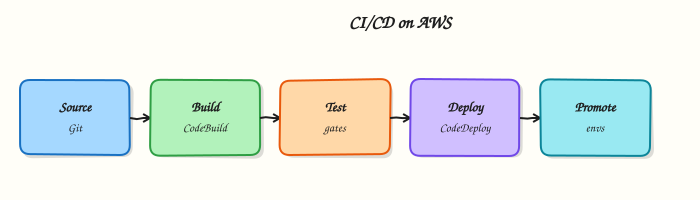

# CI/CD on AWS

## Overview


Design a secure delivery path on Amazon Web Services (AWS): source → build → test → deploy, using native Code* services and/or GitHub Actions / GitLab CI with OpenID Connect (OIDC), including a blue/green promotion pattern.

Continuous Integration and Continuous Delivery (CI/CD) turns every merge into a reviewed, automated path to an environment. On AWS you can stay native (**CodePipeline**, **CodeBuild**, **CodeDeploy**) or keep the pipeline in GitHub/GitLab and assume temporary AWS roles via **OIDC** — preferred over long-lived access keys. Deployments should be reversible: rolling, canary, or **blue/green**.

!!! warning "Cost hygiene"
    CodeBuild minutes, artefact stores, and idle load balancers used for blue/green all cost money. Tear down lab pipelines and target groups when finished.

This is a core tutorial in **Module 12 · CI/CD** of the REBASH Academy **AWS for Cloud & DevOps Engineers** series — written for Cloud, DevOps, Platform, and SRE engineers.

## Prerequisites


- [Infrastructure as Code on AWS](infrastructure-as-code-on-aws.md)
- Comfort with Git branches, pull/merge requests, and Docker image builds
- Optional: [GitHub Actions](../github-actions/index.md) or [GitLab CI](../gitlab/index.md)

## Learning Objectives


By the end of this tutorial, you will be able to:

- [ ] Map CodePipeline stages to build, test, and deploy  
- [ ] Configure CodeBuild with a buildspec and least-privilege role  
- [ ] Contrast CodeDeploy strategies (rolling vs blue/green)  
- [ ] Prefer OIDC from GitHub/GitLab over static AWS keys  
- [ ] Sketch a promotion path that is auditable and reversible

## Architecture


This topic’s control points and relationships are shown below.



## Theory


### What it is

**CI/CD on AWS** is the automated path from version control to a running workload. Native building blocks: **CodePipeline** (stages and approvals), **CodeBuild** (`buildspec.yml` in managed containers), **CodeDeploy** (EC2/ASG, ECS, or Lambda with traffic shifting). Artefacts land in S3, ECR, or CodeArtifact. Many teams keep YAML in **GitHub Actions** or **GitLab CI** and deploy to AWS via **OIDC** (short-lived IAM roles — no static keys).

**Rolling** replaces gradually; **canary** shifts a percentage first; **blue/green** runs two environments (or target groups / task sets / Lambda versions) and flips traffic after health checks — rollback reverses the flip without rebuilding.

| Piece | Role |
|-------|------|
| CodePipeline | Orchestration and approvals |
| CodeBuild | Build / test / package |
| CodeDeploy | Traffic-aware deploy |
| GitHub / GitLab + OIDC | External CI → AWS |
| Blue/green · rolling · canary | Cutover patterns |

### Why it matters

Platform and SRE teams own change failure rate and recovery time. Manual deploy does not scale or audit. DevSecOps needs lint, tests, image scan, and IaC plan *before* production credentials. Native Code* keeps artefacts in AWS; GitHub/GitLab keep developer experience in the PR. Separate **build** and **deploy** roles; never let fork PRs assume production.

### How it works

1. **Source** — push or MR triggers CodePipeline, Actions, or GitLab.
2. **Build** — produce an immutable artefact (digest, zip, template).
3. **Gates** — SAST, dependency/container scans; fail closed on CRITICAL for prod.
4. **Deploy** — CodeDeploy or IaC/`kubectl` with a scoped role.
5. **Validate** — health checks, synthetics, alarms; roll back on failure.
6. **Promote** — same digest staging → production (build once, promote many).

### Concept deep dive

**CodePipeline.** Stages (Source → Build → Deploy → Approve); artefacts via S3; encrypt buckets; least-privilege pipeline role; manual approval before prod.

**CodeBuild.** Phases in `buildspec.yml`; size compute; cache layers to cut minutes. Build role: ECR push/pull and secret read — not broad IAM mutation. Privileged mode for Docker-in-Docker is a trust boundary.

**CodeDeploy.** A **deployment group** targets ASG, ECS, or Lambda. Appspec/hooks (`BeforeAllowTraffic`, `AfterAllowTraffic`) validate before full traffic. Rolling needs less spare capacity; blue/green needs a second environment and a balancer that can shift traffic.

**GitHub Actions with AWS.** `aws-actions/configure-aws-credentials` + OIDC provider for `token.actions.githubusercontent.com`; trust `sub` limited to org/repo/ref or environment; pin actions by SHA; use Environments for prod approval.

**GitLab CI with AWS.** JWT/OIDC → IAM role in `before_script`; protected branches and environment scopes. Static keys on self-managed runners are an anti-pattern — prefer OIDC or instance profiles.

**Blue/green, rolling, canary.** Rolling: simple, mixed versions briefly, slower undo. Blue/green: clean cutover, fast traffic flip, higher temporary cost. Canary: 5–10% traffic, watch errors/latency, then proceed — CodeDeploy and weighted target groups support this. Plan **expand/contract** data migrations; compute blue/green does not undo a breaking schema.

### Key concepts and comparisons

| Term | Meaning |
|------|---------|
| Artefact | Immutable build output |
| Build vs deploy role | Separate least privilege |
| Deployment group | CodeDeploy target set |
| Traffic shifting | Weighted cutover |
| OIDC provider | GitHub/GitLab issuer → IAM role |

| Pattern | When to use |
|---------|-------------|
| Rolling | Simple ASG/ECS; mixed versions OK |
| Canary | Observe a percentage first |
| Blue/green | Instant reversible cutover |
| Approval gate | Human check before prod |

### Common pitfalls

- Long-lived AWS keys in CI instead of OIDC.
- Rebuilding “for production” instead of promoting a digest.
- Privileged builds that can change IAM/org policies.
- Blue/green without draining or a DB migration plan.
- No buildspec caching → burned CodeBuild minutes.
- OIDC trust for `*` repos or all branches.
- Assuming CodePipeline is mandatory — GitHub/GitLab + OIDC is valid.

## Hands-on Lab


!!! warning "Cost and account safety"
    Use a sandbox account. Prefer read-only calls. Destroy anything you create before leaving the lab.

### Objective

Use read-only AWS APIs to inventory and verify aspects of **CI/CD on AWS** in a sandbox account.

### Prerequisites

- AWS CLI v2
- Credentials for a **sandbox** account (SSO or short-lived keys)

### Lab environment

Workspace: `~/rebash-aws/module-12`

Prefer `describe`/`list`/`get` APIs. Create resources only with an explicit destroy path.

```bash title="Terminal"
mkdir -p ~/rebash-aws/module-12 && cd ~/rebash-aws/module-12
```

### Real-world scenario

Security asks for evidence that **CI/CD on AWS** is configured correctly. You gather CLI proof without click-ops drift.

### Step-by-step tasks

#### Task 1 – Prove caller identity

Every AWS change starts by knowing which account/role you are.

```bash title="Terminal"
aws sts get-caller-identity | tee identity.json
aws configure get region || true
test -s identity.json
```

!!! example "Expected output"
    JSON includes Account, Arn, and UserId.


#### Task 2 – Collect topic signals

Inventory the service surface related to this module.

```bash title="Terminal"
aws ec2 describe-vpcs --query 'Vpcs[].{Id:VpcId,Cidr:CidrBlock}' --output table 2>/dev/null | tee vpcs.txt || true
aws iam get-account-summary 2>/dev/null | tee iam-summary.json || true
tee notes.txt << 'EOF'
Record which APIs apply to this topic and any NotAuthorized errors for follow-up.
EOF
cat notes.txt
```

!!! example "Expected output"
    Evidence files created even if some APIs are denied.


### Validation steps

- [ ] identity.json present
- [ ] No long-lived keys committed to the repo

### Common errors and fixes

| Error | Cause | Fix |
|-------|-------|-----|
| Unable to locate credentials | No profile/SSO | Run `aws sso login` or export sandbox keys |
| AccessDenied | Least privilege | Use a role that can read the service — or document the deny |
| UnauthorizedOperation | Wrong region/account | Check `AWS_REGION` and account id |

### Challenge exercise

Enable a cost budget alarm in the sandbox (or document the console clicks) and screenshot/CLI-describe it.

### Learning outcomes

- Authenticated safely
- Captured read-only evidence
- Avoided unmanaged spend

### Cleanup

```bash
# Revoke/lab-expire any temporary keys you exported
# Do not leave EC2/ELB/NAT running
```

## Validation


- [ ] Lab commands run under `~/rebash-aws/module-12/`
- [ ] You can explain each Theory section in your own words
- [ ] You used modern tooling where it applies to this topic
- [ ] You can describe one production failure mode for this topic

## Code Walkthrough


Production practice for **CI/CD on AWS** always combines:

1. Inspect before you change (status, plan, logs, dry-run)
2. Prefer reversible, documented changes (Git, IaC, drop-ins, version pins)
3. Capture evidence (command output, pipeline logs) for handovers
4. Prefer current tools and APIs over legacy shortcuts
5. Least privilege — escalate credentials only when required

Keep runbooks short enough to follow under pressure. Automate checks; keep humans for judgement.

## Security Considerations


- Treat credentials and tokens for aws as privileged — never commit them
- Prefer short-lived auth (OIDC, roles, SSO) over long-lived keys
- Validate blast radius before apply/deploy/delete operations
- Restrict who can approve production changes
- Collect audit logs; limit who can read sensitive traces

## Common Mistakes


!!! warning "Long-lived AWS keys in CI instead of OIDC."
    Validate assumptions against the Theory section and official docs before changing production.

!!! warning "Rebuilding “for production” instead of promoting a digest."
    Lab shortcuts (open security groups, admin roles, skip approvals) must not ship unchanged.

!!! warning "Changing production without a rollback path"
    Always know how to revert (previous artefact, prior release, state rollback, DNS failback).

## Best Practices


- Encode CI/CD on AWS changes as code and review them in pull requests
- Pin versions (images, modules, actions, provider plugins)
- Separate environments with clear promotion gates
- Alert on symptoms with runbooks attached
- Destroy lab resources; tag everything with owner and expiry where possible

## Troubleshooting


| Symptom | Likely cause | Fix |
|---------|--------------|-----|
| Auth / permission denied | Wrong identity, policy, or scope | Check caller identity, roles, and least-privilege policies |
| Timeout / no route | Network, DNS, security group, or endpoint | Trace path, DNS, and allow-lists before retrying |
| Drift / unexpected plan | Manual change or wrong state/workspace | Reconcile desired vs actual; avoid click-ops on managed resources |
| Pipeline/job red | Flaky step, cache, or missing secret | Read failing step logs; bisect recent workflow/config changes |
| Cost spike | Idle load balancer, NAT, oversized compute | Inventory billable resources; stop/delete labs promptly |

## Summary


**CI/CD on AWS** is essential for Cloud and DevOps engineers working with aws. Practise the lab until the inspection and change path is muscle memory, then continue the track.

## Interview Questions


1. CodePipeline versus GitHub Actions deploying to AWS?
2. Why OIDC to IAM roles beats AKIA keys in CI?
3. What should a deploy role be allowed to do?
4. How do you promote across accounts?
5. Artifact integrity between stages?

!!! tip "Sample answer — question 2"
    Check the pipeline stage error, the deploy role’s trust policy, and whether the commit SHA matches the artifact.

!!! tip "Sample answer — question 4"
    Scope roles per environment/account and forbid long-lived keys in CI.

## Related Tutorials


- [Course overview](index.md)
- [Cost Optimisation on AWS](cost-optimisation-on-aws.md)

## References


- [AWS CodePipeline](https://docs.aws.amazon.com/codepipeline/latest/userguide/welcome.html)  
- [AWS CodeBuild](https://docs.aws.amazon.com/codebuild/latest/userguide/welcome.html)  
- [AWS CodeDeploy](https://docs.aws.amazon.com/codedeploy/latest/userguide/welcome.html)  
- [Configuring OpenID Connect in Amazon Web Services](https://docs.github.com/en/actions/deployment/security-hardening-your-deployments/configuring-openid-connect-in-amazon-web-services)
