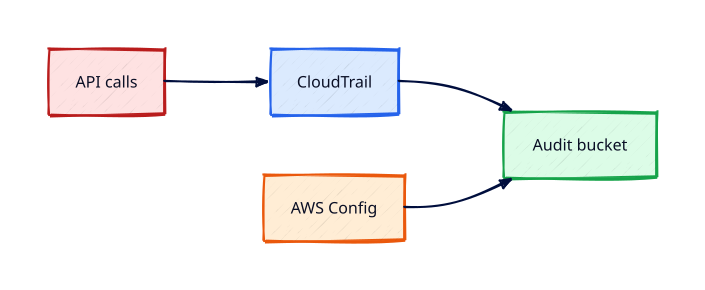

# CloudTrail, Config, and Account Guardrails

## Overview

**AWS CloudTrail** records API activity for audit. **AWS Config** tracks resource configuration
compliance over time. Together they provide guardrails and evidence for security and operations.

You will enable a trail delivering to S3, run sample API calls, query events, enable Config recorder
(awareness of cost), and review AWS **Control Tower** / **SCP** concepts for organisations.

This is **Tutorial 19** in **Module 6: Ops and Capstone** of the REBASH Academy AWS track.

!!! warning "Destroy lab resources and watch billing"
    Tear down every resource you create before you close your laptop. Set a **billing alarm**
    (see [Accounts, Free Tier, Billing, and Cost Hygiene](accounts-free-tier-billing-and-cost-hygiene.md))
    and check the Cost Explorer dashboard after each lab session.


## Prerequisites

- Completed [CloudWatch Metrics, Logs, and Alarms](cloudwatch-metrics-logs-and-alarms.md)

## Learning Objectives

By the end of this tutorial, you will be able to:

- [ ] Create multi-Region CloudTrail with S3 delivery and log file validation
- [ ] Look up events for IAM and EC2 API calls
- [ ] Enable AWS Config recorder and describe compliance (lab scope)
- [ ] Explain SCPs and AWS Organizations guardrails
- [ ] Delete lab trail and Config recorder to avoid storage charges

## Architecture




## Theory

### CloudTrail

- **Management events** — control plane (who created SG)
- **Data events** — S3 object ops (optional, extra cost)
- **Organization trail** — all accounts to central bucket

### AWS Config

Records configuration snapshots and rules (`s3-bucket-public-read-prohibited`).
Config items bill per recording — disable after lab.

### Guardrails hierarchy

| Layer | Example |
|-------|---------|
| SCP | Deny `ec2:RunInstances` except approved types |
| Config rule | Detect public SG |
| CloudTrail | Prove who changed SG |
| IAM policy | Least privilege daily access |

### Security Lake / CloudTrail Lake

Advanced query stores — awareness for SOC teams.

## Hands-on Lab

```bash
TRAIL_BUCKET=rebash-cloudtrail-$(aws sts get-caller-identity --query Account --output text)

aws s3api create-bucket --bucket $TRAIL_BUCKET --region $LAB_REGION \
  --create-bucket-configuration LocationConstraint=$LAB_REGION

aws cloudtrail create-trail --name rebash-org-trail --s3-bucket-name $TRAIL_BUCKET \
  --is-multi-region-trail --enable-log-file-validation --region $LAB_REGION

aws cloudtrail start-logging --name rebash-org-trail --region $LAB_REGION

aws iam list-users --region $LAB_REGION
aws cloudtrail lookup-events --lookup-attributes AttributeKey=EventName,AttributeValue=ListUsers \
  --max-results 5 --region $LAB_REGION

aws configservice put-configuration-recorder --configuration-recorder name=default,roleARN=$CONFIG_ROLE_ARN
aws configservice start-configuration-recorder --configuration-recorder-name default
aws configservice describe-compliance-by-config-rule --config-rule-names s3-bucket-public-read-prohibited
```

Teardown: stop logging, delete trail, empty bucket, stop Config recorder.

### LocalStack / dry-run alternative

With [LocalStack](https://localstack.cloud/) running on port 4566:

```bash
export AWS_ACCESS_KEY_ID=test
export AWS_SECRET_ACCESS_KEY=test
export AWS_DEFAULT_REGION=eu-west-1
aws --endpoint-url=http://localhost:4566 cloudtrail describe-trails
```

Some services are emulated imperfectly — treat LocalStack as CLI practice, not a full AWS substitute.

## Validation

| Check | Pass criteria |
|-------|---------------|
| Trail logging | `get-trail-status` IsLogging true |
| Lookup events | ListUsers event found |
| S3 delivery | Log objects appear in bucket |
| Config | Recorder started (optional rule compliance) |

## Code Walkthrough

| Component | Detail |
|-----------|--------|
| Log file validation | Detect tampering of trail files |
| Multi-Region | Captures activity in all Regions |
| Config timeline | Who changed resource when |
| SCP | Organisation-level deny/allow ceiling |

## Security Considerations

- Trail bucket policy allows CloudTrail service only
- Encrypt trail bucket with SSE-KMS
- Restrict `cloudtrail:StopLogging` to break-glass roles
- Centralise logs to security account in organisations

## Common Mistakes

!!! warning "Trail bucket public"
    Audit log exposure. **Fix:** Block Public Access on trail bucket.

!!! warning "Config left recording"
    Per-item charges. **Fix:** Stop recorder after lab.

!!! warning "No log validation"
    Tampering undetected. **Fix:** Enable validation on trails.

## Best Practices

- Organization trail to immutable S3 with lifecycle to Glacier
- Config conformance packs for CIS benchmarks
- Integrate with Security Hub for findings aggregation

## Troubleshooting

| Issue | Cause | Fix |
|-------|-------|-----|
| Trail not delivering | Bucket policy | Apply CloudTrail bucket policy template |
| Lookup empty | Wrong Region/attribute | Use event time window; correct EventName |
| Config failed | Missing service role | Create aws-config-role |

## Production Patterns and Deep Dive

        ### How `CloudTrail, Config, and Account Guardrails` fits in real environments

        Engineers working on **Module 6: Ops and Capstone** material use these concepts daily during design reviews,
        incident response, and cost optimisation workshops. The lab exercises prove you can execute;
        this section connects those commands to production trade-offs you will defend in interviews
        and on-call handovers.

        Production teams treating AWS as a first-class platform typically document:

        | Artefact | Purpose |
        |----------|---------|
        | Architecture decision record (ADR) | Why this service, alternatives rejected |
        | Runbook | Step-by-step operational procedures with rollback |
        | Teardown / DR checklist | What to destroy or fail over during exercises |
        | Cost owner | Who receives Budget alerts for resources tagged to this service |

        Always pair technical controls with **billing alarms** and a **destroy discipline** after
        experiments. The REBASH AWS track assumes British English documentation and explicit
        mention of Free Tier limits.

        ### Extended CLI and console reference

        The commands below extend the lab — run read-only variants first, then mutating operations
        in a non-production account. Replace `$LAB_REGION` and resource identifiers with your values.

        ```bash
aws cloudtrail describe-trails
aws cloudtrail get-trail-status --name rebash-org-trail
aws cloudtrail lookup-events --max-results 10
aws configservice describe-configuration-recorders
aws configservice describe-config-rules --config-rule-names s3-bucket-public-read-prohibited
aws organizations describe-organization
aws organizations list-policies --filter SERVICE_CONTROL_POLICY
```

        ### Operational scenario (table-top)

        **Scenario:** A teammate announces "customers cannot reach the application after a change."
        You suspect a misconfiguration related to **CloudTrail, Config, and Account Guardrails**.

        | Step | Action | Why |
        |------|--------|-----|
        | 1 | Confirm Region and account (`aws sts get-caller-identity`) | Wrong profile wastes triage time |
        | 2 | Check CloudWatch alarms and recent deploys | Correlates timeline |
        | 3 | Review CloudTrail events for API changes in this service | Identifies who changed what |
        | 4 | Compare running config to IaC/Terraform state | Detects manual console drift |
        | 5 | Roll back or restore last known good | Document in incident ticket |
        | 6 | Update runbook and least-privilege IAM if human error | Prevents repeat |

        ### Hardening checklist before production

        - [ ] IAM roles preferred over IAM users with long-lived keys
        - [ ] MFA enabled for privileged humans; root not used daily
        - [ ] Resources tagged `Environment`, `Owner`, `CostCentre`
        - [ ] Budgets and anomaly detection configured
        - [ ] Encryption at rest and in transit enabled where supported
        - [ ] No `0.0.0.0/0` administrative ports (use SSM Session Manager)
        - [ ] Teardown script or `terraform destroy` documented for non-prod environments
        - [ ] Cross-links reviewed: [Networking](../networking/index.md), [Linux](../linux/index.md), [Terraform](../terraform/index.md)

        ### When to choose a different AWS service

        No service exists in isolation. If **CloudTrail, Config, and Account Guardrails** feels forced, discuss alternatives with your
        team: managed versus self-managed, serverless versus EC2, or whether the workload belongs in
        another Region or account under AWS Organizations. Capture that decision in an ADR so future
        engineers understand the constraints you optimised for.

        ### Terraform handoff note

        After completing the AWS track, reproduce this tutorial's resources using modules in the
        [Terraform](../terraform/index.md) curriculum. Start with `required_providers` for `hashicorp/aws`,
        pin provider versions, store remote state in S3 with locking, and never commit secrets. The
        `cloudtrail-config-and-account-guardrails` lesson maps cleanly to named resources you will import or recreate in HCL.

        ### Review questions (self-check)

        Before moving to the next tutorial, answer without looking at notes:

        1. Which API calls in this lesson are **read-only** versus **mutating**?
        2. What is the first command you run to confirm account and Region?
        3. Which tags will you apply so Cost Explorer can attribute spend?
        4. How do you destroy lab resources created here?
        5. Which [Networking](../networking/index.md) or [Linux](../linux/index.md) concept underpins this AWS service?

        ### Additional references inside AWS

        Browse the official **AWS Documentation** centre for `CloudTrail, Config, and Account Guardrails` — focus on quotas, API permissions,
        and CloudWatch metrics emitted by the service. Bookmark the **Pricing** page for the service and
        add a line item to your personal cheat sheet noting Free Tier eligibility and the most common
        bill surprise mentioned in this tutorial.

## Summary

- CloudTrail proves **who did what**; Config tracks **resource state**
- Layer SCPs, Config rules, and IAM for defence in depth
- Delete lab trails and stop Config to control storage costs

## Interview Questions

1. Management vs data events in CloudTrail?
2. Why multi-Region trail?
3. Config vs CloudTrail?
4. SCP vs IAM policy?
5. Log file validation purpose?
6. CloudTrail Lake benefit?
7. How detect public S3 automatically?
8. Organization trail advantage?
9. Who can stop CloudTrail logging?
10. Immutable audit storage pattern?

!!! tip "Sample answer — question 3"
    CloudTrail is an event log of API calls — audit trail. Config is configuration snapshots over time with rules evaluating compliance — 'is this SG open now?' vs 'who opened it?' — complementary.


!!! tip "Sample answer — question 4"
    SCP is an organisation guardrail applied to accounts/OUs — maximum permissions ceiling even for admin IAM users in member accounts. IAM policies grant permissions within that ceiling.


## Related Tutorials

- Track overview: [AWS](index.md)
- Previous: [CloudWatch Metrics, Logs, and Alarms](cloudwatch-metrics-logs-and-alarms.md)
- Next: [Lambda and Three-Tier Capstone](lambda-and-three-tier-capstone.md)
- [Terraform track](../terraform/index.md) — automate these patterns next


## References

1. [AWS CloudTrail User Guide](https://docs.aws.amazon.com/awscloudtrail/latest/userguide/cloudtrail-user-guide.html)
2. [AWS Config](https://docs.aws.amazon.com/config/latest/developerguide/WhatIsConfig.html)
3. [Service control policies](https://docs.aws.amazon.com/organizations/latest/userguide/orgs_manage_policies_scps.html)
