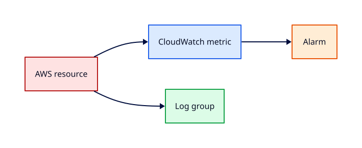

# CloudWatch Metrics, Logs, and Alarms

## Overview

**Amazon CloudWatch** collects metrics, logs, and alarms — the default observability layer for AWS.
Without it, you fly blind during incidents.

You will publish custom metrics, ship logs with the CloudWatch agent, create an alarm on CPU or
billing metric, and wire an SNS email notification — then delete alarms and log groups in teardown.

This is **Tutorial 18** in **Module 6: Ops and Capstone** of the REBASH Academy AWS track.

!!! warning "Destroy lab resources and watch billing"
    Tear down every resource you create before you close your laptop. Set a **billing alarm**
    (see [Accounts, Free Tier, Billing, and Cost Hygiene](accounts-free-tier-billing-and-cost-hygiene.md))
    and check the Cost Explorer dashboard after each lab session.


## Prerequisites

- Completed Module 5 tutorials
- Running or recently terminated EC2 lab

## Learning Objectives

By the end of this tutorial, you will be able to:

- [ ] Navigate EC2 and billing metrics namespaces
- [ ] Publish custom metric with `put-metric-data`
- [ ] Create log group and ingest sample logs
- [ ] Create alarm with SNS email action
- [ ] Delete alarms and log groups after lab

## Architecture




## Theory

### Metrics

- **AWS namespaces** — `AWS/EC2`, `AWS/RDS`, `AWS/Billing`
- **Custom namespaces** — your app KPIs
- Resolution: standard 1 min; high-resolution down to 1 sec (cost)

### Logs

- **Log groups / streams** — retention configurable (cost control)
- **CloudWatch agent** on EC2 for file metrics/logs
- **Logs Insights** query language for triage

### Alarms

States: OK, ALARM, INSUFFICIENT_DATA. Actions: SNS, Auto Scaling, EC2 recover.

### Billing alarm

Legacy `AWS/Billing` metric in `us-east-1` — prefer **AWS Budgets** (Tutorial 2) plus anomaly detection.

## Hands-on Lab

```bash
aws logs create-log-group --log-group-name /rebash/lab/app --region $LAB_REGION
aws logs put-log-events --log-group-name /rebash/lab/app --log-stream-name web-01 \
  --log-events timestamp=$(date +%s000),message="rebash lab log line"

aws cloudwatch put-metric-data --namespace Rebash/Lab \
  --metric-name ProcessedRequests --value 42 --unit Count --region $LAB_REGION

aws sns create-topic --name rebash-alarms --region $LAB_REGION
aws sns subscribe --topic-arn $SNS_ARN --protocol email --notification-endpoint you@example.com

aws cloudwatch put-metric-alarm \
  --alarm-name rebash-high-cpu \
  --metric-name CPUUtilization --namespace AWS/EC2 \
  --statistic Average --period 300 --threshold 70 --comparison-operator GreaterThanThreshold \
  --evaluation-periods 2 --dimensions Name=InstanceId,Value=$INSTANCE_ID \
  --alarm-actions $SNS_ARN --region $LAB_REGION
```

Teardown: delete alarms, log group, SNS subscriptions.

### LocalStack / dry-run alternative

With [LocalStack](https://localstack.cloud/) running on port 4566:

```bash
export AWS_ACCESS_KEY_ID=test
export AWS_SECRET_ACCESS_KEY=test
export AWS_DEFAULT_REGION=eu-west-1
aws --endpoint-url=http://localhost:4566 cloudwatch put-metric-data --namespace Lab --metric-name Test --value 1
```

Some services are emulated imperfectly — treat LocalStack as CLI practice, not a full AWS substitute.

## Validation

| Check | Pass criteria |
|-------|---------------|
| Log event | Visible in log group |
| Custom metric | Appears in console metrics |
| SNS | Subscription pending confirm email |
| Alarm | Shows configured threshold |

## Code Walkthrough

| Feature | Use |
|---------|-----|
| `put-metric-data` | Custom KPIs from scripts |
| Agent | Disk/mem logs from EC2 |
| Alarm actions | SNS for human notification |
| Retention | Set log group retention to control cost |

## Security Considerations

- Restrict `cloudwatch:PutMetricData` to trusted roles
- Encrypt log groups with KMS for sensitive apps
- SNS topic policies least privilege

## Common Mistakes

!!! warning "Infinite log retention"
    Storage cost grows. **Fix:** Set 7–30 day retention in labs.

!!! warning "Alarm without SNS confirm"
    Emails never arrive. **Fix:** Confirm subscription link.

!!! warning "Wrong Region for billing metric"
    Alarm INSUFFICIENT_DATA. **Fix:** Billing metrics only in us-east-1.

## Best Practices

- Dashboards per service with golden signals
- Logs Insights saved queries for incidents
- Composite alarms reduce noise

## Troubleshooting

| Issue | Cause | Fix |
|-------|-------|-----|
| INSUFFICIENT_DATA | Missing metric dimensions | Match instance ID exactly |
| No logs | Agent not running | Install CloudWatch agent |
| SNS no email | Unconfirmed subscription | Confirm via email link |

## Production Patterns and Deep Dive

        ### How `CloudWatch Metrics, Logs, and Alarms` fits in real environments

        Engineers working on **Module 6: Ops and Capstone** material use these concepts daily during design reviews,
        incident response, and cost optimisation workshops. The lab exercises prove you can execute;
        this section connects those commands to production trade-offs you will defend in interviews
        and on-call handovers.

        Production teams treating AWS as a first-class platform typically document:

        | Artefact | Purpose |
        |----------|---------|
        | Architecture decision record (ADR) | Why this service, alternatives rejected |
        | Runbook | Step-by-step operational procedures with rollback |
        | Teardown / DR checklist | What to destroy or fail over during exercises |
        | Cost owner | Who receives Budget alerts for resources tagged to this service |

        Always pair technical controls with **billing alarms** and a **destroy discipline** after
        experiments. The REBASH AWS track assumes British English documentation and explicit
        mention of Free Tier limits.

        ### Extended CLI and console reference

        The commands below extend the lab — run read-only variants first, then mutating operations
        in a non-production account. Replace `$LAB_REGION` and resource identifiers with your values.

        ```bash
aws cloudwatch list-metrics --namespace AWS/EC2 --dimensions Name=InstanceId,Value=$INSTANCE_ID
aws cloudwatch get-metric-statistics --namespace AWS/EC2 --metric-name CPUUtilization \
  --start-time 2026-07-28T00:00:00Z --end-time 2026-07-28T01:00:00Z --period 300 --statistics Average
aws logs filter-log-events --log-group-name /rebash/lab/app --filter-pattern "ERROR"
aws logs put-retention-policy --log-group-name /rebash/lab/app --retention-in-days 7
aws cloudwatch describe-alarms --alarm-names rebash-high-cpu
```

        ### Operational scenario (table-top)

        **Scenario:** A teammate announces "customers cannot reach the application after a change."
        You suspect a misconfiguration related to **CloudWatch Metrics, Logs, and Alarms**.

        | Step | Action | Why |
        |------|--------|-----|
        | 1 | Confirm Region and account (`aws sts get-caller-identity`) | Wrong profile wastes triage time |
        | 2 | Check CloudWatch alarms and recent deploys | Correlates timeline |
        | 3 | Review CloudTrail events for API changes in this service | Identifies who changed what |
        | 4 | Compare running config to IaC/Terraform state | Detects manual console drift |
        | 5 | Roll back or restore last known good | Document in incident ticket |
        | 6 | Update runbook and least-privilege IAM if human error | Prevents repeat |

        ### Hardening checklist before production

        - [ ] IAM roles preferred over IAM users with long-lived keys
        - [ ] MFA enabled for privileged humans; root not used daily
        - [ ] Resources tagged `Environment`, `Owner`, `CostCentre`
        - [ ] Budgets and anomaly detection configured
        - [ ] Encryption at rest and in transit enabled where supported
        - [ ] No `0.0.0.0/0` administrative ports (use SSM Session Manager)
        - [ ] Teardown script or `terraform destroy` documented for non-prod environments
        - [ ] Cross-links reviewed: [Networking](../networking/index.md), [Linux](../linux/index.md), [Terraform](../terraform/index.md)

        ### When to choose a different AWS service

        No service exists in isolation. If **CloudWatch Metrics, Logs, and Alarms** feels forced, discuss alternatives with your
        team: managed versus self-managed, serverless versus EC2, or whether the workload belongs in
        another Region or account under AWS Organizations. Capture that decision in an ADR so future
        engineers understand the constraints you optimised for.

        ### Terraform handoff note

        After completing the AWS track, reproduce this tutorial's resources using modules in the
        [Terraform](../terraform/index.md) curriculum. Start with `required_providers` for `hashicorp/aws`,
        pin provider versions, store remote state in S3 with locking, and never commit secrets. The
        `cloudwatch-metrics-logs-and-alarms` lesson maps cleanly to named resources you will import or recreate in HCL.

        ### Review questions (self-check)

        Before moving to the next tutorial, answer without looking at notes:

        1. Which API calls in this lesson are **read-only** versus **mutating**?
        2. What is the first command you run to confirm account and Region?
        3. Which tags will you apply so Cost Explorer can attribute spend?
        4. How do you destroy lab resources created here?
        5. Which [Networking](../networking/index.md) or [Linux](../linux/index.md) concept underpins this AWS service?

        ### Additional references inside AWS

        Browse the official **AWS Documentation** centre for `CloudWatch Metrics, Logs, and Alarms` — focus on quotas, API permissions,
        and CloudWatch metrics emitted by the service. Bookmark the **Pricing** page for the service and
        add a line item to your personal cheat sheet noting Free Tier eligibility and the most common
        bill surprise mentioned in this tutorial.

## Summary

- CloudWatch metrics, logs, and alarms form the AWS observability baseline
- Pair with SNS for human alerts; use Budgets for cost
- Set log retention and delete lab alarms after validation

## Interview Questions

1. Standard vs high-resolution metrics?
2. Logs Insights vs Athena on S3 logs?
3. Alarm state INSUFFICIENT_DATA meaning?
4. Where billing metric lives?
5. CloudWatch agent vs embedded metric format?
6. Composite alarm benefit?
7. Metric dimensions purpose?
8. Cross-account observability?
9. Retention cost control?
10. EventBridge vs CloudWatch alarms?

!!! tip "Sample answer — question 3"
    Alarm lacks enough data points in evaluation periods — new metric, stopped instance, or wrong dimension. Not OK or ALARM — no action fires until data exists.


!!! tip "Sample answer — question 4"
    Estimated charges metric for billing alarms is published in us-east-1 regardless of resource Regions — a common exam trap.


## Related Tutorials

- Track overview: [AWS](index.md)
- Previous: [Auto Scaling Groups and Launch Templates](auto-scaling-groups-and-launch-templates.md)
- Next: [CloudTrail, Config, and Account Guardrails](cloudtrail-config-and-account-guardrails.md)
- [Terraform track](../terraform/index.md) — automate these patterns next


## References

1. [Amazon CloudWatch User Guide](https://docs.aws.amazon.com/AmazonCloudWatch/latest/monitoring/WhatIsCloudWatch.html)
2. [CloudWatch Logs](https://docs.aws.amazon.com/AmazonCloudWatch/latest/logs/WhatIsCloudWatchLogs.html)
3. [Using alarms](https://docs.aws.amazon.com/AmazonCloudWatch/latest/monitoring/AlarmThatSendsEmail.html)
