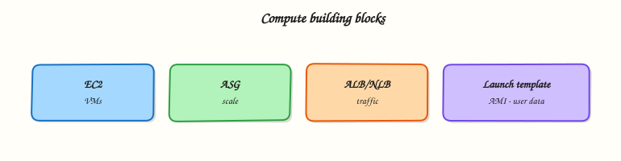

# Compute: EC2, ASG, and Load Balancing

## Overview


Provision and scale Amazon Elastic Compute Cloud (EC2) safely: Amazon Machine Images (AMIs), launch templates, Auto Scaling groups (ASGs), placement, Elastic IP (EIP) awareness, and Elastic Load Balancing with Application Load Balancer (ALB) and Network Load Balancer (NLB).

EC2 is virtual servers in your Virtual Private Cloud (VPC). Production systems rarely run a single instance: you use **launch templates**, **ASGs** across Availability Zones (AZs), and a **load balancer** for health checks and traffic distribution. This module connects compute to the networking patterns from Module 3.

!!! warning "Cost"
    Running EC2, ALB/NLB, NAT, and unattached Elastic IPs incurs charges. Prefer **`t3.micro` / Free Tier** types, **`--dry-run`**, stop or terminate promptly, and delete load balancers and target groups. Spot is cheaper but interruptible — not for this first lab unless you accept interruption.

This is a core tutorial in **Module 4 · Compute** of the REBASH Academy **AWS for Cloud & DevOps Engineers** series — written for Cloud, DevOps, Platform, and SRE engineers.

## Prerequisites


- [VPC Networking on AWS](vpc-networking-on-aws.md)
- IAM rights to describe (and optionally run) EC2 / ELB APIs

## Learning Objectives


By the end of this tutorial, you will be able to:

- [ ] Choose instance family, AMI, launch template, and subnet for a workload  
- [ ] Design a multi-AZ Auto Scaling group with desired/min/max and health replacement  
- [ ] Contrast placement group strategies and Elastic IP anti-patterns  
- [ ] Choose Application, Network, or Gateway Load Balancer for a traffic pattern  
- [ ] Sketch ALB → target group → ASG with safe lab teardown

## Architecture


This topic’s control points and relationships are shown below.



## Theory


### What it is

**Amazon Elastic Compute Cloud (EC2)** provides resizable virtual machines in your Virtual Private Cloud (VPC). Production systems rarely run a single instance: you encode launch configuration in **Amazon Machine Images (AMIs)** and **launch templates**, keep capacity with **Auto Scaling groups (ASGs)**, optionally control placement, and put **Elastic Load Balancing** in front for health checks and traffic distribution. This module connects compute to the networking patterns from Module 3.

### Why it matters

Continuous Delivery needs golden AMIs or controlled bootstrap plus ASG rolling refreshes — not snowflake servers. Platform teams place ALBs, target groups, and health checks in front so SRE can drain connections during deploys. DevSecOps uses least-privilege instance profiles and Session Manager instead of open SSH to the internet. Wrong balancer choice or Elastic IP habits on fleets create cost, scaling, and security debt.

### How it works

1. Choose an AMI and instance type.  
2. Apps in **private subnets**; load balancer in **public subnets**.  
3. Encode AMI, type, security groups, IAM instance profile, user data, and volumes in a **launch template**; the ASG pins a version.  
4. Target group + listener (for example `443`); health checks drive ASG replacement.  
5. Scaling policies adjust desired capacity; three-tier path: ALB → app ASG → database (Module 6).

Keep user data short and idempotent; prefer baked images for production.

### Concept deep dive

- **EC2** — Virtual servers with chosen CPU, memory, networking, and storage. You pay while instances run (and for some attached resources when stopped). Pick families for general purpose, compute, memory, or storage-optimised work; start labs on Free Tier–eligible types.
- **AMIs** — Bootable templates that include the root volume snapshot, launch permissions, and block-device mapping. Use Amazon-published images for learning; use organisation golden AMIs (patched, hardened, agents preinstalled) for production fleets.
- **Launch templates** — Versioned launch specifications: AMI, instance type, key pair (optional), security groups, IAM instance profile, user data, and Elastic Block Store mappings. Prefer launch templates over legacy launch configurations. ASGs and `RunInstances` both consume them.
- **Auto Scaling** — An ASG maintains **desired** capacity between **min** and **max**. It launches and terminates instances across subnets/AZs, replaces instances that fail ELB or EC2 health checks, and scales on CloudWatch metrics, schedules, or predictive policies. Rolling instance refresh updates the fleet to a new launch-template version.
- **Placement groups** — **Cluster** packs instances close together for low latency (same AZ, risk of correlated failure). **Spread** places instances on distinct hardware to reduce blast radius (limits on count). **Partition** spreads across racks/partitions for large distributed datastores. Default (no placement group) is fine for most web tiers.
- **Elastic IP (EIP)** — A static public IPv4 address you can remap. Useful for rare fixed endpoints or migration windows. Costly when unattached; an anti-pattern on every ASG member — prefer load balancers or DNS that tracks changing private/public IPs.
- **Load balancers** — **Application Load Balancer (ALB)** operates at Layer 7 (HTTP/HTTPS): host/path routing, TLS termination, container and microservice targets. **Network Load Balancer (NLB)** operates at Layer 4 (TCP/UDP/TLS): ultra-low latency, static IPs, PrivateLink. **Gateway Load Balancer (GWLB)** steers traffic through third-party virtual appliances (firewalls, inspection) using GENEVE — use when you insert inline network functions, not for ordinary web apps.

### Key concepts and comparisons

| Concept | Guidance |
|---------|----------|
| Instance profile | IAM role on the instance — preferred credential source |
| Desired / min / max | ASG capacity bounds and scaling headroom |
| Target group | Health checks + routing destination for ELB |
| ALB vs NLB vs GWLB | L7 apps → ALB; L4/static IP → NLB; appliances → GWLB |
| Connection draining | Deregistration delay for in-flight requests |
| IMDSv2 | Require tokens for instance metadata (SSRF defence) |
| Spot vs On-Demand | Cost versus interruption risk |

### Common pitfalls

- Calling a single instance in one AZ “production”  
- Public IP plus wide SSH security group instead of Session Manager  
- Using launch configurations (legacy) instead of launch templates  
- ALB without health checks, or checks that hit the wrong path  
- Forgetting to delete ALB/NLB after labs (hourly charge)  
- Elastic IPs left unassociated or glued to every ASG member  
- Choosing GWLB when you only needed an ALB for HTTP routing

## Hands-on Lab


!!! warning "Cost and account safety"
    Use a sandbox account. Prefer read-only calls. Destroy anything you create before leaving the lab.

### Objective

Use read-only AWS APIs to inventory and verify aspects of **Compute: EC2, ASG, and Load Balancing** in a sandbox account.

### Prerequisites

- AWS CLI v2
- Credentials for a **sandbox** account (SSO or short-lived keys)

### Lab environment

Workspace: `~/rebash-aws/module-04`

Prefer `describe`/`list`/`get` APIs. Create resources only with an explicit destroy path.

```bash title="Terminal"
mkdir -p ~/rebash-aws/module-04 && cd ~/rebash-aws/module-04
```

### Real-world scenario

Security asks for evidence that **Compute: EC2, ASG, and Load Balancing** is configured correctly. You gather CLI proof without click-ops drift.

### Step-by-step tasks

#### Task 1 – Prove caller identity

Every AWS change starts by knowing which account/role you are.

```bash title="Terminal"
aws sts get-caller-identity | tee identity.json
aws configure get region || true
test -s identity.json
```

!!! example "Expected output"
    JSON includes Account, Arn, and UserId.


#### Task 2 – Collect topic signals

Inventory the service surface related to this module.

```bash title="Terminal"
aws ec2 describe-vpcs --query 'Vpcs[].{Id:VpcId,Cidr:CidrBlock}' --output table 2>/dev/null | tee vpcs.txt || true
aws iam get-account-summary 2>/dev/null | tee iam-summary.json || true
tee notes.txt << 'EOF'
Record which APIs apply to this topic and any NotAuthorized errors for follow-up.
EOF
cat notes.txt
```

!!! example "Expected output"
    Evidence files created even if some APIs are denied.


### Validation steps

- [ ] identity.json present
- [ ] No long-lived keys committed to the repo

### Common errors and fixes

| Error | Cause | Fix |
|-------|-------|-----|
| Unable to locate credentials | No profile/SSO | Run `aws sso login` or export sandbox keys |
| AccessDenied | Least privilege | Use a role that can read the service — or document the deny |
| UnauthorizedOperation | Wrong region/account | Check `AWS_REGION` and account id |

### Challenge exercise

Enable a cost budget alarm in the sandbox (or document the console clicks) and screenshot/CLI-describe it.

### Learning outcomes

- Authenticated safely
- Captured read-only evidence
- Avoided unmanaged spend

### Cleanup

```bash
# Revoke/lab-expire any temporary keys you exported
# Do not leave EC2/ELB/NAT running
```

## Validation


- [ ] Lab commands run under `~/rebash-aws/module-04/`
- [ ] You can explain each Theory section in your own words
- [ ] You used modern tooling where it applies to this topic
- [ ] You can describe one production failure mode for this topic

## Code Walkthrough


Production practice for **Compute: EC2, ASG, and Load Balancing** always combines:

1. Inspect before you change (status, plan, logs, dry-run)
2. Prefer reversible, documented changes (Git, IaC, drop-ins, version pins)
3. Capture evidence (command output, pipeline logs) for handovers
4. Prefer current tools and APIs over legacy shortcuts
5. Least privilege — escalate credentials only when required

Keep runbooks short enough to follow under pressure. Automate checks; keep humans for judgement.

## Security Considerations


- Treat credentials and tokens for aws as privileged — never commit them
- Prefer short-lived auth (OIDC, roles, SSO) over long-lived keys
- Validate blast radius before apply/deploy/delete operations
- Restrict who can approve production changes
- Collect audit logs; limit who can read sensitive traces

## Common Mistakes


!!! warning "Calling a single instance in one AZ “production”  "
    Validate assumptions against the Theory section and official docs before changing production.

!!! warning "Public IP plus wide SSH security group instead of Session Manager  "
    Lab shortcuts (open security groups, admin roles, skip approvals) must not ship unchanged.

!!! warning "Changing production without a rollback path"
    Always know how to revert (previous artefact, prior release, state rollback, DNS failback).

## Best Practices


- Encode Compute: EC2, ASG, and Load Balancing changes as code and review them in pull requests
- Pin versions (images, modules, actions, provider plugins)
- Separate environments with clear promotion gates
- Alert on symptoms with runbooks attached
- Destroy lab resources; tag everything with owner and expiry where possible

## Troubleshooting


| Symptom | Likely cause | Fix |
|---------|--------------|-----|
| Auth / permission denied | Wrong identity, policy, or scope | Check caller identity, roles, and least-privilege policies |
| Timeout / no route | Network, DNS, security group, or endpoint | Trace path, DNS, and allow-lists before retrying |
| Drift / unexpected plan | Manual change or wrong state/workspace | Reconcile desired vs actual; avoid click-ops on managed resources |
| Pipeline/job red | Flaky step, cache, or missing secret | Read failing step logs; bisect recent workflow/config changes |
| Cost spike | Idle load balancer, NAT, oversized compute | Inventory billable resources; stop/delete labs promptly |

## Summary


**Compute: EC2, ASG, and Load Balancing** is essential for Cloud and DevOps engineers working with aws. Practise the lab until the inspection and change path is muscle memory, then continue the track.

## Interview Questions


1. ASG desired/min/max — what do they mean?
2. ALB versus NLB versus CLB?
3. Instance unhealthy behind ALB — checks?
4. Implications of stopping versus terminating?
5. How do launch templates improve consistency?

!!! tip "Sample answer — question 2"
    Check instance state, status checks, and load balancer target health before resizing.

!!! tip "Sample answer — question 4"
    Use IMDSv2, least-privilege instance roles, and terminate lab instances promptly.

## Related Tutorials


- [Course overview](index.md)
- [Storage: S3, EBS, and EFS](storage-s3-ebs-efs.md)

## References


- [Amazon EC2 User Guide](https://docs.aws.amazon.com/AWSEC2/latest/UserGuide/concepts.html)  
- [Launch templates](https://docs.aws.amazon.com/AWSEC2/latest/UserGuide/ec2-launch-templates.html)  
- [Auto Scaling groups](https://docs.aws.amazon.com/autoscaling/ec2/userguide/auto-scaling-groups.html)  
- [Elastic Load Balancing](https://docs.aws.amazon.com/elasticloadbalancing/latest/userguide/what-is-load-balancing.html)
