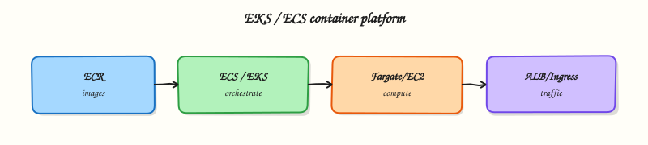

# Containers on AWS — ECS, EKS, ECR, and App Runner

## Overview


Map Amazon Elastic Container Registry (ECR), Elastic Container Service (ECS), Elastic Kubernetes Service (EKS), AWS Fargate, and AWS App Runner so you can pick a platform, sketch a deploy path, and avoid leaving expensive clusters running after a lab.

AWS offers several ways to run containers. **ECR** stores images. **ECS** is AWS-native orchestration (tasks and services). **EKS** is managed Kubernetes. **Fargate** runs tasks or pods without you managing EC2 capacity. **App Runner** is a higher-level PaaS for HTTP services from a source or image. Production designs usually pair a registry, an orchestrator, IAM task/pod roles, private networking, and observability — not a single “container button”.

This is a core tutorial in **Module 7 · Containers** of the REBASH Academy **AWS for Cloud & DevOps Engineers** series — written for Cloud, DevOps, Platform, and SRE engineers.

## Prerequisites


- [Databases on AWS](databases-on-aws.md) (or equivalent VPC and IAM comfort)
- Docker fundamentals and a working AWS CLI profile
- Optional: kubectl experience for the EKS mental model

## Learning Objectives


By the end of this tutorial, you will be able to:

- [ ] Contrast ECS tasks/services with EKS pods and when to use each  
- [ ] Place Fargate, ECR, and App Runner in a deploy path  
- [ ] Choose ECS vs EKS vs App Runner for a given workload  
- [ ] Sketch task/pod IAM roles and private pull from ECR  
- [ ] Apply cost hygiene: no long-lived lab EKS/ECS clusters

## Architecture


This topic’s control points and relationships are shown below.



## Theory


### What it is

AWS offers several ways to run containers. **Amazon Elastic Container Registry (ECR)** stores images. **Amazon Elastic Container Service (ECS)** is AWS-native orchestration (tasks and services). **Amazon Elastic Kubernetes Service (EKS)** is managed Kubernetes. **AWS Fargate** runs ECS tasks or EKS pods without managing EC2 capacity. **AWS App Runner** turns a source repository or image into an HTTPS service with minimal cluster concepts. Production designs pair a registry, an orchestrator, IAM roles, private networking, and observability.

### Why it matters

ECS is AWS-native and simpler for many teams. EKS unlocks Helm, operators, and portable Kubernetes skills at higher day-two cost. Fargate raises unit price but removes node patching. App Runner is fastest to a URL, with less VPC control. Platform and DevOps teams own image provenance, deploy pipelines, task/pod IAM, and cost guardrails so a lab cluster never becomes a permanent bill.

### How it works

1. Build and push to ECR (`aws ecr get-login-password` → `docker push`).  
2. **ECS:** register a task definition; create cluster/service; ALB targets healthy tasks.  
3. **EKS:** create cluster and capacity; map IAM to Kubernetes RBAC; deploy; pull from ECR via node or pod identity.  
4. **Fargate:** set CPU/memory; AWS places the task/pod in your subnets — no EC2 node group.  
5. **App Runner:** connect ECR or source; AWS provisions compute and a URL.

Shared concerns: private pull (VPC endpoints), scanning, least-privilege roles, and logs.

### Concept deep dive

- **ECS** — AWS-native scheduler. A **task definition** declares image, CPU/memory, ports, IAM roles, and logging. A **task** is a running instance; a **service** keeps desired count and can register with a load balancer. Capacity is EC2 you manage or Fargate. Prefer ECS for deep AWS integration without operating Kubernetes.
- **EKS** — Managed Kubernetes control plane. You run **pods** (Deployments, Services, Ingress) against the Kubernetes API. You still own node groups or Fargate profiles, add-ons, upgrades, and RBAC. Prefer EKS when teams standardise on Kubernetes tooling and operators.
- **Fargate** — Serverless container compute for ECS or EKS. No SSH to nodes or AMI patching; pay for vCPU/memory while tasks/pods run. Good for spiky or low-ops work; EC2 capacity may win for specialised types, DaemonSets, or steady high utilisation.
- **ECR** — Managed OCI registry. Repositories hold tags/digests; lifecycle policies expire old images; scan-on-push finds common CVEs. ECS, EKS, and App Runner commonly pull from ECR. Prefer immutable tags or digests in production.
- **App Runner** — PaaS-style HTTP from an image or source. AWS manages scaling and a default HTTPS endpoint. Prefer for simple public APIs; prefer ECS/EKS for rich VPC design, sidecars, meshes, or non-HTTP workloads.
- **Tasks/services vs pods** — ECS **tasks** are scheduled units; **services** keep N tasks healthy behind a balancer. Kubernetes **pods** are scheduled units; Deployments keep N pods; Services/Ingress expose them. Concepts map loosely, but APIs and networking differ — `kubectl` skills do not transfer unchanged to ECS.
- **When ECS vs EKS vs App Runner** — AWS-centric microservices + ALB → **ECS** (often + Fargate). Multi-team Helm/operators/portability → **EKS**. Single HTTP service, minimal ops → **App Runner**. Choose deliberately; many orgs run both ECS and EKS for different jobs.

### Key concepts and comparisons

| Concern | Prefer |
|---------|--------|
| Fewer AWS-native moving parts | ECS |
| Kubernetes ecosystem / operators | EKS |
| No nodes to patch | Fargate (ECS or EKS) |
| One HTTP service quickly | App Runner |
| Reproducible images | ECR digests / immutable tags |
| Workload credentials | ECS task roles; EKS IRSA / pod identity |

Prefer **task roles** (ECS) and **IAM Roles for Service Accounts (IRSA) / pod identity** (EKS) over access keys baked into images.

### Common pitfalls

- Leaving EKS/ECS capacity running overnight — control planes and nodes bill continuously  
- Shipping `:latest` in production — non-reproducible rollbacks  
- Treating Fargate as free — you still pay vCPU-hours  
- Expecting App Runner to replace a full multi-tier VPC design  
- Equating ECS services with Kubernetes Deployments without learning the networking differences  
- Granting cluster-admin to every CI identity

## Hands-on Lab


!!! warning "Cost and account safety"
    Use a sandbox account. Prefer read-only calls. Destroy anything you create before leaving the lab.

### Objective

Use read-only AWS APIs to inventory and verify aspects of **Containers on AWS — ECS, EKS, ECR, and App Runner** in a sandbox account.

### Prerequisites

- AWS CLI v2
- Credentials for a **sandbox** account (SSO or short-lived keys)

### Lab environment

Workspace: `~/rebash-aws/module-07`

Prefer `describe`/`list`/`get` APIs. Create resources only with an explicit destroy path.

```bash
mkdir -p ~/rebash-aws/module-07 && cd ~/rebash-aws/module-07
```

### Real-world scenario

Security asks for evidence that **Containers on AWS — ECS, EKS, ECR, and App Runner** is configured correctly. You gather CLI proof without click-ops drift.

### Step-by-step tasks

#### Task 1 – Prove caller identity

Every AWS change starts by knowing which account/role you are.

```bash
aws sts get-caller-identity | tee identity.json
aws configure get region || true
test -s identity.json
```

**Expected output:** JSON includes Account, Arn, and UserId.

#### Task 2 – Collect topic signals

Inventory the service surface related to this module.

```bash
aws ec2 describe-vpcs --query 'Vpcs[].{Id:VpcId,Cidr:CidrBlock}' --output table 2>/dev/null | tee vpcs.txt || true
aws iam get-account-summary 2>/dev/null | tee iam-summary.json || true
tee notes.txt << 'EOF'
Record which APIs apply to this topic and any NotAuthorized errors for follow-up.
EOF
cat notes.txt
```

**Expected output:** Evidence files created even if some APIs are denied.

### Validation steps

- [ ] identity.json present
- [ ] No long-lived keys committed to the repo

### Common errors and fixes

| Error | Cause | Fix |
|-------|-------|-----|
| Unable to locate credentials | No profile/SSO | Run `aws sso login` or export sandbox keys |
| AccessDenied | Least privilege | Use a role that can read the service — or document the deny |
| UnauthorizedOperation | Wrong region/account | Check `AWS_REGION` and account id |

### Challenge exercise

Enable a cost budget alarm in the sandbox (or document the console clicks) and screenshot/CLI-describe it.

### Learning outcomes

- Authenticated safely
- Captured read-only evidence
- Avoided unmanaged spend

### Cleanup

```bash
# Revoke/lab-expire any temporary keys you exported
# Do not leave EC2/ELB/NAT running
```

## Validation


- [ ] Lab commands run under `~/rebash-aws/module-07/`
- [ ] You can explain each Theory section in your own words
- [ ] You used modern tooling where it applies to this topic
- [ ] You can describe one production failure mode for this topic

## Code Walkthrough


Production practice for **Containers on AWS — ECS, EKS, ECR, and App Runner** always combines:

1. Inspect before you change (status, plan, logs, dry-run)
2. Prefer reversible, documented changes (Git, IaC, drop-ins, version pins)
3. Capture evidence (command output, pipeline logs) for handovers
4. Prefer current tools and APIs over legacy shortcuts
5. Least privilege — escalate credentials only when required

Keep runbooks short enough to follow under pressure. Automate checks; keep humans for judgement.

## Security Considerations


- Treat credentials and tokens for aws as privileged — never commit them
- Prefer short-lived auth (OIDC, roles, SSO) over long-lived keys
- Validate blast radius before apply/deploy/delete operations
- Restrict who can approve production changes
- Collect audit logs; limit who can read sensitive traces

## Common Mistakes


!!! warning "Leaving EKS/ECS capacity running overnight — control planes and nodes bill continuously  "
    Validate assumptions against the Theory section and official docs before changing production.

!!! warning "Shipping `:latest` in production — non-reproducible rollbacks  "
    Lab shortcuts (open security groups, admin roles, skip approvals) must not ship unchanged.

!!! warning "Changing production without a rollback path"
    Always know how to revert (previous artefact, prior release, state rollback, DNS failback).

## Best Practices


- Encode Containers on AWS — ECS, EKS, ECR, and App Runner changes as code and review them in pull requests
- Pin versions (images, modules, actions, provider plugins)
- Separate environments with clear promotion gates
- Alert on symptoms with runbooks attached
- Destroy lab resources; tag everything with owner and expiry where possible

## Troubleshooting


| Symptom | Likely cause | Fix |
|---------|--------------|-----|
| Auth / permission denied | Wrong identity, policy, or scope | Check caller identity, roles, and least-privilege policies |
| Timeout / no route | Network, DNS, security group, or endpoint | Trace path, DNS, and allow-lists before retrying |
| Drift / unexpected plan | Manual change or wrong state/workspace | Reconcile desired vs actual; avoid click-ops on managed resources |
| Pipeline/job red | Flaky step, cache, or missing secret | Read failing step logs; bisect recent workflow/config changes |
| Cost spike | Idle load balancer, NAT, oversized compute | Inventory billable resources; stop/delete labs promptly |

## Summary


**Containers on AWS — ECS, EKS, ECR, and App Runner** is essential for Cloud and DevOps engineers working with aws. Practise the lab until the inspection and change path is muscle memory, then continue the track.

## Interview Questions


1. ECR digest pins — why?
2. ECS versus EKS decision factors?
3. How do tasks/pods get AWS permissions?
4. ImagePullBackOff equivalent on ECS?
5. Control plane cost differences?

!!! tip "Sample answer — question 2"
    Verify repository permissions, image URI/digest, and task/execution roles.

!!! tip "Sample answer — question 4"
    Scan images, least-privilege task roles, and delete unused ECR images/repos in labs.

## Related Tutorials


- [Course overview](index.md)
- [Serverless on AWS](serverless-on-aws.md)

## References


- [Amazon ECR User Guide](https://docs.aws.amazon.com/AmazonECR/latest/userguide/what-is-ecr.html)  
- [Amazon ECS Developer Guide](https://docs.aws.amazon.com/AmazonECS/latest/developerguide/Welcome.html)  
- [Amazon EKS User Guide](https://docs.aws.amazon.com/eks/latest/userguide/what-is-eks.html)  
- [AWS Fargate](https://docs.aws.amazon.com/AmazonECS/latest/developerguide/AWS_Fargate.html)  
- [AWS App Runner](https://docs.aws.amazon.com/apprunner/latest/dg/what-is-apprunner.html)
