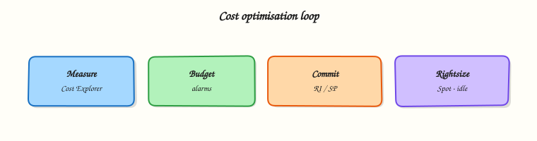

# Cost Optimisation on AWS

## Overview


Read Amazon Web Services (AWS) bills with intent: know pricing models, use Cost Explorer and Budgets, and apply Savings Plans, Reserved Instances (RIs), Spot, and Trusted Advisor recommendations without breaking reliability.

Cloud cost is an engineering problem. Idle NAT Gateways, oversized Amazon Elastic Compute Cloud (EC2) instances, unattached Elastic Block Store (EBS) volumes, and forgotten load balancers dominate surprise invoices. **FinOps** (cloud financial operations) means visibility, ownership via tags, and continuous right-sizing — not a once-a-year discount purchase.

!!! warning "Cost hygiene"
    Enable Cost Explorer and a monthly Budget with email alerts before you buy Savings Plans. Never commit multi-year discounts without 30 days of usage data.

This is a core tutorial in **Module 13 · Cost Optimisation** of the REBASH Academy **AWS for Cloud & DevOps Engineers** series — written for Cloud, DevOps, Platform, and SRE engineers.


## Prerequisites


- [CI/CD on AWS](cicd-on-aws.md)
- Billing access (or a read-only billing view) in a sandbox or shared account
- Familiarity with EC2, Amazon Simple Storage Service (S3), and networking cost drivers from earlier modules


## Learning Objectives


By the end of this tutorial, you will be able to:

- [ ] Contrast On-Demand, Spot, Savings Plans, and Reserved Instances  
- [ ] Navigate Cost Explorer by service, tag, and account  
- [ ] Create a Budget with alert thresholds  
- [ ] Interpret Trusted Advisor cost checks safely  
- [ ] List top waste patterns and how to eliminate them


## Architecture


This topic’s control points and relationships are shown below.




## Theory


### What it is

**Cost optimisation on AWS** matches capacity and purchase model to demand while preserving SLOs. Combine **pricing models** (On-Demand, Spot, Savings Plans, Reserved Instances), **visibility** (Cost Explorer, Budgets, Trusted Advisor), and hygiene (right-sizing, lifecycle, fewer idle NAT Gateways). Cost allocation tags and Organizations cost categories enable FinOps showback/chargeback.

| Lever | Idea |
|-------|------|
| On-Demand | Flexible; highest unit price |
| Spot | Deep discount; interruptible |
| Savings Plans | Commit $/hour compute (1–3 years) |
| Reserved Instances | Commit to specific attributes/capacity |
| Cost Explorer | Visualise and group spend |
| Budgets | Alert on actual/forecast thresholds |
| Trusted Advisor | Cost checks (by Support tier) |

### Why it matters

Platforms that ignore unit cost become unaffordable. SRE balances Multi-AZ reliability against idle waste; staging left 24×7 doubles bills. Interviews expect purchase-option literacy *and* waste elimination. Cost spikes are also incidents — runaway ASG, data transfer, or logging.

### How it works

1. Enable Cost Explorer and cost allocation tags; separate prod/dev accounts.
2. Baseline two to four weeks before large commitments.
3. Kill waste: idle resources, right-size, S3 lifecycle, endpoints instead of NAT where possible.
4. Commit: Savings Plans for steady compute; Spot for interruptible fleets; RIs when footprint is stable/specific.
5. Govern: Budgets + anomaly detection; showback by `Owner`/`CostCenter`; Trusted Advisor / Compute Optimizer reviews.

### Concept deep dive

**On-Demand** — default for spiky or unknown work. **Spot** — spare EC2 at large discount; handle interruption/rebalance; diversify types/AZs; keep a minimum On-Demand floor for capacity that must not die; never the sole copy of a stateful single-AZ database. **Savings Plans** — commit $/hour for 1–3 years. **Compute SP** flexes across family/size/OS/Region and covers much Fargate/Lambda usage; **EC2 Instance SP** is narrower/deeper for a fixed family. **Reserved Instances** still matter for some database/cache commitments and capacity reservation; for EC2, many orgs prefer Compute SP. Unused commitment is wasted money — cover the *stable baseline*, not 100% of peak.

**Cost Explorer** groups by service, account, Region, tag; prefer amortised views with upfront fees; inspect EC2-Other, transfer, and NAT lines. **Budgets** alert at 50/80/100% actual or forecast via SNS; optional budget actions in non-prod; pair with Cost Anomaly Detection. **Trusted Advisor** cost checks (idle LBs, underutilised EC2, free Elastic IPs, …) depend on Support plan — verify with metrics before terminate. **Compute Optimizer** complements rightsizing for EC2, ASG, EBS, and Lambda.

### Key concepts and comparisons

| Option | Best for | Risk |
|--------|----------|------|
| On-Demand | Spiky / short-lived | Higher unit cost |
| Spot | Stateless / interruptible | Interruption |
| Compute Savings Plan | Broad steady compute | Mis-sized commitment |
| EC2 Instance SP / RI | Stable specific footprint | Lock-in |

| Term | Meaning |
|------|---------|
| Amortised cost | Spreads upfront fees across the term |
| Rightsizing | Match size/family to utilisation |
| Showback / chargeback | Attribute tagged spend to teams |
| FinOps | Continuous visibility, ownership, optimisation |

### Common pitfalls

- Three-year RIs on day one of a migration.
- Ignoring data transfer and NAT hours.
- Unattached EBS and old AMI snapshots.
- Inconsistent tags so Cost Explorer cannot attribute spend.
- Spot for stateful single-AZ databases.
- Savings Plans without Budgets or a usage baseline.
- Cutting Multi-AZ “to save money” without an explicit reliability trade-off.


## Hands-on Lab


!!! warning "Cost and account safety"
    Prefer read-only `describe`/`get` calls. Create resources only in a sandbox account and destroy them in the cleanup step.

Create a workspace for this tutorial.

```bash
mkdir -p ~/rebash-aws/module-13 && cd ~/rebash-aws/module-13
```

**Focus:** fetch cost-and-usage style signals if permitted (otherwise document)

### Step 1 – Cost awareness

```bash
aws ce get-cost-and-usage \
  --time-period Start=$(date -u -v-7d +%F 2>/dev/null || date -u -d '7 days ago' +%F),End=$(date -u +%F) \
  --granularity DAILY --metrics UnblendedCost \
  --query 'ResultsByTime[].{Date:TimePeriod.Start,Amount:Total.UnblendedCost.Amount}' \
  --output table 2>/dev/null | tee cost.txt || echo 'Cost Explorer not permitted — enable budgets anyway' | tee cost.txt
tee finops.txt << 'EOF'
Tag owners, turn off idle NAT/ELB/EC2, use budgets + anomaly detection.
EOF
```

### Final step – Cleanup note

```bash
# Read-only
```


## Validation


- [ ] Lab commands run under `~/rebash-aws/module-13/`
- [ ] You can explain each Theory section in your own words
- [ ] You used modern tooling where it applies to this topic
- [ ] You can describe one production failure mode for this topic


## Code Walkthrough


Production practice for **Cost Optimisation on AWS** always combines:

1. Inspect before you change (status, plan, logs, dry-run)
2. Prefer reversible, documented changes (Git, IaC, drop-ins, version pins)
3. Capture evidence (command output, pipeline logs) for handovers
4. Prefer current tools and APIs over legacy shortcuts
5. Least privilege — escalate credentials only when required

Keep runbooks short enough to follow under pressure. Automate checks; keep humans for judgement.


## Security Considerations


- Treat credentials and tokens for aws as privileged — never commit them
- Prefer short-lived auth (OIDC, roles, SSO) over long-lived keys
- Validate blast radius before apply/deploy/delete operations
- Restrict who can approve production changes
- Collect audit logs; limit who can read sensitive traces


## Common Mistakes


!!! warning "Three-year RIs on day one of a migration."
    Validate assumptions against the Theory section and official docs before changing production.

!!! warning "Ignoring data transfer and NAT hours."
    Lab shortcuts (open security groups, admin roles, skip approvals) must not ship unchanged.

!!! warning "Changing production without a rollback path"
    Always know how to revert (previous artefact, prior release, state rollback, DNS failback).


## Best Practices


- Encode Cost Optimisation on AWS changes as code and review them in pull requests
- Pin versions (images, modules, actions, provider plugins)
- Separate environments with clear promotion gates
- Alert on symptoms with runbooks attached
- Destroy lab resources; tag everything with owner and expiry where possible


## Troubleshooting


| Symptom | Likely cause | Fix |
|---------|--------------|-----|
| Auth / permission denied | Wrong identity, policy, or scope | Check caller identity, roles, and least-privilege policies |
| Timeout / no route | Network, DNS, security group, or endpoint | Trace path, DNS, and allow-lists before retrying |
| Drift / unexpected plan | Manual change or wrong state/workspace | Reconcile desired vs actual; avoid click-ops on managed resources |
| Pipeline/job red | Flaky step, cache, or missing secret | Read failing step logs; bisect recent workflow/config changes |
| Cost spike | Idle load balancer, NAT, oversized compute | Inventory billable resources; stop/delete labs promptly |


## Summary


**Cost Optimisation on AWS** is essential for Cloud and DevOps engineers working with aws. Practise the lab until the inspection and change path is muscle memory, then continue the track.


## Interview Questions


1. How does **Cost Optimisation on AWS** appear in a well-run AWS landing zone?
2. Users report timeouts to a service — what is your AWS-oriented triage order?
3. How do IAM roles and least privilege change your design for this topic?
4. What cost or blast-radius controls should wrap experiments in this area?
5. How would you prove correctness with read-only AWS APIs in an interview whiteboard?

!!! tip "Sample answer — question 2"
    Confirm identity/region, then path: DNS, SG/NACL, routes, target health, and CloudWatch/CloudTrail signals before changing infrastructure.

!!! tip "Sample answer — question 4"
    Sandbox accounts, budgets, tags, destroy-after-lab, and no long-lived keys in CI — use OIDC/roles.


## Related Tutorials


- [Course overview](index.md)
- [Reliability and Disaster Recovery](reliability-and-disaster-recovery.md)


## References


- [AWS Cost Explorer](https://docs.aws.amazon.com/cost-management/latest/userguide/ce-what-is.html)  
- [AWS Budgets](https://docs.aws.amazon.com/cost-management/latest/userguide/budgets-managing-costs.html)  
- [Savings Plans](https://docs.aws.amazon.com/savingsplans/latest/userguide/what-is-savings-plans.html)  
- [AWS Trusted Advisor](https://docs.aws.amazon.com/awssupport/latest/user/trusted-advisor.html)
