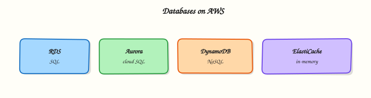

# Databases on AWS

## Overview

Applications need somewhere to store structured data — user accounts, orders, events, sessions. On AWS you can run traditional **SQL databases**, massive **NoSQL** tables, or fast **in-memory caches**.

Do not memorise database logos yet. Learn the **problem each service solves**:

- **RDS / Aurora** — managed SQL (PostgreSQL, MySQL, etc.) when you need joins and transactions
- **DynamoDB** — managed key-value/document store when you need huge scale and millisecond reads
- **ElastiCache** — Redis or Memcached in memory to speed up reads (not your primary database)

This is **Tutorial 1** in **Module 6: Databases** of the REBASH Academy **AWS for Cloud & DevOps Engineers** series. Theory covers RDS and friends; the lab uses **DynamoDB on-demand** — **not RDS** — so you learn key design without hourly database charges or NAT Gateway cost.

!!! warning "Cost hygiene"
    RDS and Aurora bill hourly even when idle. This lab uses DynamoDB **PAY_PER_REQUEST** only. Delete the table when finished. **Point-in-time recovery (PITR)** adds a small storage charge — disable before delete.

## Prerequisites

- [Storage: S3, EBS, and EFS](storage-s3-ebs-efs.md)
- AWS CLI v2 with `dynamodb:*` in a sandbox account
- Basic idea of rows/columns (SQL) vs key lookup (NoSQL) — we explain the rest

## Learning Objectives

By the end of this tutorial, you will be able to:

- [ ] Explain RDS vs DynamoDB vs ElastiCache with simple analogies
- [ ] Create a DynamoDB table with on-demand capacity and put/query items
- [ ] Explain why a query with the wrong partition key returns empty results
- [ ] Toggle PITR on and off safely
- [ ] Answer fresher interview questions on Multi-AZ and cache-aside pattern

## Architecture

Apps connect to **RDS/Aurora** over SQL drivers inside a VPC. **DynamoDB** is API-driven (CLI/SDK) with optional streams. **ElastiCache** sits beside the app for sub-millisecond cached reads. Backups differ: RDS snapshots, Aurora continuous backup, DynamoDB PITR, Redis snapshots.



## Theory

### The problem (before AWS words)

Your shopping app stores users and orders. A spreadsheet on one server breaks when traffic grows. You need a database that backups, patches, and scales — without you becoming a full-time DBA on day one.

### RDS — managed SQL in the cloud

**Problem:** You want PostgreSQL or MySQL but do not want to install disks, patch OS, and configure backups manually on EC2.

**Analogy:** **RDS** (**Relational Database Service**) is like renting a flat where the landlord handles building maintenance — AWS patches the engine and offers automated backups; you still design tables and queries.

**Tiny example:** `db.t3.micro` PostgreSQL in private subnets, port 5432, security group allows app tier only.

**Interview one-liner:** “RDS is managed relational SQL — Multi-AZ for failover, read replicas for read scale.”

| Term | Plain meaning |
|------|----------------|
| **Multi-AZ** | Standby copy in another AZ for failover |
| **Read replica** | Async copy for read traffic (and optional DR) |
| **DB subnet group** | Which subnets the database may use |

### Aurora — AWS-built SQL engine

**Problem:** RDS is familiar but storage scaling and replica lag can hurt at large scale.

**Analogy:** **Aurora** is AWS’s own SQL engine compatible with PostgreSQL/MySQL — storage grows automatically like a magic expanding hard drive shared by writer and readers.

**Interview one-liner:** “Aurora separates compute from replicated storage across three AZs — faster failover and more read replicas than classic RDS for many workloads.”

### DynamoDB — massive key-value table

**Problem:** Millions of sessions or IoT events per second — SQL on one big server hits limits.

**Analogy:** **DynamoDB** is a giant hash map in the cloud. You must know the **partition key** to fetch items quickly — like knowing which filing cabinet drawer before you search.

**AWS name:** **Amazon DynamoDB** (NoSQL).

**Tiny example:** Partition key `tenant_id`, sort key `event_ts` — query all events for one tenant.

**Interview one-liner:** “Design access patterns first, then partition key — wrong key returns empty Query, not necessarily an error.”

| Term | Plain meaning |
|------|----------------|
| **Partition key (HASH)** | Which shard stores the item |
| **Sort key (RANGE)** | Orders items within one partition |
| **GSI** | **Global Secondary Index** — alternate lookup pattern |
| **On-demand** | Pay per request — great for labs and spiky traffic |
| **Scan** | Read entire table — slow and expensive; avoid in prod |

### ElastiCache — speed layer, not vault

**Problem:** Every product page hits the database for the same catalogue data.

**Analogy:** **ElastiCache** is a sticky-note pad on the desk — **Redis** or **Memcached** holds hot data in RAM so the database breathes.

**Interview one-liner:** “Cache-aside: app reads cache first, on miss reads DB and fills cache with TTL — do not store the only copy of money in Redis.”

### When to pick which

| Workload | Prefer | Avoid |
|----------|--------|-------|
| Orders with joins and ACID | RDS/Aurora PostgreSQL | DynamoDB relational modelling |
| Session store at huge scale | DynamoDB or Redis | Uncached RDS for every read |
| Leaderboard / real-time counts | DynamoDB | Row locks on one SQL server |
| Speed up product catalogue reads | ElastiCache + RDS | Querying RDS on every page view |

### Common pitfalls

- **DynamoDB hot partition** — one `tenant_id` gets all traffic; throttling despite “high limits”
- **Scan instead of Query** — reads whole table; burns capacity
- **RDS public accessibility** — database on the internet for “easy access”
- **ElastiCache as sole database** — cache can evict data; DB is source of truth

## Hands-on Lab

### Objective

Create a DynamoDB on-demand table, put and query items, prove empty results for a wrong partition key, toggle PITR on then off, and delete the table.

### Prerequisites

| Tool | Notes |
|------|--------|
| AWS CLI v2 | `CreateTable`, `PutItem`, `Query`, `UpdateContinuousBackups` |
| `jq` | Parse JSON counts |

### Lab environment

``` {.bash .ra-terminal title="Terminal"}
mkdir -p ~/rebash-aws/module-06 && cd ~/rebash-aws/module-06
export AWS_REGION="${AWS_REGION:-eu-west-2}"
export AWS_PAGER=""
export TABLE="rebash-m06-events"
echo "$TABLE" | tee table-name.txt
aws sts get-caller-identity --output table
```

### Real-world scenario

An event platform stores records keyed by **tenant** and **timestamp**. On-call says “customer sees no events.” You check whether data is missing or the dashboard queried the **wrong tenant partition** — a classic junior engineer debug path.

### Step-by-step tasks

#### Task 1 – Create on-demand table

``` {.bash .ra-terminal title="Terminal"}
cd ~/rebash-aws/module-06
TABLE=$(cat table-name.txt)
aws dynamodb create-table \
  --table-name "$TABLE" \
  --attribute-definitions \
    AttributeName=tenant_id,AttributeType=S \
    AttributeName=event_ts,AttributeType=S \
  --key-schema \
    AttributeName=tenant_id,KeyType=HASH \
    AttributeName=event_ts,KeyType=RANGE \
  --billing-mode PAY_PER_REQUEST \
  --tags Key=Name,Value=rebash-m06 \
  --output json | tee create-table.json
aws dynamodb wait table-exists --table-name "$TABLE"
aws dynamodb describe-table --table-name "$TABLE" \
  --query 'Table.{Name:TableName,Billing:BillingModeSummary.BillingMode,Status:TableStatus}' \
  --output json | tee describe-table.json
grep -q PAY_PER_REQUEST describe-table.json
```

!!! example "Expected output"
    `describe-table.json` shows `"Billing": "PAY_PER_REQUEST"` and `"Status": "ACTIVE"`.


#### Task 2 – Put items and query by tenant

Create `item1.json`:

```json title="item1.json"
{
  "tenant_id": {"S": "tenant-acme"},
  "event_ts": {"S": "2026-08-03T10:00:00Z"},
  "event_type": {"S": "login"},
  "user_id": {"S": "user-42"}
}
```

Create `item2.json`:

```json title="item2.json"
{
  "tenant_id": {"S": "tenant-acme"},
  "event_ts": {"S": "2026-08-03T10:05:00Z"},
  "event_type": {"S": "purchase"},
  "user_id": {"S": "user-42"}
}
```

``` {.bash .ra-terminal title="Terminal"}
cd ~/rebash-aws/module-06
TABLE=$(cat table-name.txt)
aws dynamodb put-item --table-name "$TABLE" --item file://item1.json
aws dynamodb put-item --table-name "$TABLE" --item file://item2.json
aws dynamodb query --table-name "$TABLE" \
  --key-condition-expression "tenant_id = :t" \
  --expression-attribute-values '{":t":{"S":"tenant-acme"}}' \
  --output json | tee query-acme.json
jq -e '.Count == 2' query-acme.json
aws dynamodb get-item --table-name "$TABLE" \
  --key '{"tenant_id":{"S":"tenant-acme"},"event_ts":{"S":"2026-08-03T10:00:00Z"}}' \
  --output json | tee get-one.json
jq -e '.Item.event_type.S == "login"' get-one.json
```

!!! example "Expected output"
    `query-acme.json` Count is 2; `get-one.json` shows the login event.


#### Task 3 – Wrong partition key returns empty (debug pattern)

``` {.bash .ra-terminal title="Terminal"}
cd ~/rebash-aws/module-06
TABLE=$(cat table-name.txt)
aws dynamodb query --table-name "$TABLE" \
  --key-condition-expression "tenant_id = :t" \
  --expression-attribute-values '{":t":{"S":"tenant-wrong"}}' \
  --output json | tee query-wrong.json
jq -e '.Count == 0' query-wrong.json
aws dynamodb scan --table-name "$TABLE" --select COUNT --output json | tee scan-count.json
jq -e '.Count == 2' scan-count.json
echo "dynamodb query empty vs scan OK" | tee evidence.txt
```

!!! example "Expected output"
    `query-wrong.json` Count is 0; scan Count is 2 — data exists but wrong key returns nothing.


#### Task 4 – Toggle PITR and delete table

**PITR** = **Point-in-time recovery** — continuous backup so you can restore the table to a moment in the last 35 days.

``` {.bash .ra-terminal title="Terminal"}
cd ~/rebash-aws/module-06
TABLE=$(cat table-name.txt)
aws dynamodb update-continuous-backups --table-name "$TABLE" \
  --point-in-time-recovery-specification PointInTimeRecoveryEnabled=true \
  --output json | tee pitr-on.json
grep -qi ENABLED pitr-on.json
aws dynamodb update-continuous-backups --table-name "$TABLE" \
  --point-in-time-recovery-specification PointInTimeRecoveryEnabled=false \
  --output json | tee pitr-off.json
aws dynamodb delete-table --table-name "$TABLE" --output json | tee delete-table.json
aws dynamodb wait table-not-exists --table-name "$TABLE"
echo "table deleted" | tee cleanup-ok.txt
```

!!! example "Expected output"
    PITR toggled; table deletion completes; `cleanup-ok.txt` printed.


### Validation steps

- [ ] Table created with composite key and on-demand billing
- [ ] Query returned two items for `tenant-acme`
- [ ] Query for wrong tenant returned Count 0
- [ ] PITR enabled then disabled
- [ ] Table deleted — no ongoing DynamoDB charge

### Common errors and fixes

| Error | Cause | Fix |
|-------|-------|-----|
| ResourceInUseException | Table name already exists | Delete old table or pick new name |
| ValidationException on Query | Missing partition key in condition | Query must include partition key equality |
| AccessDeniedException | IAM missing `dynamodb:Query` | Extend sandbox policy |
| ThrottlingException | Provisioned mode under-provisioned | Lab uses on-demand |

### Challenge exercise

Create `gsi-design.json` sketching a **Global Secondary Index (GSI)** for “all events by user” and a one-line note on write amplification.

```json title="gsi-design.json"
{
  "IndexName": "user_id-index",
  "KeySchema": [
    {"AttributeName": "user_id", "KeyType": "HASH"},
    {"AttributeName": "event_ts", "KeyType": "RANGE"}
  ],
  "Projection": {"ProjectionType": "ALL"},
  "_note": "Each GSI duplicates writes — more indexes mean higher write cost"
}
```

``` {.bash .ra-terminal title="Terminal"}
cd ~/rebash-aws/module-06
test -f gsi-design.json
grep -q user_id gsi-design.json
echo "gsi challenge OK" | tee challenge.txt
```

### Learning outcomes

- You created and queried DynamoDB with correct key conditions
- You proved empty Query vs Scan count — classic on-call skill
- You toggled PITR and deleted the table cleanly
- You know when RDS/Aurora would replace DynamoDB

### Cleanup

``` {.bash .ra-terminal title="Terminal"}
cd ~/rebash-aws/module-06
TABLE=$(cat table-name.txt 2>/dev/null || echo rebash-m06-events)
aws dynamodb delete-table --table-name "$TABLE" 2>/dev/null || true
aws dynamodb wait table-not-exists --table-name "$TABLE" 2>/dev/null || true
rm -f create-table.json query-acme.json query-wrong.json evidence.txt pitr-on.json pitr-off.json
```

## Validation

- [ ] Lab under `~/rebash-aws/module-06` with query-empty evidence
- [ ] You can explain RDS Multi-AZ vs read replica in plain English
- [ ] You can describe partition key design in one minute
- [ ] No DynamoDB lab tables remain

## Code Walkthrough

1. **Composite keys** — `tenant_id` + `event_ts` enables range queries per tenant without Scan.
2. **Query vs Scan** — Query needs partition key; Scan reads everything (last resort).
3. **On-demand billing** — zero capacity planning for labs; provisioned + auto scaling for steady prod traffic.
4. **Empty Query ≠ broken table** — wrong key or typo returns Count 0 silently.
5. **PITR toggle** — small extra cost when enabled; disable before delete in sandboxes.

## Security Considerations

- Place RDS in **private subnets**; never `PubliclyAccessible=true` in production.
- Use **Secrets Manager** or IAM database authentication for credentials — not Git.
- Encrypt at rest with KMS; enforce TLS in transit.
- Restrict security groups to application tier only.
- Enable CloudTrail data events on sensitive DynamoDB tables.

## Common Mistakes

!!! warning "Provisioning RDS for a key-design lab"
    RDS bills hourly and takes minutes to create. Use DynamoDB on-demand for access-pattern exercises unless the goal is engine administration.

!!! warning "SQL schema on DynamoDB"
    Many joins and normalised tables map poorly. Design queries first, then keys and GSIs.

!!! warning "Redis as primary database"
    ElastiCache is a cache — use RDS/DynamoDB as source of truth.

## Best Practices

- Document access patterns before DynamoDB table design
- Use **RDS Proxy** for connection pooling to Aurora/RDS at scale
- Enable **Performance Insights** on production RDS
- Set **DeletionProtection** on production databases
- Use cache TTLs with jitter; monitor cache hit ratio

## Troubleshooting

| Symptom | Likely cause | Fix |
|---------|--------------|-----|
| Query returns empty | Wrong partition key value | Verify put-item keys; check case sensitivity |
| ProvisionedThroughputExceeded | Hot key or low limits | Redesign key; use on-demand or raise capacity |
| RDS connection timeout | Security group or subnet | Module 3 VPC path; SG from app tier |
| High replica lag | Heavy writes | Scale writer; optimise queries |

## Summary

**RDS and Aurora** excel at relational OLTP. **DynamoDB** excels at massive-scale key-value access. **ElastiCache** accelerates reads. The lab proved **Query key correctness** and safe teardown — skills that transfer directly to interviews and on-call.

Next: [Containers: ECS, EKS, and ECR](containers-ecs-eks-ecr.md).

## Interview Questions

**1. RDS vs DynamoDB — simple difference?**

??? success "Reveal answer"
    **RDS** is managed **SQL** — tables, joins, transactions — good when your app thinks relationally. **DynamoDB** is managed **NoSQL** — you design partition keys for specific queries at huge scale with millisecond latency. Pick based on access pattern and data model, not hype.

**2. RDS Multi-AZ vs read replica?**

??? success "Reveal answer"
    **Multi-AZ** keeps a synchronous standby in another AZ for **automatic failover** of the primary endpoint (high availability). **Read replicas** are asynchronous copies for **read scaling** and optional disaster recovery — not the same as Multi-AZ standby.

**3. Why did Query return zero items but Scan shows data?**

??? success "Reveal answer"
    Query requires the correct **partition key** (and optional sort key condition). Wrong tenant ID, typo, or wrong Region returns an empty set **without error**. Scan reads all items — proves data exists but the access pattern or key was wrong.

**4. What is a DynamoDB hot partition?**

??? success "Reveal answer"
    One partition key value receives too much traffic and saturates that shard’s throughput even if the table limit looks high. Fix with high-cardinality keys, write sharding, or on-demand capacity.

**5. When would you pick DynamoDB over Aurora?**

??? success "Reveal answer"
    When you need predictable single-digit millisecond latency at massive scale with a key-value/document model and minimal ops — sessions, IoT, carts. Choose Aurora when you need SQL joins, complex transactions, and mature SQL tooling.

**6. What is cache-aside with ElastiCache?**

??? success "Reveal answer"
    App reads cache first; on miss, reads database, stores result in cache with a TTL, returns to user. Writes update the database and invalidate or update cache. Watch cache stampede when many keys expire together.

**7. DynamoDB on-demand vs provisioned?**

??? success "Reveal answer"
    **On-demand** charges per request — great for unknown or spiky traffic (labs, startups). **Provisioned** with auto scaling is often cheaper at steady high volume but can throttle if limits are too low.

**8. Why did we use DynamoDB not RDS in this lab?**

??? success "Reveal answer"
    RDS instances bill hourly even when idle and need VPC networking. DynamoDB on-demand lets you learn **partition keys and Query** with pennies of cost and no NAT Gateway — the learning goal is key design, not SQL admin.

## Related Tutorials

- Previous: [Storage: S3, EBS, and EFS](storage-s3-ebs-efs.md)
- Next: [Containers: ECS, EKS, and ECR](containers-ecs-eks-ecr.md)
- [Compute: EC2, ASG, and Load Balancing](compute-ec2-asg-and-load-balancing.md)

## References

- [Amazon RDS](https://docs.aws.amazon.com/AmazonRDS/latest/UserGuide/Welcome.html)
- [Amazon Aurora](https://docs.aws.amazon.com/AmazonRDS/latest/AuroraUserGuide/CHAP_AuroraOverview.html)
- [Amazon DynamoDB](https://docs.aws.amazon.com/amazondynamodb/latest/developerguide/Introduction.html)
- [Amazon ElastiCache](https://docs.aws.amazon.com/AmazonElastiCache/latest/red-ug/WhatIs.html)
- [DynamoDB best practices](https://docs.aws.amazon.com/amazondynamodb/latest/developerguide/best-practices.html)
