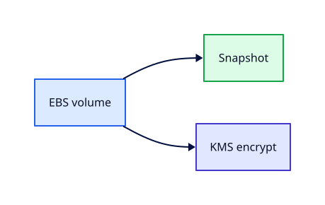

# EBS Volumes, Snapshots, and Encryption

## Overview

**Elastic Block Store (EBS)** provides durable block volumes for EC2. Snapshots back up volumes to S3;
encryption protects data at rest with KMS keys.

You will attach a secondary volume, create snapshots, restore to a new volume, enable encryption by
default, and delete unattached volumes — a common source of silent billing.

This is **Tutorial 11** in **Module 3: Compute** of the REBASH Academy AWS track.

!!! warning "Destroy lab resources and watch billing"
    Tear down every resource you create before you close your laptop. Set a **billing alarm**
    (see [Accounts, Free Tier, Billing, and Cost Hygiene](accounts-free-tier-billing-and-cost-hygiene.md))
    and check the Cost Explorer dashboard after each lab session.


## Prerequisites

- Completed [User Data, IMDS, and SSM Session Manager](user-data-imds-and-ssm-session-manager.md)

## Learning Objectives

By the end of this tutorial, you will be able to:

- [ ] Create and attach gp3 volumes in the same AZ
- [ ] Snapshot and restore volumes across AZs via snapshot copy
- [ ] Enable EBS encryption by default for the Region
- [ ] Identify `DeleteOnTermination` behaviour
- [ ] Delete snapshots and volumes during teardown

## Architecture




## Theory

### Volume types (summary)

| Type | Use case |
|------|----------|
| gp3 | General purpose default |
| io2 | High IOPS databases |
| st1/sc1 | Throughput/cold HDD (legacy patterns) |

### AZ affinity

Volumes attach only in the same AZ as the instance. Snapshots are Regional; restored volumes can
target any AZ in the Region.

### Encryption

- Default encryption uses AWS managed KMS key `aws/ebs`
- Snapshots inherit encryption; share encrypted snapshots via KMS key policy

### Billing traps

- **Unattached gp3 volumes** bill monthly
- **Snapshots** bill per GB-month
- Orphan snapshots after quick instance terminate tests

## Hands-on Lab

```bash
aws ec2 create-volume --availability-zone ${LAB_REGION}a --size 10 --volume-type gp3 \
  --tag-specifications 'ResourceType=volume,Tags=[{Key=Name,Value=rebash-data}]' \
  --region $LAB_REGION

aws ec2 attach-volume --volume-id $VOL_ID --instance-id $INSTANCE_ID --device /dev/xvdf --region $LAB_REGION

# on instance via SSM
sudo mkfs -t xfs /dev/xvdf
sudo mkdir /data && sudo mount /dev/xvdf /data
echo lab > /data/test.txt

aws ec2 create-snapshot --volume-id $VOL_ID --description "rebash lab snap" --region $LAB_REGION

aws ec2 enable-ebs-encryption-by-default --region $LAB_REGION
```

Teardown:

```bash
aws ec2 terminate-instances --instance-ids $INSTANCE_ID --region $LAB_REGION
aws ec2 delete-snapshot --snapshot-id $SNAP_ID --region $LAB_REGION
aws ec2 delete-volume --volume-id $VOL_ID --region $LAB_REGION  # if detached
```

### LocalStack / dry-run alternative

With [LocalStack](https://localstack.cloud/) running on port 4566:

```bash
export AWS_ACCESS_KEY_ID=test
export AWS_SECRET_ACCESS_KEY=test
export AWS_DEFAULT_REGION=eu-west-1
aws --endpoint-url=http://localhost:4566 ec2 create-volume --availability-zone eu-west-1a --size 10
```

Some services are emulated imperfectly — treat LocalStack as CLI practice, not a full AWS substitute.

## Validation

| Check | Pass criteria |
|-------|---------------|
| Attach | Volume `in-use` same AZ |
| Snapshot | `completed` state |
| Encryption default | `get-ebs-encryption-by-default` true |
| Cleanup | No volumes/snapshots remain |

## Code Walkthrough

| Operation | Note |
|-----------|------|
| `attach-volume` | Device name OS-specific |
| Snapshot | Crash-consistent unless app quiesced |
| Restore | New volume from snapshot in target AZ |
| `DeleteOnTermination` | Root volume default true |

## Security Considerations

- Enable encryption by default in all Regions
- Restrict snapshot sharing with KMS and IAM
- Encrypt backups for compliance (GDPR, etc.)

## Common Mistakes

!!! warning "Unattached volumes after lab"
    Monthly gp3 charge. **Fix:** Delete volumes in teardown checklist.

!!! warning "Snapshot hoarding"
    Storage cost creep. **Fix:** Lifecycle policy deletes old lab snaps.

!!! warning "Cross-AZ attach attempt"
    API error. **Fix:** Snapshot-copy to target AZ first.

## Best Practices

- gp3 baseline; tune IOPS only when metrics prove need
- Automate snapshots with Data Lifecycle Manager
- Tag volumes with `Environment=lab`

## Troubleshooting

| Issue | Cause | Fix |
|-------|-------|-----|
| Attach fails AZ | Volume AZ mismatch | Create volume in instance AZ |
| Device busy | Already mounted | Unmount inside OS |
| Encrypted share denied | KMS key policy | Update key policy for account |

## Production Patterns and Deep Dive

        ### How `EBS Volumes, Snapshots, and Encryption` fits in real environments

        Engineers working on **Module 3: Compute** material use these concepts daily during design reviews,
        incident response, and cost optimisation workshops. The lab exercises prove you can execute;
        this section connects those commands to production trade-offs you will defend in interviews
        and on-call handovers.

        Production teams treating AWS as a first-class platform typically document:

        | Artefact | Purpose |
        |----------|---------|
        | Architecture decision record (ADR) | Why this service, alternatives rejected |
        | Runbook | Step-by-step operational procedures with rollback |
        | Teardown / DR checklist | What to destroy or fail over during exercises |
        | Cost owner | Who receives Budget alerts for resources tagged to this service |

        Always pair technical controls with **billing alarms** and a **destroy discipline** after
        experiments. The REBASH AWS track assumes British English documentation and explicit
        mention of Free Tier limits.

        ### Extended CLI and console reference

        The commands below extend the lab — run read-only variants first, then mutating operations
        in a non-production account. Replace `$LAB_REGION` and resource identifiers with your values.

        ```bash
aws ec2 create-volume --availability-zone eu-west-1a --size 10 --volume-type gp3 --encrypted
aws ec2 create-snapshot --volume-id vol-xxx --description "nightly backup"
aws ec2 describe-snapshots --owner-ids self
aws ec2 enable-ebs-encryption-by-default
aws ec2 get-ebs-encryption-by-default
aws dlm create-lifecycle-policy --execution-role-arn arn:aws:iam::ACCOUNT:role/DLMRole --policy-details file://dlm.json
```

        ### Operational scenario (table-top)

        **Scenario:** A teammate announces "customers cannot reach the application after a change."
        You suspect a misconfiguration related to **EBS Volumes, Snapshots, and Encryption**.

        | Step | Action | Why |
        |------|--------|-----|
        | 1 | Confirm Region and account (`aws sts get-caller-identity`) | Wrong profile wastes triage time |
        | 2 | Check CloudWatch alarms and recent deploys | Correlates timeline |
        | 3 | Review CloudTrail events for API changes in this service | Identifies who changed what |
        | 4 | Compare running config to IaC/Terraform state | Detects manual console drift |
        | 5 | Roll back or restore last known good | Document in incident ticket |
        | 6 | Update runbook and least-privilege IAM if human error | Prevents repeat |

        ### Hardening checklist before production

        - [ ] IAM roles preferred over IAM users with long-lived keys
        - [ ] MFA enabled for privileged humans; root not used daily
        - [ ] Resources tagged `Environment`, `Owner`, `CostCentre`
        - [ ] Budgets and anomaly detection configured
        - [ ] Encryption at rest and in transit enabled where supported
        - [ ] No `0.0.0.0/0` administrative ports (use SSM Session Manager)
        - [ ] Teardown script or `terraform destroy` documented for non-prod environments
        - [ ] Cross-links reviewed: [Networking](../networking/index.md), [Linux](../linux/index.md), [Terraform](../terraform/index.md)

        ### When to choose a different AWS service

        No service exists in isolation. If **EBS Volumes, Snapshots, and Encryption** feels forced, discuss alternatives with your
        team: managed versus self-managed, serverless versus EC2, or whether the workload belongs in
        another Region or account under AWS Organizations. Capture that decision in an ADR so future
        engineers understand the constraints you optimised for.

        ### Terraform handoff note

        After completing the AWS track, reproduce this tutorial's resources using modules in the
        [Terraform](../terraform/index.md) curriculum. Start with `required_providers` for `hashicorp/aws`,
        pin provider versions, store remote state in S3 with locking, and never commit secrets. The
        `ebs-volumes-snapshots-and-encryption` lesson maps cleanly to named resources you will import or recreate in HCL.

        ### Review questions (self-check)

        Before moving to the next tutorial, answer without looking at notes:

        1. Which API calls in this lesson are **read-only** versus **mutating**?
        2. What is the first command you run to confirm account and Region?
        3. Which tags will you apply so Cost Explorer can attribute spend?
        4. How do you destroy lab resources created here?
        5. Which [Networking](../networking/index.md) or [Linux](../linux/index.md) concept underpins this AWS service?

        ### Additional references inside AWS

        Browse the official **AWS Documentation** centre for `EBS Volumes, Snapshots, and Encryption` — focus on quotas, API permissions,
        and CloudWatch metrics emitted by the service. Bookmark the **Pricing** page for the service and
        add a line item to your personal cheat sheet noting Free Tier eligibility and the most common
        bill surprise mentioned in this tutorial.

## Summary

- EBS volumes are AZ-local block storage; snapshots enable backup and migration
- Enable encryption by default; delete volumes and snapshots after labs
- Watch billing for unattached volumes and old snapshots

## Interview Questions

1. EBS vs instance store?
2. Can you attach one volume to two instances?
3. Snapshot consistency model?
4. What happens to root volume on terminate?
5. gp2 vs gp3?
6. How encryption at rest works for EBS?
7. Cross-Region snapshot copy use case?
8. Billing for unattached volume?
9. DeleteOnTermination flag purpose?
10. DLM snapshot policy benefit?

!!! tip "Sample answer — question 1"
    EBS is network-attached persistent block storage surviving stop/start. Instance store is local physical SSD with higher performance but data lost on stop/terminate — good for caches, not databases.


!!! tip "Sample answer — question 8"
    You pay for provisioned GB-month of gp3/io volumes whether attached or not — a classic post-lab leak if terminate leaves volumes behind.


## Related Tutorials

- Track overview: [AWS](index.md)
- Previous: [User Data, IMDS, and SSM Session Manager](user-data-imds-and-ssm-session-manager.md)
- Next: [S3 Fundamentals](s3-fundamentals.md)
- [Terraform track](../terraform/index.md) — automate these patterns next


## References

1. [Amazon EBS](https://docs.aws.amazon.com/ebs/latest/userguide/how-ebs-works.html)
2. [EBS snapshots](https://docs.aws.amazon.com/ebs/latest/userguide/ebs-snapshots.html)
3. [EBS encryption](https://docs.aws.amazon.com/ebs/latest/userguide/ebs-encryption.html)
