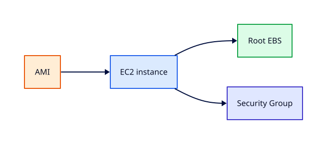

# EC2 Fundamentals

## Overview

**Elastic Compute Cloud (EC2)** provides virtual machines with configurable CPU, memory, networking,
and AMI base images. Most AWS workloads still run on EC2 or containers on EC2-backed nodes.

You will launch Amazon Linux 2023 in your lab VPC, choose instance type and EBS root volume,
connect via **SSM Session Manager**, and terminate instances before leaving — with billing
alarms confirmed.

This is **Tutorial 9** in **Module 3: Compute** of the REBASH Academy AWS track.

!!! warning "Destroy lab resources and watch billing"
    Tear down every resource you create before you close your laptop. Set a **billing alarm**
    (see [Accounts, Free Tier, Billing, and Cost Hygiene](accounts-free-tier-billing-and-cost-hygiene.md))
    and check the Cost Explorer dashboard after each lab session.


## Prerequisites

- Completed Module 2 VPC tutorials
- [Linux essentials](../linux/index.md) for SSH/SSM shell comfort

## Learning Objectives

By the end of this tutorial, you will be able to:

- [ ] Select AMI, instance type, and key-less SSM access pattern
- [ ] Launch EC2 in a tagged public subnet with instance profile
- [ ] Describe instance states and metadata categories
- [ ] Stop vs terminate cost implications
- [ ] Terminate instances and verify volume cleanup options

## Architecture




## Theory

### Core concepts

| Term | Meaning |
|------|---------|
| AMI | Boot image template |
| Instance type | vCPU, RAM, network (e.g. `t3.micro`) |
| EBS root volume | Persistent OS disk |
| Instance store | Ephemeral local disks (specific families) |

### Purchase options (awareness)

On-Demand (labs), Reserved, Savings Plans, Spot (interruptible). Free Tier often includes
limited `t2/t3.micro` hours.

### Networking on launch

- Subnet determines AZ
- Security groups stateful firewall
- Public IP only if subnet/route allow

### Connect patterns

| Method | REBASH recommendation |
|--------|-------------------------|
| SSM Session Manager | **Yes** — no SSH port |
| SSH with key pair | Learn but avoid 0.0.0.0/0 |
| EC2 Instance Connect | Optional browser-based |

## Hands-on Lab

```bash
export LAB_REGION=eu-west-1

aws ec2 run-instances \
  --image-id resolve_ssm:/aws/service/ami-amazon-linux-latest/al2023-ami-kernel-default-x86_64 \
  --instance-type t3.micro \
  --subnet-id $PUBLIC_SUBNET_ID \
  --security-group-ids $WEB_SG \
  --iam-instance-profile Name=rebash-ec2-ssm-profile \
  --tag-specifications 'ResourceType=instance,Tags=[{Key=Name,Value=rebash-web-01},{Key=Environment,Value=lab}]' \
  --metadata-options HttpTokens=required,HttpEndpoint=enabled \
  --region $LAB_REGION

aws ec2 wait instance-running --instance-ids $INSTANCE_ID --region $LAB_REGION
aws ssm start-session --target $INSTANCE_ID --region $LAB_REGION
```

Inside instance:

```bash
curl -s http://169.254.169.254/latest/meta-data/instance-id
sudo dnf update -y
```

Teardown:

```bash
aws ec2 terminate-instances --instance-ids $INSTANCE_ID --region $LAB_REGION
aws ec2 wait instance-terminated --instance-ids $INSTANCE_ID --region $LAB_REGION
```

### LocalStack / dry-run alternative

With [LocalStack](https://localstack.cloud/) running on port 4566:

```bash
export AWS_ACCESS_KEY_ID=test
export AWS_SECRET_ACCESS_KEY=test
export AWS_DEFAULT_REGION=eu-west-1
aws --endpoint-url=http://localhost:4566 ec2 run-instances --image-id ami-000001 --instance-type t3.micro
    aws --endpoint-url=http://localhost:4566 ec2 describe-instances
```

Some services are emulated imperfectly — treat LocalStack as CLI practice, not a full AWS substitute.

## Validation

| Check | Pass criteria |
|-------|---------------|
| Instance running | `describe-instances` State=running |
| SSM online | `PingStatus=Online` in Fleet Manager |
| IMDSv2 | `HttpTokens=required` on launch |
| Terminated | No running lab instances |
| Billing | EC2 spend near zero post-teardown |

## Code Walkthrough

| Launch parameter | Why |
|------------------|-----|
| SSM path AMI query | Always latest Amazon Linux 2023 |
| `t3.micro` | Free Tier eligible in many accounts |
| Instance profile | Credentials for SSM without keys |
| `HttpTokens=required` | IMDSv2 only — security best practice |

## Security Considerations

- Require IMDSv2 (`HttpTokens=required`)
- No SSH from 0.0.0.0/0; use SSM
- Patch AMIs regularly; use SSM Patch Manager in production
- Instance role least privilege — not AdministratorAccess

## Common Mistakes

!!! warning "Forgetting terminate"
    EBS volumes may still bill. **Fix:** Terminate instances; delete unattached volumes.

!!! warning "IMDSv1 left enabled"
    SSRF credential theft risk. **Fix:** Require IMDSv2 at launch.

!!! warning "Admin role on every instance"
    Lateral movement. **Fix:** Scope role to SSM + app needs only.

## Best Practices

- Golden AMI or SSM parameter for latest Amazon Linux
- Auto Recovery / ASG for production (Tutorial 17)
- Detailed monitoring only when needed (cost)
- Use Instance Metadata Service tags carefully

## Troubleshooting

| Issue | Cause | Fix |
|-------|-------|-----|
| SSM offline | No profile or network | Attach SSM role; check SG egress |
| Insufficient capacity | AZ capacity | Retry another AZ or type |
| Cannot terminate | Termination protection | Disable protection flag |

## Production Patterns and Deep Dive

        ### How `EC2 Fundamentals` fits in real environments

        Engineers working on **Module 3: Compute** material use these concepts daily during design reviews,
        incident response, and cost optimisation workshops. The lab exercises prove you can execute;
        this section connects those commands to production trade-offs you will defend in interviews
        and on-call handovers.

        Production teams treating AWS as a first-class platform typically document:

        | Artefact | Purpose |
        |----------|---------|
        | Architecture decision record (ADR) | Why this service, alternatives rejected |
        | Runbook | Step-by-step operational procedures with rollback |
        | Teardown / DR checklist | What to destroy or fail over during exercises |
        | Cost owner | Who receives Budget alerts for resources tagged to this service |

        Always pair technical controls with **billing alarms** and a **destroy discipline** after
        experiments. The REBASH AWS track assumes British English documentation and explicit
        mention of Free Tier limits.

        ### Extended CLI and console reference

        The commands below extend the lab — run read-only variants first, then mutating operations
        in a non-production account. Replace `$LAB_REGION` and resource identifiers with your values.

        ```bash
aws ec2 describe-instance-types --filters Name=free-tier-eligible,Values=true --query 'InstanceTypes[].InstanceType'
aws ec2 run-instances --count 1 --instance-type t3.micro --metadata-options HttpTokens=required
aws ec2 describe-instances --instance-ids $INSTANCE_ID --query 'Reservations[].Instances[].State.Name'
aws ec2 stop-instances --instance-ids $INSTANCE_ID
aws ec2 terminate-instances --instance-ids $INSTANCE_ID
aws ec2 describe-volumes --filters Name=attachment.instance-id,Values=$INSTANCE_ID
```

        ### Operational scenario (table-top)

        **Scenario:** A teammate announces "customers cannot reach the application after a change."
        You suspect a misconfiguration related to **EC2 Fundamentals**.

        | Step | Action | Why |
        |------|--------|-----|
        | 1 | Confirm Region and account (`aws sts get-caller-identity`) | Wrong profile wastes triage time |
        | 2 | Check CloudWatch alarms and recent deploys | Correlates timeline |
        | 3 | Review CloudTrail events for API changes in this service | Identifies who changed what |
        | 4 | Compare running config to IaC/Terraform state | Detects manual console drift |
        | 5 | Roll back or restore last known good | Document in incident ticket |
        | 6 | Update runbook and least-privilege IAM if human error | Prevents repeat |

        ### Hardening checklist before production

        - [ ] IAM roles preferred over IAM users with long-lived keys
        - [ ] MFA enabled for privileged humans; root not used daily
        - [ ] Resources tagged `Environment`, `Owner`, `CostCentre`
        - [ ] Budgets and anomaly detection configured
        - [ ] Encryption at rest and in transit enabled where supported
        - [ ] No `0.0.0.0/0` administrative ports (use SSM Session Manager)
        - [ ] Teardown script or `terraform destroy` documented for non-prod environments
        - [ ] Cross-links reviewed: [Networking](../networking/index.md), [Linux](../linux/index.md), [Terraform](../terraform/index.md)

        ### When to choose a different AWS service

        No service exists in isolation. If **EC2 Fundamentals** feels forced, discuss alternatives with your
        team: managed versus self-managed, serverless versus EC2, or whether the workload belongs in
        another Region or account under AWS Organizations. Capture that decision in an ADR so future
        engineers understand the constraints you optimised for.

        ### Terraform handoff note

        After completing the AWS track, reproduce this tutorial's resources using modules in the
        [Terraform](../terraform/index.md) curriculum. Start with `required_providers` for `hashicorp/aws`,
        pin provider versions, store remote state in S3 with locking, and never commit secrets. The
        `ec2-fundamentals` lesson maps cleanly to named resources you will import or recreate in HCL.

        ### Review questions (self-check)

        Before moving to the next tutorial, answer without looking at notes:

        1. Which API calls in this lesson are **read-only** versus **mutating**?
        2. What is the first command you run to confirm account and Region?
        3. Which tags will you apply so Cost Explorer can attribute spend?
        4. How do you destroy lab resources created here?
        5. Which [Networking](../networking/index.md) or [Linux](../linux/index.md) concept underpins this AWS service?

        ### Additional references inside AWS

        Browse the official **AWS Documentation** centre for `EC2 Fundamentals` — focus on quotas, API permissions,
        and CloudWatch metrics emitted by the service. Bookmark the **Pricing** page for the service and
        add a line item to your personal cheat sheet noting Free Tier eligibility and the most common
        bill surprise mentioned in this tutorial.

## Summary

- EC2 launches AMIs as instances in subnets with SGs and roles
- Use **SSM** and **IMDSv2**; terminate and verify billing after labs
- Instance store vs EBS matters for data durability (next tutorial)

## Interview Questions

1. Difference between stop and terminate?
2. What is an AMI?
3. How does SSM replace SSH?
4. IMDSv1 vs IMDSv2?
5. What does instance profile do at launch?
6. When use Spot instances?
7. How choose instance type?
8. Public IP assignment rules?
9. What bills after instance terminated?
10. How resolve latest Amazon Linux AMI?

!!! tip "Sample answer — question 1"
    Stop preserves EBS root volume and private IP (with caveats); you pay for EBS while stopped. Terminate ends billing for compute and, by default, deletes the root volume unless `DeleteOnTermination` is false.


!!! tip "Sample answer — question 4"
    IMDSv2 requires a session token via PUT before metadata GET, mitigating SSRF attacks that stole role credentials via IMDSv1.


## Related Tutorials

- Track overview: [AWS](index.md)
- Previous: [VPC Endpoints and Private AWS Access](vpc-endpoints-and-private-aws-access.md)
- Next: [User Data, IMDS, and SSM Session Manager](user-data-imds-and-ssm-session-manager.md)
- [Terraform track](../terraform/index.md) — automate these patterns next


## References

1. [Amazon EC2 User Guide](https://docs.aws.amazon.com/AWSEC2/latest/UserGuide/concepts.html)
2. [Connect via Session Manager](https://docs.aws.amazon.com/AWSEC2/latest/UserGuide/session-manager.html)
3. [Instance metadata](https://docs.aws.amazon.com/AWSEC2/latest/UserGuide/ec2-instance-metadata.html)
