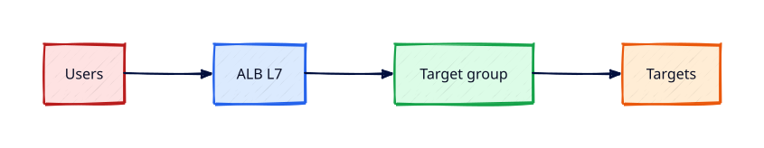

# Elastic Load Balancing — ALB and NLB

## Overview

**Elastic Load Balancing** distributes traffic across targets. **Application Load Balancers (ALB)**
operate at Layer 7 with path-based routing; **Network Load Balancers (NLB)** handle TCP/UDP with
extreme performance and static IPs.

You will create an ALB, target group, health checks, and register EC2 instances — then delete the
ALB to avoid ongoing charges.

This is **Tutorial 14** in **Module 5: Edge and Data** of the REBASH Academy AWS track.

!!! warning "Destroy lab resources and watch billing"
    Tear down every resource you create before you close your laptop. Set a **billing alarm**
    (see [Accounts, Free Tier, Billing, and Cost Hygiene](accounts-free-tier-billing-and-cost-hygiene.md))
    and check the Cost Explorer dashboard after each lab session.

!!! warning "Application Load Balancer cost"
    ALB bills hourly plus LCU usage — **not** Free Tier. Create for the lab, validate health checks,
    then **delete the load balancer the same session**. Prefer target group + curl tests on instances
    if you need to skip ALB cost entirely.

## Prerequisites

- Completed Module 4 Storage
- VPC with public subnets

## Learning Objectives

By the end of this tutorial, you will be able to:

- [ ] Compare ALB vs NLB vs Classic ELB
- [ ] Create ALB in public subnets across two AZs
- [ ] Configure target group health checks on `/` HTTP 200
- [ ] Register EC2 targets and observe healthy state
- [ ] Delete load balancer and target group in teardown

## Architecture




## Theory

### Load balancer types

| Type | Layer | Use case |
|------|-------|----------|
| ALB | 7 HTTP/HTTPS/gRPC | Web apps, path routing |
| NLB | 4 TCP/UDP/TLS | Low latency, static IP, gaming |
| GLB | 3 Gateway | IP rewrites at VPC edge |

### ALB components

- Listeners (443 → forward action)
- Rules (host/path conditions)
- Target groups (instances, IPs, Lambda)
- Health checks (interval, threshold, matcher)

### Security

ALB security group allows 443 from internet (or CloudFront prefix list). Instance SG allows
traffic **only from ALB SG** on app port.

### Cost

ALB hourly + LCU — destroy after lab. NLB similar model.

## Hands-on Lab

```bash
TG_ARN=$(aws elbv2 create-target-group --name rebash-http-tg --protocol HTTP --port 80 \
  --vpc-id $VPC_ID --health-check-path / --matcher HttpCode=200 \
  --query TargetGroups[0].TargetGroupArn --output text --region $LAB_REGION)

ALB_ARN=$(aws elbv2 create-load-balancer --name rebash-alb --type application \
  --subnets $PUBLIC_SUBNET_A $PUBLIC_SUBNET_B \
  --security-groups $ALB_SG \
  --query LoadBalancers[0].LoadBalancerArn --output text --region $LAB_REGION)

aws elbv2 create-listener --load-balancer-arn $ALB_ARN --protocol HTTP --port 80 \
  --default-actions Type=forward,TargetGroupArn=$TG_ARN --region $LAB_REGION

aws elbv2 register-targets --target-group-arn $TG_ARN \
  --targets Id=$INSTANCE_ID --region $LAB_REGION

aws elbv2 describe-target-health --target-group-arn $TG_ARN --region $LAB_REGION
curl http://$ALB_DNS_NAME/
```

Teardown:

```bash
aws elbv2 delete-load-balancer --load-balancer-arn $ALB_ARN --region $LAB_REGION
aws elbv2 delete-target-group --target-group-arn $TG_ARN --region $LAB_REGION
```

### LocalStack / dry-run alternative

With [LocalStack](https://localstack.cloud/) running on port 4566:

```bash
export AWS_ACCESS_KEY_ID=test
export AWS_SECRET_ACCESS_KEY=test
export AWS_DEFAULT_REGION=eu-west-1
aws --endpoint-url=http://localhost:4566 elbv2 describe-load-balancers
```

Some services are emulated imperfectly — treat LocalStack as CLI practice, not a full AWS substitute.

## Validation

| Check | Pass criteria |
|-------|---------------|
| Target health | `healthy` state |
| ALB DNS | Returns HTTP 200 body |
| SG layering | Instance accepts only ALB SG |
| Teardown | No load balancers remain |

## Code Walkthrough

| Component | Detail |
|-----------|--------|
| Health check | Unhealthy targets removed from rotation |
| Cross-zone LB | ALB cross-zone enabled by default |
| Idle timeout | Tune for long-lived connections |
| Access logs | S3 bucket for ALB logs (prod) |

## Security Considerations

- TLS terminate at ALB with modern policy
- Restrict instance SG to ALB source SG
- Enable WAF on internet-facing ALB in production

## Common Mistakes

!!! warning "ALB left over weekend"
    Hourly charges. **Fix:** Delete in teardown checklist.

!!! warning "Health check wrong path"
    All targets unhealthy. **Fix:** Match app endpoint returning 200.

!!! warning "Instance SG open to world"
    Bypasses ALB shield. **Fix:** Allow only ALB SG.

## Best Practices

- HTTPS listeners with ACM certs
- Connection draining on target deregistration
- Use NLB for non-HTTP TCP services

## Troubleshooting

| Issue | Cause | Fix |
|-------|-------|-----|
| Unhealthy targets | SG or wrong port | Open instance SG from ALB; check app port |
| 502 Bad Gateway | App not listening | Start httpd on port 80 |
| Slow delete ALB | Eni cleanup delay | Wait minutes; retry delete |

## Production Patterns and Deep Dive

        ### How `Elastic Load Balancing — ALB and NLB` fits in real environments

        Engineers working on **Module 5: Edge and Data** material use these concepts daily during design reviews,
        incident response, and cost optimisation workshops. The lab exercises prove you can execute;
        this section connects those commands to production trade-offs you will defend in interviews
        and on-call handovers.

        Production teams treating AWS as a first-class platform typically document:

        | Artefact | Purpose |
        |----------|---------|
        | Architecture decision record (ADR) | Why this service, alternatives rejected |
        | Runbook | Step-by-step operational procedures with rollback |
        | Teardown / DR checklist | What to destroy or fail over during exercises |
        | Cost owner | Who receives Budget alerts for resources tagged to this service |

        Always pair technical controls with **billing alarms** and a **destroy discipline** after
        experiments. The REBASH AWS track assumes British English documentation and explicit
        mention of Free Tier limits.

        ### Extended CLI and console reference

        The commands below extend the lab — run read-only variants first, then mutating operations
        in a non-production account. Replace `$LAB_REGION` and resource identifiers with your values.

        ```bash
aws elbv2 describe-load-balancers --names rebash-alb
aws elbv2 describe-target-health --target-group-arn $TG_ARN
aws elbv2 modify-target-group --target-group-arn $TG_ARN --health-check-interval-seconds 30
aws elbv2 describe-rules --listener-arn $LISTENER_ARN
aws elbv2 delete-load-balancer --load-balancer-arn $ALB_ARN
```

**ALB cost warning:** delete load balancer same session after validation.

        ### Operational scenario (table-top)

        **Scenario:** A teammate announces "customers cannot reach the application after a change."
        You suspect a misconfiguration related to **Elastic Load Balancing — ALB and NLB**.

        | Step | Action | Why |
        |------|--------|-----|
        | 1 | Confirm Region and account (`aws sts get-caller-identity`) | Wrong profile wastes triage time |
        | 2 | Check CloudWatch alarms and recent deploys | Correlates timeline |
        | 3 | Review CloudTrail events for API changes in this service | Identifies who changed what |
        | 4 | Compare running config to IaC/Terraform state | Detects manual console drift |
        | 5 | Roll back or restore last known good | Document in incident ticket |
        | 6 | Update runbook and least-privilege IAM if human error | Prevents repeat |

        ### Hardening checklist before production

        - [ ] IAM roles preferred over IAM users with long-lived keys
        - [ ] MFA enabled for privileged humans; root not used daily
        - [ ] Resources tagged `Environment`, `Owner`, `CostCentre`
        - [ ] Budgets and anomaly detection configured
        - [ ] Encryption at rest and in transit enabled where supported
        - [ ] No `0.0.0.0/0` administrative ports (use SSM Session Manager)
        - [ ] Teardown script or `terraform destroy` documented for non-prod environments
        - [ ] Cross-links reviewed: [Networking](../networking/index.md), [Linux](../linux/index.md), [Terraform](../terraform/index.md)

        ### When to choose a different AWS service

        No service exists in isolation. If **Elastic Load Balancing — ALB and NLB** feels forced, discuss alternatives with your
        team: managed versus self-managed, serverless versus EC2, or whether the workload belongs in
        another Region or account under AWS Organizations. Capture that decision in an ADR so future
        engineers understand the constraints you optimised for.

        ### Terraform handoff note

        After completing the AWS track, reproduce this tutorial's resources using modules in the
        [Terraform](../terraform/index.md) curriculum. Start with `required_providers` for `hashicorp/aws`,
        pin provider versions, store remote state in S3 with locking, and never commit secrets. The
        `elastic-load-balancing-alb-and-nlb` lesson maps cleanly to named resources you will import or recreate in HCL.

        ### Review questions (self-check)

        Before moving to the next tutorial, answer without looking at notes:

        1. Which API calls in this lesson are **read-only** versus **mutating**?
        2. What is the first command you run to confirm account and Region?
        3. Which tags will you apply so Cost Explorer can attribute spend?
        4. How do you destroy lab resources created here?
        5. Which [Networking](../networking/index.md) or [Linux](../linux/index.md) concept underpins this AWS service?

        ### Additional references inside AWS

        Browse the official **AWS Documentation** centre for `Elastic Load Balancing — ALB and NLB` — focus on quotas, API permissions,
        and CloudWatch metrics emitted by the service. Bookmark the **Pricing** page for the service and
        add a line item to your personal cheat sheet noting Free Tier eligibility and the most common
        bill surprise mentioned in this tutorial.

## Summary

- ALB routes HTTP/S to healthy targets; NLB for Layer 4
- **Delete ALB after lab** — hourly charges apply
- Layer security groups: internet → ALB → instances only

## Interview Questions

1. ALB vs NLB?
2. How health checks affect routing?
3. Why two subnets for ALB?
4. Target type instance vs IP?
5. Connection draining purpose?
6. ALB listener rules use case?
7. Cross-zone load balancing?
8. How stickiness works?
9. ALB access logs location?
10. Cost components of ALB?

!!! tip "Sample answer — question 1"
    ALB understands HTTP — host/path routing, WAF integration, Lambda targets. NLB preserves source IP at TCP layer, handles millions of flows, supports static IPs — use for non-HTTP or extreme performance.


!!! tip "Sample answer — question 10"
    Hourly charge for each ALB plus LCU based on new connections, active connections, processed bytes, and rule evaluations — idle ALBs still cost hourly.


## Related Tutorials

- Track overview: [AWS](index.md)
- Previous: [S3 Security and Static Hosting](s3-security-and-static-hosting.md)
- Next: [Route 53 DNS and Health Checks](route-53-dns-and-health-checks.md)
- [Terraform track](../terraform/index.md) — automate these patterns next


## References

1. [Elastic Load Balancing](https://docs.aws.amazon.com/elasticloadbalancing/latest/userguide/what-is-load-balancing.html)
2. [Application Load Balancers](https://docs.aws.amazon.com/elasticloadbalancing/latest/application/introduction.html)
3. [Target groups](https://docs.aws.amazon.com/elasticloadbalancing/latest/application/load-balancer-target-groups.html)
