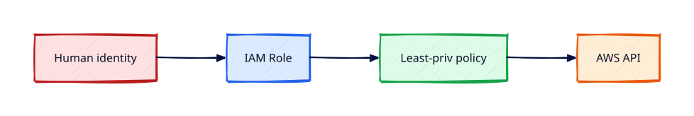

# IAM Fundamentals

## Overview

**Identity and Access Management (IAM)** is the control plane for who can call which AWS APIs.
Every production incident involving public S3 buckets or crypto-mining EC2 instances traces back
to IAM decisions — roles, policies, or missing MFA.

You will create groups and users sparingly, attach **least-privilege policies**, create an **IAM role**
for EC2, and enforce **MFA**. Prefer **roles** over long-lived access keys wherever possible.

This is **Tutorial 3** in **Module 1: Foundations** of the REBASH Academy AWS track.

!!! warning "Destroy lab resources and watch billing"
    Tear down every resource you create before you close your laptop. Set a **billing alarm**
    (see [Accounts, Free Tier, Billing, and Cost Hygiene](accounts-free-tier-billing-and-cost-hygiene.md))
    and check the Cost Explorer dashboard after each lab session.


## Prerequisites

- Completed [Accounts, Free Tier, Billing, and Cost Hygiene](accounts-free-tier-billing-and-cost-hygiene.md)
- Root MFA enabled; billing budget configured
- AWS CLI installed

## Learning Objectives

By the end of this tutorial, you will be able to:

- [ ] Explain users, groups, roles, and policies with correct use cases
- [ ] Write and attach a least-privilege IAM policy using JSON
- [ ] Create an EC2 instance profile role and trust policy
- [ ] Enable MFA for an IAM user and test denied-without-MFA patterns
- [ ] Run `aws iam simulate-principal-policy` to validate permissions

## Architecture




## Theory

### IAM building blocks

| Entity | Purpose | Production preference |
|--------|---------|------------------------|
| **User** | Human or long-lived CLI | Avoid except break-glass admin |
| **Group** | Bundle permissions for users | OK for small teams |
| **Role** | Temporary credentials via STS | **Default for EC2, Lambda, CI** |
| **Policy** | JSON allow/deny document | Least privilege, many small policies |

IAM is **global** — policies apply account-wide regardless of Region.

### Policy structure

```json
{
  "Version": "2012-10-17",
  "Statement": [{
    "Effect": "Allow",
    "Action": ["s3:ListBucket"],
    "Resource": "arn:aws:s3:::my-bucket",
    "Condition": {"Bool": {"aws:MultiFactorAuthPresent": "true"}}
  }]
}
```

- **Identity-based policies** attach to users, groups, roles
- **Resource-based policies** attach to S3 buckets, KMS keys, etc.
- **Permission boundaries** cap maximum permissions (advanced)

### Roles and trust policies

A **role** has two parts: permissions policy (what it can do) and **trust policy** (who can
assume it). EC2 assumes a role via an **instance profile**:

```json
{
  "Version": "2012-10-17",
  "Statement": [{
    "Effect": "Allow",
    "Principal": {"Service": "ec2.amazonaws.com"},
    "Action": "sts:AssumeRole"
  }]
}
```

### Least privilege workflow

1. Start with AWS managed **ReadOnly** or job-function policies for discovery
2. Narrow actions and resources based on CloudTrail `AccessDenied` logs
3. Prefer **roles** + SSO in organisations; never embed keys in user-data

### MFA

Require MFA for console users and sensitive API calls using `Condition` keys. Root MFA is
mandatory; IAM user MFA strongly recommended for admins.

## Hands-on Lab

### Step 1 — Create lab group and user (console or CLI)

```bash
aws iam create-group --group-name rebash-lab-admins
aws iam attach-group-policy --group-name rebash-lab-admins \
  --policy-arn arn:aws:iam::aws:policy/IAMUserChangePassword
aws iam create-user --user-name rebash.lab
aws iam add-user-to-group --user-name rebash.lab --group-name rebash-lab-admins
```

Attach a custom least-privilege policy for EC2 read in one Region (create `ec2-read-lab.json` first).

### Step 2 — Enable MFA for the lab user

Console: **IAM → Users → rebash.lab → Security credentials → Assign MFA device**.

### Step 3 — Create EC2 role + instance profile

```bash
aws iam create-role --role-name rebash-ec2-ssm-role \
  --assume-role-policy-document file://trust-ec2.json
aws iam attach-role-policy --role-name rebash-ec2-ssm-role \
  --policy-arn arn:aws:iam::aws:policy/AmazonSSMManagedInstanceCore
aws iam create-instance-profile --instance-profile-name rebash-ec2-ssm-profile
aws iam add-role-to-instance-profile \
  --instance-profile-name rebash-ec2-ssm-profile \
  --role-name rebash-ec2-ssm-role
```

### Step 4 — Simulate policy

```bash
aws iam simulate-principal-policy \
  --policy-source-arn arn:aws:iam::ACCOUNT_ID:user/rebash.lab \
  --action-names ec2:DescribeInstances s3:DeleteBucket
```

### Step 5 — Cleanup

```bash
aws iam remove-role-from-instance-profile \
  --instance-profile-name rebash-ec2-ssm-profile \
  --role-name rebash-ec2-ssm-role
aws iam delete-instance-profile --instance-profile-name rebash-ec2-ssm-profile
aws iam detach-role-policy --role-name rebash-ec2-ssm-role \
  --policy-arn arn:aws:iam::aws:policy/AmazonSSMManagedInstanceCore
aws iam delete-role --role-name rebash-ec2-ssm-role
# delete user, group, custom policies when finished
```

### LocalStack / dry-run alternative

With [LocalStack](https://localstack.cloud/) running on port 4566:

```bash
export AWS_ACCESS_KEY_ID=test
export AWS_SECRET_ACCESS_KEY=test
export AWS_DEFAULT_REGION=eu-west-1
aws --endpoint-url=http://localhost:4566 iam create-user --user-name rebash.lab
    aws --endpoint-url=http://localhost:4566 iam list-users
```

Some services are emulated imperfectly — treat LocalStack as CLI practice, not a full AWS substitute.

## Validation

| Check | Pass criteria |
|-------|---------------|
| User MFA | Console shows MFA device assigned |
| Role trust | `ec2.amazonaws.com` in trust policy |
| SSM policy | `AmazonSSMManagedInstanceCore` attached to role |
| Simulation | `DeleteBucket` simulated as denied for read-only user |
| Cleanup | No orphan instance profiles or test users left |

## Code Walkthrough

| Component | Detail |
|-----------|--------|
| Trust policy | Defines **who** can assume the role (service principal for EC2) |
| Permissions policy | Defines **what** API actions are allowed |
| Instance profile | Container attaching a role to an EC2 instance at launch |
| `simulate-principal-policy` | Tests policy without live API calls |
| MFA condition | Adds `aws:MultiFactorAuthPresent` requirement for sensitive actions |

## Security Considerations

- Prefer **roles** over IAM users with access keys on laptops
- Enable MFA on all privileged IAM users; never disable for convenience
- Do not use `AdministratorAccess` for daily lab users once basics work
- Rotate or delete unused access keys; check **Credential Report**
- Use permission boundaries for third-party roles in production

## Common Mistakes

!!! warning "Embedding access keys in user-data"
    Keys appear in console and logs. **Fix:** Use instance profiles and roles.

!!! warning "One AdministratorAccess user for everyone"
    No accountability; huge blast radius. **Fix:** Separate roles per job function with least privilege.

!!! warning "Skipping MFA on admin users"
    Phished password owns the account. **Fix:** Require MFA via policy condition.

## Best Practices

- **Roles** for EC2, Lambda, GitHub Actions OIDC — not static keys
- Name policies and roles clearly (`rebash-ec2-ssm-role`)
- Use AWS SSO / IAM Identity Centre in multi-user organisations
- Regularly audit with Access Analyzer and Credential Report
- Break-glass admin only with MFA and logging

## Troubleshooting

| Issue | Cause | Fix |
|-------|-------|-----|
| AccessDenied | Missing action in policy | Add action or use role with correct profile |
| Cannot assume role | Trust policy wrong principal | Fix `Principal` service or ARN |
| MFA still prompts on read | Sensitive action in policy | Split policies; use read-only role |
| Instance profile not visible at launch | Propagation delay | Wait 10s after create; refresh console |

## Production Patterns and Deep Dive

        ### How `IAM Fundamentals` fits in real environments

        Engineers working on **Module 1: Foundations** material use these concepts daily during design reviews,
        incident response, and cost optimisation workshops. The lab exercises prove you can execute;
        this section connects those commands to production trade-offs you will defend in interviews
        and on-call handovers.

        Production teams treating AWS as a first-class platform typically document:

        | Artefact | Purpose |
        |----------|---------|
        | Architecture decision record (ADR) | Why this service, alternatives rejected |
        | Runbook | Step-by-step operational procedures with rollback |
        | Teardown / DR checklist | What to destroy or fail over during exercises |
        | Cost owner | Who receives Budget alerts for resources tagged to this service |

        Always pair technical controls with **billing alarms** and a **destroy discipline** after
        experiments. The REBASH AWS track assumes British English documentation and explicit
        mention of Free Tier limits.

        ### Extended CLI and console reference

        The commands below extend the lab — run read-only variants first, then mutating operations
        in a non-production account. Replace `$LAB_REGION` and resource identifiers with your values.

        ```bash
aws iam generate-credential-report
aws iam get-credential-report --query 'Content' --output text | base64 -d | column -t -s,
aws iam list-roles --max-items 20
aws iam get-role --role-name rebash-ec2-ssm-role
aws iam simulate-custom-policy --policy-input-list file://policy.json \
  --action-names ec2:DescribeInstances s3:ListAllMyBuckets --resource-arns '*'
aws iam list-attached-role-policies --role-name rebash-ec2-ssm-role
aws accessanalyzer list-analyzers
```

Prefer **roles** with `sts:AssumeRole` for humans via SSO. Enforce **MFA** on root and admins.
Never use root for daily CLI. Review the credential report monthly.

        ### Operational scenario (table-top)

        **Scenario:** A teammate announces "customers cannot reach the application after a change."
        You suspect a misconfiguration related to **IAM Fundamentals**.

        | Step | Action | Why |
        |------|--------|-----|
        | 1 | Confirm Region and account (`aws sts get-caller-identity`) | Wrong profile wastes triage time |
        | 2 | Check CloudWatch alarms and recent deploys | Correlates timeline |
        | 3 | Review CloudTrail events for API changes in this service | Identifies who changed what |
        | 4 | Compare running config to IaC/Terraform state | Detects manual console drift |
        | 5 | Roll back or restore last known good | Document in incident ticket |
        | 6 | Update runbook and least-privilege IAM if human error | Prevents repeat |

        ### Hardening checklist before production

        - [ ] IAM roles preferred over IAM users with long-lived keys
        - [ ] MFA enabled for privileged humans; root not used daily
        - [ ] Resources tagged `Environment`, `Owner`, `CostCentre`
        - [ ] Budgets and anomaly detection configured
        - [ ] Encryption at rest and in transit enabled where supported
        - [ ] No `0.0.0.0/0` administrative ports (use SSM Session Manager)
        - [ ] Teardown script or `terraform destroy` documented for non-prod environments
        - [ ] Cross-links reviewed: [Networking](../networking/index.md), [Linux](../linux/index.md), [Terraform](../terraform/index.md)

        ### When to choose a different AWS service

        No service exists in isolation. If **IAM Fundamentals** feels forced, discuss alternatives with your
        team: managed versus self-managed, serverless versus EC2, or whether the workload belongs in
        another Region or account under AWS Organizations. Capture that decision in an ADR so future
        engineers understand the constraints you optimised for.

        ### Terraform handoff note

        After completing the AWS track, reproduce this tutorial's resources using modules in the
        [Terraform](../terraform/index.md) curriculum. Start with `required_providers` for `hashicorp/aws`,
        pin provider versions, store remote state in S3 with locking, and never commit secrets. The
        `iam-fundamentals` lesson maps cleanly to named resources you will import or recreate in HCL.

        ### Review questions (self-check)

        Before moving to the next tutorial, answer without looking at notes:

        1. Which API calls in this lesson are **read-only** versus **mutating**?
        2. What is the first command you run to confirm account and Region?
        3. Which tags will you apply so Cost Explorer can attribute spend?
        4. How do you destroy lab resources created here?
        5. Which [Networking](../networking/index.md) or [Linux](../linux/index.md) concept underpins this AWS service?

        ### Additional references inside AWS

        Browse the official **AWS Documentation** centre for `IAM Fundamentals` — focus on quotas, API permissions,
        and CloudWatch metrics emitted by the service. Bookmark the **Pricing** page for the service and
        add a line item to your personal cheat sheet noting Free Tier eligibility and the most common
        bill surprise mentioned in this tutorial.

## Summary

- IAM controls API access globally — users, groups, roles, and JSON policies
- **Prefer roles** with instance profiles for EC2; avoid long-lived keys
- Apply **least privilege** and **MFA**; simulate policies before production
- Destroy lab IAM artefacts you no longer need (users, test roles)

## Interview Questions

1. What is the difference between an IAM user and an IAM role?
2. Explain a trust policy versus a permissions policy.
3. Why is IAM global while EC2 is Regional?
4. How does an EC2 instance receive credentials from a role?
5. What is least privilege and how do you iterate towards it?
6. When would you use a permission boundary?
7. How can you require MFA for deleting S3 buckets?
8. What does `sts:AssumeRole` do?
9. Why avoid AdministratorAccess for application roles?
10. How do you audit unused IAM access keys?

!!! tip "Sample answer — question 1"
    A user is a permanent identity with optional long-lived access keys — suited to humans with MFA. A role provides **temporary** credentials via STS when assumed by a service (EC2, Lambda) or federated user. Production compute should almost always use roles.


!!! tip "Sample answer — question 4"
    At launch, an instance profile attaches a role. The EC2 metadata service (IMDS) delivers short-lived credentials rotated automatically. No access keys are stored on disk in user-data — covered in Tutorial 10.


## Related Tutorials

- Track overview: [AWS](index.md)
- Previous: [Accounts, Free Tier, Billing, and Cost Hygiene](accounts-free-tier-billing-and-cost-hygiene.md)
- Next: [AWS CLI, Credentials, and Profiles](aws-cli-credentials-and-profiles.md)
- [Terraform track](../terraform/index.md) — automate these patterns next


## References

1. [IAM User Guide](https://docs.aws.amazon.com/IAM/latest/UserGuide/introduction.html)
2. [IAM best practices](https://docs.aws.amazon.com/IAM/latest/UserGuide/best-practices.html)
3. [IAM policy reference](https://docs.aws.amazon.com/IAM/latest/UserGuide/reference_policies.html)
4. [Instance profiles](https://docs.aws.amazon.com/IAM/latest/UserGuide/id_roles_use_switch-role-ec2_instance-profiles.html)
