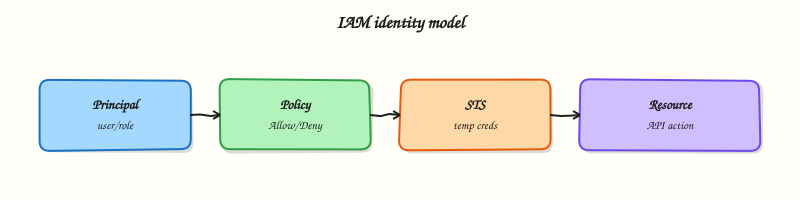

# IAM, Identity Access, and Organizations

## Overview


Design least-privilege access on AWS using Identity and Access Management (IAM) principals, roles, policies, multi-factor authentication (MFA), Security Token Service (STS), cross-account patterns, IAM Identity Center, and AWS Organizations.

Every API call is authorised by **identity + policy evaluation**. Misconfigured IAM is the most common cause of both outages (“AccessDenied”) and breaches (over-privileged keys). This module teaches the production model: humans use federated SSO; workloads assume **roles**; long-lived access keys are rare and rotated.

!!! warning "Cost and safety"
    IAM itself is free, but a compromised credential is not. Do **not** create access keys for the root user. Prefer roles and Identity Center. Tear down lab users/roles when finished.

This is a core tutorial in **Module 2 · Identity & Access Management** of the REBASH Academy **AWS for Cloud & DevOps Engineers** series — written for Cloud, DevOps, Platform, and SRE engineers.


## Prerequisites


- [AWS Fundamentals and Global Infrastructure](aws-fundamentals-and-global-infrastructure.md)
- Comfortable with JSON and the AWS CLI


## Learning Objectives


By the end of this tutorial, you will be able to:

- [ ] Distinguish users, groups, roles, and identity- vs resource-based policies  
- [ ] Explain MFA, STS temporary credentials, and role assumption  
- [ ] Sketch cross-account access with a trust policy  
- [ ] Place IAM Identity Center and Organizations (OUs, SCPs, billing) in a multi-account design  
- [ ] Write and evaluate a simple least-privilege identity-based policy


## Architecture


This topic’s control points and relationships are shown below.




## Theory


### What it is

**AWS Identity and Access Management (IAM)** is the global control plane for authentication and authorisation in an AWS account. Every Application Programming Interface (API) call is evaluated as **who** is calling plus **what** policies allow or deny. Humans, workloads, and services all become principals that must prove identity before any create, read, update, or delete succeeds.

### Why it matters

Misconfigured IAM causes both outages (`AccessDenied`) and breaches (over-privileged keys). Production pipelines deploy with roles — GitHub Actions OpenID Connect (OIDC), GitLab, CodeBuild — not shared IAM users. Platform landing zones separate prod/non-prod, deny risky actions with Service Control Policies (SCPs), and assign IAM Identity Center permission sets. SRE and DevSecOps need least privilege, multi-factor authentication (MFA) on break-glass paths, and CloudTrail attribution. Cross-account roles replace long-term keys shared across accounts.

### How it works

1. **Authenticate** — IAM user, role session, or federated identity.  
2. **Authorise** — identity + resource policies, SCPs, boundaries, session policies; explicit **Deny** wins.  
3. **Assume a role** — trust policy allows the caller; Security Token Service (STS) returns short-lived credentials.  
4. **Cross-account** — role in B trusts A; A calls `sts:AssumeRole`.  
5. **Organisations** — member accounts under OUs; Identity Center maps permission sets.

```text
Human → Identity Center / IdP → Permission set → Role → APIs
Workload → Instance role or OIDC → AssumeRoleWithWebIdentity → APIs
```

### Concept deep dive

- **IAM** — Account-wide identity service (global, not Regional). Defines principals, credentials, and policy evaluation for AWS APIs. Prefer roles and federation over long-lived access keys.
- **Users** — Long-lived identities with passwords and optional access keys. Rare break-glass or legacy only; workforce access should use Identity Center. Never create access keys for the root user.
- **Groups** — Collections of users sharing permission sets. Attach policies to groups, not one-off to every user, so joiner/mover/leaver changes stay maintainable.
- **Roles** — Assumable identities with temporary credentials. Workloads (EC2, Lambda, ECS) and humans (SSO or `AssumeRole`) should use roles. Separate **trust policy** (who may assume) from **permissions policy** (what they may do).
- **Policies** — JSON with `Effect`, `Action`, `Resource`, and optional `Condition`. **Identity-based** policies attach to users, groups, or roles. **Resource-based** policies attach to resources (bucket, queue, role trust). **Permission boundaries** set a maximum ceiling without granting rights.
- **MFA** — Second factor for console sign-in and sensitive APIs. Enforce for human privilege escalation and root; use conditions such as `aws:MultiFactorAuthPresent` where appropriate.
- **STS** — Issues temporary credentials (`AssumeRole`, `AssumeRoleWithWebIdentity`, federation). Short sessions limit blast radius versus permanent access keys.
- **Cross-account access** — Do not share user passwords across accounts. Account B defines a role trusting A; A calls `sts:AssumeRole`. Use an external ID for third parties; scope the role policy tightly.
- **IAM Identity Center** — Workforce SSO hub. Users authenticate to an IdP; permission sets map to roles across accounts. Production pattern for human access instead of per-account IAM users.
- **Organizations** — Multi-account hierarchy (management + members). **OUs** group accounts (for example `Security`, `Workloads/Prod`). **SCPs** are organisation-level ceilings — they never grant by themselves. **Consolidated billing** rolls charges to the payer while isolation stays per account.

### Key concepts and comparisons

| Concept | Production guidance |
|---------|---------------------|
| Least privilege | Deny by default; justify each action and resource |
| Root user | MFA on; no access keys; break-glass only |
| Trust vs permissions | Trust = who may assume; permissions = what they may do |
| Identity vs resource policy | Who holds rights vs what the resource allows |
| Permission boundary / SCP | Ceiling only — does not grant access |
| Identity Center | Workforce SSO + permission sets across accounts |
| Cross-account | Role assumption via STS, not shared long-term keys |

### Common pitfalls

- Leaving `AdministratorAccess` attached after a firefight  
- Confusing a trust policy with a permissions policy  
- Wildcard `Resource` on destructive APIs without conditions  
- IAM users with access keys for CI instead of OIDC roles  
- Expecting SCPs or permission boundaries to grant access  
- Skipping MFA on privileged human paths and the root user


## Hands-on Lab


!!! warning "Cost and account safety"
    Prefer read-only `describe`/`get` calls. Create resources only in a sandbox account and destroy them in the cleanup step.

Create a workspace for this tutorial.

```bash
mkdir -p ~/rebash-aws/module-02 && cd ~/rebash-aws/module-02
```

**Focus:** inspect IAM identity and simulate policy evaluation read-only

### Step 1 – IAM inventory

```bash
aws sts get-caller-identity | tee identity.json
aws iam get-user 2>/dev/null | tee user.json || echo 'Using a role session (normal for SSO)'
aws iam list-attached-user-policies --user-name "$(jq -r .Arn identity.json | awk -F/ '{print $NF}')" 2>/dev/null | tee policies.json || true
tee iam-notes.txt << 'EOF'
Prefer IAM Identity Center / roles over long-lived users. Least privilege + SCPs in Organizations.
EOF
```

### Final step – Cleanup note

```bash
# Read-only
```


## Validation


- [ ] Lab commands run under `~/rebash-aws/module-02/`
- [ ] You can explain each Theory section in your own words
- [ ] You used modern tooling where it applies to this topic
- [ ] You can describe one production failure mode for this topic


## Code Walkthrough


Production practice for **IAM, Identity Access, and Organizations** always combines:

1. Inspect before you change (status, plan, logs, dry-run)
2. Prefer reversible, documented changes (Git, IaC, drop-ins, version pins)
3. Capture evidence (command output, pipeline logs) for handovers
4. Prefer current tools and APIs over legacy shortcuts
5. Least privilege — escalate credentials only when required

Keep runbooks short enough to follow under pressure. Automate checks; keep humans for judgement.


## Security Considerations


- Treat credentials and tokens for aws as privileged — never commit them
- Prefer short-lived auth (OIDC, roles, SSO) over long-lived keys
- Validate blast radius before apply/deploy/delete operations
- Restrict who can approve production changes
- Collect audit logs; limit who can read sensitive traces


## Common Mistakes


!!! warning "Leaving `AdministratorAccess` attached after a firefight  "
    Validate assumptions against the Theory section and official docs before changing production.

!!! warning "Confusing a trust policy with a permissions policy  "
    Lab shortcuts (open security groups, admin roles, skip approvals) must not ship unchanged.

!!! warning "Changing production without a rollback path"
    Always know how to revert (previous artefact, prior release, state rollback, DNS failback).


## Best Practices


- Encode IAM, Identity Access, and Organizations changes as code and review them in pull requests
- Pin versions (images, modules, actions, provider plugins)
- Separate environments with clear promotion gates
- Alert on symptoms with runbooks attached
- Destroy lab resources; tag everything with owner and expiry where possible


## Troubleshooting


| Symptom | Likely cause | Fix |
|---------|--------------|-----|
| Auth / permission denied | Wrong identity, policy, or scope | Check caller identity, roles, and least-privilege policies |
| Timeout / no route | Network, DNS, security group, or endpoint | Trace path, DNS, and allow-lists before retrying |
| Drift / unexpected plan | Manual change or wrong state/workspace | Reconcile desired vs actual; avoid click-ops on managed resources |
| Pipeline/job red | Flaky step, cache, or missing secret | Read failing step logs; bisect recent workflow/config changes |
| Cost spike | Idle load balancer, NAT, oversized compute | Inventory billable resources; stop/delete labs promptly |


## Summary


**IAM, Identity Access, and Organizations** is essential for Cloud and DevOps engineers working with aws. Practise the lab until the inspection and change path is muscle memory, then continue the track.


## Interview Questions


1. How does **IAM, Identity Access, and Organizations** appear in a well-run AWS landing zone?
2. Users report timeouts to a service — what is your AWS-oriented triage order?
3. How do IAM roles and least privilege change your design for this topic?
4. What cost or blast-radius controls should wrap experiments in this area?
5. How would you prove correctness with read-only AWS APIs in an interview whiteboard?

!!! tip "Sample answer — question 2"
    Confirm identity/region, then path: DNS, SG/NACL, routes, target health, and CloudWatch/CloudTrail signals before changing infrastructure.

!!! tip "Sample answer — question 4"
    Sandbox accounts, budgets, tags, destroy-after-lab, and no long-lived keys in CI — use OIDC/roles.


## Related Tutorials


- [Course overview](index.md)
- [VPC Networking on AWS](vpc-networking-on-aws.md)


## References


- [IAM User Guide](https://docs.aws.amazon.com/IAM/latest/UserGuide/introduction.html)  
- [STS AssumeRole](https://docs.aws.amazon.com/STS/latest/APIReference/API_AssumeRole.html)  
- [IAM Identity Center](https://docs.aws.amazon.com/singlesignon/latest/userguide/what-is.html)  
- [AWS Organizations SCPs](https://docs.aws.amazon.com/organizations/latest/userguide/orgs_manage_policies_scps.html)
