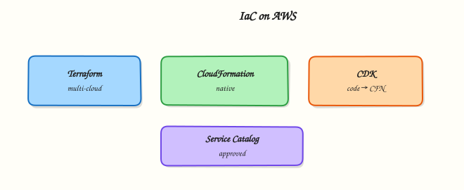

# Infrastructure as Code on AWS

## Overview


Compare HashiCorp Terraform, AWS CloudFormation, the AWS Cloud Development Kit (CDK), and AWS Service Catalog so you can pick an Infrastructure as Code (IaC) approach for a team and practise a **zero-cost or near-zero-cost** template validate/plan loop.

**Infrastructure as Code** defines cloud resources in files reviewed through Git, applied by pipelines, and reconciled to a desired state. On AWS you commonly meet four options: **Terraform** (multi-cloud HCL, huge ecosystem), **CloudFormation** (native declarative templates/stacks), **CDK** (TypeScript/Python/etc. that synthesise CloudFormation), and **Service Catalog** (governed products for end users). The “best” tool is the one your organisation can secure, review, and operate — not the newest blog post.

This is a core tutorial in **Module 11 · Infrastructure as Code** of the REBASH Academy **AWS for Cloud & DevOps Engineers** series — written for Cloud, DevOps, Platform, and SRE engineers.

## Prerequisites


- [AWS Security Services](aws-security-services.md)
- Git and AWS CLI fundamentals
- Helpful: prior Terraform or CloudFormation exposure

## Learning Objectives


By the end of this tutorial, you will be able to:

- [ ] State strengths and trade-offs of Terraform, CloudFormation, CDK, and Service Catalog for organisational fit  
- [ ] Compare Terraform remote state with CloudFormation stack state (and CDK’s relationship to both)  
- [ ] Explain CloudFormation change sets and StackSets for multi-account rollout  
- [ ] Run a CloudFormation `validate-template` (and optional Terraform plan) without leaving spend behind  
- [ ] Know when Service Catalog fits platform self-service

## Architecture


This topic’s control points and relationships are shown below.



## Theory


### What it is

**Infrastructure as Code (IaC)** defines resources in Git-reviewed files and reconciles them to a desired state. On AWS the common choices are **Terraform** (HCL; *you* operate remote state, often S3 + DynamoDB lock), **CloudFormation** (YAML/JSON **stacks**; AWS stores state; **change sets** preview updates; **StackSets** fan out across accounts/Regions), **CDK** (TypeScript/Python constructs that `cdk synth` into CloudFormation), and **Service Catalog** (approved products/portfolios so builders launch constrained stacks without full admin).

| Tool | Language | State | Org fit |
|------|----------|-------|---------|
| Terraform | HCL | You manage | Multi-cloud / modules |
| CloudFormation | YAML/JSON | AWS stack | AWS-native, StackSets |
| CDK | TS/Python/… | Via CFN stack | AWS-first constructs |
| Service Catalog | Products | Provisioned products | Governed self-service |

### Why it matters

ClickOps fails audits and does not scale. IaC makes VPC, IAM, and compute peer-reviewable. Multi-cloud estates often standardise on Terraform; AWS-centric platforms lean on CloudFormation/CDK and StackSets. Service Catalog offers golden stacks without `AdministratorAccess`. Interviews probe state risk, CDK synth surprises, and StackSets versus per-account apply.

### How it works

1. Author HCL, templates, or CDK constructs in Git.
2. CI runs `terraform plan`, change sets / `cfn-lint`, or `cdk synth` + diff.
3. Apply via short-lived OIDC roles — not laptop admin keys.
4. Terraform updates state; CloudFormation updates stacks; CDK bootstraps once then deploys.
5. Service Catalog admins version products; users launch under launch roles and tag options.
6. Day-two: drift detection, imports, module/construct refactors (pipelines in Module 12).

### Concept deep dive

**Terraform on AWS.** Providers call AWS APIs; state holds IDs and attributes. Encrypt and lock the backend; never commit state. Strengths: multi-cloud, registry modules, mature plan workflow. Risks: secrets in state, lock/partial-apply runbooks, provider version pins.

**CloudFormation.** A **stack** is a managed unit (plus nested stacks); failed updates may roll back. **Change sets** preview production IAM/network deltas before execute. **Drift detection** compares live config to the template. **StackSets** deploy one template across OUs/accounts with failure tolerance — the native “baseline every account” tool.

**CDK.** L2/L3 constructs synth to CloudFormation. You gain IDE refactoring and construct reuse; you risk unexpected roles, buckets, and custom resources. Always review `cdk diff` in CI. Deploy-time state is still the stack; `cdk bootstrap` creates staging resources.

**Service Catalog.** Versioned products in portfolios, with launch/template constraints and tag options. Fit: self-service app stacks. Anti-fit: unversioned dumping grounds.

**State models and org fit.** Terraform: you operate state → multi-cloud and existing modules; separate state per env/account. CloudFormation/CDK: AWS operates stacks → AWS-only estates, StackSets, Service Catalog packaging. Enterprises often **mix**: Terraform for platform modules, StackSets for account baselines, Service Catalog for builder self-service.

### Key concepts and comparisons

| Situation | Prefer |
|-----------|--------|
| Multi-cloud / TF modules | Terraform |
| Org-wide baselines | CloudFormation StackSets |
| Typed constructs | CDK (review synth) |
| Guardrailed self-service | Service Catalog |
| Preview risky delta | Change set / `terraform plan` |

| Concern | Terraform | CloudFormation / CDK |
|---------|-----------|----------------------|
| Who stores state? | You | AWS stack |
| Multi-account | Pipelines / workspaces | StackSets |
| Drift | `plan` + import | Drift detection |
| Abstraction risk | Module quality | Unexpected synth |

### Common pitfalls

- State (with secrets) in Git or public buckets.
- CDK deploy without reviewing synth.
- ClickOps on managed resources → permanent drift.
- Unversioned Service Catalog without launch constraints.
- Apply from personal admin keys.
- NAT/EKS “hello IaC” left running — prefer validate/plan first.
- Treating Terraform and CloudFormation as mutually exclusive.

## Hands-on Lab


!!! warning "Cost and account safety"
    Use a sandbox account. Prefer read-only calls. Destroy anything you create before leaving the lab.

### Objective

Use read-only AWS APIs to inventory and verify aspects of **Infrastructure as Code on AWS** in a sandbox account.

### Prerequisites

- AWS CLI v2
- Credentials for a **sandbox** account (SSO or short-lived keys)

### Lab environment

Workspace: `~/rebash-aws/module-11`

Prefer `describe`/`list`/`get` APIs. Create resources only with an explicit destroy path.

``` {.bash .ra-terminal title="Terminal"}
mkdir -p ~/rebash-aws/module-11 && cd ~/rebash-aws/module-11
```

### Real-world scenario

Security asks for evidence that **Infrastructure as Code on AWS** is configured correctly. You gather CLI proof without click-ops drift.

### Step-by-step tasks

#### Task 1 – Prove caller identity

Every AWS change starts by knowing which account/role you are.

``` {.bash .ra-terminal title="Terminal"}
aws sts get-caller-identity | tee identity.json
aws configure get region || true
test -s identity.json
```

!!! example "Expected output"
    JSON includes Account, Arn, and UserId.


#### Task 2 – Collect topic signals

Inventory the service surface related to this module.

``` {.bash .ra-terminal title="Terminal"}
aws ec2 describe-vpcs --query 'Vpcs[].{Id:VpcId,Cidr:CidrBlock}' --output table 2>/dev/null | tee vpcs.txt || true
aws iam get-account-summary 2>/dev/null | tee iam-summary.json || true
tee notes.txt << 'EOF'
Record which APIs apply to this topic and any NotAuthorized errors for follow-up.
EOF
cat notes.txt
```

!!! example "Expected output"
    Evidence files created even if some APIs are denied.


### Validation steps

- [ ] identity.json present
- [ ] No long-lived keys committed to the repo

### Common errors and fixes

| Error | Cause | Fix |
|-------|-------|-----|
| Unable to locate credentials | No profile/SSO | Run `aws sso login` or export sandbox keys |
| AccessDenied | Least privilege | Use a role that can read the service — or document the deny |
| UnauthorizedOperation | Wrong region/account | Check `AWS_REGION` and account id |

### Challenge exercise

Enable a cost budget alarm in the sandbox (or document the console clicks) and screenshot/CLI-describe it.

### Learning outcomes

- Authenticated safely
- Captured read-only evidence
- Avoided unmanaged spend

### Cleanup

```bash
# Revoke/lab-expire any temporary keys you exported
# Do not leave EC2/ELB/NAT running
```

## Validation


- [ ] Lab commands run under `~/rebash-aws/module-11/`
- [ ] You can explain each Theory section in your own words
- [ ] You used modern tooling where it applies to this topic
- [ ] You can describe one production failure mode for this topic

## Code Walkthrough


Production practice for **Infrastructure as Code on AWS** always combines:

1. Inspect before you change (status, plan, logs, dry-run)
2. Prefer reversible, documented changes (Git, IaC, drop-ins, version pins)
3. Capture evidence (command output, pipeline logs) for handovers
4. Prefer current tools and APIs over legacy shortcuts
5. Least privilege — escalate credentials only when required

Keep runbooks short enough to follow under pressure. Automate checks; keep humans for judgement.

## Security Considerations


- Treat credentials and tokens for aws as privileged — never commit them
- Prefer short-lived auth (OIDC, roles, SSO) over long-lived keys
- Validate blast radius before apply/deploy/delete operations
- Restrict who can approve production changes
- Collect audit logs; limit who can read sensitive traces

## Common Mistakes


!!! warning "State (with secrets) in Git or public buckets."
    Validate assumptions against the Theory section and official docs before changing production.

!!! warning "CDK deploy without reviewing synth."
    Lab shortcuts (open security groups, admin roles, skip approvals) must not ship unchanged.

!!! warning "Changing production without a rollback path"
    Always know how to revert (previous artefact, prior release, state rollback, DNS failback).

## Best Practices


- Encode Infrastructure as Code on AWS changes as code and review them in pull requests
- Pin versions (images, modules, actions, provider plugins)
- Separate environments with clear promotion gates
- Alert on symptoms with runbooks attached
- Destroy lab resources; tag everything with owner and expiry where possible

## Troubleshooting


| Symptom | Likely cause | Fix |
|---------|--------------|-----|
| Auth / permission denied | Wrong identity, policy, or scope | Check caller identity, roles, and least-privilege policies |
| Timeout / no route | Network, DNS, security group, or endpoint | Trace path, DNS, and allow-lists before retrying |
| Drift / unexpected plan | Manual change or wrong state/workspace | Reconcile desired vs actual; avoid click-ops on managed resources |
| Pipeline/job red | Flaky step, cache, or missing secret | Read failing step logs; bisect recent workflow/config changes |
| Cost spike | Idle load balancer, NAT, oversized compute | Inventory billable resources; stop/delete labs promptly |

## Summary


**Infrastructure as Code on AWS** is essential for Cloud and DevOps engineers working with aws. Practise the lab until the inspection and change path is muscle memory, then continue the track.

## Interview Questions


1. CloudFormation versus Terraform/CDK trade-offs?
2. Why validate templates before create-stack?
3. How do you recover from a ROLLBACK_COMPLETE stack?
4. Change sets — when required?
5. How do you keep credentials out of templates?

!!! tip "Sample answer — question 2"
    Read stack events for the first failing resource. Delete failed lab stacks so names can be reused.

!!! tip "Sample answer — question 4"
    Use roles for deployment and never hardcode secrets in templates.

## Related Tutorials


- [Course overview](index.md)
- [CI/CD on AWS](cicd-on-aws.md)

## References


- [AWS CloudFormation User Guide](https://docs.aws.amazon.com/AWSCloudFormation/latest/UserGuide/Welcome.html)  
- [AWS CDK Developer Guide](https://docs.aws.amazon.com/cdk/v2/guide/home.html)  
- [AWS Service Catalog](https://docs.aws.amazon.com/servicecatalog/latest/adminguide/introduction.html)  
- [Terraform AWS Provider](https://registry.terraform.io/providers/hashicorp/aws/latest/docs)  
- [AWS Well-Architected — Operational Excellence](https://docs.aws.amazon.com/wellarchitected/latest/framework/operational-excellence.html)
