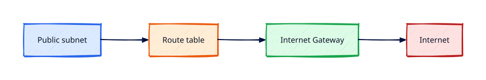

# Internet Gateways, Routes, and Egress

## Overview

Public internet reachability in AWS is explicit: an **Internet Gateway**, route table entries,
and (for private subnets) **NAT** or alternatives. Misconfigured routes cause "works in public,
broken in private" bugs.

This tutorial attaches an IGW, configures routes, compares NAT egress costs, and demonstrates
the **recommended lab pattern**: public subnet + **SSM** instead of NAT Gateway.

This is **Tutorial 6** in **Module 2: VPC Networking** of the REBASH Academy AWS track.

!!! warning "Destroy lab resources and watch billing"
    Tear down every resource you create before you close your laptop. Set a **billing alarm**
    (see [Accounts, Free Tier, Billing, and Cost Hygiene](accounts-free-tier-billing-and-cost-hygiene.md))
    and check the Cost Explorer dashboard after each lab session.

!!! danger "NAT Gateway cost warning"
    **NAT Gateway** bills hourly **and** per GB processed — it is **not** Free Tier friendly.
    For REBASH labs, prefer **public subnet EC2 with SSM Session Manager** (no inbound SSH)
    or **VPC endpoints** (Tutorial 8) instead of NAT. If you create NAT for learning, **destroy
    it in the same session**.

## Prerequisites

- Completed [VPC, Subnets, and Multi-AZ Design](vpc-subnets-and-multi-az-design.md)
- Billing budget configured

## Learning Objectives

By the end of this tutorial, you will be able to:

- [ ] Attach and detach an Internet Gateway correctly
- [ ] Add `0.0.0.0/0` routes to public route tables
- [ ] Explain NAT Gateway egress and its cost model
- [ ] Implement lab egress via SSM without NAT
- [ ] Validate connectivity with ping/curl and teardown IGW

## Architecture




## Theory

### Internet Gateway (IGW)

Regional, horizontally scaled VPC component. One IGW per VPC for standard internet access.
Public subnet route: `0.0.0.0/0` → `igw-xxxx`.

### NAT Gateway vs NAT instance vs alternatives

| Option | Pros | Cons |
|--------|------|------|
| **NAT Gateway** | Managed, scalable | **Hourly + data charge — costly in labs** |
| **NAT instance** | Cheaper (legacy) | You patch and scale it |
| **Public + SSM** | No NAT for admin | Instance in public subnet; no SSH port |
| **VPC endpoints** | Private access to AWS APIs | Not general internet |

### SSM Session Manager path

EC2 in a **public subnet** with IGW route, **no SSH security group rule**, SSM agent, and
instance profile `AmazonSSMManagedInstanceCore` gives shell access without bastion or NAT.

### Elastic IP charges

Unattached EIPs and EIPs attached to stopped instances can incur charges. Release after labs.

## Hands-on Lab

### Step 1 — IGW and public route

```bash
export LAB_REGION=eu-west-1
# Assume VPC_ID and public subnet from Tutorial 5 or recreate minimal VPC

IGW_ID=$(aws ec2 create-internet-gateway --region $LAB_REGION \
  --tag-specifications 'ResourceType=internet-gateway,Tags=[{Key=Name,Value=rebash-igw}]' \
  --query InternetGateway.InternetGatewayId --output text)

aws ec2 attach-internet-gateway --internet-gateway-id $IGW_ID --vpc-id $VPC_ID --region $LAB_REGION

RTB_ID=$(aws ec2 create-route-table --vpc-id $VPC_ID --region $LAB_REGION \
  --query RouteTable.RouteTableId --output text)

aws ec2 create-route --route-table-id $RTB_ID --destination-cidr-block 0.0.0.0/0 \
  --gateway-id $IGW_ID --region $LAB_REGION

aws ec2 associate-route-table --route-table-id $RTB_ID --subnet-id $PUBLIC_SUBNET_ID --region $LAB_REGION
```

### Step 2 — Preferred lab pattern (SSM, no NAT)

Launch Amazon Linux 2023 in the public subnet with the SSM instance profile from Tutorial 3.
Security group: **no inbound** from 0.0.0.0/0; outbound HTTPS allowed.

```bash
aws ssm start-session --target i-INSTANCE_ID --region $LAB_REGION
```

### Step 3 — Optional NAT demo (destroy immediately)

```bash
# ONLY if you accept charges — delete within the hour
# aws ec2 create-nat-gateway --subnet-id $PUBLIC_SUBNET_ID --allocation-id $EIP_ALLOC ...
```

### Step 4 — Teardown

```bash
aws ec2 delete-route --route-table-id $RTB_ID --destination-cidr-block 0.0.0.0/0 --region $LAB_REGION
aws ec2 detach-internet-gateway --internet-gateway-id $IGW_ID --vpc-id $VPC_ID --region $LAB_REGION
aws ec2 delete-internet-gateway --internet-gateway-id $IGW_ID --region $LAB_REGION
```

### LocalStack / dry-run alternative

With [LocalStack](https://localstack.cloud/) running on port 4566:

```bash
export AWS_ACCESS_KEY_ID=test
export AWS_SECRET_ACCESS_KEY=test
export AWS_DEFAULT_REGION=eu-west-1
aws --endpoint-url=http://localhost:4566 ec2 create-internet-gateway
    aws --endpoint-url=http://localhost:4566 ec2 describe-internet-gateways
```

Some services are emulated imperfectly — treat LocalStack as CLI practice, not a full AWS substitute.

## Validation

| Check | Pass criteria |
|-------|---------------|
| IGW attached | `describe-internet-gateways` shows VPC |
| Public route | `0.0.0.0/0` → igw in route table |
| SSM session | Shell without SSH port open |
| NAT | None left running (or deleted) |
| Billing | Cost Explorer still near zero |

## Code Walkthrough

| Step | Detail |
|------|--------|
| Attach IGW | Required before public routing works |
| Public route | Only subnets associated with this RTB become public |
| SSM | Uses outbound HTTPS to AWS endpoints — no inbound SSH |
| NAT GW | Place in **public** subnet; private RT points to NAT |

## Security Considerations

- Do not open SSH 0.0.0.0/0; use SSM with least-privilege instance role
- NAT hides private IP sources but still exposes outbound attack surface — monitor egress
- Release unused Elastic IPs promptly

## Common Mistakes

!!! warning "NAT Gateway over weekend"
    Tens of dollars for idle hours. **Fix:** Destroy same day; use SSM pattern in labs.

!!! warning "IGW on private subnet route only"
    Confusion about direction. **Fix:** NAT goes in public subnet; private RT targets NAT.

!!! warning "SSH open to world"
    Constant brute force. **Fix:** SSM Session Manager instead.

## Best Practices

- Prefer SSM and endpoints over NAT for admin and AWS API traffic
- Use NAT Gateway in production private tiers when internet egress required
- One NAT per AZ for HA in prod; single NAT for non-prod cost savings
- Monitor NAT costs in Cost Explorer

## Troubleshooting

| Issue | Cause | Fix |
|-------|-------|-----|
| No internet on public instance | Missing IGW route or `MapPublicIpOnLaunch` | Fix route table association |
| SSM offline | No role or outbound block | Attach SSM policy; allow 443 outbound |
| Cannot delete IGW | Still attached | Detach from VPC first |

## Production Patterns and Deep Dive

        ### How `Internet Gateways, Routes, and Egress` fits in real environments

        Engineers working on **Module 2: VPC Networking** material use these concepts daily during design reviews,
        incident response, and cost optimisation workshops. The lab exercises prove you can execute;
        this section connects those commands to production trade-offs you will defend in interviews
        and on-call handovers.

        Production teams treating AWS as a first-class platform typically document:

        | Artefact | Purpose |
        |----------|---------|
        | Architecture decision record (ADR) | Why this service, alternatives rejected |
        | Runbook | Step-by-step operational procedures with rollback |
        | Teardown / DR checklist | What to destroy or fail over during exercises |
        | Cost owner | Who receives Budget alerts for resources tagged to this service |

        Always pair technical controls with **billing alarms** and a **destroy discipline** after
        experiments. The REBASH AWS track assumes British English documentation and explicit
        mention of Free Tier limits.

        ### Extended CLI and console reference

        The commands below extend the lab — run read-only variants first, then mutating operations
        in a non-production account. Replace `$LAB_REGION` and resource identifiers with your values.

        ```bash
aws ec2 describe-internet-gateways --filters Name=attachment.vpc-id,Values=$VPC_ID
aws ec2 describe-route-tables --filters Name=vpc-id,Values=$VPC_ID --query 'RouteTables[].Routes'
aws ec2 describe-nat-gateways --filter Name=vpc-id,Values=$VPC_ID
aws ec2 describe-addresses --filters Name=domain,Values=vpc
aws ssm describe-instance-information --filters Key=PingStatus,Values=Online
```

**NAT Gateway COST warning:** destroy same session. Prefer public subnet + SSM for labs.

        ### Operational scenario (table-top)

        **Scenario:** A teammate announces "customers cannot reach the application after a change."
        You suspect a misconfiguration related to **Internet Gateways, Routes, and Egress**.

        | Step | Action | Why |
        |------|--------|-----|
        | 1 | Confirm Region and account (`aws sts get-caller-identity`) | Wrong profile wastes triage time |
        | 2 | Check CloudWatch alarms and recent deploys | Correlates timeline |
        | 3 | Review CloudTrail events for API changes in this service | Identifies who changed what |
        | 4 | Compare running config to IaC/Terraform state | Detects manual console drift |
        | 5 | Roll back or restore last known good | Document in incident ticket |
        | 6 | Update runbook and least-privilege IAM if human error | Prevents repeat |

        ### Hardening checklist before production

        - [ ] IAM roles preferred over IAM users with long-lived keys
        - [ ] MFA enabled for privileged humans; root not used daily
        - [ ] Resources tagged `Environment`, `Owner`, `CostCentre`
        - [ ] Budgets and anomaly detection configured
        - [ ] Encryption at rest and in transit enabled where supported
        - [ ] No `0.0.0.0/0` administrative ports (use SSM Session Manager)
        - [ ] Teardown script or `terraform destroy` documented for non-prod environments
        - [ ] Cross-links reviewed: [Networking](../networking/index.md), [Linux](../linux/index.md), [Terraform](../terraform/index.md)

        ### When to choose a different AWS service

        No service exists in isolation. If **Internet Gateways, Routes, and Egress** feels forced, discuss alternatives with your
        team: managed versus self-managed, serverless versus EC2, or whether the workload belongs in
        another Region or account under AWS Organizations. Capture that decision in an ADR so future
        engineers understand the constraints you optimised for.

        ### Terraform handoff note

        After completing the AWS track, reproduce this tutorial's resources using modules in the
        [Terraform](../terraform/index.md) curriculum. Start with `required_providers` for `hashicorp/aws`,
        pin provider versions, store remote state in S3 with locking, and never commit secrets. The
        `internet-gateways-routes-and-egress` lesson maps cleanly to named resources you will import or recreate in HCL.

        ### Review questions (self-check)

        Before moving to the next tutorial, answer without looking at notes:

        1. Which API calls in this lesson are **read-only** versus **mutating**?
        2. What is the first command you run to confirm account and Region?
        3. Which tags will you apply so Cost Explorer can attribute spend?
        4. How do you destroy lab resources created here?
        5. Which [Networking](../networking/index.md) or [Linux](../linux/index.md) concept underpins this AWS service?

        ### Additional references inside AWS

        Browse the official **AWS Documentation** centre for `Internet Gateways, Routes, and Egress` — focus on quotas, API permissions,
        and CloudWatch metrics emitted by the service. Bookmark the **Pricing** page for the service and
        add a line item to your personal cheat sheet noting Free Tier eligibility and the most common
        bill surprise mentioned in this tutorial.

## Summary

- IGW + public routes enable inbound/outbound internet for public subnets
- **NAT Gateway is expensive** — avoid in Free Tier labs; prefer public + SSM
- Destroy IGW, NAT, and EIPs after labs; confirm billing alarms

## Interview Questions

1. What does an Internet Gateway do in a VPC?
2. Why is NAT Gateway costly for labs?
3. How can SSM replace a bastion host?
4. Where must a NAT Gateway be placed?
5. Difference between public IP and Elastic IP?
6. What route makes a subnet public?
7. When do you need NAT at all?
8. How does outbound-only security group interact with IGW?
9. What charges apply to unattached Elastic IPs?
10. How would you give private subnets AWS API access without NAT?

!!! tip "Sample answer — question 2"
    NAT Gateway has hourly availability charges plus per-GB data processing. A forgotten NAT over a weekend easily exceeds a student lab budget. SSM and VPC endpoints cover many lab/admin cases without general internet egress.


!!! tip "Sample answer — question 3"
    SSM Agent on EC2 calls AWS APIs outbound on 443. With an instance profile granting `ssm:StartSession`, operators get a shell in the console/CLI without opening SSH or running a bastion.


## Related Tutorials

- Track overview: [AWS](index.md)
- Previous: [VPC, Subnets, and Multi-AZ Design](vpc-subnets-and-multi-az-design.md)
- Next: [Security Groups and NACLs](security-groups-and-nacls.md)
- [Networking track](../networking/index.md) — TCP/IP and routing before VPC specifics
- [Cloud Networking: VPC and Subnets](../networking/cloud-networking-vpc-and-subnets.md) — conceptual VPC model
- [Linux track](../linux/index.md) — host skills for EC2 and SSM
- [Terraform track](../terraform/index.md) — automate these patterns next

- [Networking track](../networking/index.md) — TCP/IP and routing before VPC specifics
- [Cloud Networking: VPC and Subnets](../networking/cloud-networking-vpc-and-subnets.md) — conceptual VPC model
- [Linux track](../linux/index.md) — host skills for EC2 and SSM

## References

1. [Internet gateways](https://docs.aws.amazon.com/vpc/latest/userguide/VPC_Internet_Gateway.html)
2. [NAT gateways](https://docs.aws.amazon.com/vpc/latest/userguide/vpc-nat-gateway.html)
3. [SSM Session Manager](https://docs.aws.amazon.com/systems-manager/latest/userguide/session-manager.html)
