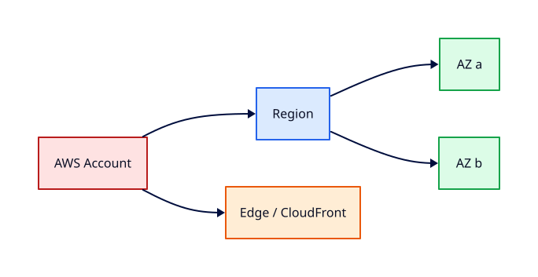

# Introduction to AWS and Global Infrastructure

## Overview

Amazon Web Services (AWS) is the largest public cloud provider. Before you launch a single EC2
instance, you need a mental map of **Regions**, **Availability Zones**, **Edge Locations**,
and the **shared responsibility model** — otherwise every service name feels arbitrary.

This tutorial explains how AWS organises infrastructure globally, how to choose a Region for
labs, and how AWS partitions responsibility between you and the provider. You will explore
the console and CLI read-only commands so you understand where resources live and why latency
and compliance start with Region selection.

This is **Tutorial 1** in **Module 1: Foundations** of the REBASH Academy AWS track.

!!! warning "Destroy lab resources and watch billing"
    Tear down every resource you create before you close your laptop. Set a **billing alarm**
    (see [Accounts, Free Tier, Billing, and Cost Hygiene](accounts-free-tier-billing-and-cost-hygiene.md))
    and check the Cost Explorer dashboard after each lab session.


## Prerequisites

- Completed the [Networking](../networking/index.md) fundamentals track (or equivalent TCP/IP awareness)
- Comfortable using a terminal on Linux, macOS, or WSL
- An email address if you plan to create a Free Tier account in a later tutorial

## Learning Objectives

By the end of this tutorial, you will be able to:

- [ ] Explain Regions, AZs, and why most resources are Regional
- [ ] Describe the AWS shared responsibility model in plain language
- [ ] List major global services (IAM, Route 53, CloudFront) versus Regional ones (EC2, VPC)
- [ ] Choose a sensible home Region for Free Tier labs
- [ ] Navigate the AWS Management Console and run read-only CLI discovery commands

## Architecture



| Layer | What it is | Lab relevance |
|-------|------------|---------------|
| **Region** | Geographic area (e.g. `eu-west-1`) | All resources are Regional unless stated |
| **Availability Zone (AZ)** | Isolated data centre group within a Region | Multi-AZ designs for resilience |
| **Local Zone / Wavelength** | Edge extensions | Low-latency special cases — skip in Module 1 |
| **Edge location** | CloudFront / Route 53 caching | Covered in later edge tutorials |

## Theory

### Regions and Availability Zones

A **Region** is a named geographic area (`us-east-1`, `eu-west-1`, `ap-southeast-2`). Each
Region contains multiple **Availability Zones** — physically separate data centres with
independent power and networking, connected by low-latency links.

| Concept | Analogy | Production note |
|---------|---------|-----------------|
| Region | Country or metro area | Data residency and latency |
| AZ | Separate campus building | Spread tiers across ≥2 AZs |
| Edge location | CDN cache near users | Static content, DNS caching |

For REBASH Academy labs, pick **one Region** and stay there unless a tutorial says otherwise.
`eu-west-1` (Ireland) and `us-east-1` (N. Virginia) are common choices; `us-east-1` often has
the newest services first, whilst `eu-west-1` suits many European learners.

### Global vs Regional services

| Scope | Examples | Implication |
|-------|----------|-------------|
| **Global** | IAM, Route 53 (hosted zones), CloudFront | Names are global; policies apply account-wide |
| **Regional** | EC2, VPC, S3 buckets, RDS | ARNs include Region; failures can be Regional |
| **AZ-scoped** | Subnets, EC2 instances | You choose AZ at launch |

### Shared responsibility model

AWS secures **of** the cloud (hardware, hypervisor, physical facilities). You secure **in**
the cloud (OS patches on EC2, IAM policies, encryption choices, security group rules).

| AWS responsible | You responsible |
|-----------------|-----------------|
| Physical security | Guest OS and application patches |
| Hypervisor | IAM users, roles, MFA |
| Managed service patching (e.g. RDS engine) | Network configuration, open ports |
| Global infrastructure resilience | Data classification and backup strategy |

### Account, Organisation, and landing zone (preview)

An **AWS account** is a hard billing and security boundary. **AWS Organizations** lets you
consolidate billing and apply **service control policies (SCPs)** across member accounts. You
will create a single Free Tier account in the next tutorial; enterprise teams use multi-account
strategies (separate accounts for prod/non-prod/logging).

### Console vs CLI vs Infrastructure as Code

The console is excellent for discovery. The CLI scales for scripts and matches what
[Terraform](../terraform/index.md) providers call under the hood. Production teams favour
version-controlled IaC; the console remains useful for support and incident triage.

## Hands-on Lab

### Path A — AWS Free Tier (read-only discovery)

Sign in to the [AWS Management Console](https://console.aws.amazon.com/). Note the Region
selector (top-right). Switch to your chosen lab Region and leave it there for the whole track.

```bash
aws --version
aws configure list
aws ec2 describe-regions --query 'Regions[].RegionName' --output table
aws ec2 describe-availability-zones --region eu-west-1 --query 'AvailabilityZones[].ZoneName' --output table
aws sts get-caller-identity
```

**Expected:** Your account ID, user/role ARN, and a table of AZ names like `eu-west-1a`.

Browse **Services → EC2 → Account attributes** and **VPC** to see default VPC presence (varies
by account age). Do **not** launch billable resources yet.

### Path B — LocalStack (CLI shape only)

### LocalStack / dry-run alternative

With [LocalStack](https://localstack.cloud/) running on port 4566:

```bash
export AWS_ACCESS_KEY_ID=test
export AWS_SECRET_ACCESS_KEY=test
export AWS_DEFAULT_REGION=eu-west-1
aws --endpoint-url=http://localhost:4566 ec2 describe-regions --output table
    aws --endpoint-url=http://localhost:4566 sts get-caller-identity
```

Some services are emulated imperfectly — treat LocalStack as CLI practice, not a full AWS substitute.
### Step — Document your lab Region

Create `~/rebash-aws/region.txt`:

```bash
mkdir -p ~/rebash-aws
echo "LAB_REGION=eu-west-1" >> ~/rebash-aws/region.txt
```

Use this Region in every subsequent tutorial unless instructed otherwise.

## Validation

| Check | Command / action | Pass criteria |
|-------|------------------|---------------|
| CLI installed | `aws --version` | Version 2.x shown |
| Identity | `aws sts get-caller-identity` | Account, ARN returned |
| Regions | `aws ec2 describe-regions` | Table of Region codes |
| AZs | `aws ec2 describe-availability-zones --region $LAB_REGION` | ≥3 AZs listed |
| Console | Region selector | Matches `$LAB_REGION` |

## Code Walkthrough

| Command / area | Purpose |
|----------------|---------|
| `aws ec2 describe-regions` | Lists opt-in and standard Regions |
| `aws ec2 describe-availability-zones` | AZ names for VPC subnet planning |
| `aws sts get-caller-identity` | Confirms which account and principal the CLI uses |
| Console Region selector | Every Regional API call uses this default in the console |
| Shared responsibility | Guides what you harden in later IAM and EC2 tutorials |

## Security Considerations

- Do not share root account credentials; enable MFA on root when you create an account
- Use IAM users or roles for daily CLI access — covered in the next modules
- Read-only discovery commands are safe; avoid creating resources until you understand billing
- Record which Region stores data for compliance discussions with your organisation

## Common Mistakes

!!! warning "Mixing Regions across tutorials"
    Resources in `eu-west-1` cannot attach to a VPC in `us-east-1`. **Fix:** Pick one lab Region and export `AWS_DEFAULT_REGION`.

!!! warning "Assuming all services are global"
    EC2 and VPC are Regional; ARNs include the Region. **Fix:** Check the service chapter in AWS documentation for scope.

!!! warning "Ignoring AZ labels"
    `eu-west-1a` maps to different physical AZs per account. **Fix:** Use AZ IDs (`use1-az1`) in automation when absolute consistency matters.

## Best Practices

- Standardise a lab Region in team documentation
- Design multi-AZ for production tiers; single-AZ is acceptable for short Free Tier labs
- Prefer CLI or IaC once past discovery — reproducible and reviewable
- Enable MFA on the root user and avoid daily root sign-in
- Set billing alarms before launching EC2 or RDS (next tutorials)

## Troubleshooting

| Issue | Likely cause | Fix |
|-------|--------------|-----|
| `Unable to locate credentials` | CLI not configured | Run `aws configure` or use SSO profile (Tutorial 4) |
| Empty Region list | Wrong partition or endpoint | Use real AWS endpoints; check `AWS_DEFAULT_REGION` |
| Access denied on describe | IAM policy missing read | Use an administrator lab user temporarily; tighten in Tutorial 3 |
| Console shows different Region than CLI | Separate defaults | Align `AWS_DEFAULT_REGION` with console selector |

## Production Patterns and Deep Dive

        ### How `Introduction to AWS and Global Infrastructure` fits in real environments

        Engineers working on **Module 1: Foundations** material use these concepts daily during design reviews,
        incident response, and cost optimisation workshops. The lab exercises prove you can execute;
        this section connects those commands to production trade-offs you will defend in interviews
        and on-call handovers.

        Production teams treating AWS as a first-class platform typically document:

        | Artefact | Purpose |
        |----------|---------|
        | Architecture decision record (ADR) | Why this service, alternatives rejected |
        | Runbook | Step-by-step operational procedures with rollback |
        | Teardown / DR checklist | What to destroy or fail over during exercises |
        | Cost owner | Who receives Budget alerts for resources tagged to this service |

        Always pair technical controls with **billing alarms** and a **destroy discipline** after
        experiments. The REBASH AWS track assumes British English documentation and explicit
        mention of Free Tier limits.

        ### Extended CLI and console reference

        The commands below extend the lab — run read-only variants first, then mutating operations
        in a non-production account. Replace `$LAB_REGION` and resource identifiers with your values.

        ```bash
aws account list-regions --region us-east-1 --output table
aws ec2 describe-regions --all-regions --filters Name=opt-in-status,Values=opt-in-not-required,enabled-by-default
aws pricing describe-services --service-code AmazonEC2 --region us-east-1
aws service-quotas list-service-quotas --service-code ec2 --region eu-west-1
aws health describe-events --filter eventTypeCategories=issue
curl -s https://ip-ranges.amazonaws.com/ip-ranges.json | jq '.prefixes[] | select(.region=="eu-west-1")' | head
```

| Concept | Production tip |
|---------|----------------|
| Region selection | Align with data residency and latency to users |
| AZ spread | Minimum two AZs for HA tiers |
| Service quotas | Request increases before launch day |
| AWS Health Dashboard | Subscribe to operational events |

        ### Operational scenario (table-top)

        **Scenario:** A teammate announces "customers cannot reach the application after a change."
        You suspect a misconfiguration related to **Introduction to AWS and Global Infrastructure**.

        | Step | Action | Why |
        |------|--------|-----|
        | 1 | Confirm Region and account (`aws sts get-caller-identity`) | Wrong profile wastes triage time |
        | 2 | Check CloudWatch alarms and recent deploys | Correlates timeline |
        | 3 | Review CloudTrail events for API changes in this service | Identifies who changed what |
        | 4 | Compare running config to IaC/Terraform state | Detects manual console drift |
        | 5 | Roll back or restore last known good | Document in incident ticket |
        | 6 | Update runbook and least-privilege IAM if human error | Prevents repeat |

        ### Hardening checklist before production

        - [ ] IAM roles preferred over IAM users with long-lived keys
        - [ ] MFA enabled for privileged humans; root not used daily
        - [ ] Resources tagged `Environment`, `Owner`, `CostCentre`
        - [ ] Budgets and anomaly detection configured
        - [ ] Encryption at rest and in transit enabled where supported
        - [ ] No `0.0.0.0/0` administrative ports (use SSM Session Manager)
        - [ ] Teardown script or `terraform destroy` documented for non-prod environments
        - [ ] Cross-links reviewed: [Networking](../networking/index.md), [Linux](../linux/index.md), [Terraform](../terraform/index.md)

        ### When to choose a different AWS service

        No service exists in isolation. If **Introduction to AWS and Global Infrastructure** feels forced, discuss alternatives with your
        team: managed versus self-managed, serverless versus EC2, or whether the workload belongs in
        another Region or account under AWS Organizations. Capture that decision in an ADR so future
        engineers understand the constraints you optimised for.

        ### Terraform handoff note

        After completing the AWS track, reproduce this tutorial's resources using modules in the
        [Terraform](../terraform/index.md) curriculum. Start with `required_providers` for `hashicorp/aws`,
        pin provider versions, store remote state in S3 with locking, and never commit secrets. The
        `introduction-to-aws-and-global-infrastructure` lesson maps cleanly to named resources you will import or recreate in HCL.

        ### Review questions (self-check)

        Before moving to the next tutorial, answer without looking at notes:

        1. Which API calls in this lesson are **read-only** versus **mutating**?
        2. What is the first command you run to confirm account and Region?
        3. Which tags will you apply so Cost Explorer can attribute spend?
        4. How do you destroy lab resources created here?
        5. Which [Networking](../networking/index.md) or [Linux](../linux/index.md) concept underpins this AWS service?

        ### Additional references inside AWS

        Browse the official **AWS Documentation** centre for `Introduction to AWS and Global Infrastructure` — focus on quotas, API permissions,
        and CloudWatch metrics emitted by the service. Bookmark the **Pricing** page for the service and
        add a line item to your personal cheat sheet noting Free Tier eligibility and the most common
        bill surprise mentioned in this tutorial.

## Summary

- AWS organises compute and networking into **Regions** and **AZs**; most lab resources are Regional
- **IAM** is global; **EC2/VPC** are Regional — always check scope
- The **shared responsibility model** defines what AWS patches versus what you must harden
- Choose one lab Region, verify identity with `sts get-caller-identity`, and enable billing alarms before billable labs

## Interview Questions

1. What is the difference between an AWS Region and an Availability Zone?
2. Which AWS services are global versus Regional? Give three examples of each.
3. Explain the shared responsibility model for EC2 versus RDS.
4. Why might two accounts see different physical mappings for `eu-west-1a`?
5. How does Region choice affect latency and compliance?
6. What is an AWS account boundary used for?
7. When would you use more than one Region in production?
8. How do you verify which account the CLI is using?
9. Why is `us-east-1` special for some global services?
10. What should you configure before launching billable resources in a new account?

!!! tip "Sample answer — question 1"
    A Region is a geographic area containing multiple isolated AZs (separate data centres). AZs within a Region are connected with low-latency links; you spread resilient workloads across AZs, not across Regions unless you need disaster recovery or data residency in two areas.


!!! tip "Sample answer — question 3"
    For EC2, AWS secures the hardware and hypervisor; you patch the guest OS, configure security groups, and manage application secrets. For RDS, AWS manages more of the stack (engine patching options, storage infrastructure); you still control network access, IAM authentication, and encryption settings.


## Related Tutorials

- Track overview: [AWS](index.md)
- Next: [Accounts, Free Tier, Billing, and Cost Hygiene](accounts-free-tier-billing-and-cost-hygiene.md)
- [Terraform track](../terraform/index.md) — automate these patterns next


## References

1. [AWS Global Infrastructure](https://docs.aws.amazon.com/general/latest/gr/rande.html)
2. [Regions and Availability Zones](https://docs.aws.amazon.com/AWSEC2/latest/UserGuide/using-regions-availability-zones.html)
3. [Shared Responsibility Model](https://docs.aws.amazon.com/whitepapers/latest/aws-overview/shared-responsibility-model.html)
4. [AWS CLI configure](https://docs.aws.amazon.com/cli/latest/userguide/cli-chap-configure.html)
5. [AWS Free Tier](https://aws.amazon.com/free/)
