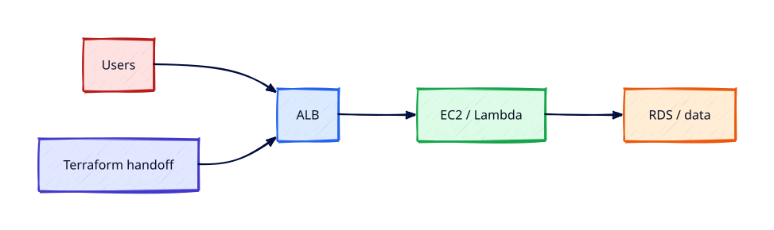

# Lambda and Three-Tier Capstone

## Overview

Capstone time: sketch a **three-tier web application** on AWS — ALB web tier, optional Lambda for
API events, RDS data tier, private subnets, SSM admin, CloudWatch observability, and IAM roles
throughout. You will deploy a minimal Lambda behind API Gateway (or ALB Lambda target) and document
the **Terraform handoff** — how this track maps to modules in the REBASH Terraform curriculum.

Destroy **all** capstone resources and confirm billing alarms before celebrating completion.

This is **Tutorial 20** in **Module 6: Ops and Capstone** of the REBASH Academy AWS track.

!!! warning "Destroy lab resources and watch billing"
    Tear down every resource you create before you close your laptop. Set a **billing alarm**
    (see [Accounts, Free Tier, Billing, and Cost Hygiene](accounts-free-tier-billing-and-cost-hygiene.md))
    and check the Cost Explorer dashboard after each lab session.


## Prerequisites

- Completed tutorials 1–19 or equivalent AWS fundamentals
- Conceptual readiness for [Terraform](../terraform/index.md) automation

## Learning Objectives

By the end of this tutorial, you will be able to:

- [ ] Diagram three-tier flow: client → ALB → app (EC2/ASG) → RDS
- [ ] Create Lambda execution role with least privilege
- [ ] Deploy Python Lambda via CLI zip package (lab scale)
- [ ] Explain where Lambda fits versus EC2 for API workloads
- [ ] Produce Terraform module map for automating this architecture

## Architecture




## Theory

### Three-tier on AWS (reference architecture)

```
Internet → Route 53 → ALB (public subnets)
                  → EC2 ASG (private or public+SSM lab pattern)
                  → RDS (private subnets, SG from app tier)
Sidecar: Lambda for async tasks, S3 for static assets, CloudWatch + CloudTrail for ops
```

### Lambda fundamentals

- **Execution role** — trust `lambda.amazonaws.com`
- **Package** — zip or container image
- **Triggers** — API Gateway HTTP API, ALB, S3 events, EventBridge
- **VPC** — optional ENIs for RDS access (cold start + NAT/endpoints trade-off)

### When Lambda vs EC2

| Lambda | EC2/ASG |
|--------|---------|
| Spiky short requests | Long-lived connections |
| Ops overhead minimal | Full OS control |
| 15 min max timeout | Persistent workers |

### Terraform handoff

| AWS track concept | Terraform resource (next steps) |
|-------------------|----------------------------------|
| VPC + subnets | `aws_vpc`, `aws_subnet` modules |
| ALB + ASG | `aws_lb`, `aws_autoscaling_group` |
| RDS | `aws_db_instance` in private subnets |
| Lambda | `aws_lambda_function`, `aws_iam_role` |
| Remote state | S3 + DynamoDB lock (Terraform Module 5+) |

Proceed to [Introduction to Terraform and IaC](../terraform/introduction-to-terraform-and-iac.md).

## Hands-on Lab

### Part A — Lambda hello (CLI)

`trust-lambda.json`:

```json
{
  "Version": "2012-10-17",
  "Statement": [{
    "Effect": "Allow",
    "Principal": {"Service": "lambda.amazonaws.com"},
    "Action": "sts:AssumeRole"
  }]
}
```

```bash
aws iam create-role --role-name rebash-lambda-basic \
  --assume-role-policy-document file://trust-lambda.json

aws iam attach-role-policy --role-name rebash-lambda-basic \
  --policy-arn arn:aws:iam::aws:policy/service-role/AWSLambdaBasicExecutionRole

cat > handler.py <<'EOF'
import json
def handler(event, context):
    return {"statusCode": 200, "body": json.dumps({"message": "rebash capstone ok"})}
EOF
zip function.zip handler.py

aws lambda create-function --function-name rebash-capstone-fn \
  --runtime python3.12 --role arn:aws:iam::ACCOUNT:role/rebash-lambda-basic \
  --handler handler.handler --zip-file fileb://function.zip --region $LAB_REGION

aws lambda invoke --function-name rebash-capstone-fn out.json --region $LAB_REGION
cat out.json
```

### Part B — Architecture document

Write `~/rebash-aws/capstone-architecture.md` listing:

- VPC IDs/subnets from Module 2
- ALB + ASG from Module 5
- RDS endpoint (destroyed) pattern
- Lambda role ARN
- CloudWatch log group for Lambda `/aws/lambda/rebash-capstone-fn`
- Terraform modules you would create next

### Part C — Full teardown

```bash
aws lambda delete-function --function-name rebash-capstone-fn --region $LAB_REGION
aws iam detach-role-policy --role-name rebash-lambda-basic \
  --policy-arn arn:aws:iam::aws:policy/service-role/AWSLambdaBasicExecutionRole
aws iam delete-role --role-name rebash-lambda-basic
# ASG, ALB, RDS, VPC — complete teardown checklist from Tutorial 2
```

### LocalStack / dry-run alternative

With [LocalStack](https://localstack.cloud/) running on port 4566:

```bash
export AWS_ACCESS_KEY_ID=test
export AWS_SECRET_ACCESS_KEY=test
export AWS_DEFAULT_REGION=eu-west-1
aws --endpoint-url=http://localhost:4566 lambda create-function --function-name lab-fn ...
    aws --endpoint-url=http://localhost:4566 lambda invoke --function-name lab-fn out.json
```

Some services are emulated imperfectly — treat LocalStack as CLI practice, not a full AWS substitute.

## Validation

| Check | Pass criteria |
|-------|---------------|
| Lambda invoke | HTTP 200 message in payload |
| Architecture doc | All tiers documented |
| IAM role | Basic execution only — no admin |
| Teardown | Lambda, role, and prior module resources gone |
| Billing | Budget alarm quiet |

## Code Walkthrough

| Piece | Capstone role |
|-------|---------------|
| ALB | Public entry, TLS termination |
| ASG | Scalable stateless web tier |
| RDS | Stateful data — private only |
| Lambda | Event-driven/API functions without servers |
| Terraform | Repeatable module stack in next track |

## Security Considerations

- Lambda role least privilege per function — not one shared admin role
- API Gateway auth (JWT/IAM) before public Lambda URLs
- RDS never public; secrets in Secrets Manager
- CloudTrail enabled for capstone API changes

## Common Mistakes

!!! warning "Lambda admin role"
    Function code compromise = full account. **Fix:** Scope policy to logs + specific AWS APIs needed.

!!! warning "Public RDS for Lambda convenience"
    Database scanned. **Fix:** Lambda in VPC with SG to RDS only.

!!! warning "Skipping final teardown"
    ALB+NAT+RDS surprise bill. **Fix:** Run full checklist Tutorial 2.

## Best Practices

- IaC everything in Terraform modules after this capstone
- Separate accounts for prod/non-prod via Organizations
- Observability dashboards before go-live
- Regular game days failing AZs and RDS failover

## Troubleshooting

| Issue | Cause | Fix |
|-------|-------|-----|
| Lambda timeout VPC | ENI setup | Increase timeout; check subnets/SG |
| Invoke access denied | Role trust | Fix execution role trust policy |
| 502 API GW | Bad proxy integration | Match handler response format |
| Terraform handoff gaps | Manual resources | Import or recreate in HCL modules |

## Production Patterns and Deep Dive

        ### How `Lambda and Three-Tier Capstone` fits in real environments

        Engineers working on **Module 6: Ops and Capstone** material use these concepts daily during design reviews,
        incident response, and cost optimisation workshops. The lab exercises prove you can execute;
        this section connects those commands to production trade-offs you will defend in interviews
        and on-call handovers.

        Production teams treating AWS as a first-class platform typically document:

        | Artefact | Purpose |
        |----------|---------|
        | Architecture decision record (ADR) | Why this service, alternatives rejected |
        | Runbook | Step-by-step operational procedures with rollback |
        | Teardown / DR checklist | What to destroy or fail over during exercises |
        | Cost owner | Who receives Budget alerts for resources tagged to this service |

        Always pair technical controls with **billing alarms** and a **destroy discipline** after
        experiments. The REBASH AWS track assumes British English documentation and explicit
        mention of Free Tier limits.

        ### Extended CLI and console reference

        The commands below extend the lab — run read-only variants first, then mutating operations
        in a non-production account. Replace `$LAB_REGION` and resource identifiers with your values.

        ```bash
aws lambda list-functions --query 'Functions[].FunctionName'
aws lambda get-function --function-name rebash-capstone-fn
aws lambda update-function-code --function-name rebash-capstone-fn --zip-file fileb://function.zip
aws apigatewayv2 create-api --name rebash-http --protocol-type HTTP
aws lambda add-permission --function-name rebash-capstone-fn --statement-id apigw --action lambda:InvokeFunction \
  --principal apigateway.amazonaws.com
```

Continue with [Terraform production capstone](../terraform/production-patterns-and-capstone.md).

        ### Operational scenario (table-top)

        **Scenario:** A teammate announces "customers cannot reach the application after a change."
        You suspect a misconfiguration related to **Lambda and Three-Tier Capstone**.

        | Step | Action | Why |
        |------|--------|-----|
        | 1 | Confirm Region and account (`aws sts get-caller-identity`) | Wrong profile wastes triage time |
        | 2 | Check CloudWatch alarms and recent deploys | Correlates timeline |
        | 3 | Review CloudTrail events for API changes in this service | Identifies who changed what |
        | 4 | Compare running config to IaC/Terraform state | Detects manual console drift |
        | 5 | Roll back or restore last known good | Document in incident ticket |
        | 6 | Update runbook and least-privilege IAM if human error | Prevents repeat |

        ### Hardening checklist before production

        - [ ] IAM roles preferred over IAM users with long-lived keys
        - [ ] MFA enabled for privileged humans; root not used daily
        - [ ] Resources tagged `Environment`, `Owner`, `CostCentre`
        - [ ] Budgets and anomaly detection configured
        - [ ] Encryption at rest and in transit enabled where supported
        - [ ] No `0.0.0.0/0` administrative ports (use SSM Session Manager)
        - [ ] Teardown script or `terraform destroy` documented for non-prod environments
        - [ ] Cross-links reviewed: [Networking](../networking/index.md), [Linux](../linux/index.md), [Terraform](../terraform/index.md)

        ### When to choose a different AWS service

        No service exists in isolation. If **Lambda and Three-Tier Capstone** feels forced, discuss alternatives with your
        team: managed versus self-managed, serverless versus EC2, or whether the workload belongs in
        another Region or account under AWS Organizations. Capture that decision in an ADR so future
        engineers understand the constraints you optimised for.

        ### Terraform handoff note

        After completing the AWS track, reproduce this tutorial's resources using modules in the
        [Terraform](../terraform/index.md) curriculum. Start with `required_providers` for `hashicorp/aws`,
        pin provider versions, store remote state in S3 with locking, and never commit secrets. The
        `lambda-and-three-tier-capstone` lesson maps cleanly to named resources you will import or recreate in HCL.

        ### Review questions (self-check)

        Before moving to the next tutorial, answer without looking at notes:

        1. Which API calls in this lesson are **read-only** versus **mutating**?
        2. What is the first command you run to confirm account and Region?
        3. Which tags will you apply so Cost Explorer can attribute spend?
        4. How do you destroy lab resources created here?
        5. Which [Networking](../networking/index.md) or [Linux](../linux/index.md) concept underpins this AWS service?

        ### Additional references inside AWS

        Browse the official **AWS Documentation** centre for `Lambda and Three-Tier Capstone` — focus on quotas, API permissions,
        and CloudWatch metrics emitted by the service. Bookmark the **Pricing** page for the service and
        add a line item to your personal cheat sheet noting Free Tier eligibility and the most common
        bill surprise mentioned in this tutorial.

## Summary

- Three-tier AWS: Route 53 → ALB → compute → RDS with private networking and IAM roles
- Lambda suits event/API workloads; EC2/ASG suits long-lived apps
- **Destroy all capstone resources**; continue to **Terraform** to automate the stack

## Interview Questions

1. Draw three-tier AWS architecture with AZs.
2. Lambda execution role vs instance profile?
3. Lambda in VPC pros/cons?
4. How ALB targets Lambda?
5. Where store DB credentials?
6. Blue/green on ASG approach?
7. CloudWatch for Lambda defaults?
8. Terraform module boundaries for VPC vs app?
9. SCP guarding prod account?
10. Cost optimisations for lab vs prod?

!!! tip "Sample answer — question 1"
    Public subnets: ALB only. Private subnets: app tier ASG and RDS Multi-AZ. Route 53 alias to ALB. SGs: ALB→app on 443/80, app→RDS on DB port. SSM for admin, no SSH. CloudWatch alarms on CPU/error rate.


!!! tip "Sample answer — question 8"
    Typical modules: `network` (VPC, subnets, endpoints), `compute` (ASG, launch template), `data` (RDS, subnet group), `edge` (ALB, Route53), `lambda` (function + IAM), composed by `envs/dev|prod` roots with remote state.


## Related Tutorials

- Track overview: [AWS](index.md)
- Previous: [CloudTrail, Config, and Account Guardrails](cloudtrail-config-and-account-guardrails.md)
- Next track: [Introduction to Terraform and IaC](../terraform/introduction-to-terraform-and-iac.md)
- [DevOps Engineer learning path](../learning-paths/devops-engineer.md)
- [Terraform track](../terraform/index.md) — automate these patterns next


## References

1. [AWS Lambda Developer Guide](https://docs.aws.amazon.com/lambda/latest/dg/welcome.html)
2. [Lambda IAM roles](https://docs.aws.amazon.com/lambda/latest/dg/lambda-intro-execution-role.html)
3. [Three-tier architecture whitepaper](https://docs.aws.amazon.com/whitepapers/latest/aws-overview/solutions.html)
4. [Terraform AWS provider](https://registry.terraform.io/providers/hashicorp/aws/latest/docs)
