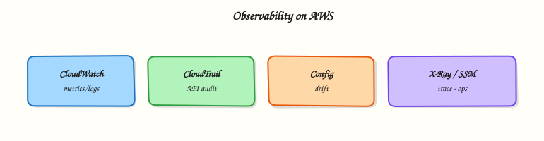

# Monitoring and Observability on AWS

## Overview


Wire the AWS observability spine — Amazon CloudWatch, AWS CloudTrail, AWS Config, AWS X-Ray, AWS Health Dashboard, and AWS Systems Manager — so you can detect, investigate, and act without drowning in alarms or log ingestion cost.

**Observability** answers: is the system healthy, what changed, and why? On AWS, **CloudWatch** holds metrics, logs, alarms, and dashboards. **CloudTrail** records API activity (who did what). **Config** records resource configuration and compliance over time. **X-Ray** traces requests across services. **Health Dashboard** surfaces AWS service events affecting your accounts. **Systems Manager (SSM)** provides operational actions — Session Manager, Parameter Store (ops config), Run Command, Patch Manager, and Inventory. Together they support SRE-style detect → diagnose → remediate loops.

This is a core tutorial in **Module 9 · Monitoring & Observability** of the REBASH Academy **AWS for Cloud & DevOps Engineers** series — written for Cloud, DevOps, Platform, and SRE engineers.

## Prerequisites


- [Serverless on AWS](serverless-on-aws.md)
- AWS CLI access to a sandbox account
- Familiarity with IAM and basic EC2 or Lambda resources

## Learning Objectives


By the end of this tutorial, you will be able to:

- [ ] Create a useful CloudWatch alarm, dashboard sketch, and Logs Insights query  
- [ ] Distinguish CloudTrail (API audit) from Config (resource configuration and compliance)  
- [ ] Explain when X-Ray tracing helps versus when metrics and logs suffice  
- [ ] Use Systems Manager Session Manager, Run Command, Parameter Store (ops), and Patch Manager without bastion hosts  
- [ ] Place the AWS Health Dashboard in an incident triage sequence

## Architecture


This topic’s control points and relationships are shown below.



## Theory


### What it is

**Observability on AWS** answers: is the system healthy, what changed, and how do we act? **Amazon CloudWatch** holds metrics, logs, alarms, and dashboards (plus Logs Insights). **AWS CloudTrail** audits API activity. **AWS Config** records resource configuration and compliance over time. **AWS X-Ray** samples distributed traces. **AWS Health Dashboard** surfaces provider events affecting your accounts. **AWS Systems Manager (SSM)** provides Session Manager, Parameter Store (ops config), Run Command, and Patch Manager — typically replacing public SSH bastions.

| Tool | Primary question |
|------|------------------|
| CloudWatch | Is it broken *now*? |
| CloudTrail | Who changed what via the API? |
| Config | What was the config, and is it compliant? |
| X-Ray | Where is latency in the request path? |
| Health | Is AWS itself impaired? |
| SSM | How do I access, configure, patch, or remediate? |

### Why it matters

Site Reliability Engineering (SRE) and DevOps need golden signals, change correlation, and drift detection. Too many alarms cause fatigue; too little instrumentation prolongs outages. Custom metrics, forever log retention, and multi-Region Config recorders cost real money — design for *actionable* signals. Health stops you blaming the app during an AWS incident. SSM gives auditable, IAM-gated access without opening port 22.

### How it works

1. Verify CloudTrail to a locked-down bucket (account or organisation trail).
2. Enable Config only in Regions you use, with rules that match guardrails.
3. Emit CloudWatch metrics/logs; alarm on actionable symptoms via SNS or EventBridge.
4. Trace critical paths with X-Ray (or OpenTelemetry) at a sensible sample rate.
5. Prefer Session Manager over SSH; tag for inventory/patch; Parameter Store for ops config; Run Command for fleet tasks.
6. Incidents: Health → CloudTrail → Config → logs/metrics → traces.

### Concept deep dive

**CloudWatch metrics** are time series (`AWS/EC2`, `AWS/Lambda`, …). Prefer p99 and error rates over CPU alone; custom and high-resolution metrics cost more. **Logs** go to log groups — set retention (labs: days). **Logs Insights** queries need bounded time ranges; **metric filters** turn log patterns into alarmable metrics. **Alarms** evaluate thresholds over *N* periods; use **composite alarms** and anomaly detection to cut noise; choose missing-data behaviour deliberately. **Dashboards** show SLIs and dependencies — they do not replace paging alarms.

**CloudTrail** is an API audit log (management events by default; data events optional and dearer), not an application debugger. Organisation trails centralise forensics.

**Config** stores configuration items and evaluates rules for drift/compliance (“was this security group open yesterday?”), not live performance. Scope recorders — multi-Region Config bills.

**X-Ray** builds a service map for sampled requests (API → Lambda → DynamoDB). Start with low sampling; raise during incidents.

**Health Dashboard** answers “is AWS degraded?” first; EventBridge can fan into ops channels.

**SSM Session Manager** opens a shell via the agent and IAM — no inbound SSH (need agent, instance profile, and path to SSM endpoints or VPC endpoints). **Parameter Store** holds String / StringList / SecureString for ops config. **Run Command** runs documents across tagged fleets. **Patch Manager** applies baselines in maintenance windows; pair with Inventory.

### Key concepts and comparisons

| Signal or job | Prefer |
|---------------|--------|
| Error rate / p99 | CloudWatch metrics + alarms |
| Structured app logs | CloudWatch Logs (+ Insights) |
| API mutations | CloudTrail |
| Config / compliance history | Config |
| Distributed path | X-Ray |
| Provider impairment | Health Dashboard |
| Shell-less access | Session Manager |
| Fleet script / patch | Run Command / Patch Manager |
| Ops config | Parameter Store |

### Common pitfalls

- Alarming only on CPU while ignoring errors and latency.
- Config in every Region without a cost review.
- Using CloudTrail as an application debugger.
- 100% X-Ray sampling in steady-state production.
- Infinite log retention and forgotten custom metrics.
- Bastions on port 22 instead of Session Manager (and missing VPC endpoints).
- Treating Parameter Store as a database.

## Hands-on Lab


!!! warning "Cost and account safety"
    Use a sandbox account. Prefer read-only calls. Destroy anything you create before leaving the lab.

### Objective

Use read-only AWS APIs to inventory and verify aspects of **Monitoring and Observability on AWS** in a sandbox account.

### Prerequisites

- AWS CLI v2
- Credentials for a **sandbox** account (SSO or short-lived keys)

### Lab environment

Workspace: `~/rebash-aws/module-09`

Prefer `describe`/`list`/`get` APIs. Create resources only with an explicit destroy path.

```bash
mkdir -p ~/rebash-aws/module-09 && cd ~/rebash-aws/module-09
```

### Real-world scenario

Security asks for evidence that **Monitoring and Observability on AWS** is configured correctly. You gather CLI proof without click-ops drift.

### Step-by-step tasks

#### Task 1 – Prove caller identity

Every AWS change starts by knowing which account/role you are.

```bash
aws sts get-caller-identity | tee identity.json
aws configure get region || true
test -s identity.json
```

**Expected output:** JSON includes Account, Arn, and UserId.

#### Task 2 – Collect topic signals

Inventory the service surface related to this module.

```bash
aws ec2 describe-vpcs --query 'Vpcs[].{Id:VpcId,Cidr:CidrBlock}' --output table 2>/dev/null | tee vpcs.txt || true
aws iam get-account-summary 2>/dev/null | tee iam-summary.json || true
tee notes.txt << 'EOF'
Record which APIs apply to this topic and any NotAuthorized errors for follow-up.
EOF
cat notes.txt
```

**Expected output:** Evidence files created even if some APIs are denied.

### Validation steps

- [ ] identity.json present
- [ ] No long-lived keys committed to the repo

### Common errors and fixes

| Error | Cause | Fix |
|-------|-------|-----|
| Unable to locate credentials | No profile/SSO | Run `aws sso login` or export sandbox keys |
| AccessDenied | Least privilege | Use a role that can read the service — or document the deny |
| UnauthorizedOperation | Wrong region/account | Check `AWS_REGION` and account id |

### Challenge exercise

Enable a cost budget alarm in the sandbox (or document the console clicks) and screenshot/CLI-describe it.

### Learning outcomes

- Authenticated safely
- Captured read-only evidence
- Avoided unmanaged spend

### Cleanup

```bash
# Revoke/lab-expire any temporary keys you exported
# Do not leave EC2/ELB/NAT running
```

## Validation


- [ ] Lab commands run under `~/rebash-aws/module-09/`
- [ ] You can explain each Theory section in your own words
- [ ] You used modern tooling where it applies to this topic
- [ ] You can describe one production failure mode for this topic

## Code Walkthrough


Production practice for **Monitoring and Observability on AWS** always combines:

1. Inspect before you change (status, plan, logs, dry-run)
2. Prefer reversible, documented changes (Git, IaC, drop-ins, version pins)
3. Capture evidence (command output, pipeline logs) for handovers
4. Prefer current tools and APIs over legacy shortcuts
5. Least privilege — escalate credentials only when required

Keep runbooks short enough to follow under pressure. Automate checks; keep humans for judgement.

## Security Considerations


- Treat credentials and tokens for aws as privileged — never commit them
- Prefer short-lived auth (OIDC, roles, SSO) over long-lived keys
- Validate blast radius before apply/deploy/delete operations
- Restrict who can approve production changes
- Collect audit logs; limit who can read sensitive traces

## Common Mistakes


!!! warning "Alarming only on CPU while ignoring errors and latency."
    Validate assumptions against the Theory section and official docs before changing production.

!!! warning "Config in every Region without a cost review."
    Lab shortcuts (open security groups, admin roles, skip approvals) must not ship unchanged.

!!! warning "Changing production without a rollback path"
    Always know how to revert (previous artefact, prior release, state rollback, DNS failback).

## Best Practices


- Encode Monitoring and Observability on AWS changes as code and review them in pull requests
- Pin versions (images, modules, actions, provider plugins)
- Separate environments with clear promotion gates
- Alert on symptoms with runbooks attached
- Destroy lab resources; tag everything with owner and expiry where possible

## Troubleshooting


| Symptom | Likely cause | Fix |
|---------|--------------|-----|
| Auth / permission denied | Wrong identity, policy, or scope | Check caller identity, roles, and least-privilege policies |
| Timeout / no route | Network, DNS, security group, or endpoint | Trace path, DNS, and allow-lists before retrying |
| Drift / unexpected plan | Manual change or wrong state/workspace | Reconcile desired vs actual; avoid click-ops on managed resources |
| Pipeline/job red | Flaky step, cache, or missing secret | Read failing step logs; bisect recent workflow/config changes |
| Cost spike | Idle load balancer, NAT, oversized compute | Inventory billable resources; stop/delete labs promptly |

## Summary


**Monitoring and Observability on AWS** is essential for Cloud and DevOps engineers working with aws. Practise the lab until the inspection and change path is muscle memory, then continue the track.

## Interview Questions


1. Metric versus log versus trace?
2. What makes a good CloudWatch alarm?
3. How do you stop alarm fatigue?
4. Log retention versus cost?
5. How do runbooks link to alerts?

!!! tip "Sample answer — question 2"
    Check alarm state history, underlying metric, and related logs for the same time window.

!!! tip "Sample answer — question 4"
    Avoid putting secrets in logs; control who can read log groups.

## Related Tutorials


- [Course overview](index.md)
- [AWS Security Services](aws-security-services.md)

## References


- [Amazon CloudWatch](https://docs.aws.amazon.com/AmazonCloudWatch/latest/monitoring/WhatIsCloudWatch.html)  
- [AWS CloudTrail](https://docs.aws.amazon.com/awscloudtrail/latest/userguide/cloudtrail-user-guide.html)  
- [AWS Config](https://docs.aws.amazon.com/config/latest/developerguide/WhatIsConfig.html)  
- [AWS X-Ray](https://docs.aws.amazon.com/xray/latest/devguide/aws-xray.html)  
- [AWS Systems Manager](https://docs.aws.amazon.com/systems-manager/latest/userguide/what-is-systems-manager.html)  
- [AWS Health](https://docs.aws.amazon.com/health/latest/ug/what-is-aws-health.html)
