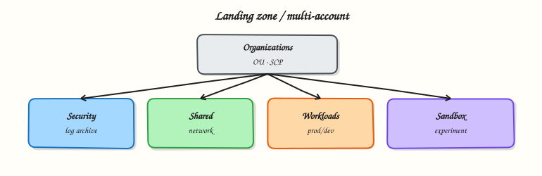

# Production AWS Landing Zones

## Overview


Design a production-ready Amazon Web Services (AWS) **landing zone**: multi-account layout with AWS Organizations, guardrails, tagging standards, operational excellence habits, and security automation that scales with teams.

A landing zone is the *foundational* cloud environment — accounts, identity, networking, logging, and security baselines — onto which product teams deploy workloads. One shared “everything” account collapses under audit and blast-radius pressure. Production AWS means **separation of duties**, automated compliance, and boring, repeatable account vending.

!!! warning "Cost hygiene"
    Log archives, GuardDuty, and Transit Gateways are shared platform costs — tag and budget them. Do not duplicate NAT Gateways in every sandbox without a design decision.

This is a core tutorial in **Module 15 · Production AWS** of the REBASH Academy **AWS for Cloud & DevOps Engineers** series — written for Cloud, DevOps, Platform, and SRE engineers.


## Prerequisites


- [Reliability and Disaster Recovery](reliability-and-disaster-recovery.md)
- [IAM, Identity Access, and Organizations](iam-identity-access-and-organizations.md)
- [AWS Security Services](aws-security-services.md) and [Infrastructure as Code on AWS](infrastructure-as-code-on-aws.md)


## Learning Objectives


By the end of this tutorial, you will be able to:

- [ ] Sketch a multi-account OU layout (security, log archive, shared services, workloads)  
- [ ] Explain Service Control Policies (SCPs) and mention Control Tower for governed account vending  
- [ ] Define a minimal tagging taxonomy for cost, ownership, and incident response  
- [ ] List operational excellence practices (runbooks, IaC, small reversible change)  
- [ ] Outline security best practices and automation (baselines, Config, Security Hub, EventBridge)


## Architecture


This topic’s control points and relationships are shown below.




## Theory


### What it is

A **landing zone** is the foundational AWS environment — accounts, identity, networking, logging, and security baselines — onto which teams deploy workloads. It is a **multi-account strategy** with governance so “safe by default” scales.

| Building block | Purpose |
|----------------|---------|
| Organizations + OUs | Hierarchy and policy attachment |
| SCPs | Org-level permission envelope |
| Control Tower (common) | Managed LZ, Account Factory, guardrails |
| Identity Center | Workforce SSO into roles |
| Log archive / security tooling | Central trails and findings |
| Network / shared services | Ingress, DNS, connectivity hub |
| Workload accounts | Isolated prod/non-prod |
| Tagging + automation | Ownership, cost, baselines, response |

### Why it matters

Platform and DevSecOps win when engineers self-serve into safe defaults. One flat account with `AdministratorAccess` fails audits and maximises blast radius. Multi-account isolation limits ransomware and credential compromise. SRE needs consistent logging and change pipelines — not snowflake accounts. Treat the landing zone as a product: factory, baselines, ownership.

### How it works

1. Design OUs: Security (Log Archive, Security Tooling) → Infrastructure → Workloads (Prod/NonProd) → Sandbox.
2. Baseline: org CloudTrail, Config, default encryption, block public S3, IMDSv2.
3. Identity Center for humans; roles/OIDC for machines; monitored break-glass only.
4. Network hub-and-spoke or isolated VPCs; centralise ingress/egress if required.
5. SCPs deny leaving the org and disabling CloudTrail; tag policies for required keys.
6. Operate with IaC, account factory, Security Hub runbooks; iterate via reviews and game days.

### Concept deep dive

**Landing zones.** Control Tower, Landing Zone Accelerator, or a custom Terraform/CloudFormation factory — same goal: every new account gets security and logging plumbing before apps deploy. Control Tower’s Account Factory and guardrails are a strong start; customise when you outgrow defaults.

**Multi-account strategy.** Keep log archive and security tooling out of workload accounts so compromise cannot erase evidence. Split prod/non-prod; optionally isolate by domain or data class. Sandboxes get looser SCPs but still central logging. Protect the management/billing account ruthlessly.

**Governance (SCPs, Control Tower).** SCPs cap maximum permissions (after identity policies) — they are not IAM replacements. Typical denies: leave org, disable CloudTrail/Config/GuardDuty, disallowed Regions. Test in non-prod first — overly tight SCPs break logging and Support. Control Tower preventive/detective guardrails encode many patterns; extend with custom SCPs.

**Tagging.** Enforce `Owner`, `Environment`, `CostCenter`, `DataClass` (+ optional `Application`) for FinOps, Security Hub, and paging. Inconsistent casing silently breaks attribution.

**Operational excellence.** Platform as code: baselines in Git, small reversible changes, runbooks for vending and break-glass, measured account lead time — Well-Architected Operational Excellence applied to the foundation.

**Security best practices.** Org trail → log archive; GuardDuty/Security Hub delegated admin; default encryption; no human long-lived IAM users; SCP preventive + Config detective; private data planes by default.

**Automation.** EventBridge → tickets or remediations; factory hooks for SSM/agents/endpoints; StackSets or Terraform to push baseline updates across OUs (same discipline as Modules 11–12).

### Key concepts and comparisons

| Anti-pattern | Prefer |
|--------------|--------|
| One account for all envs | Separate prod / non-prod |
| Inline IAM users | Identity Center + roles |
| Console-only networking | IaC + peer review |
| Alerts with no owner | Tag `Owner` + paging |
| Perfect LZ, zero apps | Thin slice, then iterate |

| Term | Meaning |
|------|---------|
| Control Tower | Managed LZ + Account Factory |
| SCP | Org-level deny/allow envelope |
| Account vending | Create + enrol baseline |
| Preventive vs detective | SCP vs Config/Security Hub |

### Common pitfalls

- SCPs so tight they break Support or logging.
- No log archive — evidence dies with the account.
- Tag chaos breaking FinOps and ownership.
- Unmonitored break-glass equivalent to root.
- Years of LZ design before any workload.
- No account factory → immediate baseline drift.
- “Temporary” shared workload accounts that become permanent.


## Hands-on Lab


!!! warning "Cost and account safety"
    Prefer read-only `describe`/`get` calls. Create resources only in a sandbox account and destroy them in the cleanup step.

Create a workspace for this tutorial.

```bash
mkdir -p ~/rebash-aws/module-15 && cd ~/rebash-aws/module-15
```

**Focus:** document Organizations / account-vending checklist with STS proof

### Step 1 – Landing zone checklist

```bash
aws sts get-caller-identity | tee identity.json
aws organizations describe-organization 2>/dev/null | tee org.json || echo 'No org access from this identity'
tee landing-zone.txt << 'EOF'
- Mandatory accounts: security, log-archive, shared, workload OU structure
- SCPs for region/deny controls
- Central logging + GuardDuty/Security Hub
- No long-lived keys on humans
EOF
cat landing-zone.txt
```

### Final step – Cleanup note

```bash
# Read-only
```


## Validation


- [ ] Lab commands run under `~/rebash-aws/module-15/`
- [ ] You can explain each Theory section in your own words
- [ ] You used modern tooling where it applies to this topic
- [ ] You can describe one production failure mode for this topic


## Code Walkthrough


Production practice for **Production AWS Landing Zones** always combines:

1. Inspect before you change (status, plan, logs, dry-run)
2. Prefer reversible, documented changes (Git, IaC, drop-ins, version pins)
3. Capture evidence (command output, pipeline logs) for handovers
4. Prefer current tools and APIs over legacy shortcuts
5. Least privilege — escalate credentials only when required

Keep runbooks short enough to follow under pressure. Automate checks; keep humans for judgement.


## Security Considerations


- Treat credentials and tokens for aws as privileged — never commit them
- Prefer short-lived auth (OIDC, roles, SSO) over long-lived keys
- Validate blast radius before apply/deploy/delete operations
- Restrict who can approve production changes
- Collect audit logs; limit who can read sensitive traces


## Common Mistakes


!!! warning "SCPs so tight they break Support or logging."
    Validate assumptions against the Theory section and official docs before changing production.

!!! warning "No log archive — evidence dies with the account."
    Lab shortcuts (open security groups, admin roles, skip approvals) must not ship unchanged.

!!! warning "Changing production without a rollback path"
    Always know how to revert (previous artefact, prior release, state rollback, DNS failback).


## Best Practices


- Encode Production AWS Landing Zones changes as code and review them in pull requests
- Pin versions (images, modules, actions, provider plugins)
- Separate environments with clear promotion gates
- Alert on symptoms with runbooks attached
- Destroy lab resources; tag everything with owner and expiry where possible


## Troubleshooting


| Symptom | Likely cause | Fix |
|---------|--------------|-----|
| Auth / permission denied | Wrong identity, policy, or scope | Check caller identity, roles, and least-privilege policies |
| Timeout / no route | Network, DNS, security group, or endpoint | Trace path, DNS, and allow-lists before retrying |
| Drift / unexpected plan | Manual change or wrong state/workspace | Reconcile desired vs actual; avoid click-ops on managed resources |
| Pipeline/job red | Flaky step, cache, or missing secret | Read failing step logs; bisect recent workflow/config changes |
| Cost spike | Idle load balancer, NAT, oversized compute | Inventory billable resources; stop/delete labs promptly |


## Summary


**Production AWS Landing Zones** is essential for Cloud and DevOps engineers working with aws. Practise the lab until the inspection and change path is muscle memory, then continue the track.


## Interview Questions


1. How does **Production AWS Landing Zones** appear in a well-run AWS landing zone?
2. Users report timeouts to a service — what is your AWS-oriented triage order?
3. How do IAM roles and least privilege change your design for this topic?
4. What cost or blast-radius controls should wrap experiments in this area?
5. How would you prove correctness with read-only AWS APIs in an interview whiteboard?

!!! tip "Sample answer — question 2"
    Confirm identity/region, then path: DNS, SG/NACL, routes, target health, and CloudWatch/CloudTrail signals before changing infrastructure.

!!! tip "Sample answer — question 4"
    Sandbox accounts, budgets, tags, destroy-after-lab, and no long-lived keys in CI — use OIDC/roles.


## Related Tutorials


- [Course overview](index.md)
- [Troubleshooting AWS](troubleshooting-aws.md)


## References


- [Organizing Your AWS Environment Using Multiple Accounts](https://docs.aws.amazon.com/whitepapers/latest/organizing-your-aws-environment/organizing-your-aws-environment.html)  
- [AWS Control Tower](https://docs.aws.amazon.com/controltower/latest/userguide/what-is-control-tower.html)  
- [Well-Architected Operational Excellence](https://docs.aws.amazon.com/wellarchitected/latest/operational-excellence-pillar/welcome.html)
