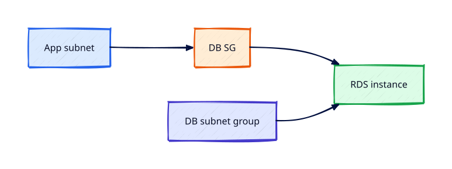

# RDS Fundamentals

## Overview

**Amazon RDS** manages relational databases (PostgreSQL, MySQL, MariaDB, etc.) with automated backups,
patching options, and Multi-AZ failover. It is powerful and **expensive for idle labs**.

You will launch a small MySQL or PostgreSQL instance in private subnets, connect from EC2 via SSM,
verify backups, and **delete the instance immediately** — with billing alarms confirmed.

This is **Tutorial 16** in **Module 5: Edge and Data** of the REBASH Academy AWS track.

!!! warning "Destroy lab resources and watch billing"
    Tear down every resource you create before you close your laptop. Set a **billing alarm**
    (see [Accounts, Free Tier, Billing, and Cost Hygiene](accounts-free-tier-billing-and-cost-hygiene.md))
    and check the Cost Explorer dashboard after each lab session.

!!! danger "Destroy RDS immediately after the lab"
    RDS instances bill for compute and storage continuously. **Create, validate, snapshot optionally,
    then delete the instance in the same session.** Skip final snapshots in labs unless you need
    restore practice — snapshots also incur storage cost.

## Prerequisites

- Completed VPC and security group tutorials

## Learning Objectives

By the end of this tutorial, you will be able to:

- [ ] Launch RDS in private subnets with security group referencing app tier
- [ ] Explain Multi-AZ vs Read Replica at high level
- [ ] Connect from EC2 using endpoint DNS name
- [ ] Review automated backup window and retention
- [ ] Delete RDS instance without unnecessary final snapshot retention

## Architecture




## Theory

### RDS responsibilities

AWS manages: hosting, storage replication (Multi-AZ), automated backups to S3, patching platform.
You manage: schema, users, parameter groups, security groups, encryption keys.

### Deployment options

| Option | HA | Read scaling |
|--------|----|--------------|
| Single-AZ | No | — |
| Multi-AZ | Sync standby failover | No (standby not readable) |
| Read replica | Async copy | Yes |

### Networking

RDS lives in DB subnet group spanning AZs. SG allows app tier SG on DB port only.

### Cost warning

db.t3.micro may have Free Tier hours — still **delete same day**. Storage and backup storage bill separately.

## Hands-on Lab

```bash
aws rds create-db-subnet-group --db-subnet-group-name rebash-db-subnets \
  --db-subnet-group-description "lab" \
  --subnet-ids $PRIVATE_SUBNET_A $PRIVATE_SUBNET_B --region $LAB_REGION

aws rds create-db-instance \
  --db-instance-identifier rebash-lab-db \
  --db-instance-class db.t3.micro \
  --engine mysql \
  --master-username admin \
  --master-user-password 'ChangeMeLab123!' \
  --allocated-storage 20 \
  --vpc-security-group-ids $DB_SG \
  --db-subnet-group-name rebash-db-subnets \
  --backup-retention-period 1 \
  --no-publicly-accessible \
  --region $LAB_REGION

aws rds wait db-instance-available --db-instance-identifier rebash-lab-db --region $LAB_REGION

# From app EC2 via SSM:
mysql -h $RDS_ENDPOINT -u admin -p
```

Teardown (**same session**):

```bash
aws rds delete-db-instance --db-instance-identifier rebash-lab-db \
  --skip-final-snapshot --delete-automated-backups --region $LAB_REGION
aws rds wait db-instance-deleted --db-instance-identifier rebash-lab-db --region $LAB_REGION
```

### LocalStack / dry-run alternative

With [LocalStack](https://localstack.cloud/) running on port 4566:

```bash
export AWS_ACCESS_KEY_ID=test
export AWS_SECRET_ACCESS_KEY=test
export AWS_DEFAULT_REGION=eu-west-1
aws --endpoint-url=http://localhost:4566 rds create-db-instance --db-instance-identifier lab-db ...
```

Some services are emulated imperfectly — treat LocalStack as CLI practice, not a full AWS substitute.

## Validation

| Check | Pass criteria |
|-------|---------------|
| Available | `describe-db-instances` Status=available |
| Private | PubliclyAccessible=false |
| Connect | SQL prompt from app EC2 |
| Deleted | Instance gone; Cost Explorer quiet |

## Code Walkthrough

| Setting | Purpose |
|---------|---------|
| DB subnet group | AZ placement for ENIs |
| `--no-publicly-accessible` | No internet route to database |
| Backup retention | Point-in-time recovery window |
| `--skip-final-snapshot` | Lab only — prod always snapshots |

## Security Considerations

- Never publicly accessible RDS
- Encrypt at rest with KMS; TLS in transit
- Rotate master password via Secrets Manager in production
- Least-privilege DB users — not master for apps

## Common Mistakes

!!! warning "RDS overnight"
    Compute + storage bill. **Fix:** Delete same session.

!!! warning "Publicly accessible true"
    Internet scanning. **Fix:** Always false; SG app tier only.

!!! warning "Master creds in app config"
    Over-privileged apps. **Fix:** App-specific DB users + secrets store.

## Best Practices

- Multi-AZ for production OLTP
- Parameter groups tuned with staging first
- Performance Insights for slow queries
- Aurora serverless v2 for variable workloads (awareness)

## Troubleshooting

| Issue | Cause | Fix |
|-------|-------|-----|
| Cannot connect | SG wrong | Allow app SG on 3306/5432 |
| Storage full | Autoscaling off | Enable storage autoscaling prod |
| Slow delete | Final snapshot | Skip in lab; wait for delete |

## Production Patterns and Deep Dive

        ### How `RDS Fundamentals` fits in real environments

        Engineers working on **Module 5: Edge and Data** material use these concepts daily during design reviews,
        incident response, and cost optimisation workshops. The lab exercises prove you can execute;
        this section connects those commands to production trade-offs you will defend in interviews
        and on-call handovers.

        Production teams treating AWS as a first-class platform typically document:

        | Artefact | Purpose |
        |----------|---------|
        | Architecture decision record (ADR) | Why this service, alternatives rejected |
        | Runbook | Step-by-step operational procedures with rollback |
        | Teardown / DR checklist | What to destroy or fail over during exercises |
        | Cost owner | Who receives Budget alerts for resources tagged to this service |

        Always pair technical controls with **billing alarms** and a **destroy discipline** after
        experiments. The REBASH AWS track assumes British English documentation and explicit
        mention of Free Tier limits.

        ### Extended CLI and console reference

        The commands below extend the lab — run read-only variants first, then mutating operations
        in a non-production account. Replace `$LAB_REGION` and resource identifiers with your values.

        ```bash
aws rds describe-db-instances --db-instance-identifier rebash-lab-db
aws rds describe-db-subnet-groups --db-subnet-group-name rebash-db-subnets
aws rds modify-db-instance --db-instance-identifier rebash-lab-db --backup-retention-period 7
aws rds create-db-snapshot --db-instance-identifier rebash-lab-db --db-snapshot-identifier rebash-lab-snap
aws rds delete-db-instance --db-instance-identifier rebash-lab-db --skip-final-snapshot
```

**Destroy RDS ASAP** after lab validation.

        ### Operational scenario (table-top)

        **Scenario:** A teammate announces "customers cannot reach the application after a change."
        You suspect a misconfiguration related to **RDS Fundamentals**.

        | Step | Action | Why |
        |------|--------|-----|
        | 1 | Confirm Region and account (`aws sts get-caller-identity`) | Wrong profile wastes triage time |
        | 2 | Check CloudWatch alarms and recent deploys | Correlates timeline |
        | 3 | Review CloudTrail events for API changes in this service | Identifies who changed what |
        | 4 | Compare running config to IaC/Terraform state | Detects manual console drift |
        | 5 | Roll back or restore last known good | Document in incident ticket |
        | 6 | Update runbook and least-privilege IAM if human error | Prevents repeat |

        ### Hardening checklist before production

        - [ ] IAM roles preferred over IAM users with long-lived keys
        - [ ] MFA enabled for privileged humans; root not used daily
        - [ ] Resources tagged `Environment`, `Owner`, `CostCentre`
        - [ ] Budgets and anomaly detection configured
        - [ ] Encryption at rest and in transit enabled where supported
        - [ ] No `0.0.0.0/0` administrative ports (use SSM Session Manager)
        - [ ] Teardown script or `terraform destroy` documented for non-prod environments
        - [ ] Cross-links reviewed: [Networking](../networking/index.md), [Linux](../linux/index.md), [Terraform](../terraform/index.md)

        ### When to choose a different AWS service

        No service exists in isolation. If **RDS Fundamentals** feels forced, discuss alternatives with your
        team: managed versus self-managed, serverless versus EC2, or whether the workload belongs in
        another Region or account under AWS Organizations. Capture that decision in an ADR so future
        engineers understand the constraints you optimised for.

        ### Terraform handoff note

        After completing the AWS track, reproduce this tutorial's resources using modules in the
        [Terraform](../terraform/index.md) curriculum. Start with `required_providers` for `hashicorp/aws`,
        pin provider versions, store remote state in S3 with locking, and never commit secrets. The
        `rds-fundamentals` lesson maps cleanly to named resources you will import or recreate in HCL.

        ### Review questions (self-check)

        Before moving to the next tutorial, answer without looking at notes:

        1. Which API calls in this lesson are **read-only** versus **mutating**?
        2. What is the first command you run to confirm account and Region?
        3. Which tags will you apply so Cost Explorer can attribute spend?
        4. How do you destroy lab resources created here?
        5. Which [Networking](../networking/index.md) or [Linux](../linux/index.md) concept underpins this AWS service?

        ### Additional references inside AWS

        Browse the official **AWS Documentation** centre for `RDS Fundamentals` — focus on quotas, API permissions,
        and CloudWatch metrics emitted by the service. Bookmark the **Pricing** page for the service and
        add a line item to your personal cheat sheet noting Free Tier eligibility and the most common
        bill surprise mentioned in this tutorial.

## Summary

- RDS manages relational DB with backups and optional Multi-AZ
- Keep databases in private subnets; **destroy immediately after labs**
- Use security groups referencing app tier, not open CIDR

## Interview Questions

1. Multi-AZ vs Read Replica?
2. Who patches RDS engine?
3. Why DB subnet group spans AZs?
4. Publicly accessible flag risk?
5. Backup vs snapshot?
6. Encryption at rest options?
7. Connection pooling at scale?
8. Parameter group purpose?
9. Failover time Multi-AZ?
10. Cost if RDS left running?

!!! tip "Sample answer — question 1"
    Multi-AZ maintains synchronous standby for automatic failover — not for read scaling. Read replicas are asynchronous copies for read traffic and DR, promoted manually or via automation.


!!! tip "Sample answer — question 10"
    You pay DB instance hours, storage GB-month, backup storage beyond free allocation, and I/O depending on engine — idle db.t3.micro still charges storage and instance hours outside Free Tier.


## Related Tutorials

- Track overview: [AWS](index.md)
- Previous: [Route 53 DNS and Health Checks](route-53-dns-and-health-checks.md)
- Next: [Auto Scaling Groups and Launch Templates](auto-scaling-groups-and-launch-templates.md)
- [Terraform track](../terraform/index.md) — automate these patterns next


## References

1. [Amazon RDS User Guide](https://docs.aws.amazon.com/AmazonRDS/latest/UserGuide/Welcome.html)
2. [Creating DB instance](https://docs.aws.amazon.com/AmazonRDS/latest/UserGuide/USER_CreateDBInstance.html)
3. [Multi-AZ](https://docs.aws.amazon.com/AmazonRDS/latest/UserGuide/Concepts.MultiAZ.html)
