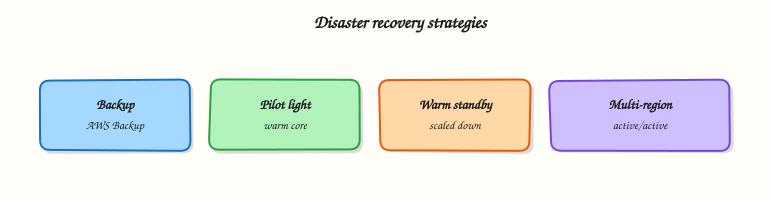

# Reliability and Disaster Recovery

## Overview

Design for failure on Amazon Web Services (AWS): high availability (HA) with Multi-AZ, decide when Multi-Region is justified, pick a disaster recovery (DR) strategy with clear Recovery Time Objective (RTO) and Recovery Point Objective (RPO), and use AWS Backup plus Well-Architected reviews.

Reliability means the workload performs its intended function correctly and consistently. **Availability Zones (AZs)** are your first failure domain; **Regions** are for rare but severe events and data residency. DR is not “we have backups” — it is a tested runbook with measured RTO/RPO. The AWS **Well-Architected Framework** Reliability pillar turns these ideas into design questions you can audit.

!!! warning "Cost hygiene"
    Multi-Region active-active is expensive. Start with Multi-AZ and backup/restore; add warm standby only when RTO/RPO and business impact demand it.

This is a core tutorial in **Module 14 · Reliability** of the REBASH Academy **AWS for Cloud & DevOps Engineers** series — written for Cloud, DevOps, Platform, and SRE engineers.

## Prerequisites

- [Cost Optimisation on AWS](cost-optimisation-on-aws.md)
- [VPC Networking on AWS](vpc-networking-on-aws.md) and [Databases on AWS](databases-on-aws.md)
- Basic CloudWatch alarms from Module 9

## Learning Objectives

By the end of this tutorial, you will be able to:

- [ ] Distinguish high availability (Multi-AZ) from disaster recovery (often Multi-Region)  
- [ ] Define Recovery Time Objective (RTO) and Recovery Point Objective (RPO) for a sample workload  
- [ ] Map backup/restore, pilot light, warm standby, and multi-site active/active to AWS patterns  
- [ ] Outline an AWS Backup plan for EBS, RDS, and S3 (including restore testing)  
- [ ] Name the six Well-Architected pillars and how Reliability fits the set

## Architecture

This topic’s control points and relationships are shown below.



## Theory

### What it is

**Reliability** means the workload works correctly when expected. **High availability (HA)** survives routine failures (instance death, AZ impairment) with redundancy *inside* a Region: Multi-AZ load balancers and Auto Scaling, Multi-AZ RDS/Aurora, health-check replacement. **Disaster recovery (DR)** covers larger events (Region loss, corruption) via backups and/or another Region. **AWS Backup** centralises plans, vaults, and restore testing. The **Well-Architected Framework** has six pillars — Reliability is one; production balances all six.

| DR strategy | Typical RTO / RPO | Pattern |
|-------------|-------------------|---------|
| Backup and restore | Hours / hours | Snapshots; rebuild on demand |
| Pilot light | Tens of min / minutes | Minimal DR core; scale on failover |
| Warm standby | Minutes / minutes–seconds | Scaled-down running copy |
| Multi-site active/active | Near-zero / near-zero | Serve from multiple Regions |

### Why it matters

SRE owns error budgets; platforms own HA defaults. An untested restore is not a DR plan. Multi-Region active/active is expensive — perfect Multi-AZ and tested backups first. Certifications stress RTO/RPO, Multi-AZ failover, and when cross-Region replication is worth the cost.

### How it works

1. Classify criticality and constraints; set **RTO/RPO** with the business.
2. Design HA first — ≥2 AZs; no single-AZ production data plane.
3. Choose DR strategy; document DNS, identity, secrets, and registries in DR.
4. Automate AWS Backup (vaults, cross-account/Region copies).
5. Test restores and failover; measure actual RTO/RPO; alarm on backup/replication failures.

### Concept deep dive

**HA / Multi-AZ.** Spread LBs and ASG capacity across AZs; Multi-AZ RDS makes failover a managed promotion. Prefer **static stability** — capacity ready before AZ loss. Health checks must remove bad targets quickly.

**Multi-AZ vs Multi-Region.** Multi-AZ covers AZ-scoped failures, not Region-wide events. Multi-Region needs replication, latency routing/Global Accelerator, and duplicated identity/DNS — higher cost/ops. Choose it when RTO/RPO, compliance, or global UX demands it.

**DR strategies.** Backup/restore: cheapest steady state; hours OK. Pilot light: warm data/core in DR; automate scale-out. Warm standby: running scaled-down copy continuously receiving data. Multi-site: both Regions serve traffic; hardest consistency — for global critical services.

**AWS Backup.** Plans schedule backups for EBS, RDS, EFS, and other integrated services into **vaults** (IAM, optional Vault Lock). Cross-account/Region copy limits ransomware blast radius. Retain enough generations to survive delayed discovery of corruption. The usual gap: a **restore test calendar** that proves RTO.

**Well-Architected — six pillars (briefly):** Operational Excellence (runbooks, IaC, small change); Security; Reliability (foundations, change and failure management, tested recovery); Performance Efficiency; Cost Optimisation; Sustainability. A review turns questions into a risk backlog — Reliability is not “we have Multi-AZ somewhere.”

### Key concepts and comparisons

| Concern | Multi-AZ | Multi-Region |
|---------|----------|--------------|
| AZ failure | Designed for | Overkill alone |
| Region-wide event | Not covered | Required |
| Global latency | One Region | Latency routing / GA |
| Cost / ops | Moderate | High |

| Term | Meaning |
|------|---------|
| RTO | Max acceptable downtime |
| RPO | Max acceptable data loss (time) |
| Blast radius | How much fails together |
| Static stability | Capacity ready before AZ loss |

### Common pitfalls

- Single-AZ “production” databases.
- Backups never restored.
- Multi-AZ RDS mistaken for Multi-Region DR.
- Runbooks that need offline people.
- Missing DR dependencies (identity, DNS, KMS, registries).
- Multi-site when backup/restore meets RTO.
- Well-Architected as paperwork with no owners.

## Hands-on Lab

Create a workspace for this tutorial.

```bash
mkdir -p ~/rebash-aws/module-14 && cd ~/rebash-aws/module-14
```

**Focus:** hands-on practice for Reliability and Disaster Recovery

### Step 1 – Core exercise

```bash
mkdir -p ~/rebash-aws/module-14
cd ~/rebash-aws/module-14
```

Document RTO/RPO and a DR strategy. Optional: list Backup plans in an account that has AWS Backup enabled.

```bash
cd ~/rebash-aws/module-14

cat > rto-rpo.md << 'EOF'
# Workload: sample three-tier API
- Business impact if down 1 hour: <fill>
- RTO target: e.g. 60 minutes
- RPO target: e.g. 15 minutes
- HA: Multi-AZ ALB + ASG + Multi-AZ RDS
- DR strategy: backup and restore | pilot light | warm standby | multi-site
- Failover trigger: health checks / manual decision
- Last restore test date: <fill>
EOF

cat > backup-checklist.md << 'EOF'
- [ ] AWS Backup plan for EBS / RDS / EFS as applicable
- [ ] Cross-Region or cross-account copy for critical vaults
- [ ] S3 versioning + replication if object store is source of truth
- [ ] Restore test ticket in the ops calendar (quarterly)
- [ ] Runbook: who declares DR, DNS cutover, comms
EOF

aws backup list-backup-plans --output table 2>/dev/null \
  || echo "Skip if AWS Backup not enabled / no permissions"
```

### Final step – Cleanup note

```bash
# Keep ~/rebash-aws/ for later tutorials; destroy disposable cloud resources from this lab
```

## Validation

- [ ] Lab commands run under `~/rebash-aws/module-14/`
- [ ] You can explain each Theory section in your own words
- [ ] You used modern tooling where it applies to this topic
- [ ] You can describe one production failure mode for this topic

## Code Walkthrough

Production practice for **Reliability and Disaster Recovery** always combines:

1. Inspect before you change (status, plan, logs, dry-run)
2. Prefer reversible, documented changes (Git, IaC, drop-ins, version pins)
3. Capture evidence (command output, pipeline logs) for handovers
4. Prefer current tools and APIs over legacy shortcuts
5. Least privilege — escalate credentials only when required

Keep runbooks short enough to follow under pressure. Automate checks; keep humans for judgement.

## Security Considerations

- Treat credentials and tokens for aws as privileged — never commit them
- Prefer short-lived auth (OIDC, roles, SSO) over long-lived keys
- Validate blast radius before apply/deploy/delete operations
- Restrict who can approve production changes
- Collect audit logs; limit who can read sensitive traces

## Common Mistakes

!!! warning "Single-AZ “production” databases."
    Validate assumptions against the Theory section and official docs before changing production.

!!! warning "Backups never restored."
    Lab shortcuts (open security groups, admin roles, skip approvals) must not ship unchanged.

!!! warning "Changing production without a rollback path"
    Always know how to revert (previous artefact, prior release, state rollback, DNS failback).

## Best Practices

- Encode Reliability and Disaster Recovery changes as code and review them in pull requests
- Pin versions (images, modules, actions, provider plugins)
- Separate environments with clear promotion gates
- Alert on symptoms with runbooks attached
- Destroy lab resources; tag everything with owner and expiry where possible

## Troubleshooting

| Symptom | Likely cause | Fix |
|---------|--------------|-----|
| Auth / permission denied | Wrong identity, policy, or scope | Check caller identity, roles, and least-privilege policies |
| Timeout / no route | Network, DNS, security group, or endpoint | Trace path, DNS, and allow-lists before retrying |
| Drift / unexpected plan | Manual change or wrong state/workspace | Reconcile desired vs actual; avoid click-ops on managed resources |
| Pipeline/job red | Flaky step, cache, or missing secret | Read failing step logs; bisect recent workflow/config changes |
| Cost spike | Idle load balancer, NAT, oversized compute | Inventory billable resources; stop/delete labs promptly |

## Summary

**Reliability and Disaster Recovery** is essential for Cloud and DevOps engineers working with aws. Practise the lab until the inspection and change path is muscle memory, then continue the track.

## Interview Questions

1. How does **Reliability and Disaster Recovery** show up when operating Cloud or production platforms?
2. What would you check first if this area misbehaves in production?
3. Which modern tools or APIs replace older equivalents here?
4. What security control should accompany this capability?
5. How would you automate verification of this topic in CI?

!!! tip "Sample answer — question 2"
    Start with blast radius and recent changes, gather evidence (logs, status, plan/diff), then fix forward with a known rollback path — not guesswork.

## Related Tutorials

- [Course overview](index.md)
- - [Production AWS Landing Zones](production-aws-landing-zones.md)

## References

- [Disaster Recovery of Workloads on AWS](https://docs.aws.amazon.com/whitepapers/latest/disaster-recovery-workloads-on-aws/disaster-recovery-options-in-the-cloud.html)  
- [AWS Backup](https://docs.aws.amazon.com/aws-backup/latest/devguide/whatisbackup.html)  
- [Well-Architected Reliability Pillar](https://docs.aws.amazon.com/wellarchitected/latest/reliability-pillar/welcome.html)
