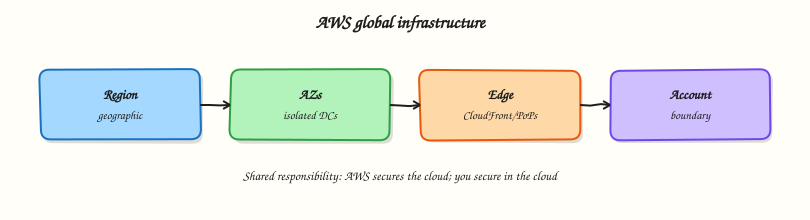

# AWS — Learning Roadmap

Follow the course in order:

1. **Course overview** — scope, prerequisites, cost hygiene
2. **Modules 1–16** — fundamentals through production and troubleshooting
3. **Labs / quizzes / projects** — practice
4. **Capstone** — production AWS landing zone
5. **Interview & certifications** — Cloud Practitioner → SAA → DevOps Pro




## Modules

| # | Focus | Tutorial |
|---|-------|----------|
| 1 | AWS fundamentals | [Global infrastructure](aws-fundamentals-and-global-infrastructure.md) |
| 2 | IAM | [Identity & access](iam-identity-access-and-organizations.md) |
| 3 | Networking | [VPC networking](vpc-networking-on-aws.md) |
| 4 | Compute | [EC2 · ASG · LB](compute-ec2-asg-and-load-balancing.md) |
| 5 | Storage | [S3 · EBS · EFS](storage-s3-ebs-efs.md) |
| 6 | Databases | [RDS · DynamoDB](databases-on-aws.md) |
| 7 | Containers | [ECS · EKS · ECR](containers-ecs-eks-ecr.md) |
| 8 | Serverless | [Lambda & events](serverless-on-aws.md) |
| 9 | Monitoring | [Observability](monitoring-and-observability-on-aws.md) |
| 10 | Security | [Security services](aws-security-services.md) |
| 11 | IaC | [Terraform · CFN · CDK](infrastructure-as-code-on-aws.md) |
| 12 | CI/CD | [Pipelines on AWS](cicd-on-aws.md) |
| 13 | Cost | [Cost optimisation](cost-optimisation-on-aws.md) |
| 14 | Reliability | [HA & DR](reliability-and-disaster-recovery.md) |
| 15 | Production | [Landing zones](production-aws-landing-zones.md) |
| 16 | Troubleshooting | [Troubleshoot AWS](troubleshooting-aws.md) |

## Diagrams

```bash
python3 scripts/generate-excalidraw-svg.py
```
