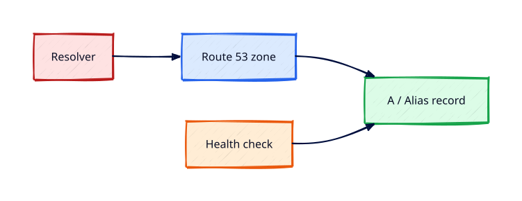

# Route 53 DNS and Health Checks

## Overview

**Amazon Route 53** is AWS's DNS service — hosted zones, records, routing policies, and health checks
that integrate with load balancers and failover architectures.

You will create a public hosted zone (lab domain or subdomain), add A/alias records to an ALB,
configure simple routing, and understand health check billing — destroy unused hosted zones after labs.

This is **Tutorial 15** in **Module 5: Edge and Data** of the REBASH Academy AWS track.

!!! warning "Destroy lab resources and watch billing"
    Tear down every resource you create before you close your laptop. Set a **billing alarm**
    (see [Accounts, Free Tier, Billing, and Cost Hygiene](accounts-free-tier-billing-and-cost-hygiene.md))
    and check the Cost Explorer dashboard after each lab session.


## Prerequisites

- Completed [Elastic Load Balancing — ALB and NLB](elastic-load-balancing-alb-and-nlb.md)

## Learning Objectives

By the end of this tutorial, you will be able to:

- [ ] Create public hosted zone and interpret NS/SOA records
- [ ] Add alias A record to Application Load Balancer
- [ ] Compare routing policies: simple, weighted, failover
- [ ] Create HTTP health check against ALB endpoint
- [ ] Delete hosted zone records before zone deletion

## Architecture




## Theory

### Record types

| Type | Use |
|------|-----|
| A / AAAA | IPv4/IPv6 — often **Alias** to ALB/CloudFront |
| CNAME | DNS name alias (not apex) |
| NS / SOA | Zone delegation |

### Alias records

Alias to AWS resources free of charge for queries to AWS targets; supports ALB, CloudFront, S3 website.

### Routing policies

- **Simple** — one record, multiple values (RR)
- **Weighted** — traffic split canary
- **Failover** — primary/secondary with health check
- **Latency / Geolocation** — user proximity

### Health checks

Route 53 health checks bill per check — delete lab checks in teardown.

## Hands-on Lab

```bash
ZONE_ID=$(aws route53 create-hosted-zone --name lab.rebash.example \
  --caller-reference $(date +%s) --query HostedZone.Id --output text)

cat > change-batch.json <<EOF
{
  "Changes": [{
    "Action": "CREATE",
    "ResourceRecordSet": {
      "Name": "app.lab.rebash.example",
      "Type": "A",
      "AliasTarget": {
        "HostedZoneId": "$ALB_ZONE_ID",
        "DNSName": "$ALB_DNS_NAME",
        "EvaluateTargetHealth": true
      }
    }
  }]
}
EOF

aws route53 change-resource-record-sets --hosted-zone-id $ZONE_ID --change-batch file://change-batch.json

aws route53 create-health-check --health-check-config \
  IPAddress=8.8.8.8,Port=443,Type=HTTPS,ResourcePath=/,RequestInterval=30,FailureThreshold=3
```

Teardown: delete records, health checks, hosted zone.

### LocalStack / dry-run alternative

With [LocalStack](https://localstack.cloud/) running on port 4566:

```bash
export AWS_ACCESS_KEY_ID=test
export AWS_SECRET_ACCESS_KEY=test
export AWS_DEFAULT_REGION=eu-west-1
aws --endpoint-url=http://localhost:4566 route53 list-hosted-zones
```

Some services are emulated imperfectly — treat LocalStack as CLI practice, not a full AWS substitute.

## Validation

| Check | Pass criteria |
|-------|---------------|
| Hosted zone | NS records returned |
| Alias record | Points to ALB DNS name |
| DNS resolution | `dig` returns ALB addresses (if delegated) |
| Teardown | Health checks and zone removed |

## Code Walkthrough

| Item | Note |
|------|------|
| Caller reference | Idempotent zone creation token |
| EvaluateTargetHealth | Alias considers target health |
| TTL vs Alias | Alias uses AWS internal TTL |
| Private zones | Associated with VPC — different tutorial path |

## Security Considerations

- DNSSEC signing for public zones when supported
- Restrict Route 53 IAM changes — high blast radius
- Monitor unexpected record changes via CloudTrail

## Common Mistakes

!!! warning "Deleting zone with records"
    HostedZoneNotEmpty. **Fix:** Delete all records except NS/SOA first.

!!! warning "CNAME at zone apex"
    Invalid DNS. **Fix:** Use Alias A at apex.

!!! warning "Forgotten health checks"
    Small monthly charge. **Fix:** Delete checks in teardown.

## Best Practices

- Infrastructure as Code for DNS (Terraform aws_route53_record)
- Lower TTL before migrations; raise after stable
- Failover health checks for DR patterns

## Troubleshooting

| Issue | Cause | Fix |
|-------|-------|-----|
| NXDOMAIN | Zone not delegated | Update registrar NS |
| Alias to wrong LB zone ID | ELB hosted zone IDs are per-Region | Use describe-load-balancers HostedZoneId |
| Health check false negative | Wrong path/port | Match listener config |

## Production Patterns and Deep Dive

        ### How `Route 53 DNS and Health Checks` fits in real environments

        Engineers working on **Module 5: Edge and Data** material use these concepts daily during design reviews,
        incident response, and cost optimisation workshops. The lab exercises prove you can execute;
        this section connects those commands to production trade-offs you will defend in interviews
        and on-call handovers.

        Production teams treating AWS as a first-class platform typically document:

        | Artefact | Purpose |
        |----------|---------|
        | Architecture decision record (ADR) | Why this service, alternatives rejected |
        | Runbook | Step-by-step operational procedures with rollback |
        | Teardown / DR checklist | What to destroy or fail over during exercises |
        | Cost owner | Who receives Budget alerts for resources tagged to this service |

        Always pair technical controls with **billing alarms** and a **destroy discipline** after
        experiments. The REBASH AWS track assumes British English documentation and explicit
        mention of Free Tier limits.

        ### Extended CLI and console reference

        The commands below extend the lab — run read-only variants first, then mutating operations
        in a non-production account. Replace `$LAB_REGION` and resource identifiers with your values.

        ```bash
aws route53 list-hosted-zones-by-name --dns-name lab.example
aws route53 get-hosted-zone --id $ZONE_ID
aws route53 list-resource-record-sets --hosted-zone-id $ZONE_ID
aws route53 change-resource-record-sets --hosted-zone-id $ZONE_ID --change-batch file://upsert.json
aws route53 list-health-checks
dig +trace app.lab.example @8.8.8.8
aws route53 delete-health-check --health-check-id $HC_ID
```

Delete unused **health checks** during teardown — they incur small recurring charges. Confirm **billing alarms**
after creating hosted zones in a real account.

        ### Operational scenario (table-top)

        **Scenario:** A teammate announces "customers cannot reach the application after a change."
        You suspect a misconfiguration related to **Route 53 DNS and Health Checks**.

        | Step | Action | Why |
        |------|--------|-----|
        | 1 | Confirm Region and account (`aws sts get-caller-identity`) | Wrong profile wastes triage time |
        | 2 | Check CloudWatch alarms and recent deploys | Correlates timeline |
        | 3 | Review CloudTrail events for API changes in this service | Identifies who changed what |
        | 4 | Compare running config to IaC/Terraform state | Detects manual console drift |
        | 5 | Roll back or restore last known good | Document in incident ticket |
        | 6 | Update runbook and least-privilege IAM if human error | Prevents repeat |

        ### Hardening checklist before production

        - [ ] IAM roles preferred over IAM users with long-lived keys
        - [ ] MFA enabled for privileged humans; root not used daily
        - [ ] Resources tagged `Environment`, `Owner`, `CostCentre`
        - [ ] Budgets and anomaly detection configured
        - [ ] Encryption at rest and in transit enabled where supported
        - [ ] No `0.0.0.0/0` administrative ports (use SSM Session Manager)
        - [ ] Teardown script or `terraform destroy` documented for non-prod environments
        - [ ] Cross-links reviewed: [Networking](../networking/index.md), [Linux](../linux/index.md), [Terraform](../terraform/index.md)

        ### When to choose a different AWS service

        No service exists in isolation. If **Route 53 DNS and Health Checks** feels forced, discuss alternatives with your
        team: managed versus self-managed, serverless versus EC2, or whether the workload belongs in
        another Region or account under AWS Organizations. Capture that decision in an ADR so future
        engineers understand the constraints you optimised for.

        ### Terraform handoff note

        After completing the AWS track, reproduce this tutorial's resources using modules in the
        [Terraform](../terraform/index.md) curriculum. Start with `required_providers` for `hashicorp/aws`,
        pin provider versions, store remote state in S3 with locking, and never commit secrets. The
        `route-53-dns-and-health-checks` lesson maps cleanly to named resources you will import or recreate in HCL.

        ### Review questions (self-check)

        Before moving to the next tutorial, answer without looking at notes:

        1. Which API calls in this lesson are **read-only** versus **mutating**?
        2. What is the first command you run to confirm account and Region?
        3. Which tags will you apply so Cost Explorer can attribute spend?
        4. How do you destroy lab resources created here?
        5. Which [Networking](../networking/index.md) or [Linux](../linux/index.md) concept underpins this AWS service?

        ### Additional references inside AWS

        Browse the official **AWS Documentation** centre for `Route 53 DNS and Health Checks` — focus on quotas, API permissions,
        and CloudWatch metrics emitted by the service. Bookmark the **Pricing** page for the service and
        add a line item to your personal cheat sheet noting Free Tier eligibility and the most common
        bill surprise mentioned in this tutorial.

## Summary

- Route 53 hosts DNS with alias integration to ALB and CloudFront
- Choose routing policy to match failover and canary needs
- Delete health checks and hosted zones after labs

## Interview Questions

1. Alias vs CNAME at apex?
2. Route 53 routing policies?
3. How health checks tie to failover?
4. Private hosted zone use case?
5. DNS TTL trade-offs?
6. Weighted routing canary?
7. EvaluateTargetHealth meaning?
8. Route 53 Resolver purpose?
9. DNSSEC on Route 53?
10. Billing for health checks?

!!! tip "Sample answer — question 1"
    Route 53 Alias A records at zone apex can point to ALB/CloudFront/S3 — CNAME at apex is invalid per DNS RFC. Alias is AWS-specific extension with no charge for alias queries to AWS targets.


!!! tip "Sample answer — question 3"
    Failover routing uses primary/secondary record sets; health check on primary removes it from DNS answers when unhealthy, sending traffic to secondary.


## Related Tutorials

- Track overview: [AWS](index.md)
- Previous: [Elastic Load Balancing — ALB and NLB](elastic-load-balancing-alb-and-nlb.md)
- Next: [RDS Fundamentals](rds-fundamentals.md)
- [Terraform track](../terraform/index.md) — automate these patterns next


## References

1. [Route 53 Developer Guide](https://docs.aws.amazon.com/Route53/latest/DeveloperGuide/Welcome.html)
2. [Routing policies](https://docs.aws.amazon.com/Route53/latest/DeveloperGuide/routing-policy.html)
3. [Health checks](https://docs.aws.amazon.com/Route53/latest/DeveloperGuide/dns-failover.html)
