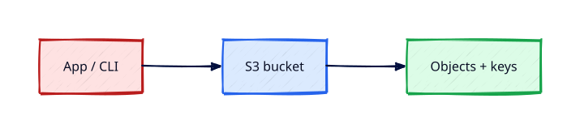

# S3 Fundamentals

## Overview

**Amazon S3** is object storage for backups, artefacts, static sites, and data lakes. Buckets are
global names; objects live in a Region. Understanding versioning, storage classes, and Block Public
Access prevents headline-grabbing data leaks.

You will create a bucket, upload objects, set lifecycle rules, and enable Block Public Access —
then empty and delete the bucket in teardown.

This is **Tutorial 12** in **Module 4: Storage** of the REBASH Academy AWS track.

!!! warning "Destroy lab resources and watch billing"
    Tear down every resource you create before you close your laptop. Set a **billing alarm**
    (see [Accounts, Free Tier, Billing, and Cost Hygiene](accounts-free-tier-billing-and-cost-hygiene.md))
    and check the Cost Explorer dashboard after each lab session.


## Prerequisites

- Completed Module 3 Compute tutorials
- AWS CLI profile configured

## Learning Objectives

By the end of this tutorial, you will be able to:

- [ ] Create a uniquely named bucket in your lab Region
- [ ] Upload, list, and download objects via CLI
- [ ] Explain storage classes at a high level
- [ ] Enable Block Public Access on the account and bucket
- [ ] Empty and delete buckets during teardown

## Architecture




## Theory

### Bucket and object model

- Bucket name globally unique across all AWS
- Key = object path (`logs/2026/app.log`)
- Strong read-after-write consistency for new objects

### Storage classes (awareness)

| Class | Pattern |
|-------|---------|
| S3 Standard | Frequent access |
| S3 Infrequent Access | Backups |
| Glacier tiers | Archives |

### Block Public Access

Account-level BPA prevents accidental public ACLs/policies — **enable before creating buckets**.

### Request and transfer billing

PUT/LIST costs pennies at lab scale; egress to internet costs more — mind downloads in production.

## Hands-on Lab

```bash
export LAB_REGION=eu-west-1
BUCKET=rebash-lab-$(aws sts get-caller-identity --query Account --output text)-${LAB_REGION}

aws s3api create-bucket --bucket $BUCKET --region $LAB_REGION \
  --create-bucket-configuration LocationConstraint=$LAB_REGION

aws s3api put-public-access-block --bucket $BUCKET \
  --public-access-block-configuration BlockPublicAcls=true,IgnorePublicAcls=true,BlockPublicPolicy=true,RestrictPublicBuckets=true

echo "rebash s3 lab" > hello.txt
aws s3 cp hello.txt s3://$BUCKET/hello.txt
aws s3 ls s3://$BUCKET/
aws s3 presign s3://$BUCKET/hello.txt --expires-in 300
```

Teardown:

```bash
aws s3 rm s3://$BUCKET --recursive
aws s3api delete-bucket --bucket $BUCKET --region $LAB_REGION
```

### LocalStack / dry-run alternative

With [LocalStack](https://localstack.cloud/) running on port 4566:

```bash
export AWS_ACCESS_KEY_ID=test
export AWS_SECRET_ACCESS_KEY=test
export AWS_DEFAULT_REGION=eu-west-1
aws --endpoint-url=http://localhost:4566 s3 mb s3://rebash-local-bucket
    aws --endpoint-url=http://localhost:4566 s3 cp hello.txt s3://rebash-local-bucket/
```

Some services are emulated imperfectly — treat LocalStack as CLI practice, not a full AWS substitute.

## Validation

| Check | Pass criteria |
|-------|---------------|
| Bucket | Created with BPA enabled |
| Object | `hello.txt` listed |
| Presigned URL | Downloads file before expiry |
| Teardown | Bucket deleted (empty first) |

## Code Walkthrough

| API | Purpose |
|-----|---------|
| `create-bucket` | Region via LocationConstraint (not us-east-1) |
| `put-public-access-block` | Defence against public exposure |
| `cp` | High-level upload/download |
| `presign` | Temporary HTTPS URL without public bucket |

## Security Considerations

- Block Public Access at account level
- Bucket policies least privilege; no `Principal:*` without condition
- Enable versioning for recovery; MFA delete for sensitive buckets
- Encrypt with SSE-S3 or SSE-KMS default

## Common Mistakes

!!! warning "Globally duplicate bucket name"
    Create fails. **Fix:** Include account id in lab names.

!!! warning "Deleting non-empty bucket"
    BucketNotEmpty error. **Fix:** Run `aws s3 rm --recursive` before delete-bucket.

!!! warning "Public read ACL on lab bucket"
    Data leak. **Fix:** BPA + no public policies.

## Best Practices

- Standardise naming `{org}-{env}-{region}-{purpose}`
- Lifecycle rules expire lab prefixes automatically
- Access logging to dedicated audit bucket

## Troubleshooting

| Issue | Cause | Fix |
|-------|-------|-----|
| BucketAlreadyExists | Name taken globally | Choose unique name |
| AccessDenied | IAM policy | Add s3:PutObject for prefix |
| Wrong Region | Endpoint mismatch | Pass `--region` consistently |

## Production Patterns and Deep Dive

        ### How `S3 Fundamentals` fits in real environments

        Engineers working on **Module 4: Storage** material use these concepts daily during design reviews,
        incident response, and cost optimisation workshops. The lab exercises prove you can execute;
        this section connects those commands to production trade-offs you will defend in interviews
        and on-call handovers.

        Production teams treating AWS as a first-class platform typically document:

        | Artefact | Purpose |
        |----------|---------|
        | Architecture decision record (ADR) | Why this service, alternatives rejected |
        | Runbook | Step-by-step operational procedures with rollback |
        | Teardown / DR checklist | What to destroy or fail over during exercises |
        | Cost owner | Who receives Budget alerts for resources tagged to this service |

        Always pair technical controls with **billing alarms** and a **destroy discipline** after
        experiments. The REBASH AWS track assumes British English documentation and explicit
        mention of Free Tier limits.

        ### Extended CLI and console reference

        The commands below extend the lab — run read-only variants first, then mutating operations
        in a non-production account. Replace `$LAB_REGION` and resource identifiers with your values.

        ```bash
aws s3api list-buckets --query 'Buckets[].Name'
aws s3api get-bucket-versioning --bucket $BUCKET
aws s3api put-bucket-versioning --bucket $BUCKET --versioning-configuration Status=Enabled
aws s3api get-bucket-encryption --bucket $BUCKET
aws s3api put-object --bucket $BUCKET --key logs/2026/07/app.log --body ./app.log
aws s3api list-objects-v2 --bucket $BUCKET --prefix logs/
aws s3api get-bucket-lifecycle-configuration --bucket $BUCKET
aws s3api delete-bucket --bucket $BUCKET  # after emptying — always teardown lab buckets
```

Empty buckets with `aws s3 rm s3://$BUCKET --recursive` before deletion. Confirm **Block Public Access**
remains enabled and verify **billing alarms** after any transfer-heavy experiment.

        ### Operational scenario (table-top)

        **Scenario:** A teammate announces "customers cannot reach the application after a change."
        You suspect a misconfiguration related to **S3 Fundamentals**.

        | Step | Action | Why |
        |------|--------|-----|
        | 1 | Confirm Region and account (`aws sts get-caller-identity`) | Wrong profile wastes triage time |
        | 2 | Check CloudWatch alarms and recent deploys | Correlates timeline |
        | 3 | Review CloudTrail events for API changes in this service | Identifies who changed what |
        | 4 | Compare running config to IaC/Terraform state | Detects manual console drift |
        | 5 | Roll back or restore last known good | Document in incident ticket |
        | 6 | Update runbook and least-privilege IAM if human error | Prevents repeat |

        ### Hardening checklist before production

        - [ ] IAM roles preferred over IAM users with long-lived keys
        - [ ] MFA enabled for privileged humans; root not used daily
        - [ ] Resources tagged `Environment`, `Owner`, `CostCentre`
        - [ ] Budgets and anomaly detection configured
        - [ ] Encryption at rest and in transit enabled where supported
        - [ ] No `0.0.0.0/0` administrative ports (use SSM Session Manager)
        - [ ] Teardown script or `terraform destroy` documented for non-prod environments
        - [ ] Cross-links reviewed: [Networking](../networking/index.md), [Linux](../linux/index.md), [Terraform](../terraform/index.md)

        ### When to choose a different AWS service

        No service exists in isolation. If **S3 Fundamentals** feels forced, discuss alternatives with your
        team: managed versus self-managed, serverless versus EC2, or whether the workload belongs in
        another Region or account under AWS Organizations. Capture that decision in an ADR so future
        engineers understand the constraints you optimised for.

        ### Terraform handoff note

        After completing the AWS track, reproduce this tutorial's resources using modules in the
        [Terraform](../terraform/index.md) curriculum. Start with `required_providers` for `hashicorp/aws`,
        pin provider versions, store remote state in S3 with locking, and never commit secrets. The
        `s3-fundamentals` lesson maps cleanly to named resources you will import or recreate in HCL.

        ### Review questions (self-check)

        Before moving to the next tutorial, answer without looking at notes:

        1. Which API calls in this lesson are **read-only** versus **mutating**?
        2. What is the first command you run to confirm account and Region?
        3. Which tags will you apply so Cost Explorer can attribute spend?
        4. How do you destroy lab resources created here?
        5. Which [Networking](../networking/index.md) or [Linux](../linux/index.md) concept underpins this AWS service?

        ### Additional references inside AWS

        Browse the official **AWS Documentation** centre for `S3 Fundamentals` — focus on quotas, API permissions,
        and CloudWatch metrics emitted by the service. Bookmark the **Pricing** page for the service and
        add a line item to your personal cheat sheet noting Free Tier eligibility and the most common
        bill surprise mentioned in this tutorial.

## Summary

- S3 stores objects in globally named Regional buckets
- **Block Public Access** is mandatory hygiene
- Empty and delete lab buckets; presigned URLs share without public ACLs

## Interview Questions

1. S3 consistency model?
2. Bucket naming rules?
3. Block Public Access four settings?
4. Storage class selection?
5. Presigned URL use case?
6. Versioning benefit?
7. S3 vs EBS?
8. Cross-Region replication purpose?
9. Event notifications use case?
10. How delete non-empty bucket?

!!! tip "Sample answer — question 3"
    BlockPublicAcls and IgnorePublicAcls prevent public ACLs; BlockPublicPolicy and RestrictPublicBuckets prevent public bucket policies and cross-account public access — enable all four.


!!! tip "Sample answer — question 7"
    S3 is object storage accessed via HTTP API, unlimited scale, 11 nines durability. EBS is block storage attached to one EC2 instance in one AZ.


## Related Tutorials

- Track overview: [AWS](index.md)
- Previous: [EBS Volumes, Snapshots, and Encryption](ebs-volumes-snapshots-and-encryption.md)
- Next: [S3 Security and Static Hosting](s3-security-and-static-hosting.md)
- [Terraform track](../terraform/index.md) — automate these patterns next


## References

1. [Amazon S3 User Guide](https://docs.aws.amazon.com/AmazonS3/latest/userguide/Welcome.html)
2. [Block Public Access](https://docs.aws.amazon.com/AmazonS3/latest/userguide/access-control-block-public-access.html)
3. [S3 storage classes](https://docs.aws.amazon.com/AmazonS3/latest/userguide/storage-class-intro.html)
