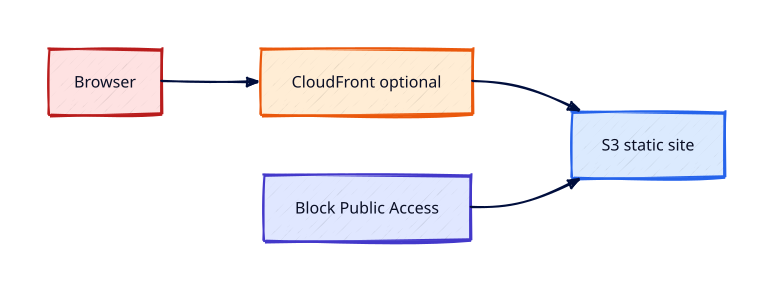

# S3 Security and Static Hosting

## Overview

Static websites on S3 plus CloudFront is a common pattern — but public buckets caused many breaches.
This tutorial configures **encryption**, **bucket policies**, optional **static website hosting**,
and CloudFront OAI/OAC patterns conceptually, keeping buckets private by default.

You will enforce HTTPS-only access patterns and understand when static hosting is appropriate versus
ALB-served dynamic apps.

This is **Tutorial 13** in **Module 4: Storage** of the REBASH Academy AWS track.

!!! warning "Destroy lab resources and watch billing"
    Tear down every resource you create before you close your laptop. Set a **billing alarm**
    (see [Accounts, Free Tier, Billing, and Cost Hygiene](accounts-free-tier-billing-and-cost-hygiene.md))
    and check the Cost Explorer dashboard after each lab session.


## Prerequisites

- Completed [S3 Fundamentals](s3-fundamentals.md)

## Learning Objectives

By the end of this tutorial, you will be able to:

- [ ] Apply bucket policy allowing only CloudFront or specific principals
- [ ] Enable default encryption SSE-S3 or SSE-KMS
- [ ] Configure static website hosting safely in a lab bucket
- [ ] Explain OAC vs legacy OAI
- [ ] Tear down CloudFront distribution and bucket (distribution delete takes time)

## Architecture




## Theory

### Secure static site pattern

1. S3 bucket **private** (no public ACL)
2. CloudFront distribution with **Origin Access Control (OAC)**
3. Bucket policy allows `s3:GetObject` for CloudFront service principal only
4. ACM certificate on CloudFront (cert in us-east-1 for CloudFront)

### Bucket policy example shape

```json
{
  "Effect": "Allow",
  "Principal": {"Service": "cloudfront.amazonaws.com"},
  "Action": "s3:GetObject",
  "Resource": "arn:aws:s3:::bucket/*",
  "Condition": {"StringEquals": {"AWS:SourceArn": "arn:aws:cloudfront::ACCOUNT:distribution/ID"}}
}
```

### Static website hosting endpoint

`bucket.s3-website-REGION.amazonaws.com` — **avoid public internet exposure** without CloudFront
and WAF in production.

## Hands-on Lab

```bash
BUCKET=rebash-static-$(aws sts get-caller-identity --query Account --output text)

aws s3api create-bucket --bucket $BUCKET --region $LAB_REGION \
  --create-bucket-configuration LocationConstraint=$LAB_REGION

aws s3api put-bucket-encryption --bucket $BUCKET \
  --server-side-encryption-configuration '{"Rules":[{"ApplyServerSideEncryptionByDefault":{"SSEAlgorithm":"AES256"}}]}'

aws s3 website s3://$BUCKET/ --index-document index.html --error-document error.html
aws s3 cp index.html s3://$BUCKET/ --content-type text/html

# Console: create CloudFront distribution with OAC (or document steps read-only)
aws cloudfront list-distributions --query 'DistributionList.Items[*].Id' --output table
```

Teardown: disable CloudFront distribution, wait deployed=false, delete distribution, empty bucket.

### LocalStack / dry-run alternative

With [LocalStack](https://localstack.cloud/) running on port 4566:

```bash
export AWS_ACCESS_KEY_ID=test
export AWS_SECRET_ACCESS_KEY=test
export AWS_DEFAULT_REGION=eu-west-1
aws --endpoint-url=http://localhost:4566 s3api put-bucket-encryption --bucket rebash-local-bucket ...
```

Some services are emulated imperfectly — treat LocalStack as CLI practice, not a full AWS substitute.

## Validation

| Check | Pass criteria |
|-------|---------------|
| Encryption | Default SSE enabled |
| BPA | Still enabled |
| Website config | Index document set |
| No public policy | Policy denies anonymous GetObject |

## Code Walkthrough

| Control | Why |
|---------|-----|
| OAC | CloudFront reads private S3 without public bucket |
| SSE | At-rest encryption compliance |
| BPA | Blocks accidental public ACL |
| WAF (prod) | Rate limit and geo block at edge |

## Security Considerations

- Never `Principal: *` on sensitive buckets without tight conditions
- Use OAC + private bucket for static sites
- Enable S3 access logging and CloudTrail data events for audit
- MFA delete for production buckets with versioning

## Common Mistakes

!!! warning "Public bucket for 'simple' static site"
    Indexed by scanners. **Fix:** CloudFront + OAC + private bucket.

!!! warning "HTTP only website endpoint"
    Credentials intercepted. **Fix:** Redirect HTTP→HTTPS at CloudFront.

!!! warning "Deleting bucket before CloudFront"
    Distribution holds reference. **Fix:** Delete CloudFront first.

## Best Practices

- Infrastructure as Code for CloudFront + S3 modules
- Invalidate CloudFront cache on deploy
- Separate buckets per environment

## Troubleshooting

| Issue | Cause | Fix |
|-------|-------|-----|
| 403 from CloudFront | OAC policy wrong | Fix SourceArn condition |
| Website 404 | Missing index key | Upload index.html at root |
| AccessDenied encryption | KMS key policy | Allow S3 service |

## Production Patterns and Deep Dive

        ### How `S3 Security and Static Hosting` fits in real environments

        Engineers working on **Module 4: Storage** material use these concepts daily during design reviews,
        incident response, and cost optimisation workshops. The lab exercises prove you can execute;
        this section connects those commands to production trade-offs you will defend in interviews
        and on-call handovers.

        Production teams treating AWS as a first-class platform typically document:

        | Artefact | Purpose |
        |----------|---------|
        | Architecture decision record (ADR) | Why this service, alternatives rejected |
        | Runbook | Step-by-step operational procedures with rollback |
        | Teardown / DR checklist | What to destroy or fail over during exercises |
        | Cost owner | Who receives Budget alerts for resources tagged to this service |

        Always pair technical controls with **billing alarms** and a **destroy discipline** after
        experiments. The REBASH AWS track assumes British English documentation and explicit
        mention of Free Tier limits.

        ### Extended CLI and console reference

        The commands below extend the lab — run read-only variants first, then mutating operations
        in a non-production account. Replace `$LAB_REGION` and resource identifiers with your values.

        ```bash
aws s3api get-public-access-block --bucket $BUCKET
aws s3api put-bucket-policy --bucket $BUCKET --policy file://policy-oac.json
aws cloudfront create-distribution --distribution-config file://cf.json
aws cloudfront create-invalidation --distribution-id E123 --paths "/*"
aws s3api get-bucket-website --bucket $BUCKET
```

        ### Operational scenario (table-top)

        **Scenario:** A teammate announces "customers cannot reach the application after a change."
        You suspect a misconfiguration related to **S3 Security and Static Hosting**.

        | Step | Action | Why |
        |------|--------|-----|
        | 1 | Confirm Region and account (`aws sts get-caller-identity`) | Wrong profile wastes triage time |
        | 2 | Check CloudWatch alarms and recent deploys | Correlates timeline |
        | 3 | Review CloudTrail events for API changes in this service | Identifies who changed what |
        | 4 | Compare running config to IaC/Terraform state | Detects manual console drift |
        | 5 | Roll back or restore last known good | Document in incident ticket |
        | 6 | Update runbook and least-privilege IAM if human error | Prevents repeat |

        ### Hardening checklist before production

        - [ ] IAM roles preferred over IAM users with long-lived keys
        - [ ] MFA enabled for privileged humans; root not used daily
        - [ ] Resources tagged `Environment`, `Owner`, `CostCentre`
        - [ ] Budgets and anomaly detection configured
        - [ ] Encryption at rest and in transit enabled where supported
        - [ ] No `0.0.0.0/0` administrative ports (use SSM Session Manager)
        - [ ] Teardown script or `terraform destroy` documented for non-prod environments
        - [ ] Cross-links reviewed: [Networking](../networking/index.md), [Linux](../linux/index.md), [Terraform](../terraform/index.md)

        ### When to choose a different AWS service

        No service exists in isolation. If **S3 Security and Static Hosting** feels forced, discuss alternatives with your
        team: managed versus self-managed, serverless versus EC2, or whether the workload belongs in
        another Region or account under AWS Organizations. Capture that decision in an ADR so future
        engineers understand the constraints you optimised for.

        ### Terraform handoff note

        After completing the AWS track, reproduce this tutorial's resources using modules in the
        [Terraform](../terraform/index.md) curriculum. Start with `required_providers` for `hashicorp/aws`,
        pin provider versions, store remote state in S3 with locking, and never commit secrets. The
        `s3-security-and-static-hosting` lesson maps cleanly to named resources you will import or recreate in HCL.

        ### Review questions (self-check)

        Before moving to the next tutorial, answer without looking at notes:

        1. Which API calls in this lesson are **read-only** versus **mutating**?
        2. What is the first command you run to confirm account and Region?
        3. Which tags will you apply so Cost Explorer can attribute spend?
        4. How do you destroy lab resources created here?
        5. Which [Networking](../networking/index.md) or [Linux](../linux/index.md) concept underpins this AWS service?

        ### Additional references inside AWS

        Browse the official **AWS Documentation** centre for `S3 Security and Static Hosting` — focus on quotas, API permissions,
        and CloudWatch metrics emitted by the service. Bookmark the **Pricing** page for the service and
        add a line item to your personal cheat sheet noting Free Tier eligibility and the most common
        bill surprise mentioned in this tutorial.

## Summary

- Static sites belong behind **CloudFront + OAC** with private S3
- Default encryption and Block Public Access are non-negotiable
- Tear down distributions and buckets to avoid storage and request charges

## Interview Questions

1. OAC vs OAI?
2. How serve private S3 via CloudFront?
3. Why ACM cert in us-east-1 for CloudFront?
4. Bucket policy vs IAM policy for S3?
5. SSE-S3 vs SSE-KMS trade-off?
6. Static website endpoint vs REST endpoint?
7. How prevent hotlinking?
8. S3 Object Lock use case?
9. Versioning + delete marker behaviour?
10. WAF at CloudFront benefit?

!!! tip "Sample answer — question 2"
    Bucket remains private. CloudFront OAC gets an IAM condition-bound bucket policy allowing GetObject only from that distribution ARN. Viewers hit CloudFront HTTPS URL; S3 never exposed publicly.


!!! tip "Sample answer — question 5"
    SSE-S3 uses S3-managed keys (simple, no KMS API costs). SSE-KMS uses KMS CMK with audit trail and key policy control — better for regulated data, adds KMS API latency/cost.


## Related Tutorials

- Track overview: [AWS](index.md)
- Previous: [S3 Fundamentals](s3-fundamentals.md)
- Next: [Elastic Load Balancing — ALB and NLB](elastic-load-balancing-alb-and-nlb.md)
- [Terraform track](../terraform/index.md) — automate these patterns next


## References

1. [Static website hosting](https://docs.aws.amazon.com/AmazonS3/latest/userguide/WebsiteHosting.html)
2. [CloudFront OAC](https://docs.aws.amazon.com/AmazonCloudFront/latest/DeveloperGuide/private-content-restricting-access-to-s3.html)
3. [S3 bucket policies](https://docs.aws.amazon.com/AmazonS3/latest/userguide/bucket-policies.html)
