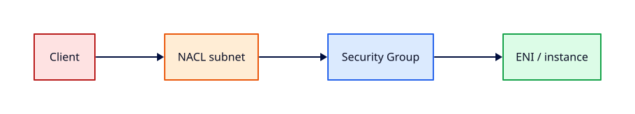

# Security Groups and NACLs

## Overview

**Security groups** are stateful firewalls at the ENI level; **Network ACLs** are stateless
filters at the subnet boundary. Production defence uses both plus least-privilege IAM.

You will author restrictive security groups for a web tier, add NACL rules for subnet-level
deny lists, and test allowed/denied flows — mirroring patterns from
[Networking — Firewalls](../networking/firewalls-and-access-control.md).

This is **Tutorial 7** in **Module 2: VPC Networking** of the REBASH Academy AWS track.

!!! warning "Destroy lab resources and watch billing"
    Tear down every resource you create before you close your laptop. Set a **billing alarm**
    (see [Accounts, Free Tier, Billing, and Cost Hygiene](accounts-free-tier-billing-and-cost-hygiene.md))
    and check the Cost Explorer dashboard after each lab session.


## Prerequisites

- Completed [Internet Gateways, Routes, and Egress](internet-gateways-routes-and-egress.md)

## Learning Objectives

By the end of this tutorial, you will be able to:

- [ ] Differentiate security groups (stateful) from NACLs (stateless)
- [ ] Create tiered security groups (web, app) with least privilege
- [ ] Add numbered NACL rules with explicit deny where needed
- [ ] Test connectivity with curl and expected failures
- [ ] Document rules for change control

## Architecture




## Theory

### Security groups

- **Stateful**: return traffic automatically allowed
- **Allow rules only** — no deny rules
- Attached to ENIs (EC2, ALB, RDS, etc.)
- Reference other SGs as sources (preferred over CIDR sprawl)

Example web tier inbound:

| Type | Port | Source |
|------|------|--------|
| HTTPS | 443 | ALB security group |
| (none) | 22 | **Do not open to 0.0.0.0/0** |

### Network ACLs

- **Stateless**: must allow return traffic explicitly if you filter inbound/outbound separately
- **Numbered rules** evaluated in order; first match wins
- Subnet-level — affects all ENIs in subnet
- Default NACL allows all; custom NACLs start deny-by-default

### When to use which

| Control | Tool |
|---------|------|
| Instance-to-instance | Security group |
| Subnet guardrail / deny IP block | NACL |
| Admin access | SSM, not SG port 22 to world |

## Hands-on Lab

```bash
export LAB_REGION=eu-west-1

WEB_SG=$(aws ec2 create-security-group --group-name rebash-web-sg \
  --description "Web tier HTTPS from ALB only" --vpc-id $VPC_ID \
  --query GroupId --output text --region $LAB_REGION)

ALB_SG=$(aws ec2 create-security-group --group-name rebash-alb-sg \
  --description "ALB ingress 443" --vpc-id $VPC_ID \
  --query GroupId --output text --region $LAB_REGION)

aws ec2 authorize-security-group-ingress --group-id $ALB_SG --protocol tcp \
  --port 443 --cidr 0.0.0.0/0 --region $LAB_REGION

aws ec2 authorize-security-group-ingress --group-id $WEB_SG --protocol tcp \
  --port 443 --source-group $ALB_SG --region $LAB_REGION

aws ec2 authorize-security-group-egress --group-id $WEB_SG --protocol tcp \
  --port 443 --cidr 0.0.0.0/0 --region $LAB_REGION
```

Create custom NACL denying a test CIDR (lab only):

```bash
NACL_ID=$(aws ec2 create-network-acl --vpc-id $VPC_ID --region $LAB_REGION \
  --query NetworkAcl.NetworkAclId --output text)
aws ec2 create-network-acl-entry --network-acl-id $NACL_ID --rule-number 100 \
  --protocol -1 --rule-action deny --cidr-block 203.0.113.0/24 --ingress --region $LAB_REGION
aws ec2 replace-network-acl-association --association-id $ASSOC_ID \
  --network-acl-id $NACL_ID --region $LAB_REGION
```

Teardown: delete security groups (after instances terminated), delete custom NACL associations.

### LocalStack / dry-run alternative

With [LocalStack](https://localstack.cloud/) running on port 4566:

```bash
export AWS_ACCESS_KEY_ID=test
export AWS_SECRET_ACCESS_KEY=test
export AWS_DEFAULT_REGION=eu-west-1
aws --endpoint-url=http://localhost:4566 ec2 create-security-group --group-name lab-sg --description test
    aws --endpoint-url=http://localhost:4566 ec2 describe-security-groups
```

Some services are emulated imperfectly — treat LocalStack as CLI practice, not a full AWS substitute.

## Validation

| Check | Pass criteria |
|-------|---------------|
| Web SG | HTTPS only from ALB SG |
| No SSH 0.0.0.0/0 | `describe-security-groups` confirms |
| NACL deny | Test CIDR blocked at subnet edge |
| Teardown | Custom SGs and NACL removed |

## Code Walkthrough

| Rule type | Behaviour |
|-----------|-----------|
| SG ingress referencing SG | Scales when IPs change behind ALB |
| SG egress restrict | Limit lateral movement and data exfil |
| NACL deny rule | Coarse block for known bad netblocks |
| Rule numbering | Leave gaps (100, 200) for future inserts |

## Security Considerations

- Default deny inbound on app tiers; explicit allow only
- Use SSM instead of SSH security group rules where possible
- Log SG changes via AWS Config / CloudTrail (Tutorial 19)
- Review NACL changes carefully — stateless mistakes break return traffic

## Common Mistakes

!!! warning "SSH 0.0.0.0/0 on production SG"
    Immediate brute-force noise. **Fix:** Remove; use SSM.

!!! warning "NACL without return rules"
    Half-open connections fail. **Fix:** Allow ephemeral return ports or use SG only.

!!! warning "CIDR 0.0.0.0/0 on app SG ingress"
    Bypasses ALB shield. **Fix:** Reference ALB SG only.

## Best Practices

- SG referencing SG beats hard-coded IPs
- Separate SG per tier (web, app, db)
- Automate rule documentation in change tickets
- Periodic audit with VPC Reachability Analyzer

## Troubleshooting

| Issue | Cause | Fix |
|-------|-------|-----|
| Timeout to app | SG missing ALB source | Add referencing rule |
| Works once then fails | NACL stateless | Allow return traffic |
| Cannot delete SG | Still attached | Terminate ENIs/instances first |

## Production Patterns and Deep Dive

        ### How `Security Groups and NACLs` fits in real environments

        Engineers working on **Module 2: VPC Networking** material use these concepts daily during design reviews,
        incident response, and cost optimisation workshops. The lab exercises prove you can execute;
        this section connects those commands to production trade-offs you will defend in interviews
        and on-call handovers.

        Production teams treating AWS as a first-class platform typically document:

        | Artefact | Purpose |
        |----------|---------|
        | Architecture decision record (ADR) | Why this service, alternatives rejected |
        | Runbook | Step-by-step operational procedures with rollback |
        | Teardown / DR checklist | What to destroy or fail over during exercises |
        | Cost owner | Who receives Budget alerts for resources tagged to this service |

        Always pair technical controls with **billing alarms** and a **destroy discipline** after
        experiments. The REBASH AWS track assumes British English documentation and explicit
        mention of Free Tier limits.

        ### Extended CLI and console reference

        The commands below extend the lab — run read-only variants first, then mutating operations
        in a non-production account. Replace `$LAB_REGION` and resource identifiers with your values.

        ```bash
aws ec2 describe-security-groups --filters Name=vpc-id,Values=$VPC_ID --output table
aws ec2 authorize-security-group-ingress --group-id sg-xxx --protocol tcp --port 443 --source-group sg-alb
aws ec2 describe-network-acls --filters Name=vpc-id,Values=$VPC_ID
aws ec2 create-network-acl-entry --network-acl-id acl-xxx --ingress --rule-number 200 --protocol -1 \
  --rule-action allow --cidr-block 0.0.0.0/0
aws ec2 describe-security-group-rules --filters Name=group-id,Values=$WEB_SG
```

        ### Operational scenario (table-top)

        **Scenario:** A teammate announces "customers cannot reach the application after a change."
        You suspect a misconfiguration related to **Security Groups and NACLs**.

        | Step | Action | Why |
        |------|--------|-----|
        | 1 | Confirm Region and account (`aws sts get-caller-identity`) | Wrong profile wastes triage time |
        | 2 | Check CloudWatch alarms and recent deploys | Correlates timeline |
        | 3 | Review CloudTrail events for API changes in this service | Identifies who changed what |
        | 4 | Compare running config to IaC/Terraform state | Detects manual console drift |
        | 5 | Roll back or restore last known good | Document in incident ticket |
        | 6 | Update runbook and least-privilege IAM if human error | Prevents repeat |

        ### Hardening checklist before production

        - [ ] IAM roles preferred over IAM users with long-lived keys
        - [ ] MFA enabled for privileged humans; root not used daily
        - [ ] Resources tagged `Environment`, `Owner`, `CostCentre`
        - [ ] Budgets and anomaly detection configured
        - [ ] Encryption at rest and in transit enabled where supported
        - [ ] No `0.0.0.0/0` administrative ports (use SSM Session Manager)
        - [ ] Teardown script or `terraform destroy` documented for non-prod environments
        - [ ] Cross-links reviewed: [Networking](../networking/index.md), [Linux](../linux/index.md), [Terraform](../terraform/index.md)

        ### When to choose a different AWS service

        No service exists in isolation. If **Security Groups and NACLs** feels forced, discuss alternatives with your
        team: managed versus self-managed, serverless versus EC2, or whether the workload belongs in
        another Region or account under AWS Organizations. Capture that decision in an ADR so future
        engineers understand the constraints you optimised for.

        ### Terraform handoff note

        After completing the AWS track, reproduce this tutorial's resources using modules in the
        [Terraform](../terraform/index.md) curriculum. Start with `required_providers` for `hashicorp/aws`,
        pin provider versions, store remote state in S3 with locking, and never commit secrets. The
        `security-groups-and-nacls` lesson maps cleanly to named resources you will import or recreate in HCL.

        ### Review questions (self-check)

        Before moving to the next tutorial, answer without looking at notes:

        1. Which API calls in this lesson are **read-only** versus **mutating**?
        2. What is the first command you run to confirm account and Region?
        3. Which tags will you apply so Cost Explorer can attribute spend?
        4. How do you destroy lab resources created here?
        5. Which [Networking](../networking/index.md) or [Linux](../linux/index.md) concept underpins this AWS service?

        ### Additional references inside AWS

        Browse the official **AWS Documentation** centre for `Security Groups and NACLs` — focus on quotas, API permissions,
        and CloudWatch metrics emitted by the service. Bookmark the **Pricing** page for the service and
        add a line item to your personal cheat sheet noting Free Tier eligibility and the most common
        bill surprise mentioned in this tutorial.

## Summary

- Security groups are stateful ENI firewalls; NACLs are stateless subnet filters
- Layer controls: no SSH to world; ALB → web tier on 443 only
- Test and tear down lab rules; align with Networking firewall tutorials

## Interview Questions

1. Stateful vs stateless — SG or NACL?
2. Can a security group contain a deny rule?
3. Why reference an SG instead of CIDR for app tier?
4. What happens to return traffic in a stateful SG?
5. When would you use a NACL deny rule?
6. Default NACL vs custom NACL behaviour?
7. How do SGs apply to RDS?
8. What ports does SSM require?
9. How do you troubleshoot SG vs NACL issues?
10. Relation to host firewalls on Linux?

!!! tip "Sample answer — question 1"
    Security groups are stateful — response traffic is automatically allowed. NACLs are stateless — you must explicitly allow both directions if you filter, and rules are numbered with first match wins.


!!! tip "Sample answer — question 3"
    ALB IPs change with scaling. Referencing the ALB security group as source keeps rules stable and least-privilege without opening the app tier to the entire internet.


## Related Tutorials

- Track overview: [AWS](index.md)
- Previous: [Internet Gateways, Routes, and Egress](internet-gateways-routes-and-egress.md)
- Next: [VPC Endpoints and Private AWS Access](vpc-endpoints-and-private-aws-access.md)
- [Networking track](../networking/index.md) — TCP/IP and routing before VPC specifics
- [Cloud Networking: VPC and Subnets](../networking/cloud-networking-vpc-and-subnets.md) — conceptual VPC model
- [Linux track](../linux/index.md) — host skills for EC2 and SSM
- [Terraform track](../terraform/index.md) — automate these patterns next

- [Networking track](../networking/index.md) — TCP/IP and routing before VPC specifics
- [Cloud Networking: VPC and Subnets](../networking/cloud-networking-vpc-and-subnets.md) — conceptual VPC model
- [Linux track](../linux/index.md) — host skills for EC2 and SSM

## References

1. [Security groups](https://docs.aws.amazon.com/vpc/latest/userguide/VPC_SecurityGroups.html)
2. [Network ACLs](https://docs.aws.amazon.com/vpc/latest/userguide/vpc-network-acls.html)
3. [Reachability Analyzer](https://docs.aws.amazon.com/vpc/latest/reachability/what-is-reachability-analyzer.html)
